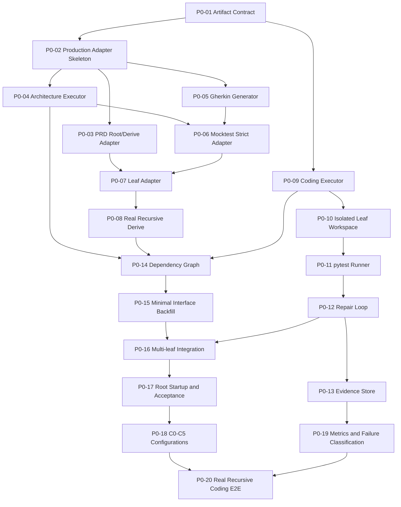
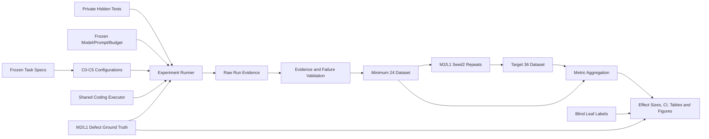
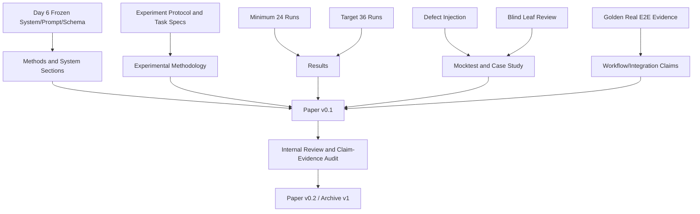

# VeriLayer 四人十天完整 Vibecoding 实施计划

> 状态：基于 tutor/tutor-app 全量复核的可执行修订版  
> 日期：2026-07-28  
> 范围：实施、实验和论文协作计划；本文件不代表任何 P0 已实现。  
> 技术边界：Python + FastAPI + pytest + SQLite/内存存储 + REST API + Modular Monolith。  

## 0. 执行原则与事实边界

1. 论文定位、RQ1-RQ5、C0-C5、S1/M1/M2/L1 和真实代码闭环已经冻结，不在本计划中重新讨论。
2. 当前根编排器、Mocktest strict 驱动和 Leaf 正式执行器可复用；当前生产 Adapter、Architecture/Gherkin 生成器、Coding Executor 和真实 Integration Executor 不存在。
3. 所有标注为“拟新增”的路径是十天内计划创建的文件，不是当前实现事实。
4. C0-C5 必须使用同一个 Coding Executor、同一模型版本、同一代码 Prompt 模板、相同项目级 Token 上限和相同最大修复轮数。
5. fixture 只允许用于单元测试编排器，不得进入 C0-C5 实验数据。
6. 系统失败、工具错误和有效负面结果必须分开记录；任何失败运行都不得静默删除。
7. Day 6 晚冻结代码、Prompt、Schema、任务规格、hidden tests 和模型参数。冻结后任何影响输出的修改都必须增加版本号，并重跑受影响配置。
8. 既有 `tutor/tutor-app` 已证明真实叶编码、多波集成和 E2E 可行；迁移范围必须分别登记 22 个设计节点包、16 套 L2 结构化五件套、17 个实现叶子和 12 个 backfill 完成包。它是 migration fixture、工程 pilot 和 case study。
9. 既有 `tutor-r01` 是手动协调运行；PRD/Architecture/Testcases/Mocktest 的 generator 为 `structured-input-preparer`，不能替代 production `run-workflow`、真实生成器、strict Mocktest、统一 Coding Executor 或 C0-C5 正式实验。
10. Day 3 使用双轨校准：CMP-CONFIG-STORE 是已知 strict 负向回归，验证系统能阻断 architecture FAIL；独立 fresh S1 是正向 Coding 校准，验证统一 Executor、pytest 和 repair。
11. Tutor 的代码、测试、预期行为和强制 STOP 标签均已公开，不能进入正式 C0-C5 benchmark、Leaf 准确率或 κ 计算；正式任务和 hidden tests 必须物理隔离。
12. 开工前必须清洁交付包：排除 `.env`、`data/`、`.git/`、`.worktrees/`、缓存和 `.superdesign/`，执行 secret scan 并生成 SHA-256 manifest。
13. VeriLayer 实验环境与 tutor reference regression 环境分别冻结，不要求强行共用一个 Python；共享证据只保存逻辑环境 ID、相对路径和依赖 hash。

## 1. 建议目录布局

以下目录在现有 `vibe coding` 根下增量建立，避免重构各独立模块：

```text
vibe coding/
├─ config/
│  ├─ verilayer.production.json                 # 拟新增
│  └─ experiments/
│     ├─ C0.json ... C5.json                   # 拟新增
├─ vibecode/
│  ├─ root_workflow.py                         # 现有，最小修改
│  ├─ orchestrator.py                          # 现有，最小修改
│  ├─ contracts.py                             # 现有，扩展 canonical contract
│  ├─ adapters/                                # 拟新增
│  │  ├─ common.py
│  │  ├─ prd_adapter.py
│  │  ├─ architecture_adapter.py
│  │  ├─ gherkin_adapter.py
│  │  ├─ mocktest_adapter.py
│  │  ├─ leaf_adapter.py
│  │  ├─ coding_adapter.py
│  │  └─ integration_adapter.py
│  ├─ executors/                               # 拟新增
│  │  ├─ model_runner.py
│  │  ├─ coding_executor.py
│  │  ├─ pytest_runner.py
│  │  ├─ repair_loop.py
│  │  └─ integration_executor.py
│  ├─ schemas/                                 # 现有，增补 Schema
│  └─ evidence.py                              # 拟新增
├─ benchmark/                                  # 拟新增
│  ├─ tasks/{S1,M1,M2,L1}/
│  │  ├─ requirement.md
│  │  ├─ requirement.json
│  │  ├─ acceptance_contract.json
│  │  └─ public_tests/
│  ├─ private_tests/{S1,M1,M2,L1}/             # Coding Executor 不可见
│  └─ defect_injection/{M2,L1}/
├─ experiments/                                # 拟新增
│  ├─ run_matrix.py
│  ├─ classify_result.py
│  ├─ aggregate_results.py
│  ├─ validate_evidence.py
│  └─ analysis/
├─ evidence/runs/                              # 运行时产物，不纳入生成上下文
└─ paper/
   ├─ sections/
   ├─ figures/
   ├─ tables/
   ├─ glossary.md
   └─ claim-evidence-matrix.md
```

## 2. 四人职责表

| 成员 | 技术主责 | 论文主责 | 对外接口 | 不应同时修改 |
|---|---|---|---|---|
| A | Artifact Contract、根编排器、PRD Root/Derive、生产配置、dependency graph、integration order、父子回填 | Workflow、Artifact Contract、Integration | 向 B/C/D 发布冻结的 envelope、module-result 和 run context | B/C/D 不直接改 `root_workflow.py`；通过接口问题单交给 A |
| B | Architecture/Gherkin 真实执行、结构化产物、Adapter、模块测试 | PRD、Architecture、Gherkin | 向 C 提供 Mocktest 可消费工件；向 D 提供叶子设计与测试输入 | 不改 Mocktest/Leaf/Coding Executor 核心 |
| C | Mocktest strict、Mocktest/Leaf Adapter、字段兼容、缺陷注入、Leaf 盲评 | Mocktest、Leaf、Defect Injection、Case Study | 向 A 发布 leaf decision；向 D 发布验证证据和失败分类 | 不改 Coding Prompt 和实验聚合规则 |
| D | Coding Executor、叶子工作区、pytest、repair、hidden tests、实验 runner、metrics、统计 | Introduction、Methodology、Results、Discussion、最终整合 | 只通过冻结 Adapter 消费 A/B/C 工件 | 不直接修 B/C 模块来制造实验成功 |

### 协作规则

- 每个一方源文件只有一名 owner；跨模块修改通过小型接口 PR/patch 交付。
- 每天 09:00 接口同步 15 分钟，13:30 阻断同步 10 分钟，21:00 Go/No-Go 复盘 30 分钟。
- Day 1 后所有契约变更写入 `contract-change-log.md`；Day 6 后禁止无版本号变更。
- D 维护全局实验账本，但不得删除失败记录；C 独立复核失败分类。

## 3. P0/P1/P2 任务总表

### 3.1 P0：支撑完整 Vibecoding 核心主张

| ID | 任务 | 优先级 | 真实文件位置 | 主负责人 | 协作者 | 前置依赖 | 人时 | 验收命令 | 验收标准 | 失败降级方案 |
|---|---|---|---|---|---|---|---:|---|---|---|
| P0-01 | 清洁迁移包、对账现状并冻结 canonical Artifact Contract | P0 | 现有 `vibe coding/vibecode/contracts.py`、`schemas/common-envelope.schema.json`；拟新增 `schemas/verilayer-artifact.schema.json`、`docs/ARTIFACT_CONTRACT.md`、`docs/TUTOR_MIGRATION_MANIFEST.md`、`docs/TUTOR_CURRENT_STATE.md`、`docs/PATH_REWRITE_MANIFEST.md` | A | B/C/D | 无 | 12 | package secret/path scan；`python -m pytest -q tests/test_contracts.py tests/test_artifact_contract.py` | 22/16/17/12 四类资产可追踪；历史报告有 evidence_time/claim_scope/superseded_by；七类工件共享 IDs/hash | 不改各模块内部 Schema，只在 Adapter 转换；无法重定位的路径 fail-closed |
| P0-02 | 生产 Module Adapter 骨架、双环境预检与配置 | P0 | 拟新增 `vibecode/adapters/common.py`、`config/verilayer.production.json`、`config/environments/*.json`、`scripts/preflight.py`；现有 `root_workflow.py:61` | A | B/C/D | P0-01 | 10 | `python scripts/preflight.py`；`python vibecode/scripts/vibecode.py run-workflow --config config/verilayer.production.json --dry-run ...` | 八个模块命令均存在且非 fixture；VeriLayer 与 tutor reference 环境分别可复现；dry-run PASS | 固定两个已验证环境；不强制二者使用同一解释器 |
| P0-03 | PRD Root/Derive Adapter | P0 | 现有 `prd-generation/scripts/prd_flow/main.py`；拟新增 `vibecode/adapters/prd_adapter.py` | A | B | P0-01/02 | 10 | `python -m pytest -q tests/integration/test_prd_adapter.py` | Root requirement 生成 PRD；child 使用 parent PRD+architecture+target module；输出 module-result | 只支持非交互模式和固定模板 |
| P0-04 | Architecture 真实执行器与结构化输出 | P0 | 现有 `prd-to-architecture-skill/`；拟新增 `vibecode/adapters/architecture_adapter.py`、`schemas/architecture-artifact.schema.json` | B | A | P0-01/02 | 18 | `python -m pytest -q tests/integration/test_architecture_adapter.py` | 真实模型调用生成七文件包、`architecture.json`、trace IDs 和 module-result | JSON-first 固定模板；限制为 FastAPI Modular Monolith |
| P0-05 | Gherkin 真实生成器与结构化输出 | P0 | 现有 `prd-to-gherkin/skill3.md`、`scripts/*.mjs`；拟新增 `vibecode/adapters/gherkin_adapter.py` | B | A/C | P0-01/02 | 18 | `python -m pytest -q tests/integration/test_gherkin_adapter.py && node ../prd-to-gherkin/scripts/validate_requirement_graph.mjs <model>` | 真实生成 requirement model、Feature、`testcases.json`；两个现有 validator PASS | 固定英文 Gherkin 模板；不生成组合扩展场景 |
| P0-06 | Mocktest strict Adapter 与稳定后端 | P0 | 现有 `mocktest/.agents/skills/validate-arch/`；拟新增 `vibecode/adapters/mocktest_adapter.py` | C | A/B | P0-04/05 | 16 | `python -m pytest -q tests/integration/test_mocktest_adapter.py`；单场景 strict smoke | 真实 component hop、validator、strict audit；正式四文件交付；工具错误可辨识 | 使用 canonical current-session driver；实验前必须封装为可重复命令 |
| P0-07 | Leaf Adapter 与语义转换 | P0 | 现有 `leaf-gate/scripts/run_leaf_gate.py`；拟新增 `vibecode/adapters/leaf_adapter.py` | C | A/B | P0-01/03/04/05/06 | 12 | `python -m pytest -q tests/integration/test_leaf_adapter.py` | 扁平化 architecture、转换 findings/defects/testcase status；输出 `node_id` 子节点 | Adapter 双读 `child_node_id`/`node_id`，正式输出统一 `node_id` |
| P0-08 | 根编排器真实递归 Derive | P0 | 现有 `vibe coding/vibecode/root_workflow.py:242`、`orchestrator.py` | A | B/C | P0-03/07 | 12 | `python -m pytest -q tests/test_root_workflow.py tests/integration/test_recursive_derive.py` | CONTINUE 后 child PRD 显式引用父 PRD、父架构、target module；最终可 STOP | 最大深度固定 2；不支持运行中动态改树 |
| P0-09 | 真实 Python/FastAPI Coding Executor | P0 | 拟新增 `vibecode/executors/model_runner.py`、`coding_executor.py`、`adapters/coding_adapter.py` | D | A/B | P0-01/02；B 提供叶子输入 | 20 | `python -m pytest -q tests/integration/test_coding_executor.py` | S1 叶子生成真实 `.py`、requirements/pyproject、启动入口和 module-result；非 fixture | 固定 FastAPI scaffold，模型只填允许文件 |
| P0-10 | 叶子隔离代码工作区 | P0 | 拟新增 `executors/workspace.py` 或并入 `coding_executor.py`；运行时 `evidence/.../workspace/leaves/<node>` | D | A | P0-09 | 6 | `python -m pytest -q tests/test_leaf_workspace.py` | safe path、无跨叶写入、输入与 hidden tests 隔离 | 使用临时目录复制后集成，不使用 worktree |
| P0-11 | pytest 执行器 | P0 | 拟新增 `vibecode/executors/pytest_runner.py` | D | B | P0-09/10 | 8 | `python -m pytest -q tests/test_pytest_runner.py` | 记录 command、exit、stdout/stderr、JUnit/JSON 摘要和超时 | 只支持 pytest；统一 120 秒超时 |
| P0-12 | 最大两轮自动修复 | P0 | 拟新增 `vibecode/executors/repair_loop.py` | D | B/C | P0-09/11 | 10 | `python -m pytest -q tests/integration/test_repair_loop.py` | 失败证据进入修复 Prompt；最多 2 轮；每轮保留 patch/hash/test；达到上限 FAIL | Day 5 No-Go 时固定 1 轮；不得人工代修后记为自动成功 |
| P0-13 | 代码与测试证据保存 | P0 | 拟新增 `vibecode/evidence.py`、`schemas/code-evidence.schema.json` | D | A/C | P0-01/09/11/12 | 8 | `python experiments/validate_evidence.py <run-dir>` | 用户要求的所有叶子和根级证据存在、hash 可重算、日志非空 | 保留 raw text+JSON；取消非必要漂亮报告 |
| P0-14 | 模块依赖图与集成排序 | P0 | 现有架构 contract；拟新增 `executors/integration_executor.py` | A | B/D | P0-04/08/09 | 8 | `python -m pytest -q tests/test_integration_order.py` | DAG 拓扑排序；循环依赖 fail-closed；顺序写入证据 | 只支持显式依赖，禁止自动猜测复杂依赖 |
| P0-15 | 最小父子接口回填 | P0 | 现有 `vibecode/backfill.py`；拟新增 `adapters/integration_adapter.py` | A | B/C/D | P0-14 | 6 | `python -m pytest -q tests/integration/test_interface_backfill.py` | 只回填 router、DTO/schema、provider/consumer mapping；breaking change 阻断 | 不做通用 AST 合并，只使用 manifest 和注册表 |
| P0-16 | 多叶代码集成 | P0 | 拟新增 `executors/integration_executor.py`、FastAPI app factory/router registry 模板 | A | D/B | P0-09/14/15 | 14 | `python -m pytest -q tests/integration/test_multi_leaf_integration.py` | 至少两个叶模块合入同一 FastAPI app；无文件覆盖；import/DB schema 可启动 | 强制 Modular Monolith、统一进程、统一 SQLite |
| P0-17 | 根级启动与验收测试 | P0 | 拟新增 `benchmark/private_tests/*`、`executors/integration_executor.py` | D | A/B | P0-16 | 10 | `python -m pytest -q benchmark/private_tests/<task>` | root app 可导入/启动；hidden acceptance 生成机器报告 | 使用 FastAPI TestClient，取消真实端口和微服务部署 |
| P0-18 | C0-C5 实验配置 | P0 | 拟新增 `config/experiments/C0.json`...`C5.json`、`experiments/run_matrix.py` | D | A/C | P0-02/09/17 | 8 | `python experiments/run_matrix.py --validate-only` | 六配置使用同一 Coding Executor/model/Prompt/repair=2；差异只在冻结阶段开关 | C0 由 runner 直接调用相同 Coding Executor；C2 使用显式 ablation evidence；C3 固定深度 2 |
| P0-19 | 指标、错误、Token 和人工干预采集 | P0 | 现有 `schemas/experiment-metrics.schema.json`；拟新增 `experiments/classify_result.py`、`aggregate_results.py` | D | C/A | P0-13/18 | 8 | `python -m pytest -q tests/test_experiment_metrics.py` | 所有冻结指标有字段、单位、缺失规则；系统/工具/负面结果分离 | Token 不可得时写 null，不估造；以 wall-clock 和调用数保底 |
| P0-20 | 真实完整集成验收 | P0 | 拟新增 `tests/e2e/test_verilayer_recursive_coding.py`、证据 run 目录 | A | B/C/D | P0-03 至 P0-19 | 12 | `python -m pytest -q tests/e2e/test_verilayer_recursive_coding.py -s` | Requirement→CONTINUE→child STOP→真实 coding→pytest→至少一轮 repair→多叶 integration→root hidden tests，全部证据有效 | 只用一个受控 M2 子集，但必须真实多叶和真实代码 |

P0 原始毛估算由约 **220 人时**调整为约 **226 人时**，新增工作来自清洁包、状态对账、路径重写和双环境 preflight。复用 Tutor 的合同样例、Leaf 工件、完成包、集成模式和测试 oracle 后，预计新实施净工作量约 **180–195 人时**；P0 验收范围不减少，节省的是探索、样例和脚手架时间。

### 3.2 P1：显著影响实验可信度

| ID | 任务 | 优先级 | 真实文件位置 | 主负责人 | 协作者 | 前置依赖 | 预计人时 | 验收命令 | 验收标准 | 失败降级方案 |
|---|---|---|---|---|---|---|---:|---|---|---|
| P1-01 | 四任务规格与权重冻结 | P1 | 拟新增 `benchmark/tasks/*` | D | A/B/C | P0-01 | 10 | `python -m pytest -q tests/benchmark/test_task_specs.py` | 每项需求有权重、oracle、public/hidden mapping；实验中不可更改 | 只保留核心需求，删除次要扩展 AC |
| P1-02 | Hidden tests 泄漏审计 | P1 | 拟新增 `benchmark/private_tests/*`、`experiments/validate_evidence.py` | D | C | P1-01 | 6 | `python experiments/validate_evidence.py --check-private-test-leak evidence/runs` | prompts、model inputs、leaf workspace 不含 private test 内容或字符串片段 | 自动扫描不足时，由 C 手工抽查全部 24 run prompts |
| P1-03 | M2/L1 缺陷注入 Ground Truth | P1 | 拟新增 `benchmark/defect_injection/*` | C | B/D | P0-04/06 | 10 | `python -m pytest -q tests/benchmark/test_defect_ground_truth.py` | 注入前后 hash、缺陷类型、影响场景、预期代码后果齐全；模型不可见答案 | 每个主要类别至少 2 个，不追求更多类别 |
| P1-04 | Leaf 专家盲评协议 | P1 | 拟新增 `benchmark/leaf_review_protocol.md`、`leaf_labels.csv` | C | A/B | P0-07 | 8 | `python experiments/analysis/leaf_agreement.py --labels benchmark/leaf_labels.csv` | 两名评审独立；所有节点有标签；κ 可重算；分歧保留 | κ低时报告分歧并第三人裁决，不修改原标签迎合系统 |
| P1-05 | 复现与证据审计 | P1 | 拟新增 `experiments/reproduce_run.py`、`validate_evidence.py` | A | D/C | P0-13/19 | 8 | `python experiments/reproduce_run.py <run-manifest>` | 任一 run 可从 manifest 重建命令；输入和证据 hash 校验 PASS | 至少复现 C0/C5 各 1 次，其余只做 hash 审计 |
| P1-06 | 统计与图表流水线 | P1 | 拟新增 `experiments/analysis/*`、`paper/figures/*` | D | C | P0-19 | 10 | `python -m pytest -q tests/analysis && python experiments/analysis/build_all.py` | 从 raw JSON/CSV 一键生成冻结表和图；论文中无手工填数字 | 24 run 时只报告效应量、CI和描述统计 |

### 3.3 P2：论文后可完善

| ID | 任务 | 优先级 | 真实文件位置 | 主负责人 | 协作者 | 前置依赖 | 预计人时 | 验收命令 | 验收标准 | 失败降级方案 |
|---|---|---|---|---|---|---|---:|---|---|---|
| P2-01 | 扩展 API Key/Issue 两个任务 | P2 | 拟新增 `benchmark/tasks/API_KEY`、`benchmark/tasks/ISSUE` | D | B/C | 48 run 与论文核心完成 | 16 | `python -m pytest -q tests/benchmark/test_extended_tasks.py` | 两任务满足同一 task contract 和 hidden-test 隔离 | 完全删除，不影响论文核心 |
| P2-02 | Web UI/实验 Dashboard | P2 | 拟新增 `dashboard/` | A | D | P0-19 | 24 | `python -m pytest -q tests/dashboard` | 只读显示 run、metrics 和 evidence link | 用 Markdown/CSV 报告替代 |
| P2-03 | 多语言/多框架 Coding Executor | P2 | 拟新增 `vibecode/executors/providers/` | D | A/B | P0-09 稳定 | 40 | 对新增技术栈运行独立 E2E | 不影响 Python/FastAPI 结果且共享证据协议 | 不实施，列为未来工作 |
| P2-04 | 云端部署、容器编排和生产运维 | P2 | 当前不规划；未来 `deploy/` | A | D | 完整论文闭环 | 40+ | 部署 smoke/health test | 可重复部署且不改变实验数据 | 不实施，论文明确不覆盖生产部署 |
| P2-05 | 全面清理 legacy CLI/文档 | P2 | 各模块 legacy 文件 | 各 owner | A 统筹 | P0/P1 全部完成 | 24 | 全仓测试、路径扫描、文档链接检查 | 不破坏冻结实验版本 | 只修影响实验的失效引用 |

## 4. P0 技术依赖图



## 5. Day 1 到 Day 10

### 5.0 十天任务总表

| Day | 唯一核心目标 | 关键交付 | 主 Gate |
|---|---|---|---|
| 开工前 | 清洁并冻结团队输入包 | 排除清单、secret scan、`PACKAGE_MANIFEST.sha256`、recipient requirements | 无秘密和机器本地状态进入共享包 |
| 1 | 资产对账并冻结合同与实验协议 | 22/16/17/12 migration manifest、current-state/path-rewrite manifest、contracts、四任务草案 | 历史状态、路径和字段均可审计 |
| 2 | 建立非 fixture 生产骨架 | Adapter/Executor skeleton、双环境 preflight、production config、migration regression、evidence writer | production dry-run、reference regression 和工作区安全 |
| 3 | 负向验证与正向编码双轨校准 | CMP strict 负例证据；fresh S1 PASS leaf、code、pytest、repair evidence | FAIL 节点被阻断；独立正例完成真实编码 |
| 4 | 新根编排器真实递归 | fresh Root PRD→CONTINUE→child PRD→STOP、repair evidence | production run-workflow 父子 trace 可审计 |
| 5 | fresh 双叶代码闭环 | 两个 child→Coding→pytest→repair→completion packages | 统一 Executor、真实代码、测试和证据 |
| 6 | 多叶集成并冻结实现 | DAG、integration、root hidden tests、freeze manifest | 多模块真实集成和根级验收 |
| 7 | 四任务 Pilot | C0-C5 smoke、缺陷集、Leaf 盲评包 | 六配置公平且技术可执行 |
| 8 | 最低实验数据 | 24 个真实 run、raw metrics、负面结果 | RQ1-RQ5 数据字段完整 |
| 9 | 目标数据与论文初稿 | 36 run 或冻结24、图表、paper v0.1 | 数据可复算且主张有证据 |
| 10 | 复现、二稿和归档 | C0/C5复现、paper v0.2、archive v1 | 最低交付全部通过 |

### 开工前 2～3 小时：清洁团队输入包

- **负责人：**A 执行，B/C/D 交叉检查排除清单。
- **必须排除：**`.env`、`data/`、`.git/`、`.worktrees/`、`.pytest_cache/`、`.ruff_cache/`、`__pycache__/`、`.superdesign/` 和任何真实密钥/本机临时输出。
- **输出：**只读源包、清洁共享包、`PACKAGE_CONTENTS.txt`、`PACKAGE_MANIFEST.sha256`、`RECIPIENT_REQUIREMENTS.md`、secret/path scan 报告。
- **Gate：**共享包中无秘密、无 Git/worktree/caches、无可执行的成员本机绝对路径；清洁包 hash 冻结后再发给四人。
- **边界：**不得删除原始 Tutor 归档；只从原始包生成新的清洁交付副本。

### Day 1：对账既有资产并冻结跨模块契约和实验协议

| 成员 | 当日任务 |
|---|---|
| A | 建立 22 设计节点/16 L2 五件套/17 实现叶/12 backfill 的 migration manifest；按 Git commit、execution-log 和后续报告生成 current-state 对账；冻结 canonical envelope、module-result、identity、状态和 hash |
| B | 比较 L0/L1/L2 共 22 份 Feature、16 套 Architecture/Testcases 与目标合同；冻结七文件+JSON、requirement model、Feature、testcases 输出 |
| C | 标记 prepared Mocktest 不等于 strict；把强制 STOP/owner decision 标为非 ground truth；冻结 Mocktest→Leaf 映射、缺陷分类和 C2 语义 |
| D | 把 tutor-app 代码/测试作为只读 oracle；冻结统一 Coding Executor、repair=2、pytest、evidence、实验 metrics 和 hidden-test 隔离 |

- **输入：**清洁 Tutor 包、前两阶段审查、22/16/17/12 四类资产、tutor-r01 事件日志和分阶段报告、现有 Schema、C0-C5、S1/M1/M2/L1。
- **输出：**`docs/TUTOR_MIGRATION_MANIFEST.md`、`docs/TUTOR_CURRENT_STATE.md`、`docs/PATH_REWRITE_MANIFEST.md`、`docs/ARTIFACT_CONTRACT.md`、Schema 草案、双环境 manifest、`benchmark/tasks/*/requirement.json` 草案、Coding/Experiment Protocol。
- **验收命令：**package/path scan；`python -m pytest -q tests/test_contracts.py`；新增 Schema 用 `jsonschema` check；人工运行 current-state/contract checklist。
- **验收标准：**四类资产不混计；历史报告具有 `evidence_time`、`superseded_by`、`claim_scope`；绝对路径只作 provenance 并能重定位；任一 Requirement ID 能映射到 Arch/Test/Code/TestResult。
- **前置依赖：**开工前清洁包 Gate。
- **Go：**四人签字冻结；22/16/17/12 清单与当前状态对账完成；至少一个 migration fixture 能通过 canonical Adapter Schema；两个环境均有可执行 preflight。
- **No-Go：**任何模块仍使用不同 `node_id`/status 含义，或 Coding Prompt 可看到 hidden tests。
- **降级：**不改内部 Schema，只冻结 Adapter contract；任务规格只保留核心需求。
- **晚间冻结：**目录、文件名、状态枚举、ID、Token 上限、repair=2、失败分类。

### Day 2：以 migration fixtures 建立可调用的生产骨架

| 成员 | 当日任务 |
|---|---|
| A | Adapter common、production config、PRD Adapter 骨架、tutor migration/path-rewrite loader、双环境 preflight、root dry-run |
| B | Architecture/Gherkin Adapter CLI 骨架、migration regression 和 deterministic validators |
| C | Mocktest/Leaf Adapter 骨架；strict preflight；验证 prepared Mock 不会被误记为 strict PASS |
| D | Coding Executor scaffold、隔离 workspace、pytest/evidence skeleton；导入既有代码仅作 oracle |

- **输入：**Day 1 contract。
- **输出：**`vibecode/adapters/*` 骨架、`executors/*` 骨架、`config/verilayer.production.json`、`experiments/run_matrix.py --validate-only`。
- **验收命令：**双环境 `preflight`；root `--dry-run`；Tutor contract+selected E2E/reference regression；`python -m pytest -q tests/test_module_runner.py tests/test_artifact_contract.py tests/test_leaf_workspace.py`。
- **验收标准：**所有模块命令存在；错误可返回结构化 module-result；migration fixture 仅用于回归；production config 没有 fixture 或旧绝对路径；当前实验机器能复现冻结的 reference 检查。
- **前置依赖：**Day 1 Go。
- **Go：**S1 input 可走到各 Adapter 的受控“未实现”错误，不出现路径或 Schema 崩溃。
- **No-Go：**strict 后端不可启动且没有 canonical driver 封装方案；工作区可越界写入。
- **降级：**分别固定已验证的 VeriLayer/tutor reference 环境；只支持单机相对路径重定位；取消 P2。
- **晚间冻结：**CLI 参数、进程退出码、证据目录结构、strict 后端方案。

### Day 3：负向 strict 与正向 Coding 双轨校准

| 成员 | 当日任务 |
|---|---|
| A | 建立两个隔离 run：CMP validation-negative 与 fresh S1 coding-positive；禁止两个轨道共享最终工件 |
| B | CMP 轨道从源 PRD 生成/迁移 fresh Architecture+Gherkin；S1 轨道生成独立且预期可验证的正向 leaf bundle |
| C | CMP 轨道执行完整 strict 并复现 architecture FAIL/WARNING；S1 轨道执行 strict PASS 与 Leaf STOP；FAIL 节点不得进入 Coding |
| D | 只对 S1 PASS/STOP bundle 调用统一 Coding Executor，执行 pytest 和至少一次受控 repair；Tutor 代码只在证据冻结后作 oracle |

- **输入：**CMP-CONFIG-STORE 只读 migration fixture、独立 fresh S1 requirement、Day 2 production Adapter/Executor。
- **输出：**CMP strict execution evidence + architecture FAIL/WARNING + downstream-block evidence；S1 fresh Arch/Feature/Mock PASS/Leaf STOP/code/pytest/repair/module-result；oracle comparison。
- **验收命令：**`python -m pytest -q tests/integration/test_architecture_adapter.py tests/integration/test_gherkin_adapter.py tests/integration/test_mocktest_adapter.py tests/integration/test_coding_executor.py`；S1 workspace `python -m pytest -q`。
- **验收标准：**CMP 的 strict flow 完整执行且架构结论不被篡改，Leaf/Coding 被阻断；S1 的 Architecture/Gherkin 为真实输出、strict 为 PASS、代码由统一 Executor 在空白目录生成、pytest 真实执行并保留 repair 证据。
- **前置依赖：**Day 2 Go。
- **Go：**两个门分别通过：①负向门能区分 strict execution PASS 与 architecture FAIL 并阻断下游；②正向门完成 fresh S1 PASS→STOP→code→pytest→repair。
- **No-Go：**把 strict audit PASS 写成 architecture PASS；让 CMP FAIL 继续 Coding；复制 Tutor 代码；复用 prepared Mock PASS；任一结果只靠手写。
- **降级：**固定 JSON-first 模板；Coding Executor 采用固定 scaffold+模型填充受限文件；取消扩展任务。
- **晚间冻结：**模型版本、生成 Prompt v1、FastAPI scaffold v1、pytest timeout。

### Day 4：用新根编排器完成 fresh 递归

| 成员 | 当日任务 |
|---|---|
| A | 从新 requirement 启动 production run-workflow；PRD Derive 传父 PRD/架构/target module |
| B | fresh Root/Child PRD 的 Architecture/Gherkin 真实生成和 parent trace |
| C | fresh Mocktest formal manifest、Leaf CONTINUE/STOP、child ID 转换 |
| D | Coding Adapter/repair loop 完成；先对一个 STOP child 制造并修复受控失败 |

- **输入：**Day 3 两个校准门均通过的 production Adapter/Executor；不复用 S1 最终代码，也不把 CMP 负例送入 Coding。
- **输出：**一次 Leaf CONTINUE、child input、child PRD/Arch/Gherkin、Coding+repair evidence。
- **验收命令：**`python -m pytest -q tests/integration/test_recursive_derive.py tests/integration/test_leaf_adapter.py tests/integration/test_repair_loop.py`。
- **验收标准：**CONTINUE 后 child 使用 Derive；repair 不超过 2 轮；失败前后 patch/hash 可审计。
- **前置依赖：**Day 3 validation-negative 与 coding-positive 两个 Gate 均通过。
- **Go：**父子 trace 完整；Leaf decision 真实；repair 使用 pytest 失败证据。
- **No-Go：**子 PRD 退化为独立 Root PRD；Mocktest findings 被静默丢失。
- **降级：**最大深度 2；child 模块名由 Architecture 明确列表提供，不做自由推断。
- **晚间冻结：**递归协议、child ID、Mock/Leaf mapping、repair Prompt v1。

### Day 5：完成 fresh 双叶代码闭环

| 成员 | 当日任务 |
|---|---|
| A | 协调 fresh root run、checkpoint/resume、两个 child completion package |
| B | 修复真实生成器的 P0 格式阻断，不扩展功能 |
| C | 审计 Mock/Leaf 每个场景、节点和决策证据 |
| D | 完成 child coding、leaf pytest、至少一轮受控 repair、最终 leaf status |

- **输入：**优先 M2 精简版；若 M2 不稳，使用可强制产生两叶的 S1 扩展规格。
- **输出：**Requirement→CONTINUE→至少两个 child STOP→real code→pytest→repair→completion packages。
- **验收命令：**`python -m pytest -q tests/e2e/test_verilayer_recursive_leaf.py -s`；`python experiments/validate_evidence.py <run-dir>`。
- **验收标准：**真实递归、至少两个 fresh 叶子、统一 Executor、真实 pytest、证据完整；已完成阶段 resume 后不重跑。
- **前置依赖：**Day 4 Go。
- **Go：**六项全部满足：递归、双叶、代码、pytest、repair、证据。
- **No-Go：**只能单层、只能 fixture coding、证据无法验证。
- **降级：**删除扩展任务；repair 固定 1；实施任务保留 S1/M2/L1；最大深度 2。
- **晚间冻结：**首个黄金 E2E run、证据 Schema、Day 6 集成接口。

### Day 6：真实多叶集成和代码/Prompt 冻结

| 成员 | 当日任务 |
|---|---|
| A | dependency DAG、拓扑排序、parent interface registry、integration order |
| B | 为 M1/M2 两个叶提供兼容 router/DTO/schema contract |
| C | 审核集成前 Mock/Leaf 证据，区分架构缺陷与工具错误 |
| D | 合并两个以上叶模块到单 FastAPI app、运行 root startup 和 private acceptance tests |

- **输入：**Day 5 leaf workspaces；M1 或 M2 多叶任务。
- **输出：**集成 app、dependency graph、conflict log、root test report、freeze manifest。
- **验收命令：**`python -m pytest -q tests/integration/test_multi_leaf_integration.py tests/e2e/test_verilayer_recursive_coding.py -s`。
- **验收标准：**真实多模块文件合并、root import/start、hidden tests；无微服务依赖。
- **前置依赖：**Day 5 Go。
- **Go：**至少两个真实叶模块集成且根测试运行。
- **No-Go：**只能复制单模块；集成依赖人工手改最终代码。
- **降级：**强制单进程 Modular Monolith、统一 FastAPI app factory 和 SQLite；仍保留多模块。
- **晚间冻结：**代码 tag/version、Prompt hash、Schema hash、任务/hidden test hash、模型参数、实验 runner。

### Day 7：四任务 Pilot 与实验有效性审查

| 成员 | 当日任务 |
|---|---|
| A | 观察四任务 root/integration，修复纯执行阻断；维护 change impact |
| B | 观察 Arch/Gherkin 结构失败；只修通用 P0，不针对任务调 Prompt |
| C | 建立独立 M2/L1 缺陷注入集和重新盲标的 Leaf 评审包；Tutor 强制 STOP 标签仅作案例，不进入 ground truth |
| D | C0-C5 每种至少一项 smoke；运行 benchmark contamination scan；验证 metrics/hidden test 物理隔离 |

- **输入：**冻结实现和四任务。
- **输出：**pilot report、run validity checklist、独立缺陷 Ground Truth、盲评包、contamination report、第一批 evidence。
- **验收命令：**`python experiments/run_matrix.py --pilot --tasks S1 M1 M2 L1 --configs C0 C1 C2 C3 C4 C5`。
- **验收标准：**六配置技术上均可执行；相同 Coding Executor/Prompt/budget；正式任务不是 Tutor 或其轻微改写；无 Tutor 代码/测试/标签和 hidden test 泄漏。
- **前置依赖：**Day 6 freeze。
- **Go：**每配置至少一个有效真实代码 run；失败被正确分类。
- **No-Go：**C5 使用额外预算或 Prompt；任一配置仍使用 fixture；正式任务可从 Tutor 旧实现、测试或公开 STOP 标签直接恢复答案。
- **降级：**不新增任务/指标；只修会使 run 无效的系统错误，修后重跑受影响配置。
- **晚间冻结：**正式实验版本 `experiment-v1`、有效 run 判定规则。

### Day 8：完成最低 24 次正式实验

| 成员 | 当日任务 |
|---|---|
| A | 监控 root/integration 系统错误，维护失败账本 |
| B | 不改 Prompt；只标注生成异常和工件质量 |
| C | 执行独立缺陷注入、Mock Precision/Recall 复核、fresh Leaf 双人盲评 |
| D | 完成 C0-C5×四任务×seed1；聚合指标；保存所有负面结果 |

- **输入：**experiment-v1、24 run matrix。
- **输出：**24 个完整 run 目录、raw metrics CSV/JSON、缺陷评估、Leaf labels。
- **验收命令：**`python experiments/run_matrix.py --matrix minimum-24.json`；`python experiments/validate_evidence.py evidence/runs --all`；`python experiments/aggregate_results.py ...`。
- **验收标准：**24 个独立 fresh benchmark 真实代码 run 均有 final status；hidden tests 位于独立私有目录且从未进入生成上下文；Tutor 只出现在 case-study 数据；工具错误若重试保留原证据；RQ1-RQ5 每项至少有数据字段。
- **前置依赖：**Day 7 Go。
- **Go：**24 个有效 run；C0/C5 均完整；无删除失败。
- **No-Go：**不足 24 或代码仍非真实。
- **降级：**取消额外 seed；C4 后续只跑 M2/L1；不删除 C0/C1/C2/C3/C5。
- **晚间冻结：**minimum dataset、排除/重试清单及理由、Leaf 初始 κ。

### Day 9：目标实验、统计、图表和论文初稿

| 成员 | 当日任务 |
|---|---|
| A | 完成 Workflow/Contract/Integration 章节和系统图；复核 traceability |
| B | 完成 PRD/Arch/Gherkin 章节和 artifact 表 |
| C | 完成 Mock/Leaf/Defect/Case Study；生成缺陷和 Leaf 表 |
| D | 增加 M2/L1 seed2 到 36 run；完成统计、结果图表、Introduction/Methods/Results/Discussion 初稿 |

- **输入：**24 run minimum dataset。
- **输出：**目标 36 run、统计表、图、论文 v0.1。
- **验收命令：**`python experiments/aggregate_results.py --freeze dataset-v1`；分析脚本 tests；paper link/hash checker。
- **验收标准：**每个图表可从 raw data 重建；每个量化主张有 evidence 路径；无超实现主张。
- **前置依赖：**Day 8 Go。
- **Go：**36 run 或有充分理由停在 24；论文所有章节有可审稿内容。
- **No-Go：**图表手工填数；结果只报告成功 run。
- **降级：**停在 24；不做扩展任务；只做效应量、CI、描述统计，不做强显著性结论。
- **晚间冻结：**dataset-v1、figure/table numbers、论文初稿 v0.1。

### Day 10：复现、补缺、二稿和归档

| 成员 | 当日任务 |
|---|---|
| A | 从 manifest 复现 C5 代表 run；审计实现事实和 Limitations |
| B | 复核输入/输出合同、术语和方法章节 |
| C | 复核 C0 代表 run、负面案例、Mock/Leaf 数据和统计解释 |
| D | 补缺 run；整合二稿；运行 claim-evidence audit；归档代码、Prompt、数据、图表 |

- **输入：**dataset-v1、paper v0.1、freeze manifest。
- **输出：**复现报告、paper v0.2、最终数据包、材料 manifest。
- **验收命令：**`python experiments/reproduce_run.py <manifest>`；`validate_evidence.py --all`；论文 claim-evidence checker。
- **验收标准：**C0/C5 各至少一个可复现；所有主张不超过证据；数据、代码、Prompt、hash 完整。
- **前置依赖：**Day 9。
- **Go：**最低交付全部满足。
- **No-Go：**真实代码、多叶集成、24 run 或关键证据任一缺失。
- **降级：**将未完成能力写入限制；不伪造、不用 fixture 替代、不删除负面结果。
- **晚间冻结：**论文 v0.2、artifact archive v1、已知限制和后续工作。

## 6. 每日 Go/No-Go 总表

| 日 | 必须通过的 Gate | No-Go 后立即动作 |
|---|---|---|
| D1 | Contract、ID、状态、预算、任务规格无歧义 | 仅保留 Adapter 转换，不做内部 Schema 重构 |
| D2 | 非 fixture production dry-run；工作区安全；strict 后端方案 | 固定单机绝对路径和 Python；停止 P2 |
| D3 | 真实 Arch/Gherkin；真实 FastAPI；真实 pytest | 固定模板/技术栈；取消扩展任务 |
| D4 | Mock/Leaf/Derive/Coding 可连接；repair 证据完整 | 最大深度2、固定模块名、repair 1轮 |
| D5 | 真实递归、叶子代码、pytest、证据 | 只保留 S1/M2/L1；取消可选功能 |
| D6 | 多叶集成、root startup、hidden acceptance | 强制 Modular Monolith/统一 SQLite |
| D7 | C0-C5 均可真实执行且公平 | 只修实验有效性阻断；版本化并重跑 |
| D8 | 24 run；RQ1-RQ5 数据字段存在 | 删除重复 seed；C4 后续只跑 M2/L1 |
| D9 | dataset 冻结；图表可复算；paper v0.1 | 停在24；取消显著性强主张 |
| D10 | 最低交付、复现和 claim audit | 诚实报告限制，不提升主张 |

## 7. 实验执行矩阵

### 7.1 固定实验参数

| 参数 | 固定值 |
|---|---|
| Coding Executor | `vibecode.executors.coding_executor`，C0-C5 共用 |
| Coding Prompt | 同一模板和版本；仅可见输入不同 |
| 最大 repair | 2；Day 5 No-Go 后所有配置统一降为 1 |
| 模型 | Day 3 双轨校准确认候选版本，Day 6 freeze manifest 正式冻结 |
| 参数 | temperature、top-p、max output、timeout 相同 |
| 技术栈 | Python/FastAPI/pytest/SQLite Modular Monolith |
| hidden tests | `benchmark/private_tests/<task>`；模型不可见 |
| seed1 | `20260701` |
| seed2 | `20260702` |
| 代码输出 | `evidence/runs/<config>/<task>/seed-<seed>/workspace/` |
| 证据输出 | 同 run 目录下 `artifacts/`、`model_calls/`、`tests/`、`metrics/` |

### 7.2 任务级预算

项目级上限对同一任务的 C0-C5 完全相同。阶段缺失产生的未用预算不得转移为更强 Coding Prompt。

| 任务 | 总 Token 上限 | 其中 Coding+Repair 上限 | 单测试超时 | 最大 repair |
|---|---:|---:|---:|---:|
| S1 | 80,000 | 32,000 | 120s | 2 |
| M1 | 120,000 | 48,000 | 180s | 2 |
| M2 | 120,000 | 48,000 | 180s | 2 |
| L1 | 180,000 | 72,000 | 300s | 2 |

### 7.3 Coding Executor 可见输入

| 配置 | 可见输入 | 不可见输入 |
|---|---|---|
| C0 | Requirement、公共 scaffold、public tests、统一执行协议 | PRD/Arch/Gherkin/Mock/Leaf、hidden tests |
| C1 | Root PRD、root Arch/Gherkin、Mock report、强制 STOP evidence、公共 scaffold/tests | child artifacts、hidden tests |
| C2 | Leaf PRD/Arch/Gherkin、明确标记 `mocktest=ABLATION_NOT_RUN` 的 evidence、Leaf decision | 真实 Mock output、hidden tests |
| C3 | 固定深度2的 leaf PRD/Arch/Gherkin/Mock evidence | Leaf 自适应决定、hidden tests |
| C4 | 与 C5 相同最终 leaf bundle，但 Arch/Gherkin 为串行独立生成 | 对方分支输出、hidden tests |
| C5 | 验证通过的最终 leaf PRD/Arch/Gherkin/Mock/Leaf evidence | hidden tests |

### 7.4 24/36/48 次矩阵

#### 最低 24 次

| 配置 \ 任务 | S1 seed1 | M1 seed1 | M2 seed1 | L1 seed1 |
|---|---|---|---|---|
| C0 | C0-S1-01 | C0-M1-01 | C0-M2-01 | C0-L1-01 |
| C1 | C1-S1-01 | C1-M1-01 | C1-M2-01 | C1-L1-01 |
| C2 | C2-S1-01 | C2-M1-01 | C2-M2-01 | C2-L1-01 |
| C3 | C3-S1-01 | C3-M1-01 | C3-M2-01 | C3-L1-01 |
| C4 | C4-S1-01 | C4-M1-01 | C4-M2-01 | C4-L1-01 |
| C5 | C5-S1-01 | C5-M1-01 | C5-M2-01 | C5-L1-01 |

#### 目标 36 次

在最低 24 次基础上，对 M2/L1 全部配置增加 seed2，共 12 次。

#### 理想 48 次

对 S1/M1 也增加 seed2，形成所有配置×所有任务×2 seed。

### 7.5 测试命令

- 叶子 public tests：`python -m pytest -q <leaf-workspace>/tests`
- 根级 hidden tests：`python -m pytest -q benchmark/private_tests/<task> --generated-root <workspace-root>`
- 启动检查：优先 FastAPI TestClient import/smoke；保留 `uvicorn` 启动日志作为补充。
- 证据验证：`python experiments/validate_evidence.py <run-dir>`

### 7.6 失败分类与重试

| 类别 | 示例 | 是否系统失败 | 是否可重试 | 结果处理 |
|---|---|---:|---:|---|
| SYSTEM_ERROR | Adapter Schema 错、路径越界、未捕获异常、证据缺失、错误成功退出 | 是 | 修复后一次，版本化 | 原 run 保留；修后 run 新 ID；若影响配置公平性则全部受影响组重跑 |
| TOOL_ERROR | 模型 API 暂不可用、Codex executable 拒绝、网络超时、磁盘/进程故障 | 否 | 相同输入/参数最多一次 | 原错误保留；重试不计代码 repair；两次仍失败记 tool-unavailable |
| MODEL_INVALID_OUTPUT | 非 JSON、缺字段、无法应用 patch | 若重试协议已定义则不是系统错误 | 在同一生成阶段预算内重试 | 计 retry/Token；达到上限为有效负面结果 |
| ARCHITECTURE_FAIL | Mocktest 发现真实 contract/state/flow 缺陷 | 否 | 仅按冻结流程修架构；不得改 Feature | 保留为 RQ2 数据；若阻断 Coding，记 blocked defect |
| CODE_FAIL | 代码无法 import/start、public/hidden tests fail | 否 | 最多两轮 code repair | 达到上限为负面结果 |
| INTEGRATION_FAIL | 冲突、循环依赖、router/DTO/DB 不兼容 | 否 | 只按冻结 integration repair 处理 | 计集成失败和修复；不得人工删除冲突 |
| LEAF_MAX_DEPTH | 深度到达上限仍复杂 | 否 | 不自动扩大深度 | 有效负面结果，进入限制分析 |
| HUMAN_INTERVENTION | 人工选择接口、批准 breaking change、手工修改 | 视原因 | 不作为自动重试 | 记录次数、原因、修改人和 diff |

必须保留为负面结果：达到 repair 上限的代码失败、hidden test 失败、真实架构缺陷、Leaf 分解不足/过度、集成失败、预算耗尽、max depth。  
允许重试但保留原证据：工具错误、无效模型格式、可证明的瞬时进程故障。

## 8. 实验依赖图



## 9. 代码开发证据设计

### 9.1 每个叶子节点

```text
nodes/<node-id>/
├─ inputs/
│  ├─ leaf-requirement.json
│  ├─ leaf-prd.json
│  ├─ leaf-architecture.json
│  ├─ leaf-architecture/...
│  ├─ leaf-testcases.json
│  ├─ leaf.feature
│  ├─ mocktest_report.json
│  ├─ leaf_gate_decision.json
│  └─ input-hashes.json
├─ coding/
│  ├─ prompt.md
│  ├─ request.json
│  ├─ raw-model-output.txt
│  ├─ parsed-response.json
│  ├─ changed-files.json
│  ├─ patch.diff
│  ├─ code-hashes.json
│  └─ requirement-code-map.json
├─ tests/
│  ├─ command.json
│  ├─ stdout.txt
│  ├─ stderr.txt
│  ├─ junit.xml
│  └─ result.json
├─ repairs/
│  └─ round-N/
│     ├─ failure-evidence.json
│     ├─ prompt.md
│     ├─ raw-output.txt
│     ├─ patch.diff
│     ├─ hashes-before-after.json
│     └─ test-result.json
├─ workspace/
└─ final-status.json
```

强制字段：

- run/project/node/parent/source IDs；
- generator/model/prompt/config versions；
- input/output hash；
- changed paths；
- pytest command/exit/stdout/stderr；
- repair round；
- final status；
- Requirement→Code mapping；
- Requirement→TestResult mapping。

### 9.2 根级

```text
root/
├─ dependency-graph.json
├─ integration-order.json
├─ integration-conflicts.json
├─ integration-patches/
├─ startup-command.json
├─ startup-stdout.txt
├─ startup-stderr.txt
├─ root-acceptance-junit.xml
├─ root-acceptance-report.json
├─ final-traceability-matrix.json
├─ final-run-report.json
└─ final-manifest.json
```

### 9.3 完整性规则

- raw model output 不覆盖，解析结果作为旁路文件。
- patch 应能从 before hash 重建 after hash。
- hidden test 文件本身不复制到模型或 leaf workspace。
- Token 不可获取时写 `null` 和原因。
- 每次人工修改必须生成 `human-intervention.json`。
- final report 不能仅依据进程退出码；必须校验报告、测试和 evidence。

## 10. 论文协作计划

### 10.1 章节与图表

| 章节/材料 | 主负责人 | 内部审稿人 | 依赖 | 首稿截止 |
|---|---|---|---|---|
| Introduction、RQ、Contributions | D | C | Day 8 主要结果方向 | Day 9 12:00 |
| Related Work 骨架与术语边界 | D | B | 论文方向已冻结；正式引用后续核验 | Day 8 22:00 |
| VeriLayer Workflow | A | D | P0-01/02/08/16 | Day 8 18:00 |
| Artifact Contract、Traceability、Integration | A | C | freeze manifest、E2E evidence | Day 8 22:00 |
| PRD、Architecture、Gherkin | B | A | P0-03/04/05 | Day 8 20:00 |
| Mocktest、Leaf、Defect Injection | C | B | P0-06/07、P1-03/04 | Day 8 22:00 |
| Experimental Methodology | D | A/C | protocol、matrix、metrics | Day 8 18:00 |
| Results | D | C | dataset-v1、analysis scripts | Day 9 20:00 |
| Case Study | C | D | 成功/失败 evidence | Day 9 16:00 |
| Discussion、Threats、Limitations | D | A/B/C | 全部结果和实现边界 | Day 9 22:00 |
| 系统/Contract/依赖图 | A | B | freeze manifest | Day 8 |
| Mock/Leaf/Case 图表 | C | D | raw data | Day 9 |
| 总体/成本/代码结果图表 | D | C | aggregate results | Day 9 |

### 10.2 版本与并发规则

- 论文拆为 `paper/sections/01-...md` 到 `10-...md`，每章唯一 owner。
- 任何人不得直接修改他人章节；评论写入 `paper/reviews/<reviewer>/<section>.md`。
- D 负责合并，不接受聊天中未落盘的数字和结论。
- `paper/glossary.md` 由 B 维护；VeriLayer、Artifact、Mocktest、Leaf、run、node、repair、integration 等术语只有一个定义。
- 当前仓库无 Git 元数据；Day 1 决定是否建立本地 Git。若不建立，则每天冻结 `paper-manifest.json` 和 SHA-256。

### 10.3 稿件时间

| 版本 | 时间 | 条件 |
|---|---|---|
| 章节骨架 v0.0 | Day 7 22:00 | 章节、表格和图占位齐全 |
| 初稿 v0.1 | Day 9 22:00 | 24/36 run 结果已填入 |
| 二稿 v0.2 | Day 10 16:00 | 内部审稿、claim audit 和复现结果已处理 |
| 归档稿 v1.0 | Day 10 22:00 | 材料、数据、代码和 limitation 同步冻结 |

### 10.4 主张不超过实现

维护 `paper/claim-evidence-matrix.md`：

| Claim ID | 论文句子 | 类型 | 所需证据 | 实际 evidence path | 状态 |
|---|---|---|---|---|---|
| CL-001 | VeriLayer 完成真实多叶集成 | system | P0-20 run + root tests | 待填 | BLOCKED/PASS |
| CL-002 | C5 提高 hidden test pass | empirical | C0-C5 raw+统计 | 待填 | BLOCKED/PASS |

规则：

- 没有真实 run evidence 的句子不得进入 Abstract/Conclusion。
- strict audit PASS 与架构 PASS 分开写。
- tool error 不改写为架构失败，架构失败也不改写为系统崩溃。
- 24 run 只支持探索性/有限样本结论，不写“普遍证明”。

## 11. 论文写作依赖图



## 12. 降级策略

| 情况 | 立即动作 | 保留项 | 删除/缩减项 | 论文处理 |
|---|---|---|---|---|
| 延期半天 | 停止 P2、合并同步会议、并行跑测试 | 全部 P0、四任务、24 run | 扩展任务、漂亮报告 | 无需收缩核心主张 |
| 延期一天 | 目标从36降到24；C4不再重复 | C0-C5×四任务、真实多叶闭环 | seed2、P1自动化美化 | 报效应量/CI，减少显著性主张 |
| 延期两天 | 全员只做 P0+24 run+论文核心章节 | C0/C1/C2/C3/C5 全四任务；C4最低四任务仍优先，若工具时间不足至少 M2/L1并记录偏离；真实多叶闭环 | P1脚本自动化、扩展任务、重复、非核心图 | 明确探索性样本和配置缺失；不得伪称完整平衡设计 |
| Architecture/Gherkin 不稳定 | JSON-first、固定 schema/template、temperature降到冻结值、deterministic validator | 真实模型生成 | 自由格式、多候选、多轮自评 | 报无效输出率和 retry |
| Mocktest 不稳定 | canonical driver、preflight、一次工具重试；减少到权威场景但不改 Feature | 真实 hop/validator/audit、M2/L1缺陷实验 | 非关键重复场景 | 分开报告 tool availability 与 architecture result |
| Leaf 专家一致率低 | 双盲+第三人裁决；保留原标签；做阈值敏感性 | κ、过度/不足、全部分歧 | 不训练新 Leaf 模型 | 不主张 Leaf 优于专家，只报告相关性/不确定性 |
| Coding Executor 代码不可运行 | 固定 FastAPI scaffold、限制允许文件、增加结构检查；相同策略应用 C0-C5 | 真实模型填充、真实 pytest | 自由工程结构、外部依赖 | 报 startup failure，不手工修成成功 |
| 自动修复效果差 | 全配置统一降为1轮；不改 Prompt偏袒C5 | 失败证据、repair attempt | 第二轮修复 | 将低修复率作为结果 |
| 多模块集成失败 | 单进程 Modular Monolith、统一 app factory/router/SQLite、显式 DAG | 至少两个真实模块 | 微服务、独立数据库、网络调用 | 若仍失败则作为负面结果，不能删除集成指标 |
| Token 超预算 | 同任务所有配置同比例降低上限；先删重复和扩展场景 | C0-C5公平、24 run | seed2、扩展任务、长解释 Prompt | 报预算耗尽率 |
| 只能完成24次 | 冻结 minimum dataset，停止新 run，投入证据审计与论文 | 全配置×四任务×1 | 重复、额外任务 | 使用描述统计、bootstrap CI、效应量；避免强显著性结论 |

### 延期一天具体删减

1. 删除 M2/L1 seed2，36→24。
2. 删除所有 P2。
3. P1 仅保留缺陷 Ground Truth、Leaf 双盲和 evidence audit。
4. 论文只生成必要六图五表，不制作额外可视化。
5. repair 仍为2，除非 Day 5 已统一冻结为1。

### 延期两天具体删减

1. 仍优先完成 24 次；不新增任何重复和扩展任务。
2. FastAPI 只使用 TestClient，不启动外部端口。
3. Integration 只支持统一 app factory、router registry 和 SQLite。
4. Architecture/Gherkin 只生成论文要求的最小结构，不做多候选或额外 review。
5. Mocktest 只运行冻结的权威场景集合；工具错误一次重试。
6. 自动修复统一为1轮。
7. 论文只保留回答 RQ1-RQ5 的结果、一个成功案例和一个失败案例。
8. 如果 C4 无法覆盖四任务，至少运行 M2/L1，并把非平衡设计作为威胁；C0/C1/C2/C3/C5 不得删除。

## 13. 最低和理想交付

### 最低可交付版本

- C0-C5 共用的真实 Coding Executor。
- Python/FastAPI Modular Monolith。
- 一个真实 CONTINUE→child STOP→Coding→pytest→repair→多叶 integration→root test 的黄金闭环。
- 四任务×六配置×一个 seed，共 24 个真实代码 run。
- M2/L1 至少一组缺陷注入。
- Leaf 双盲标签和 κ。
- 叶子/根级完整证据。
- 论文 v0.2，所有主张都有 evidence。
- 诚实记录系统失败、工具错误和负面结果。

### 理想交付版本

- 48 个真实 run（四任务×六配置×两 seed）。
- M2/L1 多类别缺陷注入和按类别 Recall。
- 两个以上黄金多叶闭环。
- repair=2 的完整对比。
- 自动复现、数据聚合、统计和图表一键生成。
- 论文归档稿、复现包和完整 claim-evidence matrix。

## 14. 接下来 24 小时

### 成员 A

1. 先生成清洁团队包；为 22 个设计节点、16 套 L2 五件套、17 个实现叶和 12 个 backfill 建立 `docs/TUTOR_MIGRATION_MANIFEST.md`，记录 source path、generator、hash、兼容状态和历史证据限制。
2. 在 `docs/ARTIFACT_CONTRACT.md` 起草 canonical envelope：
   - run/project/node/parent/source IDs；
   - artifact_id/type/schema/status；
   - requirement IDs、input refs、hash、generator/model；
   - module-result success/failure；
   - `node_id` 为唯一正式 child key。
3. 生成 current-state/path-rewrite manifest；CMP-CONFIG-STORE 只作为 migration fixture 和已知 strict 负例，不改写历史内容。
4. 起草 production config 的八模块命令表，不允许 tutor fixture 进入生产路径。
5. 与 D 冻结 shadow run/evidence 目录。
6. 24 小时验收：清洁包、四层资产清单、状态对账和路径重写通过；migration 示例能被 draft Schema/Adapter 校验；四人无字段异议。

### 成员 B

1. 对比 22 份 L0/L1/L2 Feature 和 16 套 L2 Architecture/Testcases 与现有 Skill，列出可复用字段和缺失字段。
2. 从现有 Architecture Skill 中裁剪七文件最小输出。
3. 定义 `architecture.json`、`testcases.json` 和 requirement model 的正式字段。
4. 固定 Gherkin validator 命令和输出错误码。
5. 24 小时验收：CMP-CONFIG-STORE migration 示例通过目标 Schema/validator；明确它不是新生成器结果，并为独立 S1 正向校准准备输入合同。

### 成员 C

1. 审计 tutor 的 16 个 `mocktest_report.json`，明确标注 `structured-input-preparer/prepared`，不得映射为 strict evidence。
2. 完成 Mocktest→Leaf formal input 字段映射表。
3. 固定 defect taxonomy 和 C2 `ABLATION_NOT_RUN`。
4. 运行 strict preflight，确定 Day 2 的 canonical driver。
5. 起草 Leaf 双盲表和判据；Tutor 强制 STOP 标签只作案例，不进入正式标签集。
6. 24 小时验收：prepared/strict/tool-error 三类可机器区分；M2 注入示例可映射。

### 成员 D

1. 选取 tutor-app 的 CMP-CONFIG-STORE 实现与测试作为只读质量 oracle，记录 hash；同时建立完全独立的 S1 coding-positive task/public-test contract，不得复制旧实现。
2. 冻结 Coding Executor 协议：
   - 输入 bundle；
   - 允许修改路径；
   - scaffold；
   - raw output/patch；
   - repair=2；
   - module-result。
3. 冻结四任务 Token 上限和 pytest timeout。
4. 起草 S1 requirement、public/hidden contracts。
5. 定义 C0-C5 一致性检查和 evidence/metrics schema。
6. 24 小时验收：旧实现只作为 oracle；独立 S1 positive workspace 能被证明为空白、隔离且不会覆盖 Tutor；CMP 负例不会进入 Coding。

### 24 小时全员共同 Gate

必须同时满足：

- 清洁共享包通过 secret/path scan，排除项与 SHA-256 manifest 已复核；
- 22/16/17/12 四类资产、current-state 和 path-rewrite manifest 完整；
- Artifact Contract v0.1 无字段冲突；
- 四任务 ID、主要终点和预算写入文件；
- Architecture/Testcases/Mock/Leaf/Coding evidence 都有示例；
- tutor migration manifest 明确区分 prepared artifact、真实 strict 和新生成结果；
- CMP validation-negative 与独立 S1 coding-positive 的预期 Gate 已冻结；
- C0-C5 共享 Coding Executor 的公平性可机器检查；
- strict 后端有明确可执行方案；
- 没有人开始扩展任务、UI、微服务或多框架。

未通过时不得进入 Day 2 编码，继续冻结合同直到通过。
