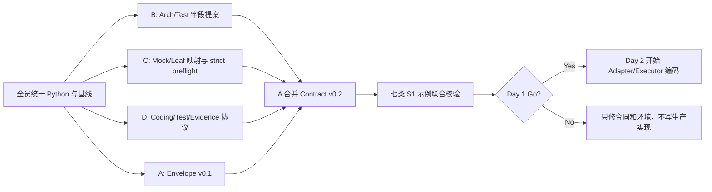

# VeriLayer 四人具体实施启动方案

> 日期：2026-07-28  
> 适用范围：从十天计划的 Day 1 正式开工，到 Day 10 实验与论文交付。  
> 核心原则：第一天先冻结合同，第二天才开始生产代码；开发可以并行，合同和集成必须集中。

> 复用修订：既有 tutor/tutor-app 是真实叶编码、多波集成和 E2E 的工程 pilot。其上游 JSON 来自 `structured-input-preparer` 且 run 为手动协调，因此不替代 production root workflow。Day 3 改为双轨校准：CMP-CONFIG-STORE 复现已知 strict 负例，独立 fresh S1 验证正向 Coding/Test/repair。

> 实施状态同步（2026-07-30）：fresh S1 的公开编码测试已 PASS（`repair=0`）；Day 4 已出现 root CONTINUE 和 health child STOP 的局部证据，但后续 Coding Admission 暴露接口证据缺失，之后仍有 Mocktest FAIL/ERROR，最新运行停在 Mocktest FAIL。完整闭环尚未达成，Day 4 继续按 **NO-GO** 管理。

> Mocktest 反馈闭环：C 必须先交付 `mocktest_report` 和处置建议。`PASS + ALLOW` 才交 Leaf Gate；`FAIL/FIX_ARCH` 退回 B 只改 Architecture 并生成新 hash 后重跑；`ERROR` 退回证据/绑定/入口/环境修复。Feature/Gherkin 冻结，B 不得通过改写它们绕过 Mocktest。

## 1. 今天应该怎样开始

四个人不要同时从各自模块直接写代码。正确顺序是：

1. A 从原始 Tutor 归档生成清洁共享包，排除 `.env`、data、Git/worktree、缓存和本机草稿；四人共同核对 secret scan 与 SHA-256 manifest。
2. A 发布 22/16/17/12 四类资产 migration manifest、current-state/path-rewrite manifest、Artifact Contract v0.1 和文件所有权表。
3. B、C、D 分别审计既有生成工件、prepared Mock/Leaf、代码与测试 oracle，再补齐字段提案。
4. 四人用 CMP-CONFIG-STORE 验证迁移和已知 strict 负例合同，用独立 S1 冻结正向 Coding/Test 合同。
5. 21:00 进行 Day 1 Go/No-Go；只有共同合同通过后，Day 2 才允许创建 Adapter 和 Executor 生产代码。

### 已验证的本机基线

- 参考机器已用 Python 3.13、`pytest 8.2.0` 运行根编排器基线：`27 passed`。
- 每人分别冻结 `$veriPython` 和可选 `$tutorPython`；同一种运行角色内部版本必须一致，但 VeriLayer 实验环境与 Tutor reference 环境不必强行使用同一解释器。
- 所有共享文件只保存仓库相对路径，不保存个人盘符或用户目录。
- `vibecode/state.json` 仍处于 legacy `INIT`；没有 `execution-log.jsonl`。
- `next-step` 当前要求 `doctor → generate-matrix`，但尚无 `STOP_LAYERING` 节点。
- 新 VeriLayer 根流程应使用 `run-workflow`，不得为了“看起来有进度”推进 legacy 示例状态。
- Architecture 模块的 canonical 名称已统一为 `prd-to-architecture-skill`；所有成员的配置、文档和交接包只允许使用这一名称，并在开工预检中确认本地 checkout 已同步。

### 四人统一终端设置

每个人先打开 PowerShell：

```powershell
$veriRoot = (Resolve-Path '<YOUR_LOCAL_VERILAYER_PROJECT_ROOT>').Path
$veriPython = '<YOUR_LOCAL_PYTHON_EXE>'
$tutorPython = '<YOUR_LOCAL_TUTOR_REFERENCE_PYTHON_EXE_OR_SAME_AS_VERI>'
$workflowRoot = Join-Path $veriRoot 'vibe coding'
if (-not (Test-Path -LiteralPath $workflowRoot)) { throw "Missing workflow root: $workflowRoot" }
if (-not (Test-Path -LiteralPath $veriPython)) { throw "Missing Python: $veriPython" }
if (-not (Test-Path -LiteralPath $tutorPython)) { throw "Missing tutor reference Python: $tutorPython" }
Set-Location $workflowRoot
& $veriPython -m pytest --version
& $veriPython -m pytest -q tests\test_contracts.py tests\test_module_runner.py tests\test_root_workflow.py
& $veriPython vibecode\scripts\vibecode.py next-step
& $veriPython vibecode\scripts\vibecode.py run-workflow --help
```

预期：

- `pytest 8.2.0`；
- `27 passed`；
- `next-step` 显示先运行 `doctor`；
- `run-workflow --help` 显示 Requirement/PRD、config、output-dir、run-id、project-id、实验模式等参数。

如同一种运行角色的结果不同，先停下，由 A 记录环境差异；不要临时升级依赖继续开发。Tutor reference 回归可以使用单独锁定的解释器和依赖 hash。

### 本地路径与共享交付

- 每个人可以把完整项目放在不同目录，使用自己的 `$veriRoot` 和 `$veriPython`。
- 仓库相对结构和 artifact contract 必须一致。
- 推荐各自分支/工作副本，由 A 合并；无 Git 时提交 patch、changed-paths、测试结果和 SHA-256 manifest。
- 不允许整目录相互覆盖。
- 模块位于项目根之外时，用本地 `$architectureRoot`、`$mocktestRoot`、`$leafGateRoot` 等变量映射。
- 个人绝对路径只能进入本地 environment manifest，不得进入共享 config、Schema 和论文证据。

## 2. 分工与文件所有权

| 成员 | 当下角色 | 独占主责文件 | 可以评审但不能直接修改 | 第一个交付 |
|---|---|---|---|---|
| A | Integration Owner + Contract Owner | `vibecode/contracts.py`、`vibecode/root_workflow.py`、`vibecode/orchestrator.py`、`vibecode/backfill.py`、拟新增 `docs/`、`config/`、公共 Adapter 基类 | B/C/D 的生成、验证和编码核心 | Artifact Contract v0.1 |
| B | Design/Test Generation Owner | Architecture/Gherkin Adapter、Schema、生成执行器及相关测试 | Mocktest、Leaf、Coding Executor | Architecture/Testcases 合同示例 |
| C | Validation/Leaf Owner | Mocktest/Leaf Adapter、缺陷映射、Leaf 盲评协议和相关测试 | Root orchestration、Coding Prompt、实验聚合 | Mock→Leaf 映射和 strict 后端结论 |
| D | Coding/Evaluation Owner | Coding/pytest/repair/evidence Executor、benchmark、experiment runner、metrics | Root orchestration、Architecture/Gherkin/Mock 核心 | Coding Executor/Test/Evidence 协议 |

### 全项目并行与串行顺序

| 阶段 | 可以并行 | 必须等待 |
|---|---|---|
| 开工前清洁包 | A 生成清洁副本；B/C/D 并行复核排除清单、secret scan 和 hash | 清洁包 Gate 前不分发原始 Tutor 文件夹 |
| 环境预检 | A/B/C/D 同时验证各自 `$veriPython`；需要 Tutor 回归者另验 `$tutorPython` | 同一角色环境不一致时停止 |
| Day 1 前半 | A 写 envelope v0.1；B 读生成规程；C strict preflight；D 定义 Coding/Test 协议 | B/C/D 的最终 Schema 必须等 A v0.1 |
| Day 1 后半 | B/C/D 同时提交字段提案和示例 | 生产实现必须等 A 合并 v0.2 和 Day 1 Gate |
| Day 2 | A、B、C、D 分别写自己所有权内的测试和骨架 | 绑定 common Adapter 的部分等 A 发布接口 |
| Day 3 双轨校准 | A 建 CMP-negative 与 S1-positive 两个 run；B 分别生成；C 复现 CMP FAIL 并验证 S1 PASS/STOP；D 只编码 S1 | CMP FAIL 必须阻断 Leaf/Coding；两个轨道不共享最终工件 |
| 单节点真实流水线 | B 的 Architecture 与 Gherkin 并行；不同节点可流水重叠 | `A PRD → B 双生成 → C Mocktest → C Leaf → D Coding/Test` |
| 多叶集成 | D 可整理 completion packages，C 可复核证据 | 所有 child 完成后 A integration；A 完成后 D root acceptance |
| 实验 | 多机器按 task/config 分片并行 | 必须等 Day 6 freeze；每 run 使用唯一 ID/目录 |
| 论文 | A/B/C/D 同时写各自主责章节 | 数字和主张必须等 evidence 冻结 |

### 强制协作边界

- 共享 Schema 由 A 合并，B/C/D 只提交字段提案或测试样例。
- `root_workflow.py`、父层 wiring、共享 DTO 和 integration registry 只由 A 修改。
- B 不为 Mocktest 特意篡改 Architecture 输出；通过合同和 Adapter 解决。
- C 不修改 Coding Prompt 来让实验通过。
- D 不直接修 B/C 模块，也不能把 hidden tests 放进生成上下文。
- 发生 contract diff 时立即停止跨模块合并，提交 Contract Change Request。
- 每次交接必须包含：输入 hash、输出 hash、Schema 版本、命令、退出码、测试摘要和已知限制。

## 3. 成员 A：合同与根编排负责人

### 3.1 今天的唯一目标

在四小时内发布 Artifact Contract v0.1；在八小时内让七类最小示例通过统一 Schema，并获得 B/C/D 确认。

### 3.2 开工前 30 分钟

1. 运行统一基线命令。
2. 确认团队统一使用 Anaconda Python。
3. 确认本地存在 canonical Architecture 目录 `prd-to-architecture-skill`；若仍出现旧拼写，先同步最新 checkout，禁止在 production config 中建立双路径兼容。
4. 建立文件所有权表和 `contract-change-log.md`。
5. 不运行 `advance-state`，不改 legacy `state.json`。

### 3.3 Day 1 逐小时安排

| 时间 | A 的工作 | 输出 |
|---|---|---|
| 09:00–09:30 | 基线、解释器和真实目录确认 | 环境记录、路径决议 |
| 09:30–11:00 | 定义 canonical envelope、identity、status、hash、input refs | `docs/ARTIFACT_CONTRACT.md` v0.1 |
| 11:00–12:00 | 定义 module-result 成功/失败、错误分类和退出码 | module-result 合同 |
| 13:00–14:30 | 起草统一 Artifact JSON Schema | `schemas/verilayer-artifact.schema.json` |
| 14:30–16:00 | 合并 B/C/D 字段提案；解决 `child_node_id/node_id` | 合同 v0.2 |
| 16:00–18:00 | 为七类工件写最小例子并准备合同测试 | `tests/fixtures/contracts/*` |
| 20:00–21:00 | 主持联合验证和签字 | Day 1 Gate 记录 |

### 3.4 A 今天创建或修改的文件

拟新增：

```text
vibe coding/
├─ docs/
│  ├─ ARTIFACT_CONTRACT.md
│  ├─ contract-change-log.md
│  └─ FILE_OWNERSHIP.md
├─ config/
│  └─ verilayer.production.json
├─ vibecode/schemas/
│  └─ verilayer-artifact.schema.json
└─ tests/
   ├─ test_artifact_contract.py
   └─ fixtures/contracts/
```

可读取但 Day 1 不应大改：

- `vibecode/contracts.py`
- `vibecode/schemas/common-envelope.schema.json`
- `vibecode/schemas/module-result.schema.json`
- `vibecode/root_workflow.py`

### 3.5 A 的合同最小字段

```text
schema_version
run_id / project_id / node_id / parent_node_id
artifact_id / artifact_type / status
created_at / generator / model
input_artifacts / requirement_ids
content_path / content_sha256
error.category / error.code / error.message
```

正式 child key 统一使用 `node_id`；Leaf 内部旧字段 `child_node_id` 仅由 Adapter 兼容读取。

### 3.6 A 的首日验收

```powershell
Set-Location $workflowRoot
& $veriPython -m pytest -q tests\test_contracts.py tests\test_artifact_contract.py
```

必须满足：

- PRD、Architecture、Testcases、Mocktest、Leaf、Code、TestResult 七类示例都能校验；
- 相同运行的四个 identity 字段一致；
- hash 可重算；
- 错误结果也能形成合法 artifact；
- B/C/D 在 Gate 记录中确认没有字段歧义。

### 3.7 A 后续十天路线

| 日程 | 主任务 |
|---|---|
| Day 2 | common Adapter、production config、migration/path-rewrite loader、双环境 preflight、PRD Root/Derive Adapter 骨架 |
| Day 3 | 建立 CMP validation-negative 与 S1 coding-positive 两个隔离 run，维护双轨 evidence |
| Day 4 | 启动 fresh root requirement，完成真实 recursive Derive |
| Day 5 | 主持 fresh 双叶 Requirement→child STOP→coding 闭环 |
| Day 6 | dependency DAG、接口回填、多叶 Modular Monolith 集成 |
| Day 7 | 审核 C0-C5 是否只改变冻结开关 |
| Day 8 | 监控正式运行，不修改冻结实现 |
| Day 9 | 负责 Workflow、Contract、Integration 论文内容 |
| Day 10 | C0/C5 复现、最终合同和交付审计 |

### 3.8 A 交给其他人的包

```text
contract-version
schema files
seven valid examples
production path map
status/error enum
hash rules
change request template
```

在这个包发布前，B/C/D 可以研究和写提案，但不能提交生产 Adapter。

## 4. 成员 B：Architecture 与 Gherkin 负责人

### 4.1 今天的唯一目标

把 Architecture 和 Gherkin 的现有规程转换成两个明确、可由 Adapter 消费的输出合同；今天只做合同、示例和 validator，不提前写完整生成器。

### 4.2 开工前 30 分钟

1. 运行统一基线命令。
2. 完整阅读：
   - `prd-to-architecture-skill/architecture-skill/architecture-ddd-to-system-design/SKILL.md`
   - `prd-to-architecture-skill/recursive-architecture-design/SKILL.md`
   - `prd-to-gherkin/skill3.md`
3. 向 A 确认当前 Architecture 真实目录名。
4. 从 A 获取 envelope v0.1；不得自行定义 run/node/status 字段。

### 4.3 Day 1 逐小时安排

| 时间 | B 的工作 | 输出 |
|---|---|---|
| 09:00–10:30 | 提取 Architecture 必需产物和最小字段 | Architecture 输出清单 |
| 10:30–12:00 | 裁剪 FastAPI Modular Monolith 七文件最小模板 | 七文件模板映射 |
| 13:00–14:30 | 定义 `architecture.json` | Schema 字段提案 |
| 14:30–15:30 | 定义 requirement model 与 `testcases.json` | Testcase Schema 字段提案 |
| 15:30–17:00 | 制作 S1 手工合同示例 | Arch/Testcases 示例 |
| 17:00–18:00 | 运行 Gherkin validators，固定退出码 | validator 记录 |
| 20:00–21:00 | 与 A/C/D 联合合同验证 | Day 1 签字 |

### 4.4 B 今天创建的提案文件

```text
vibe coding/docs/proposals/B_ARCHITECTURE_CONTRACT.md
vibe coding/docs/proposals/B_TESTCASES_CONTRACT.md
vibe coding/tests/fixtures/contracts/architecture.example.json
vibe coding/tests/fixtures/contracts/testcases.example.json
vibe coding/tests/fixtures/contracts/s1.feature
```

A 合并后，Day 2 才建立：

```text
vibe coding/vibecode/adapters/architecture_adapter.py
vibe coding/vibecode/adapters/gherkin_adapter.py
vibe coding/vibecode/schemas/architecture-artifact.schema.json
vibe coding/vibecode/schemas/testcases-artifact.schema.json
```

### 4.5 Architecture 最小输出

除统一 envelope 外，至少包含：

```text
components
interfaces
dependencies
data_and_state
risks
requirement_mappings
integration_points
```

七文件包可以保留 Markdown 供人阅读，但 `architecture.json` 是机器编排的 source of truth。

### 4.6 Testcases 最小输出

除统一 envelope 外，至少包含：

```text
features
scenarios
testcase_id
requirement_ids
preconditions
expected_result
verification_status
source_feature_path
```

### 4.7 B 的首日验收

```powershell
Set-Location $veriRoot
$gherkinRoot = Join-Path $veriRoot 'prd-to-gherkin'
node (Join-Path $gherkinRoot 'scripts\validate_feature.mjs') '<S1 feature path>'
node (Join-Path $gherkinRoot 'scripts\validate_requirement_graph.mjs') '<S1 requirement model path>'
```

同时由统一 Python 执行：

```powershell
& $veriPython -m pytest -q (Join-Path $workflowRoot 'tests\test_artifact_contract.py')
```

必须满足：

- S1 Architecture/Testcases 示例通过 A 的 envelope Schema；
- Feature 和 requirement graph 均通过现有 validator；
- 每个 testcase 可追溯到 requirement；
- Architecture dependency 能被 A 的 DAG 消费；
- B 没有把 hidden tests 写入生成输入。

### 4.8 B 后续十天路线

| 日程 | 主任务 |
|---|---|
| Day 2 | 用既有 migration regression 创建 Architecture/Gherkin CLI Adapter 骨架 |
| Day 3 | 为 CMP 负向轨道和独立 S1 正向轨道分别 fresh 生成 Architecture、Feature、`testcases.json`，不复制旧工件 |
| Day 4 | 为 fresh Root/Child PRD 真实双生成和 parent trace |
| Day 5 | 为 fresh 双叶闭环提供每个 child 的设计与测试包 |
| Day 6 | 支持依赖图和父子接口回填；冻结生成 Prompt/Schema |
| Day 7 | 四任务 pilot，确认小/中/大任务均能生成有效工件 |
| Day 8 | 只处理技术失败，不更改实验定义 |
| Day 9 | 负责 PRD、Architecture、Gherkin 方法和工件统计 |
| Day 10 | 抽查生成工件与论文案例一致性 |

### 4.9 B 交给 C 和 D 的包

交给 C：

```text
architecture.json
architecture markdown package
testcases.json
*.feature
requirement mapping
validator outputs
all hashes
```

交给 D：

```text
leaf design bundle
public acceptance scenarios
interfaces/dependencies
allowed implementation constraints
```

## 5. 成员 C：Mocktest 与 Leaf-gate 负责人

### 5.1 今天的唯一目标

证明 strict 路径有可执行方案，并冻结 Mocktest→Leaf 的确定性映射。今天不能用模拟 PASS 替代真实 strict 结果。

### 5.2 开工前 45 分钟

1. 运行统一基线命令。
2. 完整阅读：
   - `mocktest/.agents/skills/validate-arch/SKILL.md`
   - `leaf-gate/SKILL.md`
3. 运行 CLI 预检和帮助：

```powershell
Set-Location $veriRoot
$mocktestRoot = '<YOUR_LOCAL_MOCKTEST_MODULE_ROOT>'
$leafGateRoot = '<YOUR_LOCAL_LEAF_GATE_MODULE_ROOT>'
& $veriPython (Join-Path $mocktestRoot '.agents\skills\validate-arch\scripts\preflight.py') --root $mocktestRoot --scan-path $mocktestRoot
& $veriPython (Join-Path $mocktestRoot '.agents\skills\validate-arch\main_session_strict_driver.py') --help
& $veriPython (Join-Path $leafGateRoot 'scripts\run_leaf_gate.py') --help
```

4. 把结果分类为：
   - strict backend 可直接运行；
   - 需要 canonical current-session driver 封装；
   - 环境工具错误。

不能把第三类记成 Architecture FAIL。

### 5.3 Day 1 逐小时安排

| 时间 | C 的工作 | 输出 |
|---|---|---|
| 09:00–10:00 | strict preflight、driver/Leaf CLI 核验 | 后端决策记录 |
| 10:00–11:30 | 读取 Mocktest 与 Leaf 两端 Schema | 字段差异清单 |
| 11:30–12:00 | 向 A 提交 identity/status 建议 | C 字段提案 |
| 13:00–14:30 | 完成 MocktestReport→Leaf input 映射 | 映射表 |
| 14:30–15:30 | 固定 defect taxonomy | 分类规则 |
| 15:30–16:30 | 固定 C2 `ABLATION_NOT_RUN` | ablation 语义 |
| 16:30–18:00 | 制作 M2 单缺陷 Ground Truth 示例 | 注入示例 |
| 20:00–21:00 | 审查共同合同和错误语义 | Day 1 签字 |

### 5.4 C 今天创建的提案文件

```text
vibe coding/docs/proposals/C_MOCKTEST_LEAF_MAPPING.md
vibe coding/docs/proposals/C_DEFECT_TAXONOMY.md
vibe coding/docs/proposals/C_STRICT_BACKEND_DECISION.md
vibe coding/tests/fixtures/contracts/mocktest.example.json
vibe coding/tests/fixtures/contracts/leaf-decision.example.json
vibe coding/benchmark/defect_injection/M2/example-001/
```

Day 2 才建立：

```text
vibe coding/vibecode/adapters/mocktest_adapter.py
vibe coding/vibecode/adapters/leaf_adapter.py
vibe coding/tests/integration/test_mocktest_adapter.py
vibe coding/tests/integration/test_leaf_adapter.py
```

### 5.5 C 必须解决的映射

| 上游 | 正式下游含义 |
|---|---|
| strict PASS/FAIL/ERROR | Mocktest artifact status，工具错误不得伪装业务结论 |
| scenario/validator/hop | Leaf 可消费的验证证据和覆盖状态 |
| `child_node_id` | Adapter 兼容输入；跨模块正式输出改为 `node_id` |
| legacy `LEAF_READY`/`DONE_LAYERING` | 只读兼容映射为 `STOP_LAYERING` |
| C2 未运行 Mocktest | `is_ablation=true`、`full_run=false`、`ABLATION_NOT_RUN` |

### 5.6 C 的首日验收

必须提交：

- preflight 原始输出；
- strict driver 选择及理由；
- M2 一个注入缺陷的 before/after hash；
- 缺陷→受影响 scenario→预期 Mock finding→Leaf evidence 映射；
- 一个合法 `STOP_LAYERING` 示例和一个合法 `CONTINUE_LAYERING` 示例；
- 工具错误示例不能被 Leaf 当成 PASS。

### 5.7 C 后续十天路线

| 日程 | 主任务 |
|---|---|
| Day 2 | Mocktest/Leaf Adapter 骨架；拒绝把 prepared Mock 映射为 strict PASS |
| Day 3 | CMP 轨道复现 strict execution complete + architecture FAIL 并阻断下游；S1 轨道验证 strict PASS + Leaf STOP |
| Day 4 | 为 fresh root run 发布真实 CONTINUE/STOP；验证 `node_id` |
| Day 5 | 为 fresh 双叶闭环发布各节点验证证据 |
| Day 6 | 审核多叶集成前各叶验证状态；冻结缺陷和 Leaf 协议 |
| Day 7 | 缺陷注入、C2/C3 消融语义、Leaf 双盲包 |
| Day 8 | 独立复核失败分类，不删除负面结果 |
| Day 9 | 负责 Mocktest、Leaf、Defect Case Study 与一致性统计 |
| Day 10 | 独立 claim/evidence 审计 |

### 5.8 C 交给 A 和 D 的包

交给 A：

```text
leaf_gate_decision.json
proposed children
node_id mapping
decision evidence
input/output hashes
strict execution completeness
```

交给 D：

```text
verified leaf bundle
public failure evidence
defect category
repair-eligible evidence
明确排除的 hidden ground truth
```

## 6. 成员 D：Coding、测试与实验负责人

### 6.1 今天的唯一目标

冻结唯一 Coding Executor、pytest、repair、evidence 和 C0–C5 公平性协议。今天不需要完成真实模型生成器，但协议必须使 Day 2 能直接编码。

### 6.2 开工前 30 分钟

1. 运行统一基线命令，确认 `27 passed`。
2. 记录解释器、pytest、OS、工作目录和依赖版本。
3. 与 A 冻结 evidence run 目录。
4. 明确 hidden tests 物理隔离规则：
   - 不复制到 leaf workspace；
   - 不写入 Prompt；
   - 仅由 root acceptance runner 持有；
   - 泄漏扫描失败则整次 run 无效。

### 6.3 Day 1 逐小时安排

| 时间 | D 的工作 | 输出 |
|---|---|---|
| 09:00–10:00 | 冻结 Python/FastAPI/pytest/SQLite 环境 | 环境 manifest |
| 10:00–11:30 | 定义 Coding Executor 输入、输出、退出码 | Executor protocol |
| 11:30–12:00 | 向 A 提交 Code/TestResult 字段 | D 字段提案 |
| 13:00–14:00 | 定义 workspace allowlist 和 path safety | workspace contract |
| 14:00–15:00 | 定义 pytest 120 秒、JUnit/JSON/raw log | test protocol |
| 15:00–16:00 | 定义最多两轮 repair 及每轮证据 | repair protocol |
| 16:00–17:00 | 起草 S1 requirement/public/hidden contract | S1 task spec |
| 17:00–18:00 | 定义 C0–C5 公平性机器检查 | config constraints |
| 20:00–21:00 | 联合合同验证 | Day 1 签字 |

### 6.4 D 今天创建的提案文件

```text
vibe coding/docs/CODING_EXECUTOR_PROTOCOL.md
vibe coding/docs/EXPERIMENT_PROTOCOL.md
vibe coding/docs/proposals/D_ENVIRONMENT_MANIFEST.md
vibe coding/benchmark/tasks/S1/requirement.json
vibe coding/benchmark/tasks/S1/public_tests/
vibe coding/benchmark/private_tests/S1/acceptance-contract.json
vibe coding/tests/fixtures/contracts/code.example.json
vibe coding/tests/fixtures/contracts/test-result.example.json
```

Day 2 才建立：

```text
vibe coding/vibecode/executors/model_runner.py
vibe coding/vibecode/executors/coding_executor.py
vibe coding/vibecode/executors/workspace.py
vibe coding/vibecode/executors/pytest_runner.py
vibe coding/vibecode/executors/repair_loop.py
vibe coding/vibecode/evidence.py
```

### 6.5 D 冻结的 Coding Executor 协议

输入：

```text
canonical envelope
leaf PRD
architecture.json
testcases.json / public feature
allowed paths
technology profile
model settings
token budget
repair budget
```

输出：

```text
raw model response
generated file manifest
patch/diff
code hashes
module-result
pytest command/exit/stdout/stderr
repair attempt records
token/time/call metrics
```

所有 C0–C5：

- 使用同一个 Coding Executor；
- 使用同一模型、参数、Prompt 模板和 repair 上限；
- 只能通过输入工件和冻结的阶段开关形成差异；
- 不允许 C5 获得更多 Token 或人工修复。

### 6.6 D 的首日验收

使用一个静态 S1 代码样例验证协议，不把它当实验结果：

```powershell
Set-Location $workflowRoot
& $veriPython -m pytest -q tests\test_artifact_contract.py tests\test_leaf_workspace.py tests\test_pytest_runner.py
```

若后两个测试尚未实现，Day 1 的验收是先冻结测试接口和预期断言；Day 2 再让测试由红变绿。

必须满足：

- 测试结果记录 command、exit、stdout、stderr、duration 和 hash；
- repair attempt 从 0 开始，最多 2；
- 每轮 repair 的输入只含公开失败证据；
- hidden test path 不出现在 Prompt、workspace 或 raw model input；
- Token 不可得时写 `null`，不得估造。

### 6.7 D 后续十天路线

| 日程 | 主任务 |
|---|---|
| Day 2 | Coding scaffold、隔离 workspace、pytest/evidence skeleton；旧代码只作 oracle |
| Day 3 | 只在独立 S1 positive workspace fresh 编码、pytest 和受控 repair；CMP FAIL 不进入 Coding |
| Day 4 | 对 fresh child 实现最多两轮 repair，保留每轮证据 |
| Day 5 | 接收两个 fresh STOP leaf，完成双叶代码闭环 |
| Day 6 | root startup、hidden acceptance、多叶集成验收 |
| Day 7 | C0–C5 validate-only、四任务 pilot、metrics 检查 |
| Day 8 | 执行最低 24 次正式 run，不改冻结实现 |
| Day 9 | 聚合 24/36 run、统计、图表和 Results 初稿 |
| Day 10 | C0/C5 复现、归档 evidence 和最终论文整合 |

### 6.8 D 交给 A 和 C 的包

交给 A：

```text
child completion package
generated file manifest
public test result
interface manifest
code/test hashes
integration prerequisites
```

交给 C：

```text
raw failure category
repair evidence
tool/system failure separation
实验 run manifest
不可见 hidden test 审计结果
```

## 7. 第一天的依赖顺序



## 8. 每日协作节奏

| 时间 | 会议 | 每个人必须回答 |
|---|---|---|
| 09:00 | 15 分钟接口同步 | 今天唯一交付、依赖谁、会修改哪些文件 |
| 13:30 | 10 分钟阻断同步 | 当前 blocker、是否触发合同变更、是否影响 Gate |
| 18:00 | 异步交接 | 命令、hash、测试、已知失败、下一消费者 |
| 21:00 | 30 分钟 Go/No-Go | 是否满足验收；不满足时削减什么，禁止伪造什么 |

统一交接模板：

```markdown
Owner:
Artifact/version:
Input refs + hashes:
Changed paths:
Command:
Exit code:
Test summary:
Output refs + hashes:
Known limitations:
Contract change required: yes/no
Next owner/action:
```

## 9. Day 1 共同 Go/No-Go

### Go

只有同时满足以下条件才能进入 Day 2：

- 清洁共享包已排除 `.env`、data、Git/worktree、缓存和本机草稿，secret scan 与 SHA-256 manifest 已复核；
- VeriLayer 环境在四人机器上使用同一冻结基线；Tutor reference 环境若独立存在，也有单独版本/hash；
- Architecture 目录最终物理路径已冻结；
- migration manifest 完整记录 22 个设计节点、16 套 L2 五件套、17 个实现叶和 12 个 backfill；
- current-state manifest 明确 prepared artifact、手动 run、历史状态漂移及 `evidence_time/superseded_by/claim_scope`；
- path-rewrite manifest 将旧绝对路径只作为 provenance，运行引用均可重定位或 fail-closed；
- CMP-CONFIG-STORE 七类 migration 工件通过统一 envelope/Adapter，并被标为已知 strict 负例；
- `node_id`、status、hash、error 语义没有冲突；
- Architecture/Testcases validators 可执行；
- strict 后端有明确可执行路径；
- hidden tests 不进入任何生成上下文；
- C0–C5 共享 Coding Executor 的规则可以机器检查；
- 文件 owner 和交接模板已签字。

### No-Go

出现任一情况就留在 Day 1：

- B/C/D 各自创建了不同 identity/status；
- 同一运行角色使用不同且未登记的 Python/pytest/依赖版本；
- strict 工具错误被记为架构失败；
- C2 被伪装成 Mocktest PASS；
- hidden tests 可被 Coding Executor 读取；
- 当前真实路径和 production config 不一致；
- 有人开始修改不属于自己的核心文件。

No-Go 时只允许修合同、环境和路径，不允许通过 mock、fixture 或删除验收项绕过。

## 10. 四个人可直接复制给各自 Codex 任务的启动指令

### A 的启动指令

```text
你是 VeriLayer 成员 A，Integration Owner 和 Contract Owner。
先完整阅读 VERILAYER_10_DAY_IMPLEMENTATION_PLAN.md、
VERILAYER_FOUR_PERSON_START_GUIDE.md、vibe coding/AGENTS.md、
vibe coding/.agents/skills/layered-vibecode/SKILL.md。
先从原始 Tutor 归档生成清洁共享包，排除 .env、data、Git/worktree、缓存和本机草稿，
输出 secret scan、PACKAGE_MANIFEST.sha256 和 recipient requirements。
只执行 Day 1 A 的任务：建立 22/16/17/12 四类资产 migration manifest、
current-state/path-rewrite manifest；基于 CMP migration fixture 起草 canonical
Artifact Contract、Schema、七类示例、文件所有权和 production config 草案。
不要推进 legacy state，不实现 Architecture/Gherkin/Mock/Leaf/Coding 核心。
先设置本地 $veriRoot、$workflowRoot、$veriPython，再跑 27 个基线测试。
每次交付附命令、退出码、hash、测试和合同变更说明。
```

### B 的启动指令

```text
你是 VeriLayer 成员 B，Architecture 与 Gherkin Owner。
先完整阅读总计划、四人启动方案以及两个 Architecture Skill 和 Gherkin skill3.md。
只执行 Day 1 B 的任务：审计 22 份 L0/L1/L2 Feature 和 16 套 L2
Architecture/Testcases，给 A 提交迁移字段提案、七文件最小模板、
migration 示例和 validator 结果，并准备独立 S1 positive 输入合同。
共享 identity/status 必须使用 A 的 envelope，不能另建合同。
不要修改 Mocktest、Leaf、Coding Executor 或 root_workflow.py。
```

### C 的启动指令

```text
你是 VeriLayer 成员 C，Mocktest 与 Leaf-gate Owner。
先完整阅读总计划、四人启动方案、validate-arch SKILL.md 和 leaf-gate/SKILL.md。
只执行 Day 1 C 的任务：审计 prepared Mock/Leaf、强制 STOP 标签、strict preflight、后端决策、
Mock→Leaf 映射、defect taxonomy、C2 ABLATION_NOT_RUN 和 M2 单缺陷示例。
工具错误必须与业务 FAIL 分离，不允许模拟 strict PASS。
Tutor owner-forced STOP 不得进入正式 Leaf ground truth。
不要修改 Coding Prompt、实验聚合或 root_workflow.py。
```

### D 的启动指令

```text
你是 VeriLayer 成员 D，Coding、测试与实验 Owner。
先完整阅读总计划、四人启动方案和 A 发布的 Artifact Contract。
只执行 Day 1 D 的任务：把 tutor-app 既有代码/测试登记为只读 oracle，
冻结唯一 Coding Executor、隔离 positive workspace、pytest、repair=2、
evidence、metrics、C0-C5 公平性和独立 S1 positive 任务协议。
正式 benchmark 不得使用 Tutor 或其轻微改写，hidden tests 必须与生成上下文物理隔离。
不要直接修 Architecture/Mock/Leaf 模块，不要把静态样例算作实验结果。
使用本地已冻结的 $veriPython 并保留全部命令、退出码和 hash。
```

## 11. 最先开始的具体动作

如果现在四个人都在线，按以下顺序执行：

1. A 生成清洁共享包；B/C/D 复核排除清单、secret scan 和 SHA-256。
2. A 在群里发布 VeriLayer 与 Tutor reference 两套 PowerShell 基线命令。
3. 四人分别回复 `$veriPython`、可选 `$tutorPython`、pytest/依赖版本和基线结果。
4. A 发布文件所有权、Architecture 路径、22/16/17/12 migration manifest、current-state/path-rewrite manifest 骨架。
5. A 创建 Artifact Contract v0.1；B/C/D 同时审计既有 migration artifacts。
6. B、C、D 分别提交生成工件、prepared Mock/Leaf、代码/test oracle 的迁移提案，不直接抢改 A 的 Schema。
7. 14:30 进行第一次字段合并。
8. 18:00 冻结 v0.2、CMP 七类 migration 示例和独立 S1 positive 合同。
9. 21:00 运行共同 Gate。
10. Gate 通过后，四人第二天分别进入 Adapter、Generation、Validation 和 Coding 四条生产实现线。

今天最重要的交付不是代码量，而是让四个人从明天开始写出的代码天然能够接在一起。
