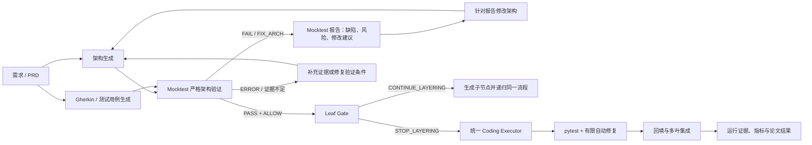

# VeriLayer 论文与实验设计分析总结

> 本文根据当前项目的工作流总文档、十天实施计划、当前进度和已确认的流程修正整理。
> 
> 事实与建议分开描述：当前代码或实验尚未完成的部分，均不得写成已经得到的论文结果。

## 1. 论文主题

VeriLayer 研究的不是单纯“让 AI 自动写代码”，而是一套**可验证的分层 AI 软件开发流程**：

1. 从需求生成 PRD；
2. 并行生成 Architecture 与 Gherkin/Testcases；
3. 用 Mocktest 严格验证架构是否足以支撑场景；
4. 根据验证证据决定节点应继续拆分还是停止拆分；
5. 只让 AI 在满足条件的叶节点实现代码；
6. 运行测试、进行有限自动修复，再将多个叶节点回填和集成；
7. 保存从输入、模型调用、代码修改、测试到最终集成的完整证据链。

一句话表述：

> VeriLayer 的目标是让复杂软件系统的 AI 开发过程，具备可分层、可验证、可追溯、可复现和可公平比较的特性。

## 2. 项目要解决的问题

项目针对以下问题：

1. 复杂需求直接交给模型编码时，边界、职责和接口往往不清晰。
2. “模块是否需要继续拆分”常由经验决定，容易过度拆分或拆分不足。
3. 架构中的契约、状态和调用流程缺陷，通常到代码或集成阶段才暴露。
4. 多个 AI 或多人并行开发时，子模块可能无法兼容，回填后容易失控。
5. AI 编码研究常只报告成功案例，缺少失败、成本、人工干预与可复现证据。

## 3. 正确的核心流程

Mocktest 不是“验证完成后直接进入 Leaf Gate”的一次性步骤。它必须形成一个“验证—报告—架构修复—再验证”的闭环。



关键边界：

- Mocktest 负责验证架构，并输出 `PASS / FIX_ARCH / REVIEW / SUPPLEMENT` 类结论和修改建议。
- `FIX_ARCH` 必须针对架构产物修复；不能为了通过验证而修改已经冻结的 Feature/Gherkin。
- 架构修改后必须重新运行 Mocktest；旧报告要保留，作为负面证据。
- Leaf Gate 只负责判定，不负责修复。
- 只有 Mocktest 结论通过、验证证据完整且输入身份一致时，节点才可进入 Leaf Gate。

## 4. FAIL 与 ERROR 的区别

| 维度 | FAIL | ERROR / 证据不足 |
|---|---|---|
| 验证是否完整执行 | 是 | 否，或无法有效开始 |
| 结论 | 已确认架构不通过 | 无法判断架构是否通过 |
| 常见原因 | 接口不兼容、状态错误、场景不可达、架构能力缺失 | 入口组件/契约不明确、工件缺失、ID/hash 不一致、strict audit 缺失、工具或环境故障 |
| 修复重点 | 修改 Architecture 后重跑验证 | 补齐输入、证据或验证条件后重跑 |
| 能否进入 Leaf/Coding | 不能 | 不能 |
| 论文统计 | 有效的架构缺陷和负面结果 | 单独统计为系统、工具或证据质量问题，不能计为架构缺陷 |

简化判断：

```text
验证完整且发现架构问题 → FAIL → 修架构
验证不完整或无法成立     → ERROR → 修证据、输入或验证条件
```

例如，已完成严格组件模拟和 validator 判断，但发现请求字段缺失，属于 FAIL；无法唯一确定场景入口组件或缺少 validator 审计记录，属于 ERROR。

## 5. 计划中的研究问题

项目文件说明 RQ1–RQ5 已冻结，但当前根目录主计划没有逐字保存这五条正式问句。下表是根据 C0–C5 消融配置、指标和验收规则得到的解释；论文开写前应补一份正式的 RQ 登记表。

| 推定 RQ | 要回答的问题 | 主要比较或证据 |
|---|---|---|
| RQ1 | 完整 VeriLayer 是否比直接编码更容易交付通过隐藏验收测试的可运行系统？ | C5 vs C0 |
| RQ2 | 严格 Mocktest 能否在编码前发现真实架构缺陷，并阻断有缺陷的设计？ | C5 vs C2、缺陷注入、CMP 负例 |
| RQ3 | 自适应 Leaf Gate 是否优于不递归或固定深度拆分？ | C5 vs C1、C3 |
| RQ4 | Architecture 与 Gherkin 并行生成能否在不降低质量的前提下节省时间或成本？ | C5 vs C4 |
| RQ5 | 完整流程是否能提供可追溯、可复现的多模块开发与集成证据，并降低不可记录的人工干预？ | 端到端 run、回填、集成和证据链 |

## 6. C0–C5 实验条件

| 配置 | 给 Coding Executor 的可见信息 | 对应作用 |
|---|---|---|
| C0 | Requirement、公共 scaffold、public tests | 直接编码基线 |
| C1 | Root PRD、根架构/Gherkin、Mock 报告、强制 STOP 证据 | 不进行自适应递归的对照 |
| C2 | Leaf PRD/Architecture/Gherkin、标记为 `ABLATION_NOT_RUN` 的 Mock 证据、Leaf 决策 | 去除真实 Mocktest 的消融 |
| C3 | 固定深度 2 的 leaf PRD/Architecture/Gherkin/Mock 证据 | 固定深度而非自适应 Leaf 决策 |
| C4 | 与 C5 相同最终 leaf bundle，但 Architecture/Gherkin 串行生成 | 并行设计分支消融 |
| C5 | 经验证的最终 leaf PRD/Architecture/Gherkin/Mock/Leaf 证据 | 完整 VeriLayer |

所有配置必须共享同一个 Coding Executor、模型版本、Prompt 模板、模型参数、Token 预算、测试超时和最多两轮 repair。阶段缺失而节省的预算不能挪给 Coding Prompt。

## 7. 正式实验设计

### 7.1 任务与样本量

正式 benchmark 设有 S1、M1、M2、L1 四类任务。每个任务应具备冻结需求、公共脚手架、公共测试、隐藏验收测试、需求到代码映射及需求到测试映射。

| 级别 | 实验规模 |
|---|---|
| 最低 | 6 配置 × 4 任务 × 1 seed = 24 runs |
| 目标 | 在 M2/L1 上增加第二个 seed，共 36 runs |
| 理想 | 全部任务、全部配置均使用两个 seed，共 48 runs |

### 7.2 公平性与污染控制

- hidden tests 必须与模型上下文、Prompt、可写 workspace 物理隔离；
- 每次 run 都使用独立 fresh workspace；
- Tutor 的历史代码、测试和 Leaf 标签不得进入正式 C0–C5 benchmark；
- Tutor 仅能作为迁移样例、工程 oracle 和案例材料；
- 任何修复、重试、人工干预、失败或预算耗尽都必须记录；
- 所有 run 保留输入、输出、Prompt、代码 hash、测试日志、修复 patch 和最终状态。

### 7.3 指标

主终点建议固定为：**hidden acceptance pass rate**，即最终系统是否通过私有验收测试。

辅助指标包括：

- 代码层：public/hidden test 通过率、import/startup 成功率、修复成功率、修复轮数；
- 架构层：Mocktest 缺陷数、缺陷类别、缺陷注入的 precision/recall；
- 分层层：`CONTINUE/STOP` 决策、过度/不足拆分、双盲专家一致率 κ；
- 集成层：多叶集成成功率、契约冲突数、回填成功率；
- 成本层：Token、wall-clock、模型调用数、重试数、人工干预次数；
- 可复现层：manifest、输入/输出 hash、Prompt/version 与 C0/C5 代表 run 的重放结果。

### 7.4 失败分类

| 类型 | 含义 | 处理 |
|---|---|---|
| SYSTEM_ERROR | Adapter、Schema、路径、证据等系统问题 | 修复后版本化重跑，保留原 run |
| TOOL_ERROR | API、可执行文件、网络、磁盘或进程故障 | 相同输入最多重试一次，仍失败则保留为 tool-unavailable |
| MODEL_INVALID_OUTPUT | 格式错误、字段缺失、patch 不可用 | 按冻结的阶段重试规则处理 |
| ARCHITECTURE_FAIL | Mocktest 确认架构缺陷 | 修改架构但不改 Feature；作为 RQ2 数据保留 |
| CODE_FAIL | 代码无法启动或测试失败 | 最多两轮自动修复，之后保留为负面结果 |
| INTEGRATION_FAIL | 模块冲突、循环依赖、接口或数据库不兼容 | 按冻结的集成修复规则处理 |
| HUMAN_INTERVENTION | 人工选择、批准或修改 | 记录次数、原因、修改人和 diff |

24 runs 只能支持探索性结论，应报告逐任务结果、效应量、bootstrap CI、失败分布和局限性，不能据此宣称普遍性结论。

## 8. 两个校准实验

Day 3 设置两个不能混入正式 benchmark 的校准轨道：

1. **CMP-CONFIG-STORE 负向轨**：严格验证应完整执行，但架构结论应为 FAIL/WARNING，并且必须阻断 Leaf/Coding 下游。
2. **fresh S1 正向轨**：独立小型 `POST /notes` 任务应完成真实生成、strict PASS、Leaf STOP、统一 Coding Executor、pytest 和证据保存。

它们分别证明“系统能正确拒绝错误架构”和“系统能实际走通一条最小正向链路”，但都不是 C0–C5 正式数据。

## 9. 论文写作计划

建议的章节结构：

1. Introduction：复杂系统 AI 开发为何需要分层验证；
2. Related Work：AI coding、架构验证、分解与 agent workflow；
3. VeriLayer：流程、Artifact Contract、递归和回填；
4. Experimental Method：任务、C0–C5、控制变量、指标、失败规则；
5. Results：按 RQ1–RQ5 报告；
6. Case Study：一个 fresh 成功闭环和一个 CMP 失败闭环；
7. Discussion：收益、成本、适用边界与失败模式；
8. Threats and Limitations：样本量、任务数、技术栈、模型和环境限制；
9. Reproducibility：数据、代码、Prompt、hash、manifest 与重放说明。

原计划的版本节奏：

| 版本 | 计划时间 | 前提 |
|---|---|---|
| 章节骨架 v0.0 | Day 7 | 章节、表格和图占位完整 |
| 初稿 v0.1 | Day 9 | 最低 24 runs 或目标 36 runs 已冻结 |
| 二稿 v0.2 | Day 10 | 内部审稿、claim audit、复现结果已处理 |
| 归档稿 v1.0 | Day 10 | 材料、数据、代码和限制同步冻结 |

论文必须维护 `claim-evidence-matrix`：每个量化或系统性主张都要能回链到明确的 run、原始数据、图表或测试证据。没有真实 run evidence 的句子不得写入 Abstract 或 Conclusion。

## 10. 当前项目状态

截至当前工作区记录：

- Day 1、Day 2 的合同、环境和生产骨架已经完成；
- Day 3 的正负校准已形成：S1 已有正向 strict/Mocktest/Leaf/Coding/public pytest 证据，CMP 已作为 strict 完整但 architecture FAIL 的负例被阻断；
- S1 首次通过 public pytest，repair=0；这证明了正向编码链，但不单独证明 repair loop。repair 能力应由独立、可复现的初始失败 fixture 证明，不能通过破坏成功输出来制造失败；
- Day 4 的真实 root 生成、strict adapter 和 pre-backfill 配置已开始执行。一个 run 在 PRD 阶段发生系统 ERROR，后续 run 在完成 PRD/Architecture/Gherkin 后于 Mocktest semantic gate FAIL；正确下一步是根据报告只修 Architecture 并重新验证；
- 尚未完成新的 production recursive root run；
- C0–C5 的正式任务规格、实验配置、24-run 数据集和统计结果尚未完成。

因此，当前可写论文的方法、系统设计和实验协议；不能把 C0–C5 的比较结果、完整递归生产运行或多叶集成写成已经得到的实证结论。

## 11. 最优先补齐的论文工件

在正式实验开始前，应补齐一张正式的：

```text
RQ1–RQ5 × C0–C5 × 主要/辅助指标 × 原始证据路径 × 图表编号
```

该工件不改变论文方向，但能确保实验、统计、图表和结论一一对应。

此外，正式实验前必须建立脱敏 evidence manifest：原始 run 可因机器绝对路径或私有测试而保留在受控位置，但每个可引用结论都必须公开其相对路径索引、输入/输出 hash、配置/Prompt 版本和状态摘要。
