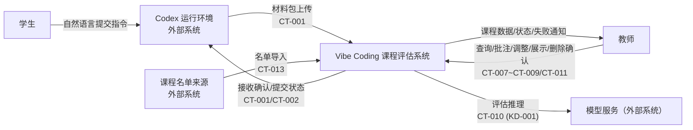
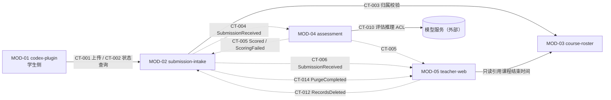

# 01 System Overview — 系统总览

## 系统目标与范围

面向大学 Vibe Coding 课堂（约 100 名学生、20–50 个小组）的 Codex 作业过程采集与评估系统：

- 学生通过 Codex Plugin 以自然语言指令提交作业相关材料（完整 Codex 对话、代码、截图、项目结果）。
- 服务器接收材料、校验课程归属，异步执行 Agent 评分（A–E 等级 + 五维度依据 + 教师专用建议）。
- 教师在网页端查看、批注、调整最终等级，并按小组生成课堂展示视图。
- 数据保留至课程结束后 1 年，教师确认删除并留存审计。

首版不包含：学生查看评分/建议、百分制评分、自动触发提交（PRD Non-goals)。

## 系统上下文图



## 模块清单（按 module_id 排序）

| module_id | Module | 来源 BC | Source Requirement / FR | trace_exemption_reason |
|---|---|---|---|---|
| MOD-01 | codex-plugin | BC-SUBMISSION（采集侧 ACL) | REQ-001~REQ-004(FR-001~FR-004) | - |
| MOD-02 | submission-intake | BC-SUBMISSION | REQ-003、REQ-004、REQ-007、REQ-011;NFR-002、NFR-003;SM-001 | - |
| MOD-03 | course-roster | BC-COURSE | REQ-005、REQ-006 | - |
| MOD-04 | assessment | BC-ASSESSMENT | REQ-008、REQ-012;NFR-003;SM-002、SM-003 | - |
| MOD-05 | teacher-web | BC-REVIEW、BC-RETENTION | REQ-009、REQ-010;NFR-001、NFR-004 | - |

## 模块职责

- **MOD-01 codex-plugin**：识别含作业/姓名/小组的自然语言提交意图；管理插件配置（邀请码、姓名、小组、三个目录）;采集完整对话与材料；分片上传材料包；展示提交编号与失败原因；网络中断时保留本地待上传任务。
- **MOD-02 submission-intake**：材料包接收（500MB 上限、类型白名单，KD-004)；提交生命周期状态机（upload_failed/rejected/received/processing/scored/scoring_failed)；完整性报告与缺失项标记；30 秒内返回接收确认；发布 SubmissionReceived 事件；执行保留期数据清除并回传清除结果（CT-014)。
- **MOD-03 course-roster**：课程、邀请码、名单（姓名+小组）维护；每次提交的归属校验（不缓存通过结论）；提供课程结束时间供保留治理引用。
- **MOD-04 assessment**：消费 SubmissionReceived 创建评分任务；经 ACL 调用外部模型 API(KD-001）执行五维度独立评估；产出原始等级、依据、教师专用建议；失败自动重试一次，再失败标记 scoring_failed 并触发教师通知。
- **MOD-05 teacher-web**：教师课程/小组/学生/提交查询（课程范围授权）；批注与最终等级调整（保留原始等级与调整记录）；展示视图生成；评分失败可见；删除确认与审计查看。

## Success Metric 分配（SM-001~003)

父级成功指标（PRD Success Metrics）到 Module 的显式归属。Owning Module 对指标负主责，并在其 L1 模块级 PRD 中承接对应子指标与统计口径；Contributing Modules 提供链路与数据支撑，不单独承接指标。

| SM ID | 指标（目标） | Owning Module | Contributing Modules | 度量数据来源 |
|---|---|---|---|---|
| SM-001 | 提交接收成功率（>=95%，有效提交中成功返回接收确认的比例） | MOD-02 submission-intake | MOD-01 codex-plugin（上传与断点续传） | CT-001 接收确认（received)/rejected/upload_failed 状态机统计 |
| SM-002 | 评分按时完成率（>=95%,10 分钟内完成评分的比例） | MOD-04 assessment | MOD-02 submission-intake(CT-004 事件发布） | CT-004 评分任务创建至 CT-005 outcome=scored 的时长（REQ-007) |
| SM-003 | 教师评分覆盖率（>=95%，课程结束前具有 Agent 结果或明确失败状态的提交比例） | MOD-04 assessment | MOD-02 submission-intake（状态回写）、MOD-05 teacher-web（教师端可见） | CT-005 outcome=scored/scoring_failed 终态比例；CT-007 可查询验证 |

说明：MOD-03 不承接成功指标（名单与归属校验为支撑能力，已含于 SM-001 链路的 REJECTED_MEMBERSHIP 统计）;SM-001~003 的统计报表由 06-deployment 的基础级监控统一产出（KD-003)，不改变本表的所有权归属。

机器可读约定：以下 `success_metric_allocations` YAML 块为本节分配信息的唯一机器可读来源（供 Derive 全层分配校验消费），与上表同源同义；冲突时以 YAML 块为准。

```yaml
success_metric_allocations:
  - sm_id: SM-001
    metric: 提交接收成功率
    target: ">=95%"
    owning_module: MOD-02
    contributing_modules: [MOD-01]
    measurement_source: "CT-001 接收确认（received）/rejected/upload_failed 状态机统计"
  - sm_id: SM-002
    metric: 评分按时完成率
    target: ">=95%"
    owning_module: MOD-04
    contributing_modules: [MOD-02]
    measurement_source: "CT-004 评分任务创建至 CT-005 outcome=scored 的时长（REQ-007）"
  - sm_id: SM-003
    metric: 教师评分覆盖率
    target: ">=95%"
    owning_module: MOD-04
    contributing_modules: [MOD-02, MOD-05]
    measurement_source: "CT-005 outcome=scored/scoring_failed 终态比例；CT-007 可查询验证"
modules_without_sm_allocation:
  - module_id: MOD-03
    reason: "名单与归属校验为支撑能力，不直接承接成功指标；已含于 SM-001 链路的 REJECTED_MEMBERSHIP 统计"
  - module_id: MOD-05
    reason: "教师端为 SM-003 的可见性与验证面（contributing），统计报表由 06-deployment 基础级监控统一产出（KD-003）"
```

## BC 到 Module 映射

| BC | Module | 说明 |
|---|---|---|
| BC-SUBMISSION | MOD-01（采集侧 ACL)+ MOD-02（服务端） | 插件实现采集侧防腐，服务端持有提交聚合 |
| BC-COURSE | MOD-03 | 一一对应 |
| BC-ASSESSMENT | MOD-04 | 一一对应 |
| BC-REVIEW | MOD-05 | 教师操作面合并 |
| BC-RETENTION | MOD-05 | 与 BC-REVIEW 同为教师驱动、读多写少、生命周期一致，合并降低运维成本；数据清除仍由数据持有方（MOD-02）执行 |

## 外部系统边界

| External System | 接入方式 | 语义隔离 | 追溯 |
|---|---|---|---|
| Codex 运行环境 | 插件进程内集成 + 本机文件读取 | ACL(MOD-01)：对话导出与本地文件 → 材料包模型 | PRD 系统边界；context-map.md |
| 课程名单来源 | 文件导入/手工录入 | Adapter(MOD-03)，首版可手工维护（A-002) | PRD 外部依赖 |
| 模型服务 | 远程 API 调用 | ACL(MOD-04)：提示编排、材料最小化、结果解析；供应商可替换 | PRD 外部依赖；KD-001 |
| 云服务器环境 | 部署承载（见 06-deployment) | 不适用 | PRD 外部依赖 |

## Module Relationship Diagram



实线为同步调用，虚线为异步事件（经 Outbox 投递，KD-002)。图中不含内部存储组件。`TW --> CR`（只读引用课程结束时间）为同 DU-2 进程内 internal_read，无网络契约（依据见 03-data-and-consistency「跨边界一致性策略」)；各跨组件流的入口条件、next_hop、返回与终止状态的机器可读声明见 02-runtime-architecture.md「合法数据流声明」。
