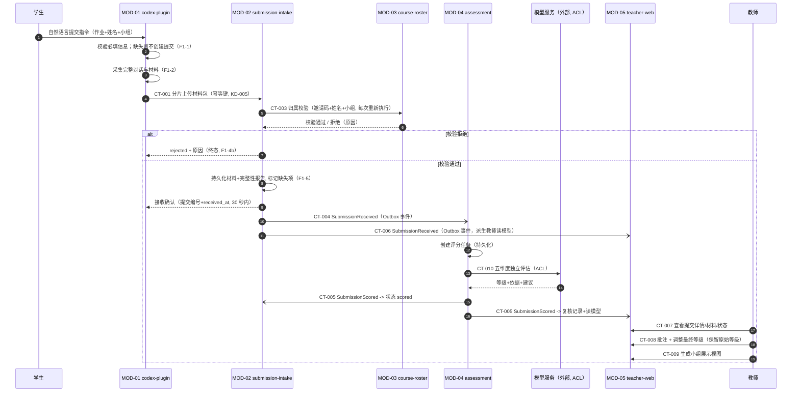
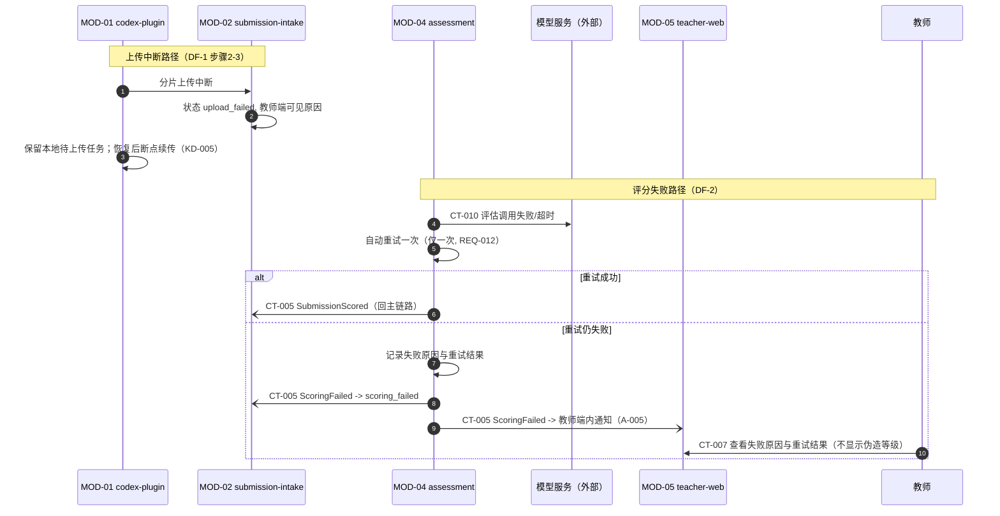

# 02 Runtime Architecture — 运行时架构

## 核心运行时流程

主链路业务顺序与 `domain-flow.md` DF-1 完全一致，未被架构阶段改写。



## 失败与补偿路径



## 同步 / 异步 / 批处理说明

| 交互 | 方式 | 依据 |
|---|---|---|
| 材料上传 + 接收确认(CT-001) | 同步 | 学生需立即获得确定结果（提交编号）;30 秒目标（NFR-003) |
| 归属校验（CT-003) | 同步 | 接收确认前必须完成校验（REQ-005/006) |
| 评分任务与执行（CT-004、CT-010) | 异步事件 + 任务内同步调用 | 评分可延迟、可重试；10 分钟目标（REQ-007) |
| 状态回写与读模型派生（CT-005、CT-006) | 异步事件 | 最终一致即可；消费幂等 |
| 教师查询/批注/调整/展示（CT-007~CT-009) | 同步 API | 交互式操作需即时反馈 |
| 保留到期标记与删除执行（DF-3) | 定时批处理 + 教师同步确认 | 到期仅标记不删除；确认后批处理执行，审计记录先于清除写入 |
| 清除结果回流（CT-014) | 异步事件 | 最终一致即可；失败项保留在批次中供重跑 |

事件投递机制：数据库 Outbox 表（KD-002)—— 业务数据与事件记录同一本地事务写入，后台投递器推送至消费方，保证「不丢事件」且无需独立消息中间件。Outbox 事件为技术事件，不新增领域事件。

## 失败处理与补偿策略

| 失败点 | 处理 | 补偿 |
|---|---|---|
| 上传中断 | 状态 upload_failed，教师端可见原因；插件保留本地任务 | 学生重发指令，断点续传；同一幂等键不产生重复提交 |
| 归属校验失败 | 状态 rejected（终态），记录原因 | 学生修正配置后重新提交（新提交编号） |
| 评分首次失败 | 自动重试一次，记录重试记录 | 重试成功回主链路 |
| 评分再失败 | 状态 scoring_failed，通知教师，教师端展示原因 | 教师可见并可线下处理；系统不伪造等级 |
| 模型服务不可用 | 计入评分失败策略（CT-010 超时/错误） | 同评分失败路径 |
| 事件投递失败 | Outbox 持久化，投递器重试 | 读模型可通过事件重放重建 |
| 删除执行部分失败 | CT-014 `failed_items[]` 回传，批次保留失败项，审计记录标注 | 重跑批处理；审计记录不可删 |

## Domain Flow 追溯表

| 运行时交互 | Source Domain Flow / Event | Contract |
|---|---|---|
| 意图识别与缺项检查 | DF-1 步骤 1 / F1-1 | (MOD-01 内部） |
| 材料包上传 | DF-1 步骤 2–3 / F1-2、F1-3 | CT-001 |
| 提交状态查询 | AC-REQ-001-01 exceptions（结果未知确认） | CT-002 |
| 归属校验 | DF-1 步骤 4–5 / F1-4 | CT-003 |
| 接收确认 | DF-1 步骤 6 / F1-5 | CT-001（应答） |
| 评分任务创建 | DF-1 步骤 7 / SubmissionReceived | CT-004 |
| 独立评估 | DF-1 步骤 8 / F2-2 | CT-010 |
| 状态回写与读模型 | DF-1 步骤 9–11 / SubmissionScored | CT-005、CT-006 |
| 教师查询/批注/调整 | DF-1 步骤 12 / F3-1~F3-3 | CT-007、CT-008 |
| 展示视图生成 | F4-1 | CT-009 |
| 评分失败重试与通知 | DF-2 / F2-3~F2-5 | CT-005 |
| 到期标记/确认删除/清除 | DF-3 / F5-1~F5-3 | CT-011、CT-012 |
| 清除结果回流 | DF-3 步骤 4–5（清除结果回写批次状态） | CT-014 |

## 合法数据流声明（机器可读）

本节为跨组件数据流的唯一机器可读来源（供验证器 contract-check / strict audit 消费），与上文时序图及 `01-system-overview.md` Module Relationship Diagram 同源同义。每条流声明入口条件（entry_condition)、后续跳转（next_hop)、返回（return_to_caller）与终止状态（terminal_states)。

```yaml
legal_flows:
  - flow_id: FLOW-001
    from: MOD-01
    to: MOD-02
    contract: CT-001
    kind: sync_api                 # HTTPS /api/v1，跨部署单元 DU-1→DU-2
    entry_condition: "学生提交指令必填信息齐全（F1-1 通过）；缺项不创建提交、不产生网络调用"
    next_hop:
      - { to: MOD-03, contract: CT-003, condition: "材料接收完成，进入归属校验" }
    return_to_caller: ["received(submission_id+received_at，30 秒内)", "rejected(rejection_reason，终态)", "upload_failed(中断标记，终态)"]
    terminal_states: [received, rejected, upload_failed]
  - flow_id: FLOW-002
    from: MOD-01
    to: MOD-02
    contract: CT-002
    kind: sync_api_query
    entry_condition: "CT-001 结果未知（30 秒超时未确认）或需展示失败原因（AC-REQ-001-01 exceptions）"
    next_hop: []
    return_to_caller: ["status+failure_reason?+missing_items[]"]
    terminal_states: []            # 只读，不推进状态机
  - flow_id: FLOW-003
    from: MOD-02
    to: MOD-03
    contract: CT-003
    kind: sync_api                 # 同 DU-2 进程内低延迟调用
    entry_condition: "FLOW-001 材料接收完成；每次提交重新执行、不缓存通过结论（REQ-006）"
    next_hop:
      - { to: MOD-04, contract: CT-004, condition: "verified=true 且材料持久化+完整性报告完成" }
    return_to_caller: ["verified+course_id", "verified=false+reason", "ROSTER_UNAVAILABLE(保持待校验并重试)"]
    terminal_states: []            # verified=false 经 CT-001 应答 rejected 终态返回 MOD-01
  - flow_id: FLOW-004
    from: MOD-02
    to: MOD-04
    contract: CT-004
    kind: async_event              # Outbox 投递，DU-2→DU-3
    entry_condition: "归属校验通过且材料持久化完成（CT-001 应答 received 之后）"
    next_hop:
      - { to: "模型服务（外部）", contract: CT-010, condition: "评分任务创建并持久化后" }
    return_to_caller: []           # 异步事件无同步返回；结果经 CT-005 回传
    terminal_states: []
  - flow_id: FLOW-005
    from: MOD-04
    to: "模型服务（外部）"
    contract: CT-010
    kind: external_sync_api        # 异步评分任务内同步调用，单次 ≤3 分钟
    entry_condition: "CT-004 消费且评分任务持久化"
    next_hop:
      - { to: MOD-02, contract: CT-005, condition: "评估完成（scored）或一次重试后仍失败（scoring_failed）" }
      - { to: MOD-05, contract: CT-005, condition: "同上，同一事件多消费方" }
    return_to_caller: ["grade+dimension_rationales[5]+suggestions[]", "MODEL_TIMEOUT/MODEL_ERROR/INVALID_RESPONSE_SCHEMA→自动重试一次"]
    terminal_states: []
  - flow_id: FLOW-006
    from: MOD-04
    to: MOD-02
    contract: CT-005
    kind: async_event
    entry_condition: "评估完成（scored）或一次重试后仍失败（scoring_failed）"
    next_hop: []
    return_to_caller: []
    terminal_states: [scored, scoring_failed]   # 提交状态机终态；重复事件不改终态
  - flow_id: FLOW-007
    from: MOD-04
    to: MOD-05
    contract: CT-005
    kind: async_event
    entry_condition: "同 FLOW-006（同一事件，多消费方）"
    next_hop: []
    return_to_caller: []
    terminal_states: []            # 派生复核记录、教师读模型与端内通知
  - flow_id: FLOW-008
    from: MOD-02
    to: MOD-05
    contract: CT-006
    kind: async_event
    entry_condition: "提交接收完成（与 CT-004 同源同时机）"
    next_hop: []
    return_to_caller: []
    terminal_states: []
  - flow_id: FLOW-009
    from: "教师浏览器（系统边界）"
    to: MOD-05
    contract: [CT-007, CT-008, CT-009, CT-011]
    kind: sync_api_boundary        # HTTPS，教师账号会话
    entry_condition: "教师已登录且课程范围授权通过（失败 403 并记录 AccessDeniedLogged）"
    next_hop:
      - { to: MOD-02, contract: CT-012, condition: "仅 CT-011 确认删除且批次执行完成" }
    return_to_caller: ["查询数据/复核记录/presentation_id/批次状态", "业务错误码见 04-interface-contracts 错误码汇总"]
    terminal_states: []
  - flow_id: FLOW-010
    from: MOD-05
    to: MOD-02
    contract: CT-012
    kind: async_event
    entry_condition: "删除批次教师确认且执行完成（审计记录先于清除写入）"
    next_hop:
      - { to: MOD-05, contract: CT-014, condition: "目标提交的材料与记录清除完成（含部分失败）" }
    return_to_caller: []
    terminal_states: [deleted]     # 材料与提交记录清除；审计记录永久留存不在删除范围
  - flow_id: FLOW-012
    from: MOD-02
    to: MOD-05
    contract: CT-014
    kind: async_event              # Outbox 投递，DU-3→DU-2 清除结果回流
    entry_condition: "CT-012 消费且目标提交的材料与提交记录清除完成（含部分失败）"
    next_hop: []
    return_to_caller: []
    terminal_states: []            # MOD-05 更新批次执行状态；失败项保留在批次中供重跑
  - flow_id: FLOW-011
    from: MOD-05
    to: MOD-03
    contract: none                 # 无网络契约
    kind: internal_read            # 同 DU-2 进程内只读引用课程结束时间
    entry_condition: "保留期到期标记批处理执行时读取最新值（DF-3 步骤 1）"
    next_hop: []
    return_to_caller: ["course_end_time"]
    terminal_states: []
    justification: "03-data-and-consistency 跨边界一致性策略「Course → 保留治理：只读引用」；变更频率极低且同部署单元，不引入网络契约"
```

说明：

- 组件命名唯一来源：本节 legal_flows 与 `04-interface-contracts.md` contract_fields 中的规范名（如 `模型服务（外部）`);`01-system-overview.md` 各图标签与之同源同义，不使用 `<br/>` 等排版字符，验证器 contract binding 以规范名为准。
- MOD-05 自消费 CT-012（清除本模块读模型）为模块内部行为，不列为跨组件流；保留期到期标记（DF-3 步骤 1–2）为 MOD-05 内定时批处理，无跨组件流。到期批次与范围经 CT-007（出参 `deletion_batches[]`）对教师可读，教师确认走 CT-011。
- 保留期规则：retention_due_at = 课程结束时间 + 1 年，由 MOD-05 保留治理批处理计算（经 FLOW-011 只读引用 MOD-03);MOD-02 仅按 CT-012 `submission_ids[]` 执行清除并回传 CT-014，不接收、也不需要 course_end_at / retention_due_at。
- FLOW-009 为系统边界入口；学生侧入口由 MOD-01 本地承担（自然语言指令，非网络流）。
- 认证端点 `POST /api/v1/auth/token` 由 MOD-02 提供（DU-1 仅与 DU-2 交互，KD-005），名单核对语义同 CT-003；视作 CT-001 契约族附属交互，不单独编号。

## 场景链路声明（机器可读）

```yaml
scenario_chains:
  - scenario_id: SCENARIO-001      # 对应 DF-1 主链路（成功路径）
    name: "学生提交到评分完成主链路"
    entry: { actor: "学生", component: MOD-01, trigger: "自然语言提交指令（作业+姓名+小组，F1-1）" }
    hops:
      - { seq: 1, from: MOD-01, to: MOD-02, contract: CT-001, flow_id: FLOW-001 }
      - { seq: 2, from: MOD-02, to: MOD-03, contract: CT-003, flow_id: FLOW-003 }
      - { seq: 3, from: MOD-02, to: MOD-04, contract: CT-004, flow_id: FLOW-004 }
      - { seq: 4, from: MOD-04, to: "模型服务（外部）", contract: CT-010, flow_id: FLOW-005 }
      - { seq: 5, from: MOD-04, to: MOD-02, contract: CT-005, flow_id: FLOW-006 }
      - { seq: 6, from: MOD-04, to: MOD-05, contract: CT-005, flow_id: FLOW-007 }
    parallel_hops:
      - { from: MOD-02, to: MOD-05, contract: CT-006, flow_id: FLOW-008, note: "与 seq 3 同源同时机，派生教师读模型" }
    termination: "提交进入 scored（或 scoring_failed）终态（CT-005 消费完成）；教师经 CT-007 查看结果（FLOW-009 边界入口）"
    exception_branches:
      - { at: "seq 2", condition: "verified=false", outcome: "CT-001 应答 rejected（终态），链路终止；学生修正配置后重新提交（新提交编号）" }
      - { at: "seq 1", condition: "上传中断", outcome: "upload_failed（终态）；插件保留本地任务，恢复后断点续传（KD-005）" }
      - { at: "seq 4", condition: "CT-010 首次失败且一次重试仍失败", outcome: "CT-005 outcome=scoring_failed（DF-2）；教师端内通知（A-005），不伪造等级" }
      - { at: "seq 1 应答", condition: "30 秒超时未确认", outcome: "MOD-01 经 FLOW-002（CT-002）查询真实状态（AC-REQ-001-01 exceptions）" }
  - scenario_id: SCENARIO-012      # 模型评估调用与失败重试（DF-1 步骤 8、DF-2）
    name: "模型服务评估调用与失败重试链路"
    entry: { actor: "系统", component: MOD-04, trigger: "CT-004 SubmissionReceived 消费，评分任务创建并持久化" }
    hops:
      - { seq: 1, from: MOD-04, to: "模型服务（外部）", contract: CT-010, flow_id: FLOW-005 }
      - { seq: 2, from: MOD-04, to: MOD-02, contract: CT-005, flow_id: FLOW-006 }
      - { seq: 3, from: MOD-04, to: MOD-05, contract: CT-005, flow_id: FLOW-007 }
    termination: "提交进入 scored（或 scoring_failed）终态（CT-005 消费完成）；教师经 CT-007 查看等级/依据/建议或失败原因与重试结果"
    exception_branches:
      - { at: "seq 1", condition: "MODEL_TIMEOUT / MODEL_ERROR / INVALID_RESPONSE_SCHEMA", outcome: "任务内自动重试一次（仅一次，REQ-012）；重试成功回主链路（CT-005 outcome=scored），再失败发 CT-005 outcome=scoring_failed 并触发教师端内通知（A-005），不伪造等级" }
  - scenario_id: SCENARIO-016      # 保留期到期与确认删除（DF-3 / F5-1~F5-3）
    name: "保留期到期标记、教师确认删除与清除回流链路"
    entry: { actor: "系统", component: MOD-05, trigger: "保留期到期标记定时批处理（DF-3 步骤 1–2）；retention_due_at = 课程结束时间 + 1 年，经 FLOW-011 只读引用 MOD-03；到期批次经 CT-007（deletion_batches[]）对教师可读" }
    hops:
      - { seq: 1, from: MOD-05, to: MOD-03, contract: none, flow_id: FLOW-011 }
      - { seq: 2, from: "教师浏览器（系统边界）", to: MOD-05, contract: CT-011, flow_id: FLOW-009 }
      - { seq: 3, from: MOD-05, to: MOD-02, contract: CT-012, flow_id: FLOW-010 }
      - { seq: 4, from: MOD-02, to: MOD-05, contract: CT-014, flow_id: FLOW-012 }
    termination: "批次内提交材料与记录清除（终态 deleted）；审计记录永久留存不在删除范围；批次执行状态经 CT-014 回写"
    exception_branches:
      - { at: "seq 2", condition: "批次未到期", outcome: "BATCH_NOT_EXPIRED 拒绝确认" }
      - { at: "seq 2", condition: "教师标记 exclusions[]", outcome: "排除项不在清除范围，保留可读" }
      - { at: "seq 3", condition: "清除部分失败", outcome: "CT-014 failed_items[] 回传，失败项保留在批次中供重跑；审计记录不受影响" }
```
