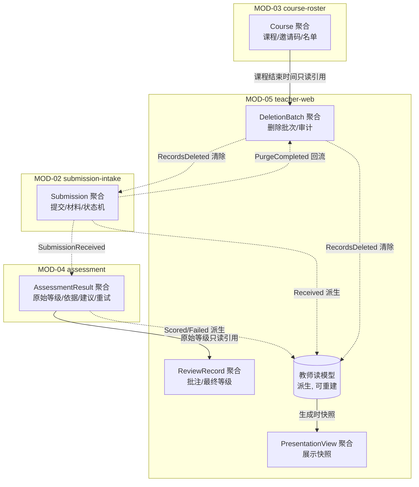

# 03 Data and Consistency — 数据与一致性

## 数据所有权

| Aggregate / 数据 | Owning Module | 数据内容 | 追溯 |
|---|---|---|---|
| Course | MOD-03 course-roster | 课程、邀请码、名单(姓名+小组)、课程结束时间 | aggregates.md Course |
| Submission | MOD-02 submission-intake | 提交记录、状态机、材料清单、材料文件、完整性报告、上传失败原因 | aggregates.md Submission |
| AssessmentResult | MOD-04 assessment | 评分任务、原始等级、五维度依据、教师专用建议、重试记录、失败原因 | aggregates.md AssessmentResult |
| ReviewRecord | MOD-05 teacher-web | 批注、最终等级、调整记录(原始等级引用、操作者、时间) | aggregates.md ReviewRecord |
| PresentationView | MOD-05 teacher-web | 展示视图快照(项目结果引用、过程摘要、评分、批注) | aggregates.md PresentationView |
| DeletionBatch | MOD-05 teacher-web | 删除批次、确认记录、删除审计记录(范围/操作者/时间)、教师排除标记 | aggregates.md DeletionBatch |

## Aggregate 到数据边界映射与本地事务边界

| Aggregate | 本地事务边界(同一事务内保证) | 不变量来源 |
|---|---|---|
| Course | 名单/小组变更与课程一致性 | 邀请码唯一映射课程；姓名+小组命中名单才通过校验 |
| Submission | 状态迁移 + 材料清单 + 完整性报告 | 缺必填信息不创建可评分提交；状态机迁移顺序；缺失显式标记 |
| AssessmentResult | 评估结果 + 重试记录 | 原始等级不可变；最多重试一次；失败记录原因 |
| ReviewRecord | 批注 + 最终等级 + 调整记录 | 原始/最终等级、操作者、时间同时保留 |
| PresentationView | 视图内容快照一次性写入 | 小组无可用提交时阻止生成 |
| DeletionBatch | 确认 + 执行记录 + 审计记录 | 未确认不删除；审计记录不在删除范围内 |

## 跨边界一致性策略

无业务强一致要求，全部跨 Module 一致性采用最终一致，不使用分布式事务：

| 跨边界协作 | 机制 | 一致性 | 追溯 |
|---|---|---|---|
| Submission → AssessmentResult | SubmissionReceived 事件(Outbox) | 最终一致(秒级) | DF-1 步骤 7 |
| AssessmentResult → Submission 状态回写 | SubmissionScored / ScoringFailed 事件 | 最终一致；消费幂等，重复事件不改终态 | DF-1 步骤 10 |
| AssessmentResult / Submission → 教师读模型 | CT-005、CT-006 事件派生 | 最终一致；可事件重放重建 | DF-1 步骤 11 |
| ReviewRecord 引用原始等级 | 只读引用(复制值 + 来源 ID) | 原始等级不可变，无一致性问题 | FR-009 不变量 |
| Course → 保留治理(课程结束时间) | 只读引用 | 课程结束时间变更频率极低，批处理时读取最新值 | DF-3 步骤 1 |
| DeletionBatch → 数据清除 | RecordsDeleted 事件 | 最终一致；审计记录先于清除写入 | DF-3 步骤 4–5 |
| Submission 清除结果 → DeletionBatch 状态 | PurgeCompleted 事件(CT-014) | 最终一致；失败项保留在批次中供重跑 | DF-3 步骤 4–5 |

保留期规则：retention_due_at = 课程结束时间 + 1 年（见 01-system-overview 系统目标），由 MOD-05 保留治理批处理计算；MOD-02 仅按 CT-012 `submission_ids[]` 执行清除并经 CT-014 回传结果，不接收、也不需要 course_end_at / retention_due_at。到期批次与范围经 CT-007（出参 `deletion_batches[]`）对教师可读，教师确认后才进入清除流程（CT-011)。

## 读模型与复制数据说明

- **教师端读模型**(MOD-05)：课程/小组/学生列表、提交详情聚合视图、删除批次状态视图。来源：Submission(CT-006)、AssessmentResult(CT-005)、ReviewRecord(本地)、DeletionBatch(本地，含批次状态、保留到期时间与教师排除标记)。复制延迟接受度：秒级。失效策略：事件重放可全量重建。派生读模型不改变源数据所有权。
- **展示视图**(MOD-05)：生成时快照，不随源数据实时更新；重新生成以获取最新内容(F4-1)。
- 不引入独立缓存或搜索引擎：100 学生/50 小组规模下事件派生读模型已满足查询性能(NFR-001)。

## 存储形态(KD-002)

同组服务共部署：结构化元数据存于单一数据库；材料文件存于服务器本地磁盘（存储加密，KD-003)；异步任务与 Outbox 事件均持久化于数据库。单课程配额 200GB、单次提交上限 500MB(KD-004)。数据库产品选型留待详细设计（defer_to_detail_design)，仅要求支持事务与备份。

## Data Ownership Diagram

图注：实线为只读引用，虚线为事件派生/清除；读模型与展示快照均为派生数据，源数据所有权不变。
