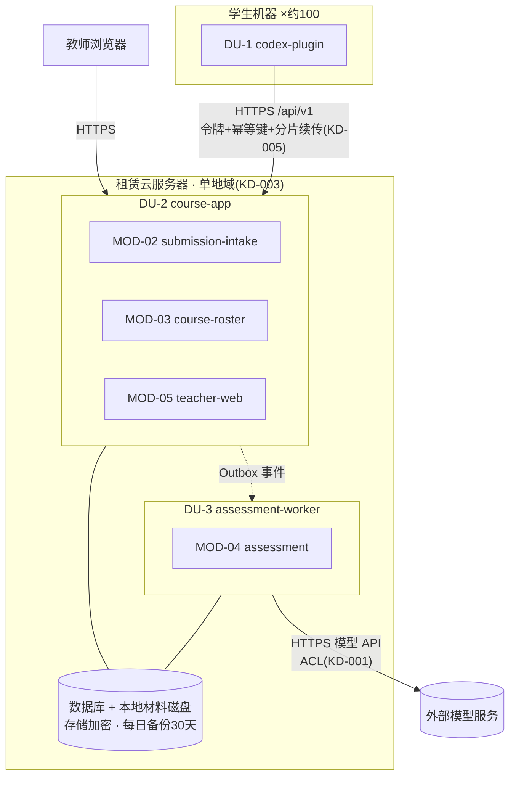

# 06 Deployment — 部署架构

## 部署单元

| Deployment Unit | 包含 Module | 来源理由 |
|---|---|---|
| DU-1 student-plugin | MOD-01 codex-plugin | 运行在学生本机 Codex 环境内（运行时依赖，随学生机器分布） |
| DU-2 course-app | MOD-02 submission-intake、MOD-03 course-roster、MOD-05 teacher-web | 同组服务共部署（KD-002)；三者无独立扩缩/发布需求，共享数据库与本地磁盘 |
| DU-3 assessment-worker | MOD-04 assessment | 评估耗时长（10 分钟目标）、资源特征不同，独立扩缩与故障隔离，避免拖垮上传确认（M6) |
| DU-2 附属：数据库 + 本地材料磁盘 + Outbox 投递器 | （基础设施） | KD-002 同组共部署；投递器可与 DU-2 同进程 |

## Module 到部署单元映射

| module_id | Deployment Unit | 说明 |
|---|---|---|
| MOD-01 | DU-1 | 学生侧分发 |
| MOD-02 | DU-2 | 接收端点需支撑 30 并发上传（NFR-002) |
| MOD-03 | DU-2 | 与 MOD-02 同步低延迟调用 |
| MOD-04 | DU-3 | 独立扩缩：评分高峰期增加 worker 数 |
| MOD-05 | DU-2 | 教师端读多写少，负载低 |

## Deployment Diagram

## 扩缩容策略

- **DU-2**：单实例即可承载 30 并发上传与教师查询（NFR-001/002)；瓶颈优先出现在磁盘与带宽，垂直扩容（磁盘、带宽）为主。接收确认路径短（校验 + 持久化 + 应答）,30 秒目标由同步路径保障。
- **DU-3**：评分旺季（作业截止前后）并发任务上升，按任务积压增加 worker 副本；单任务 ≤10 分钟，30 并发提交场景下 2–3 个 worker 可在时限内消化（每次模型调用 ≤3 分钟 + 一次重试余量）。
- **DU-1**：随学生分发，无服务端扩容问题。

## 故障隔离

- DU-3 故障（模型服务不可用、worker 崩溃）不影响 DU-2 的上传接收与教师查询；评分任务持久化，worker 恢复后继续执行（PRD 明确约束：失败保留可观察状态与重试记录）。
- DU-2 故障影响全链路，由基础级监控告警（KD-003）发现；恢复后 Outbox 继续投递，无事件丢失。
- 学生侧断网：DU-1 本地待上传队列保留，恢复后断点续传（AC-REQ-001-01 exceptions)。

## 发布和运维约束

- 发布：DU-2/DU-3 独立发布；API 以 `/api/v1` 版本兼容，破坏性变更保留旧版本一个过渡期（CT 版本策略）。
- 监控（基础级，KD-003)：进程存活、磁盘水位（200GB/课程配额）、评分任务积压、模型调用失败率、上传成功率；对应成功指标 SM-001~003 的统计报表。
- 备份：每日备份保留 30 天（数据库 + 材料磁盘）;RPO 24h / RTO 48h；恢复演练每学期至少一次（建议，非阻塞）。
- 保留治理：到期标记与删除执行为 DU-2 内定时批处理（DF-3)；审计记录独立保留，不随业务数据删除。

## 合规、安全与团队边界影响

- 材料含个人信息与第三方代码（PRD 风险节）:HTTPS 传输 + 磁盘存储加密（KD-003)；教师查询强制课程范围授权，访问拒绝留痕（AccessDeniedLogged);Agent 评估材料出境由供应商协议与 ACL 最小化控制（KD-001)。
- 数据保存至课程结束后 1 年，教师确认删除并可审计（NFR-004、AC-NFR-004-01)。
- 团队边界：小团队运维，部署单元数量刻意保持最少（2 个服务端单元），符合 M6「部署拆分不超过团队运维能力」规则。
