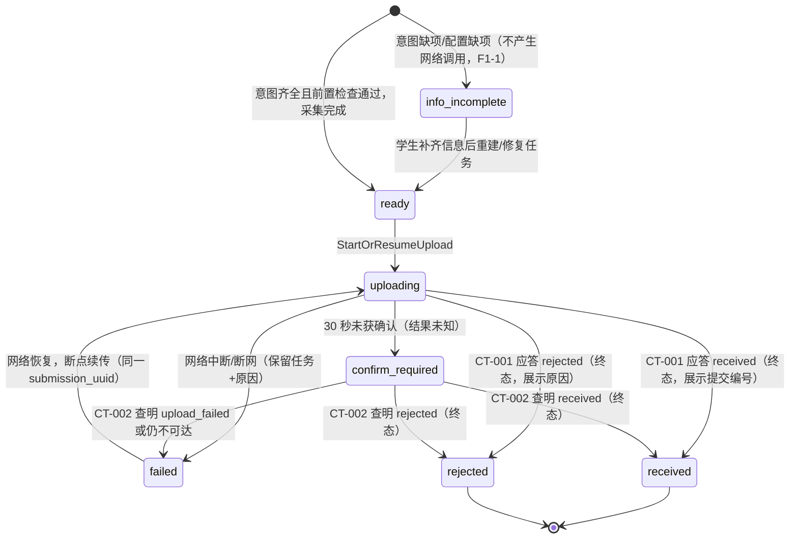
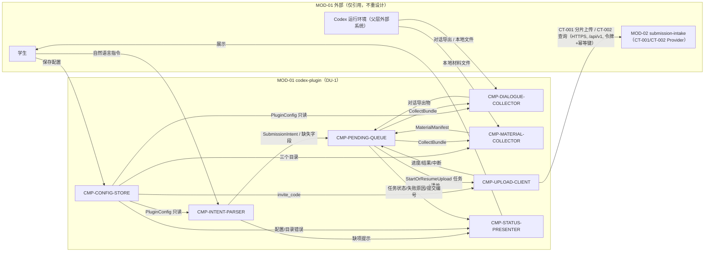

# 02 Architecture Decomposition — MOD-01 codex-plugin 内部结构

> 本文件只在选定父节点 MOD-01 内部细化（C1/C2/C5/C6）；不重跑顶层 DDD，不重划父 BC/模块，不设计兄弟节点内部。

## 1. 局部概念模型

### 1.1 值对象与局部聚合

| 局部概念 | 类型 | 含义 | 关键不变量 |
|---|---|---|---|
| `SubmissionIntent` | 值对象 | 从自然语言指令结构化出的提交意图：`assignment`、`student_name`、`group_name` | 三字段任一缺失即不可用于创建提交（F1-1）；解析结果以**当次指令文本**为准 |
| `PluginConfig` | 局部聚合（单例） | 插件配置：`invite_code`、`student_name`、`group_name`、`code_dir`、`screenshot_dir`、`result_dir`、`completeness`（缺失项清单） | 格式无效的新配置**不得覆盖**上一次有效配置（AC-REQ-002-01 exceptions）；不完整配置显式携带缺失项 |
| `PendingTask` | 局部聚合 | 本地待上传任务：`submission_uuid`（幂等键）、意图快照、材料清单引用、本地状态、失败原因、时间戳 | `submission_uuid` 在任务创建时生成且**全程不变**（KD-005）；缺项任务不产生任何网络调用 |
| `MaterialManifest` | 值对象 | 一次提交的材料清单：四类条目（对话/代码/截图/结果）的路径、类别、大小、采集时间 | 条目类别标注与 CT-001 `material_chunks[]` 类别语义一致；采集锚定任务创建时刻（LCD-002） |
| `UploadCheckpoint` | 值对象 | 分片上传进度：上传会话标识、已确认分片索引、总分片数 | 仅记录服务端已确认的分片；用于断点续传去重 |

### 1.2 命令、内部事件与策略

- **命令**：`ParseSubmitCommand`（解析指令）、`SaveConfig`（保存配置）、`CreatePendingTask`（创建任务）、`CollectBundle`（采集打包）、`StartOrResumeUpload`（启动/恢复上传）、`QueryRemoteStatus`（查询远端状态）、`DismissTask`（终态任务清理确认）。
- **内部事件**（仅 MOD-01 内，不跨模块投递）：`TaskCreated`、`ConfigSaved` / `ConfigRejected`、`BundleCollected`、`UploadConfirmed`（收到 received）、`UploadRejected`（收到 rejected 终态）、`UploadInterrupted`（中断/断网）、`RemoteStatusResolved`（CT-002 查明真实状态）。
- **策略**：上传前置检查（邀请码存在且目录可读，否则阻塞并提示，不发起网络调用）；材料客户端预检（白名单过滤 + 500MB 累计预算告警，LCD-003）；30 秒未确认转 CT-002 查询（父层语义原样实现）；恢复调度（触发时机 defer_to_next_level，LCD-005）。

### 1.3 本地任务生命周期（状态机）



说明：`received`/`rejected`/`upload_failed` 的**权威判定**在 MOD-02 提交状态机；本状态机仅为客户端任务视图，经 CT-001/CT-002 收敛，不复制、不预判服务端状态（03 §5 确认）。

## 2. 子节点清单（按稳定 child_id 排序）

| child_id | 名称 | 职责 | 排除项 | 拥有状态 | 需求/父层追踪 | 依赖 | 存在理由 |
|---|---|---|---|---|---|---|---|
| CMP-CONFIG-STORE | 插件配置存储 | PluginConfig 的持久化、读取、保存校验（格式、目录可读性）、不完整标记；拒绝无效配置并保留上一次有效配置 | 不发起网络调用；不做材料收集；不做归属校验 | ST-01 PluginConfig | REQ-D002；D-AC-REQ-002-01；父 AC-REQ-002-01；组件接口卡 local_inbound | 被 INTENT-PARSER / DIALOGUE-COLLECTOR / MATERIAL-COLLECTOR / UPLOAD-CLIENT 只读引用 | 配置是全部提交链路的前置输入，且「无效不覆盖旧值」是独立不变量，需单一所有权 |
| CMP-DIALOGUE-COLLECTOR | 对话采集器（采集侧 ACL） | 将当前作业项目相关的**完整 Codex 对话**从宿主环境导出为提交材料（对话条目，含类别标注） | 不读代码/截图/结果目录；不决定提交时机；不直接访问网络 | ST-02 对话导出物（随任务） | REQ-D003；AC-REQ-003-01 MOD-01 slice（采集完整对话）；01 §外部系统边界（Codex 运行环境 ACL，C5 委托） | CONFIG-STORE（读取配置上下文）；宿主 Codex 环境（父层外部系统） | 父层把「Codex 运行环境」适配显式委托给 MOD-01 ACL；宿主导出机制是唯一可能随外部系统变化的部分，单独隔离 |
| CMP-INTENT-PARSER | 提交意图解析器 | 解析自然语言提交指令 → `SubmissionIntent`；确定性缺项检测并返回具体缺失字段 | 不持久化任何状态；不创建/上传任务；不读取材料 | 无持久状态（trace 见右） | REQ-D001；F1-1；D-AC-REQ-001-01；FLOW-001 entry_condition（缺项不产生网络调用） | CONFIG-STORE（默认值参考）；向 PENDING-QUEUE 交付解析结果 | F1-1 是提交链路的入口闸门，缺项判定必须确定且可测，与任务编排分离 |
| CMP-MATERIAL-COLLECTOR | 材料收集器 | 按配置目录收集代码/截图/项目结果文件；白名单过滤与 500MB 预算预检（LCD-003）；生成 `MaterialManifest` 并关联作业/姓名/小组 | 不导出对话；不上传；目录为空的材料类别照常留空（缺失标记归服务端 REQ-011/MOD-02） | ST-03 MaterialManifest + 材料暂存引用 | REQ-D004；AC-REQ-003-01 MOD-01 slice；CT-001 `material_chunks[]` 类别标注；KD-004 | CONFIG-STORE（三个目录）；本地文件系统（父层外部系统边界内） | 材料收集的变更原因（目录结构/类型策略）与对话导出不同；清单是上传与关联身份的单一来源 |
| CMP-PENDING-QUEUE | 本地待上传任务队列 | PendingTask 聚合的创建、状态机推进、失败原因记录、恢复调度（worker_job）；上传前置检查；任务终态清理 | 不执行分片上传本身；不解析意图；不修改服务端状态 | ST-04 PendingTask 记录 | REQ-D001（启动提交/断网保留）；AC-REQ-001-01 exceptions；KD-005（本地待上传队列）；A-007（持久化机制 delegated）；implementation_surfaces: worker_job | 消费 INTENT-PARSER 结果；编排 DIALOGUE/MATERIAL-COLLECTOR；驱动 UPLOAD-CLIENT；向 STATUS-PRESENTER 供数 | 「断网保留+恢复续传」是独立生命周期与不变量（uuid 不变），且是 SM-001 contributing 链路的本地承载 |
| CMP-STATUS-PRESENTER | 提交状态展示器 | 向学生展示：缺失字段提示、配置/目录错误、提交编号与接收确认、失败原因、远端状态（rejected/upload_failed） | 不修改任何状态；不触发上传/重试（重试由队列调度） | 无持久状态（派生展示） | REQ-D001（展示提交编号与失败原因）；REQ-D002（目录错误展示）；D-AC-REQ-001-01 observable_oracles；组件接口卡 local_outbound | CONFIG-STORE、PENDING-QUEUE（只读） | 展示是唯一面向学生的 outbound 面，与解析（inbound）和编排（内部）变更原因不同；保证「不伪造结果」统一出口 |
| CMP-UPLOAD-CLIENT | 上传客户端（CT-001/CT-002 consumer） | 换取/持有访问令牌（auth/token 附属端点）；按分片协议上传（创建会话→逐分片→合并）；维护 `UploadCheckpoint`；30 秒超时转 CT-002；断点续传 | 不改变 CT-001/CT-002 任何字段/语义；不决定任务生命周期；不解析意图/配置 | ST-05 UploadCheckpoint | REQ-D001/D003/D004 的上传执行面；CT-001/CT-002（consumer）；KD-003（HTTPS）、KD-005；FLOW-001/002；implementation_surfaces: integration_wiring | CONFIG-STORE（invite_code）；PENDING-QUEUE（任务与材料清单）；MOD-02（父层 Provider，仅引用） | 父契约 consumer 侧实现的唯一汇聚点；分片/幂等/超时查询的失败语义集中在此，便于兼容演进 |

**追踪豁免**：无。全部 7 个子节点均有直接需求或父层追踪，无 `trace_exemption_reason` 缺省。

## 3. 子节点依赖图与外部边界



### 3.1 组件别名与规范化边界

Mermaid 图使用短别名仅为提高可读性；验证、契约绑定和运行流判断必须使用完整的 `CMP-*` 稳定 ID。

```yaml
component_aliases:
  IP: CMP-INTENT-PARSER
  CS: CMP-CONFIG-STORE
  DC: CMP-DIALOGUE-COLLECTOR
  MC: CMP-MATERIAL-COLLECTOR
  PQ: CMP-PENDING-QUEUE
  UC: CMP-UPLOAD-CLIENT
  SP: CMP-STATUS-PRESENTER

canonical_component_ids:
  - CMP-CONFIG-STORE
  - CMP-DIALOGUE-COLLECTOR
  - CMP-INTENT-PARSER
  - CMP-MATERIAL-COLLECTOR
  - CMP-PENDING-QUEUE
  - CMP-STATUS-PRESENTER
  - CMP-UPLOAD-CLIENT
```

所有跨组件边界必须同时满足：存在内部契约 ID、使用规范化组件 ID、声明 `next_hop` 和返回事件；Mermaid 图只作为可视化投影，不作为唯一机器可读来源。

## 4. 兄弟节点引用确认

- MOD-02 submission-intake：仅作为 CT-001/CT-002 的 Provider 引用（字段、错误码、失败语义以父包 04 为准）；**未读取、未重设计其内部**。
- MOD-03 / MOD-04 / MOD-05：与本节点无直接网络流（02 §合法数据流 FLOW-001/002 为唯一出入口）；归属校验、评分、教师展示均不在本层设计范围，**未重设计其内部**。
- 本层未创建任何服务、容器、部署单元或公共运行时边界（MOD-01 保持 DU-1 内进程内组件）。

## 5. 分解理由（按职责/状态/不变量/生命周期/变化原因/交互）

1. **INTENT-PARSER 独立**：入口闸门的缺项判定（F1-1）要求确定性与可测性；它是无状态的纯解析，生命周期与任务编排不同。
2. **CONFIG-STORE 独立**：「格式无效不覆盖上一次有效配置」是需要单一写方保障的聚合不变量；配置被 4 个子节点只读引用，所有权必须唯一。
3. **DIALOGUE-COLLECTOR 与 MATERIAL-COLLECTOR 分离**：两者虽同属采集侧 ACL，但变化原因不同——前者随宿主 Codex 环境导出机制变化（父层外部系统适配），后者随目录结构/类型策略/大小预算变化；产物亦分别归属 ST-02/ST-03。
4. **PENDING-QUEUE 独立**：断网保留与恢复续传构成独立生命周期（本地状态机），且「submission_uuid 全程不变」的不变量由它守护；worker_job 实现面天然落在这里。
5. **UPLOAD-CLIENT 独立**：父契约（CT-001/CT-002 + auth/token 附属）consumer 侧实现的唯一汇聚点；契约兼容演进（分片协议字段向后兼容追加）只影响这一个子节点。
6. **STATUS-PRESENTER 独立**：唯一的 outbound 展示面，统一「不伪造结果」的出口（超时未确认时展示「查询中/未知」而非假成功）；与解析（inbound）和编排（内部）变化原因不同。

## 6. C1 / C2 / C5 / C6 检查记录

| 映射 | 结果 | 结论 |
|---|---|---|
| C1 | MOD-01 → 7 个子节点，全部带稳定 child_id，全部在 MOD-01 内部 | 通过 |
| C2 | ST-01~ST-05 均为本节点新增的本地状态，各有唯一 owner；父/兄弟状态（Submission、Course 等）未触碰 | 通过（详见 03） |
| C5 | 父外部依赖「Codex 运行环境」仅由 CMP-DIALOGUE-COLLECTOR（对话导出）与 CMP-MATERIAL-COLLECTOR（本地文件读取）以 ACL/Adapter 方式承接；未重设计外部系统本身 | 通过 |
| C6 | 局部驱动（缺项确定性、断网韧性、采集完整性、30 秒未知处理、预检）全部转化为内部策略；未引入父层平台/存储/消息总线/部署单元/公共边界 | 通过 |

（C3 父流程→内部协作、C4 父契约→内部实现映射见 `04-contracts-and-runtime.md`。）
