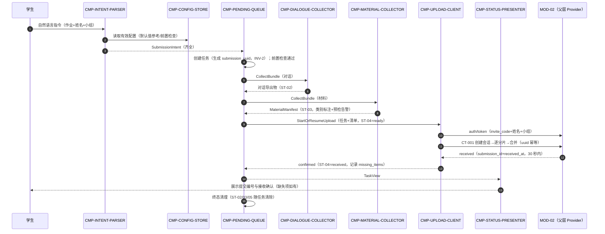
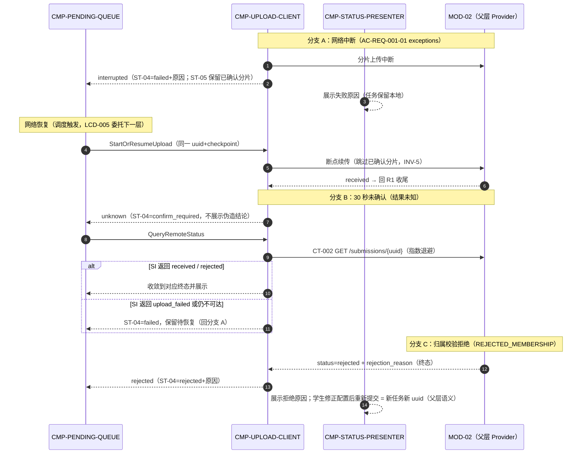
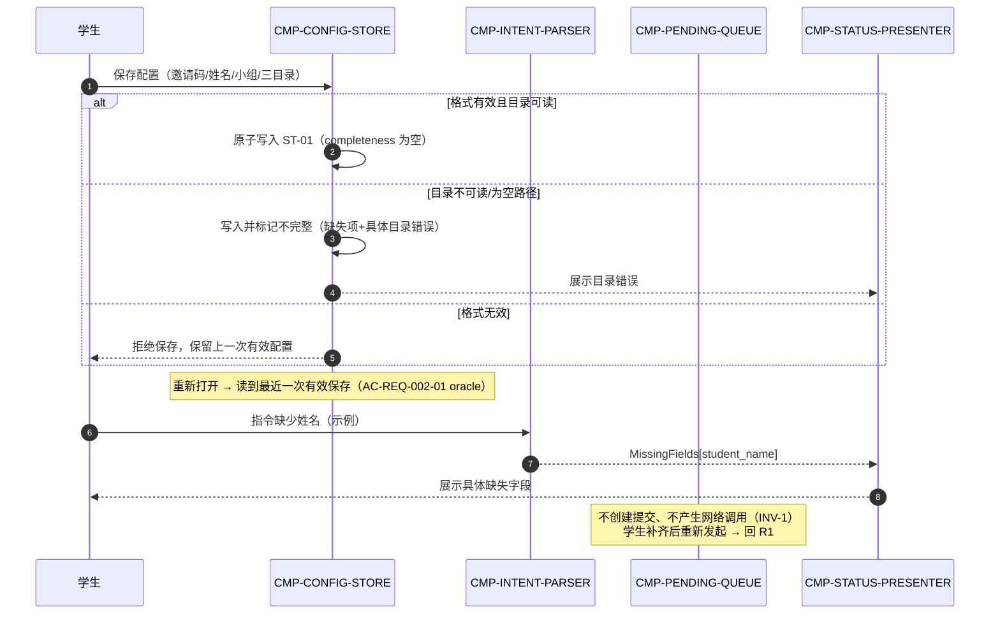

# 04 Contracts and Runtime — MOD-01 codex-plugin 契约与运行时

> C3（父流程→内部协作）与 C4（父契约→内部实现映射）。父契约的标识、所有者、路径、字段、副作用、依赖、失败语义与版本**逐字保持不变**；本文件只做 consumer 侧实现映射与节点内部契约定义。

## 1. 父契约清单（MOD-01 视角，原样引用）

| 父契约 | Provider | MOD-01 角色 | 路径/协议 | MOD-01 产出字段 | MOD-01 接收字段 | 失败/超时/幂等（父层语义，不变） |
|---|---|---|---|---|---|---|
| CT-001 提交材料包上传 | MOD-02 | Consumer | HTTPS `POST /api/v1/submissions`（multipart 分片：创建上传会话→逐分片→提交合并） | `submission_uuid`、`invite_code`、`student_name`、`group_name`、`assignment`、`material_chunks[]`（类别标注） | `submission_id`、`received_at`、`status`、`missing_items[]`；拒绝时 `status=rejected`+`rejection_reason` | 中断→服务端 upload_failed；客户端断点续传；30 秒未确认→CT-002 查询；幂等键 `submission_uuid`；`/api/v1` |
| CT-002 提交状态查询 | MOD-02 | Consumer | HTTPS `GET /api/v1/submissions/{submission_uuid}` | `submission_uuid`（路径参数） | `submission_id`、`status`、`failure_reason?`、`missing_items[]` | 未知 UUID→404；指数退避重试；只读天然幂等 |
| （附属）认证端点 | MOD-02 | Consumer | HTTPS `POST /api/v1/auth/token`（邀请码+姓名+小组换 Bearer 令牌） | `invite_code`、`student_name`、`group_name` | 访问令牌 | 名单核对语义同 CT-003；AUTH_INVALID；属 CT-001 契约族附属交互，不单独编号 |
| 错误码（适用面） | — | — | — | — | AUTH_INVALID、VALIDATION_FAILED、PAYLOAD_TOO_LARGE、UNSUPPORTED_MEDIA_TYPE、REJECTED_MEMBERSHIP（CT-001）；AUTH_INVALID、NOT_FOUND（CT-002） | 语义以父包 04 §错误码汇总为准 |

MOD-01 不提供任何契约（`provides_contracts: []`），不消费任何事件契约。

## 2. 父契约 → 子节点实现映射（C4）

| 父契约 | 实现子节点 | 分工 | 语义保持确认 |
|---|---|---|---|
| CT-001 | CMP-UPLOAD-CLIENT（主）；CMP-PENDING-QUEUE（幂等键生成与任务编排）；CMP-DIALOGUE-COLLECTOR / CMP-MATERIAL-COLLECTOR（material_chunks 内容来源）；CMP-CONFIG-STORE（invite_code 来源） | UPLOAD-CLIENT 执行分片协议与断点续传；uuid 由 PENDING-QUEUE 在任务创建时生成并冻结（INV-2）；采集两节点按类别标注产出条目 | 字段/顺序/幂等/失败语义未改；多子节点协同实现一个父契约，未削弱其外部语义 |
| CT-002 | CMP-UPLOAD-CLIENT | confirm_required 状态下发起查询；指数退避 | 只读、404 语义、幂等未改 |
| auth/token 附属 | CMP-UPLOAD-CLIENT | 以上传前置身份（invite_code+姓名+小组）换取并缓存令牌；401 后重新换取 | 端点归属与核对语义未改 |
| 30 秒超时→CT-002 | CMP-UPLOAD-CLIENT → CMP-PENDING-QUEUE → CMP-STATUS-PRESENTER | 超时仅转 confirm_required；查明前展示「结果未知」，不伪造结论 | AC-REQ-001-01 exceptions 语义原样实现 |

## 3. 节点内部契约（按稳定契约 ID 排序；标识均限定在 MOD-01 内）

### IC-M01-01 意图解析端口

- 类型：内部命令（同步，进程内）
- Owner：CMP-INTENT-PARSER；Consumer：CMP-PENDING-QUEUE（经入口编排）
- 触发：学生发送自然语言提交指令
- Schema：入参 `command_text`；出参 二选一 —— `SubmissionIntent{assignment, student_name, group_name}` 或 `MissingFields{fields[]}`（具体缺失字段）
- 副作用：无（无状态解析）
- 错误/超时：解析不阻塞网络；无法确定字段时返回 MissingFields，**绝不**猜测填充
- 幂等：纯函数，同文本同结果
- 兼容：指令语法演进只影响本子节点内部（LCD-001）
- 追踪：REQ-D001；F1-1；D-AC-REQ-001-01 boundaries

### IC-M01-02 配置端口

- 类型：内部命令 + 查询（同步，进程内）
- Owner：CMP-CONFIG-STORE；Consumer：学生设置页（保存）；INTENT-PARSER / DIALOGUE-COLLECTOR / MATERIAL-COLLECTOR / UPLOAD-CLIENT / STATUS-PRESENTER（只读）
- 触发：学生保存配置；各节点提交前置读取
- Schema：写 `PluginConfig` 全量；读 出参 `EffectiveConfig{fields..., completeness[]}`（含缺失项与目录可读性结论）
- 副作用：有效保存原子替换 ST-01；产生内部事件 `ConfigSaved` / `ConfigRejected`
- 错误：格式无效→拒绝并保留上一次有效配置；目录不可读→保存但标记不完整（缺失项含具体目录错误）
- 幂等：重复保存同值配置为空操作
- 兼容：配置项演进仅追加可选字段，不破坏读者
- 追踪：REQ-D002；D-AC-REQ-002-01

### IC-M01-03 采集编排端口

- 类型：内部命令（同步触发，产物落本地）
- Owner：CMP-PENDING-QUEUE（编排）；执行方：CMP-DIALOGUE-COLLECTOR（对话）、CMP-MATERIAL-COLLECTOR（材料）
- 触发：任务创建（意图齐全且配置前置检查通过）
- Schema：入参 `task_ref{submission_uuid, intent, config_ref}`；出参 `BundleRef{dialogue_artifact, material_manifest, warnings[]}`（warnings 含预检告警：白名单剔除项、累计大小、目录为空类别）
- 副作用：写 ST-02 / ST-03；一次性快照（INV-4），重传不重采
- 错误：目录不可读→任务阻塞并展示具体目录错误（不发起上传）；对话导出失败→任务 failed 并记录原因（保留待恢复）
- 幂等：同一 `submission_uuid` 重复触发返回已有 BundleRef，不重复采集
- 兼容：材料类别集合与 CT-001 类别语义对齐，新增类别需先确认父契约兼容（否则 return_to_parent）
- 追踪：REQ-D003、REQ-D004；AC-REQ-003-01 MOD-01 slice

### IC-M01-04 上传执行端口

- 类型：内部命令 + 回调（异步执行）
- Owner：CMP-UPLOAD-CLIENT；Consumer：CMP-PENDING-QUEUE
- 触发：任务 ready / failed 恢复（StartOrResumeUpload）
- Schema：入参 `UploadJob{submission_uuid, bundle_ref, identity{invite_code, student_name, group_name, assignment}, checkpoint?}`；回调 `UploadOutcome{confirmed{submission_id, received_at, missing_items[]} | rejected{reason} | interrupted{cause} | unknown}`
- 副作用：写 ST-05；对外发起 CT-001/CT-002/auth-token 网络调用（本节点唯一网络出口）
- 错误/超时/重试：30 秒未确认→回调 unknown（由队列转 confirm_required 并触发 CT-002 查询）；网络中断→interrupted（任务转 failed 保留）；断点续传按 checkpoint 跳过已确认分片
- 幂等：同一任务重复 Start 归并到既有上传会话；uuid 不变（INV-2）
- 兼容：分片协议字段仅向后兼容追加（父契约版本策略）
- 追踪：CT-001/CT-002 consumer 实现；KD-003/KD-005；FLOW-001/002

### IC-M01-05 状态展示端口

- 类型：内部查询（只读）
- Owner：CMP-PENDING-QUEUE（任务视图）、CMP-CONFIG-STORE（配置视图）；Consumer：CMP-STATUS-PRESENTER
- 触发：学生查看；任务状态变化（内部事件驱动刷新）
- Schema：出参 `TaskView{status, submission_id?, missing_items[], failure_reason?, progress?}` / `ConfigView{values, completeness[], dir_errors[]}`
- 副作用：无（read-only）
- 幂等：天然幂等
- 兼容：展示字段仅追加
- 追踪：REQ-D001/D002 展示面；D-AC-REQ-001-01 observable_oracles；组件接口卡 local_outbound

### 3.1 机器可读契约绑定（唯一校验来源）

以下字段块是 MOD-01 内部契约的机器可读来源；上方自然语言说明、时序图和 `02-architecture-decomposition.md` 中的依赖图均为同一语义的可读投影。字段使用点路径表示嵌套对象，组件使用完整稳定 ID。

```yaml
contract_fields:
  - contract_id: IC-M01-01
    contract_type: internal_port
    provider: CMP-INTENT-PARSER
    consumer: CMP-PENDING-QUEUE
    inbound_required_fields: [command_text]
    inbound_optional_fields: []
    outbound_produced_fields: [assignment, student_name, group_name]
    outbound_conditional_fields:
      missing: ["missing_fields[]"]
    event_required_fields: [result_type]
    error_codes: [MISSING_REQUIRED_FIELD, PARSE_UNCERTAIN]
    side_effects: None; read-only
    dependencies: []
    next_hop: CMP-PENDING-QUEUE
    return_event: [IntentParsed, MissingFieldsDetected]

  - contract_id: IC-M01-02
    contract_type: internal_port
    provider: CMP-CONFIG-STORE
    consumer:
      - CMP-INTENT-PARSER
      - CMP-DIALOGUE-COLLECTOR
      - CMP-MATERIAL-COLLECTOR
      - CMP-UPLOAD-CLIENT
      - CMP-STATUS-PRESENTER
    inbound_required_fields: [plugin_config]
    inbound_optional_fields: [config_version]
    outbound_produced_fields:
      - invite_code
      - student_name
      - group_name
      - code_dir
      - screenshot_dir
      - result_dir
      - "completeness[]"
      - "dir_errors[]"
    outbound_conditional_fields: {}
    event_required_fields: [config_version, "completeness[]"]
    error_codes: [INVALID_CONFIG, DIRECTORY_UNREADABLE]
    side_effects: atomic write of ST-01 on valid save
    dependencies: [ST-01]
    next_hop: [CMP-INTENT-PARSER, CMP-DIALOGUE-COLLECTOR, CMP-MATERIAL-COLLECTOR, CMP-UPLOAD-CLIENT, CMP-STATUS-PRESENTER]
    return_event: [ConfigSaved, ConfigRejected]

  - contract_id: IC-M01-03
    contract_type: internal_port
    provider: CMP-PENDING-QUEUE
    consumer: [CMP-DIALOGUE-COLLECTOR, CMP-MATERIAL-COLLECTOR]
    inbound_required_fields:
      - task_ref.submission_uuid
      - task_ref.intent
      - task_ref.config_ref
    inbound_optional_fields: []
    outbound_produced_fields:
      - dialogue_artifact
      - material_manifest
      - "warnings[]"
    outbound_conditional_fields: {}
    event_required_fields: [submission_uuid, dialogue_artifact, material_manifest]
    error_codes: [DIRECTORY_UNREADABLE, DIALOGUE_EXPORT_FAILED, MATERIAL_COLLECTION_FAILED]
    side_effects: write ST-02 and ST-03; one-time snapshot
    dependencies: [ST-01, ST-02, ST-03]
    next_hop: [CMP-DIALOGUE-COLLECTOR, CMP-MATERIAL-COLLECTOR]
    return_event: [BundleCollected, CollectionFailed]

  - contract_id: IC-M01-04
    contract_type: internal_port
    provider: CMP-UPLOAD-CLIENT
    consumer: CMP-PENDING-QUEUE
    inbound_required_fields:
      - submission_uuid
      - bundle_ref
      - identity.invite_code
      - identity.student_name
      - identity.group_name
      - identity.assignment
    inbound_optional_fields: [checkpoint]
    outbound_produced_fields:
      - upload_outcome.status
      - upload_outcome.submission_id
      - upload_outcome.received_at
      - "upload_outcome.missing_items[]"
      - upload_outcome.rejection_reason
      - upload_outcome.cause
    outbound_conditional_fields:
      confirmed: [upload_outcome.submission_id, upload_outcome.received_at, "upload_outcome.missing_items[]"]
      rejected: [upload_outcome.rejection_reason]
      interrupted: [upload_outcome.cause]
    event_required_fields: [submission_uuid, upload_outcome.status]
    error_codes: [AUTH_INVALID, VALIDATION_FAILED, PAYLOAD_TOO_LARGE, UNSUPPORTED_MEDIA_TYPE, REJECTED_MEMBERSHIP, NETWORK_INTERRUPTED, REMOTE_STATUS_UNKNOWN]
    side_effects: write ST-05; consume CT-001/CT-002/auth-token
    dependencies: [ST-04, ST-05, CT-001, CT-002]
    next_hop: CMP-PENDING-QUEUE
    return_event: [UploadConfirmed, UploadRejected, UploadInterrupted, RemoteStatusResolved]

  - contract_id: IC-M01-05
    contract_type: internal_port
    provider: [CMP-PENDING-QUEUE, CMP-CONFIG-STORE]
    consumer: CMP-STATUS-PRESENTER
    inbound_required_fields: [status, submission_id, "missing_items[]", failure_reason, progress, "completeness[]", "dir_errors[]"]
    inbound_optional_fields: []
    outbound_produced_fields: [task_view, config_view]
    outbound_conditional_fields: {}
    event_required_fields: [view_type]
    error_codes: [VIEW_NOT_AVAILABLE]
    side_effects: None; read-only
    dependencies: [ST-01, ST-04]
    next_hop: CMP-STATUS-PRESENTER
    return_event: [TaskViewUpdated, ConfigViewUpdated]
```

`IC-M01-03` 的 `task_ref` 字段必须按点路径消费，不再使用无法稳定解析的 `task_ref{...}` 复合文本；`IC-M01-05` 只读契约显式标记 `None; read-only`。

## 4. 运行流（C3：父流程 → 内部协作）

### 4.0 合法数据流声明（机器可读）

```yaml
legal_data_flows:
  - flow_id: FLOW-M01-001
    entry_component: CMP-INTENT-PARSER
    entry_condition: command_text_received
    steps:
      - from: CMP-INTENT-PARSER
        contract_id: IC-M01-01
        when: required_fields_complete
        next_hop: CMP-PENDING-QUEUE
        return_to_caller: IntentParsed
      - from: CMP-PENDING-QUEUE
        contract_id: IC-M01-03
        when: task_created_and_precheck_passed
        next_hop: CMP-DIALOGUE-COLLECTOR
        return_to_caller: DialogueCollected
      - from: CMP-PENDING-QUEUE
        contract_id: IC-M01-03
        when: task_created_and_precheck_passed
        next_hop: CMP-MATERIAL-COLLECTOR
        return_to_caller: MaterialCollected
      - from: CMP-PENDING-QUEUE
        contract_id: IC-M01-04
        when: bundle_collected
        next_hop: CMP-UPLOAD-CLIENT
        return_to_caller: UploadOutcome
      - from: CMP-PENDING-QUEUE
        contract_id: IC-M01-05
        when: task_view_requested_or_changed
        next_hop: CMP-STATUS-PRESENTER
        return_to_caller: TaskViewUpdated
    branches:
      - when: required_field_missing
        from: CMP-INTENT-PARSER
        next_hop: CMP-STATUS-PRESENTER
        return_to_caller: MissingFieldsDetected
        terminal_state: info_incomplete
      - when: upload_interrupted_or_failed
        from: CMP-UPLOAD-CLIENT
        next_hop: CMP-PENDING-QUEUE
        return_to_caller: UploadInterrupted
        terminal_state: failed
    terminal_states: [received, rejected, failed, confirm_required, info_incomplete]

  - flow_id: FLOW-M01-002
    entry_component: CMP-CONFIG-STORE
    entry_condition: config_save_requested
    steps:
      - from: CMP-CONFIG-STORE
        contract_id: IC-M01-02
        when: valid_config
        next_hop: CMP-STATUS-PRESENTER
        return_to_caller: ConfigSaved
      - from: CMP-CONFIG-STORE
        contract_id: IC-M01-02
        when: invalid_format_or_directory_error
        next_hop: CMP-STATUS-PRESENTER
        return_to_caller: ConfigRejected
    terminal_states: [config_saved, config_incomplete, config_rejected]

  - flow_id: FLOW-M01-003
    entry_component: CMP-UPLOAD-CLIENT
    entry_condition: confirm_required_or_network_recovered
    steps:
      - from: CMP-UPLOAD-CLIENT
        contract_id: IC-M01-04
        when: confirm_required
        next_hop: CMP-UPLOAD-CLIENT
        return_to_caller: RemoteStatusResolved
      - from: CMP-UPLOAD-CLIENT
        contract_id: IC-M01-04
        when: network_recovered
        next_hop: CMP-PENDING-QUEUE
        return_to_caller: UploadConfirmed
    terminal_states: [received, rejected, failed]
```

以上声明是 `R1/R2/R3` Mermaid 时序图的规范化来源；所有 `next_hop` 均使用完整 `CMP-*` ID，不能将 `IP/PQ/SP` 等 Mermaid 别名作为契约绑定目标。

### R1 成功提交主链路（对应 DF-1 步骤 1–3、SCENARIO-001 seq 1 的 MOD-01 段）



### R2 失败与恢复链路（上传中断 + 30 秒未知 + rejected）



### R3 配置与缺项生命周期（REQ-D002 + F1-1）



## 5. 错误、超时、重试、幂等、可观测与兼容说明（架构相关）

| 主题 | 本层规则 | 父层依据 |
|---|---|---|
| 超时 | CT-001 等待接收确认 30 秒；超时仅转 confirm_required 并 CT-002 查询，不重发整包 | NFR-003；CT-001 Error/Timeout |
| 重试 | 上传网络失败：断点续传（无限次调度触发，但每次执行遵循分片协议）；CT-002 指数退避；意图/配置类失败不重试（等学生修正） | CT-001/CT-002 Retry 语义 |
| 幂等 | uuid 全程不变；重复上传返回同一 submission_id；内部端口幂等规则见 §3 | KD-005；CT-001 Idempotency |
| 错误呈现 | 服务端错误码原样映射展示（AUTH_INVALID→提示核对邀请码/姓名/小组；PAYLOAD_TOO_LARGE→提示精简材料；UNSUPPORTED_MEDIA_TYPE→提示白名单；REJECTED_MEMBERSHIP→展示 rejection_reason）；不向学生暴露堆栈/内部细节 | 04 §错误码汇总 |
| 可观测 | 本地记录任务状态迁移与失败原因（ST-04），供学生查看与恢复诊断；SM-001 统计口径所需行为（成功确认/断点续传）由 CT-001 交互自然承载，本层无额外上报义务 | 01 §SM-001 contributing |
| 兼容 | 内部契约字段仅追加；材料类别集合变更须先核对 CT-001 类别语义（不兼容即 return_to_parent）；分片协议仅向后兼容追加 | CT-001 Versioning |

## 6. 父外部契约语义不变确认

本层未对 CT-001、CT-002、auth/token 附属端点的标识符、所有者、路径、必需/产出字段、副作用、依赖、失败/重试语义、幂等键与版本策略做任何修改、弱化、移动或升级；未新增任何跨模块契约；未改变 FLOW-001/FLOW-002 的入口条件与终止状态。
