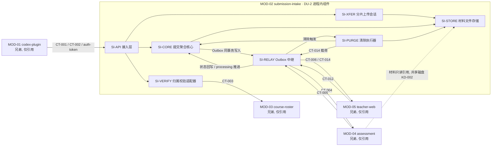

# 02 Architecture Decomposition — MOD-02 submission-intake 架构分解

> 本文件是 C1（父节点→直接子节点）与局部领域细化的产物。仅在 MOD-02 边界内细化，不重划父层模块、不设计兄弟模块内部。直接子节点按稳定 `child_id` 排序；内部支撑组件不作为 L2 target。

## 局部领域细化（Submission 聚合内部）

仅在父包 `aggregates.md` 的 Submission 聚合内部细化，不重新定义顶层业务模型。

### 聚合与构成

**Submission（聚合根，owner：SI-CORE）**

| 构成 | 类型 | 字段要点 |
|---|---|---|
| Submission | 聚合根 | `submission_id`（服务端唯一编号）、`submission_uuid`（客户端幂等键，唯一约束）、`invite_code`、`course_id`、`student_name`、`group_name`、`assignment`、`status`（状态机）、`failure_reason?`、`received_at?`、`created_at`、`updated_at` |
| MaterialEntry | 实体（聚合内） | `material_ref`（引用 SI-STORE）、`category`（对话/代码/截图/结果）、`size_bytes`、`declared`（是否插件配置声明的目录类别） |
| IntegrityReport | 值对象 | `expected_categories[]`（按插件配置声明）、`received_categories[]`、`missing_items[]`、`generated_at` |

**UploadSession（独立小聚合，owner：SI-XFER，提交成立前的暂存载体）**

| 构成 | 字段要点 |
|---|---|
| UploadSession | `session_id`、`submission_uuid`（关联幂等键）、`chunk_manifest[]`（分片序号、大小、校验和）、`received_bytes`、`state`（receiving / interrupted_retryable / merged / pending_verification / completed / failed_terminal）、`failure_reason?`、`retry_deadline?` |

### 局部不变量

| 不变量 | 内容 | 来源 |
|---|---|---|
| INV-1 | 缺必填信息（作业/姓名/小组/邀请码）不创建可评分提交；`submission_uuid` 唯一（重复请求返回首次结果） | 父聚合不变量 + KD-005 |
| INV-2 | Submission 仅允许以下迁移：∅→upload_failed、∅→rejected、∅→received、received→processing、processing→scored、processing→scoring_failed、任一存续状态→deleted（清除执行）；scored/scoring_failed/rejected/upload_failed 为终态，重复事件不改变终态。可恢复上传中断只改变 UploadSession，不创建 Submission.upload_failed | 父状态机 + FLOW-001/006/010 终态声明 |
| INV-3 | 缺失项显式标记且**不阻塞** received 与评分（空目录类别进入 `missing_items[]`，提交照常进入 processing） | REQ-D004 / REQ-011 |
| INV-4 | 材料清单中的每个 `material_ref` 必须能在 SI-STORE 定位；清除执行后引用与文件同事务移除 | 父聚合「材料清单」一致性 |
| INV-5 | 完整性报告与提交在同一本地事务生成；报告只依据清单级信息（类别、存在性、大小），不依赖材料内容解析 | 父本地事务边界；30 秒驱动 |

### 局部命令（经内部端口 IC-SI-04 暴露）

`CreateSubmission`（幂等键唯一）/ `MarkUploadFailed` / `MarkRejected` / `ConfirmReceived`（同事务写入材料清单 + 完整性报告 + Outbox）/ `AdvanceToProcessing` / `ApplyScoringOutcome`（scored|scoring_failed，幂等）/ `PurgeSubmission`（清除执行）。

### 内部事件（仅模块内，不跨模块投递）

`UploadFailedMarked`、`SubmissionPersisted`（received/rejected）、`ProcessingAdvanced`、`ScoringOutcomeApplied`、`SubmissionPurged`。跨模块语义一律由父事件契约（CT-004/CT-005/CT-006/CT-012/CT-014）承载，本层不新增跨模块事件。

### 生命周期摘要

- **UploadSession**：receiving（分片接收，可断点续传）→ interrupted_retryable（网络中断，保留会话并允许恢复）→ receiving → merged（合并完成，材料转正式区）→ pending_verification（归属校验暂不可用，LCD-001）→ completed（提交成立后会话关闭）/ failed_terminal（重试窗口耗尽或不可恢复错误，触发 `MarkUploadFailed`/材料清理）。
- **Submission**：见 INV-2 状态机；`deleted` 由清除执行到达（FLOW-010 终态），记录本体移除，行为留痕于 ST-07 与 MOD-05 审计（审计不在本模块）。

### 状态机边界规则

| 状态实体 | 当前状态 | 触发 | 下一状态 | owner | 成功副作用 | 失败/重试规则 |
|---|---|---|---|---|---|---|
| UploadSession | receiving | 网络中断且可恢复 | interrupted_retryable | SI-XFER | 保存已接收分片与 `retry_deadline` | 同一 `submission_uuid` 断点续传回 receiving；超过 deadline 转 failed_terminal |
| UploadSession | interrupted_retryable | 重传成功 | receiving | SI-XFER | 更新分片清单与进度 | 重复分片幂等；不可恢复错误转 failed_terminal |
| UploadSession | merged | CT-003=ROSTER_UNAVAILABLE | pending_verification | SI-XFER/SI-VERIFY | 材料保留，后台重试 | 重试成功继续 ConfirmReceived；耗尽转 failed_terminal |
| UploadSession | failed_terminal | 终态失败确认 | completed（仅清理完成时） | SI-XFER | 调用 SI-CORE.MarkUploadFailed，发布 CT-006 失败可见性事件 | 不允许恢复为 receiving |
| Submission | received | CT-004 消费确认且评分任务已持久化 | processing | SI-CORE（由 SI-RELAY 触发） | 记录 ack，状态查询可见 processing | CORE 更新失败时按幂等命令重试，不重复创建评分任务 |
| Submission | processing | CT-005 outcome=scored | scored | SI-CORE | 写入终态 | 重复终态事件为空操作 |
| Submission | processing | CT-005 outcome=scoring_failed | scoring_failed | SI-CORE | 写入失败原因与终态 | 重复终态事件为空操作 |

## 直接子节点清单（C1；按 child_id 排序）

| child_id | 责任 | 分配需求 | 直接验收追踪 | 拥有状态 | 依赖 | 存在理由 |
|---|---|---|---|---|---|---|
| SI-API | 接收确认、认证/幂等接入与 30 秒同步接收编排 | REQ-D003 | D-AC-REQ-007-01；CT-001/CT-002 | ST-06 AuthTokenGrant | SI-XFER、SI-CORE、SI-VERIFY | 直接承接“返回接收确认并启动异步评分”的外部产品行为 |
| SI-CORE | Submission 聚合、状态机、材料清单、完整性报告与单事务写入 | REQ-D001、REQ-D002、REQ-D004 | D-AC-REQ-003-01；D-AC-REQ-007-01 | ST-01 Submission | SI-STORE、SI-RELAY | 直接拥有提交数据与缺失标记等 L1 产品义务 |
| SI-XFER | 对话/代码/截图/结果文件的分片接收、合并与可恢复上传 | REQ-D001、REQ-D002 | D-AC-REQ-003-01；CT-001 | ST-02 UploadSession | SI-STORE、SI-VERIFY | 直接承接材料采集的用户可观察上传行为 |

> 直接清单约束：每行至少拥有一条当前 L1 PRD 的 `REQ-Dxxx`/`NFR-Dxxx`。CT/FLOW/状态/SM/FR/父层 REQ 仅作为补充追踪。

## 内部实现组件登记（非直接 child_id；不可作为 `[NEXT ...]` target）

以下台账保留实现职责、状态和契约映射，但不构成 C1 直接子节点；其实现由直接子节点组合调用或承接。

| component_id | 名称 | 职责 | 排除项 | 拥有状态 | 需求/父层追踪 | 依赖 | 实现面 |
|---|---|---|---|---|---|---|---|
| **SI-API** | intake-api 接入层 | 实现 CT-001、CT-002、`POST /api/v1/auth/token` 端点；令牌认证与签发审计；幂等键接入（重复请求返回首次结果）；同步接收编排（30 秒路径：认证→幂等→分片→合并→校验→持久化→应答）；父错误码映射（AUTH_INVALID/VALIDATION_FAILED/PAYLOAD_TOO_LARGE/UNSUPPORTED_MEDIA_TYPE/REJECTED_MEMBERSHIP）；SM-001 埋点（接收成功率） | 不持有提交领域状态；不直接操作材料文件；不自行执行归属校验逻辑（委托 SI-VERIFY）；不发布事件 | ST-06 AuthTokenGrant（令牌签发审计记录） | REQ-D003；CT-001/CT-002/auth-token；KD-005；NFR-002、NFR-003；SM-001 | SI-XFER、SI-VERIFY、SI-CORE | integration_wiring、observability |
| **SI-CORE** | submission-core 提交聚合核心 | Submission 聚合唯一写入口：提交记录、状态机迁移（INV-2 守卫）、材料清单、完整性报告与缺失项标记（INV-3/INV-5）、失败原因；单本地事务写入（状态 + 清单 + 报告 + Outbox 记录）；CT-002 查询支撑 | 不处理 HTTP；不操作文件系统（经 SI-STORE）；不直接向兄弟模块投递事件（经 SI-RELAY） | ST-01 Submission | REQ-D001、REQ-D002、REQ-D004；REQ-003/004/007/011；AC-REQ-003-01、AC-REQ-007-01 状态序列判据；父包 03 Submission 所有权行 | SI-STORE（材料元数据/配额）、SI-RELAY（Outbox 事务写入） | domain_logic |
| **SI-PURGE** | purge-executor 保留清除执行器 | 按 CT-012 `submission_ids[]` 逐项执行清除：删除材料文件（经 SI-STORE）与提交记录（→deleted）；逐项记录结果；部分失败项保留供重跑；组装 CT-014 载荷并交 SI-RELAY 发布；重跑时对已删记录空操作（幂等） | 不计算保留到期（MOD-05）；不持有删除批次、确认与审计记录（MOD-05）；不对清除范围做业务判断（按批次指令执行） | ST-07 PurgeExecution | AC-NFR-004-01（execution_dependency）；CT-012/CT-014；DF-3 步骤 4–5；FLOW-010/012 | SI-RELAY、SI-CORE、SI-STORE | worker_job |
| **SI-RELAY** | event-relay Outbox 事件中继 | Outbox 记录写入（与 SI-CORE/SI-PURGE 同一本地事务）与后台投递（CT-004→MOD-04、CT-006→MOD-05、CT-014→MOD-05）；入站事件接收与幂等去重（CT-005 按 `submission_id`+终态、CT-012 按 `batch_id`）；仅在 CT-004 任务持久化确认后触发 received→processing 推进（LCD-003）；转发状态回写与清除触发；非法入站事件隔离 | 不改变事件 schema 与语义；不拥有业务状态；不做业务判断（仅按类型路由） | ST-04 OutboxRecord、ST-05 InboundEventDedup | REQ-D003（异步评分触发）；CT-004/005/006/012/014；KD-002（Outbox 机制）；SCENARIO-001/016 | SI-CORE、SI-PURGE | worker_job、integration_wiring |
| **SI-STORE** | material-store 材料文件存储 | 材料文件本地磁盘（存储加密，KD-003）写入/读取/删除；暂存区（上传中）与正式区（提交成立）；`material_ref` 生成与解析；课程配额用量统计与超限拒绝（200GB/课程，KD-004）；单提交 500MB 流式计数支撑；材料元数据供给完整性报告 | 不解析材料内容；不做完整性业务判断（仅提供元数据）；不决定清除范围（按 SI-PURGE 指令执行） | ST-03 MaterialFile、CourseQuotaUsage | REQ-D002；KD-003、KD-004；父包 03 Submission 所有权行「材料文件」；CT-001 | （被依赖，无对模块内依赖） | domain_logic（存储意图）、worker_job |
| **SI-VERIFY** | membership-verifier 归属校验适配器 | CT-003 客户端（调用 MOD-03，每次提交重新调用、不缓存通过结论，REQ-006）；auth-token 签发时的名单核对（语义同 CT-003）；校验结论解释（verified/reason/course_id）；ROSTER_UNAVAILABLE 的有限重试与会话待校验协调（LCD-001），不向客户端暴露内部细节 | 不持有名单数据（MOD-03）；不修改 CT-003 契约；不做提交状态写入（交 SI-CORE） | 无持久业务状态（重试状态附着于 ST-02 会话） | CT-003（父契约消费侧）；REQ-005/006 消费侧语义；AC-REQ-003-01 rejected 判据；04 通用约定（auth-token 名单核对） | 外部：MOD-03（CT-003） | integration_wiring |
| **SI-XFER** | upload-transfer 分片上传会话 | 上传会话创建/恢复；分片接收与幂等（重复分片去重）；断点续传进度（KD-005）；合并与落盘（经 SI-STORE）；500MB 上限与类型白名单校验（KD-004）；可恢复中断与终态失败检测；待校验会话保持与重试驱动（LCD-001） | 不创建提交记录（交 SI-CORE）；不直接响应 HTTP（经 SI-API）；不执行归属校验调用；只向 SI-API 返回合并结果，由 SI-API 调用 SI-VERIFY | ST-02 UploadSession | REQ-D001、REQ-D002；KD-004、KD-005；CT-001；AC-REQ-003-01 exceptions（upload_failed） | SI-STORE | worker_job、integration_wiring |

直接子节点 3/3 均拥有当前 L1 需求；内部实现组件仅保留 CT/FLOW/状态/父层 NFR 等补充追踪，不进入 L2 派发清单。

## 子节点依赖与外部边界

**兄弟边界确认**：MOD-01、MOD-03、MOD-04、MOD-05 在上图中仅作为协作约束引用（父包已定义的契约与角色），本包未设计、未重设计其任何内部结构。SI-STORE 对 MOD-04 的只读材料引用沿用父包既定共享存储形态（KD-002，DU-2/DU-3 共部署存储设施），不新增跨模块文件接口。

## 分解理由（按职责/状态/不变量/生命周期/变化原因/交互）

1. **SI-API 与 SI-CORE 分离**：接入层的变化原因（协议、认证、错误码映射、并发接入）与聚合核心的变化原因（状态机、完整性规则、事务一致性）不同；30 秒同步路径要求接入层薄且可独立扩展，领域一致性集中于 CORE 单点写入。
2. **SI-XFER 独立**：上传会话有独立于提交聚合的生命周期（断点续传、分片幂等、待校验保持）与状态（ST-02）；提交未成立前的暂存语义不应污染 Submission 聚合（INV-1：校验通过才创建可评分提交）。
3. **SI-STORE 独立**：文件系统交互、加密、配额统计的变化原因独立于数据库领域状态；它是 MOD-04 只读引用与 SI-PURGE 删除的统一归属点，保证 INV-4 引用一致。
4. **SI-VERIFY 独立（C5）**：父外部依赖 CT-003 隔离为适配器，重试/超时/不缓存策略集中；MOD-03 接口演进只影响该子节点。
5. **SI-RELAY 独立**：KD-002 Outbox 机制（同事务写入、无限重试投递、入站幂等）是横切的消息可靠性职责，独立于业务逻辑；承载 CT-004/005/006/012/014 全部事件交互。
6. **SI-PURGE 独立**：清除执行是批处理生命周期（逐项、部分失败、重跑、回流），与在线接收路径的资源特征和变化原因完全不同；其状态（ST-07）与 Submission 生命周期解耦。
7. **状态归属与分解一一对应**：每个持久状态恰有一个 owner（见 `03-state-and-data.md`），父/兄弟所有权未转移。
