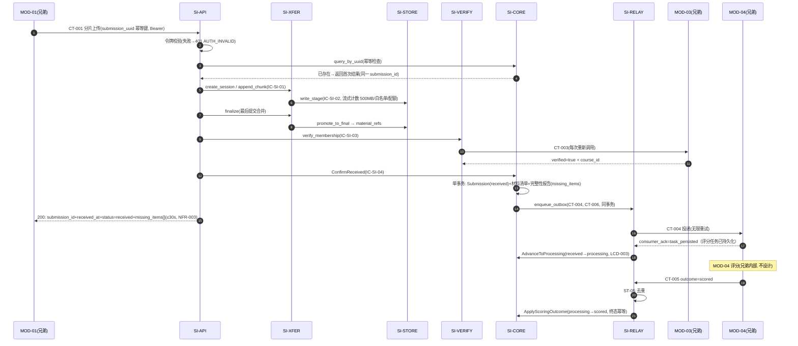

# 04 Contracts and Runtime — MOD-02 submission-intake 契约与运行时

> 本文件是 C3（父流程 → 内部运行时协作）与 C4（继承契约 → 内部实现映射 + 模块内契约）的产物。父契约的标识、所有者、路径/主题、字段、副作用、依赖、失败与版本语义**逐字继承**，本层只做实现映射。内部契约（IC-SI-*）限定在 MOD-02 内，跨模块不可见。

## 1. 继承父契约清单与实现映射

父契约完整字段定义见父包 `04-interface-contracts.md`（contract_fields 块为唯一机器可读来源），此处不复制字段、只做实现映射与不变性确认。

| contract_id | 角色 | 父契约要点（不变） | MOD-02 内部实现映射 |
|---|---|---|---|
| CT-001 材料包上传 | **Provides**（Consumer=MOD-01） | `POST /api/v1/submissions`（multipart 分片：建会话→逐分片→合并）；入参 `submission_uuid`(幂等键)/`invite_code`/`student_name`/`group_name`/`assignment`/`material_chunks[]`；出参 `submission_id`/`received_at`/`status`/`missing_items[]`（拒绝时 `rejection_reason`）；错误码 AUTH_INVALID/VALIDATION_FAILED/PAYLOAD_TOO_LARGE/UNSUPPORTED_MEDIA_TYPE/REJECTED_MEMBERSHIP；side_effects 含创建提交记录、归属校验、状态机推进、完整性报告、发布 SubmissionReceived；可恢复中断不立即创建终态，重试窗口耗尽后发布 upload_failed 可见性事件；30 秒同步确认 | SI-API（端点/认证/编排/错误映射）→ SI-XFER（IC-SI-01 会话/分片/合并）→ SI-STORE（IC-SI-02 落盘/配额）→ SI-VERIFY（IC-SI-03 归属校验）→ SI-CORE（IC-SI-04 单事务持久化 + IC-SI-05 Outbox 写入）→ 应答。RF-01 逐步映射 |
| CT-002 提交状态查询 | **Provides**（Consumer=MOD-01） | `GET /api/v1/submissions/{submission_uuid}`；出参 `submission_id`/`status`/`failure_reason?`/`missing_items[]`；`side_effects: None; read-only`；错误码 AUTH_INVALID/NOT_FOUND | SI-API → SI-CORE 只读查询（IC-SI-04 query）；无任何写副作用 |
| `POST /api/v1/auth/token`（未编号附属端点） | **Provides**（Consumer=MOD-01） | 邀请码+姓名+小组换取 Bearer 令牌；名单核对语义同 CT-003；CT-001 契约族附属，不单独编号（KD-005） | SI-API（端点/签发/审计 ST-06）→ SI-VERIFY（IC-SI-03 名单核对，每次调用实时执行、不缓存） |
| CT-003 课程归属校验 | **Consumes**（Provider=MOD-03） | `POST /api/v1/courses/verify-membership`；入参 `invite_code`/`student_name`/`group_name`；出参 `verified`/`course_id`（拒绝时 `reason`）；每次提交必须重新调用，不缓存通过结论（REQ-006）；ROSTER_UNAVAILABLE：保持待校验并重试，不向客户端暴露内部细节 | SI-VERIFY 唯一出口（IC-SI-03 服务端点）：同步调用、有限重试、待校验协调（LCD-001）；结论交 SI-CORE 落盘（rejected+reason 或 received 路径） |
| CT-004 SubmissionReceived | **Publishes**（Consumer=MOD-04） | Outbox 事件；载荷 `submission_id`/`course_id`/`assignment`/`student_name`/`group_name`/`material_refs[]`/`missing_items[]`/`received_at`/`v=1`；触发：校验通过且材料持久化完成；消费方按 `submission_id` 幂等；确认语义为 MOD-04 已持久化评分任务 | SI-CORE 在 ConfirmReceived 事务内经 IC-SI-05 写 OutboxRecord；SI-RELAY 投递器推送至 MOD-04，无限重试直至收到 `task_persisted` 确认；确认后触发 received→processing（LCD-003） |
| CT-005 SubmissionScored / ScoringFailed | **Consumes**（Provider=MOD-04） | Outbox 事件；载荷 `submission_id`/`outcome`(scored\|scoring_failed)/条件字段；side_effects 含回写提交状态；按 `submission_id`+终态幂等（重复事件不改终态） | SI-RELAY 入站接收 → ST-05 去重 → SI-CORE `ApplyScoringOutcome`（processing→scored/scoring_failed，IC-SI-04，状态机守卫 INV-2）。原始等级/依据/建议内容不落地本模块（归 MOD-04/MOD-05） |
| CT-006 SubmissionReceived（读模型派生） | **Publishes**（Consumer=MOD-05） | Outbox 事件；载荷 `submission_id`/`course_id`/`assignment`/`student_name`/`group_name`/`status`/`missing_items[]`/`received_at`/`v=1`；按 `submission_id` 幂等；触发为 `received` 或终态 `upload_failed` | 同 CT-004 通道（SI-CORE 事务内写 Outbox，SI-RELAY 投递）；received 与 upload_failed 均使用相同 CT-006 schema、消费者和事件版本 |
| CT-012 RecordsDeleted | **Consumes**（Provider=MOD-05） | Outbox 事件；载荷 `batch_id`/`submission_ids[]`/`scope`/`operator`/`executed_at`/`audit_record_id`/`v=1`；side_effects：清除目标提交材料与提交记录；重复清除已删除记录为空操作 | SI-RELAY 入站接收 → ST-05 去重（按 `batch_id`+载荷）→ SI-PURGE（IC-SI-06 逐项执行：SI-STORE 删文件 → SI-CORE 记录 →deleted）→ 结果经 IC-SI-05 写 CT-014 Outbox |
| CT-014 PurgeCompleted | **Publishes**（Consumer=MOD-05） | Outbox 事件；载荷 `batch_id`/`purged_submission_ids[]`/`failed_items[]`/`purged_at`/`v=1`；失败项保留在批次中供重跑；按 `batch_id`+`purged_at` 幂等 | SI-PURGE 汇总 ST-07 执行结果组装载荷 → IC-SI-05 写 Outbox → SI-RELAY 投递；重跑产生新 `purged_at`，消费方幂等语义不变 |

**父外部契约语义确认**：字段、消费者、版本和幂等规则沿用父包；CT-006 的触发条件已在父包同步登记为 `received` 或终态 `upload_failed`。本层不新增外部事件契约。

## 2. 模块内部契约（按稳定 ID 排序）

内部契约为 DU-2 进程内调用，不走网络、不版本化对外暴露；演进规则：同包内随版本一起发布，字段只追加不修改。

### IC-SI-01 上传会话端口（owner：SI-XFER）

- Owner / Consumer：SI-XFER / SI-API
- 触发：`POST /api/v1/submissions` 各阶段（建会话、追加分片、提交合并、中止）
- 命令/查询：`create_session(submission_uuid, declared_categories[])`、`append_chunk(session_id, seq, bytes)`、`finalize(session_id)`、`abort(session_id)`、`get_session(submission_uuid)`
- 副作用：写 ST-02；分片/合并经 IC-SI-02 落盘
- 错误：`CHUNK_OUT_OF_ORDER`（可续传重试）、`SIZE_LIMIT_EXCEEDED`（→413 PAYLOAD_TOO_LARGE）、`TYPE_NOT_ALLOWED`（→415）、`SESSION_NOT_FOUND`
- 幂等：`submission_uuid` 唯一会话；分片按 `seq` 去重；`finalize` 重复调用返回同一结果

### IC-SI-02 材料存储端口（owner：SI-STORE）

- Owner / Consumer：SI-STORE / SI-XFER、SI-CORE、SI-PURGE
- 命令/查询：`write_stage(...)`、`promote_to_final(...)`（生成 `material_ref`）、`read_metadata(material_ref)`、`delete(material_ref)`、`get_course_quota_usage(course_id)`
- 副作用：写/删 ST-03 文件与元数据；配额计数更新
- 错误：`QUOTA_EXCEEDED`（200GB/课程，→拒绝写入并回报）、`STORAGE_IO_FAILED`（写入失败回滚，上传可重试）
- 幂等：`material_ref` 唯一；重复 `delete` 为空操作

### IC-SI-03 归属校验端口（owner：SI-VERIFY）

- Owner / Consumer：SI-VERIFY / SI-API（CT-001 编排与 auth-token 核对）
- 触发：CT-001 合并完成后、auth-token 签发前
- 查询：`verify_membership(invite_code, student_name, group_name) → {verified, course_id?, reason?}`
- 副作用：无本模块持久状态（校验结论由调用方经 IC-SI-04 落盘）；每次调用实时发起 CT-003，不缓存通过结论（REQ-006）
- 错误/重试：`ROSTER_UNAVAILABLE` → 有限快速重试（30 秒预算内）；仍失败 → 会话转 pending_verification 并后台有限重试（LCD-001），不向客户端暴露内部细节
- 幂等：同一请求重复执行结果一致（CT-003 父契约语义）

### IC-SI-04 提交聚合端口（owner：SI-CORE）

- Owner / Consumer：SI-CORE / SI-API、SI-RELAY、SI-PURGE
- 命令：`CreateSubmission` / `MarkUploadFailed` / `MarkRejected` / `ConfirmReceived`（事务含清单+报告+Outbox）/ `AdvanceToProcessing` / `ApplyScoringOutcome` / `PurgeSubmission`；查询：`query_by_uuid(submission_uuid)`
- 副作用：写 ST-01；ConfirmReceived/MarkUploadFailed 同时经 IC-SI-05 写 Outbox（同事务）
- 错误：`DUPLICATE_UUID`（→返回首次结果，非错误响应）、`ILLEGAL_TRANSITION`（状态机守卫拒绝，INV-2）、`NOT_FOUND`
- 幂等：`submission_uuid` 唯一约束；`ApplyScoringOutcome` 按终态幂等；`PurgeSubmission` 对已删记录空操作

### IC-SI-05 Outbox 中继端口（owner：SI-RELAY）

- Owner / Consumer：SI-RELAY / SI-CORE、SI-PURGE（出站写入）；外部入站（CT-005/CT-012）
- 命令：`enqueue_outbox(event, tx)`（调用方事务内）；内部循环：`deliver_loop`（投递、确认、无限重试）；`consume_inbound(event_id, contract_id, payload, v, idempotency_key)`
- 副作用：写 ST-04；入站写 ST-05 并路由（CT-005→IC-SI-04 ApplyScoringOutcome；CT-012→IC-SI-06）
- 错误/重试：投递失败无限重试（KD-002）；入站 schema/反序列化失败进入 ST-05.quarantined 并告警，不阻断后续合法事件；可重试业务失败进入 retry_wait
- 幂等：出站按事件业务键；入站按 ST-05 去重规则

### IC-SI-06 清除执行端口（owner：SI-PURGE）

- Owner / Consumer：SI-PURGE / SI-RELAY
- 触发：CT-012 消费
- 命令：`execute_purge(batch_id, submission_ids[]) → {purged[], failed_items[]}`
- 副作用：逐项删除材料文件（IC-SI-02）与提交记录（IC-SI-04）；写 ST-07；汇总后经 IC-SI-05 发布 CT-014
- 错误：单项失败记入 `failed_items[]`（`submission_id`+`reason`），不阻塞其他项；保留供原批次重跑
- 幂等：已删记录/文件为空操作；同批次重跑安全

### 2.1 机器可读内部契约绑定

| contract_id | 所有者 → 消费者 | 触发与 schema | 错误、幂等、兼容性 | next_hop / 终止条件 |
|---|---|---|---|---|
| IC-SI-01 | SI-XFER → SI-API | 输入: `submission_uuid, declared_categories[], session_id?, seq?, bytes?, abort_reason?`；输出: `session_id, received_bytes, state, material_refs[]?, failure_reason?` | `CHUNK_OUT_OF_ORDER, SIZE_LIMIT_EXCEEDED, TYPE_NOT_ALLOWED, SESSION_NOT_FOUND`；`submission_uuid`/`seq` 幂等；内部字段只追加 | `finalize` 成功→IC-SI-03；`interrupted_retryable`→等待 ResumeUpload；`failed_terminal`→IC-SI-04.MarkUploadFailed |
| IC-SI-02 | SI-STORE → SI-XFER/SI-CORE/SI-PURGE | 输入: `course_id, session_id, material_ref?, category?, bytes?, material_refs[]?`；输出: `material_ref, category, size_bytes, declared, quota_used, delete_result` | `QUOTA_EXCEEDED, STORAGE_IO_FAILED`；`material_ref` 唯一；重复 delete 为空操作 | 写入成功→调用方继续；删除成功→SI-PURGE 汇总；失败→记录 `failed_items[]` |
| IC-SI-03 | SI-VERIFY → SI-API | 输入: `invite_code, student_name, group_name`；输出: `verified, course_id?, reason?` | `ROSTER_UNAVAILABLE`；每次实时调用，不缓存通过结论；重复请求不改变结果 | `verified=true`→IC-SI-04.ConfirmReceived；`verified=false`→IC-SI-04.MarkRejected；不可用→SI-XFER.pending_verification |
| IC-SI-04 | SI-CORE → SI-API/SI-RELAY/SI-PURGE | 输入: `submission_uuid, submission_id?, course_id?, assignment?, student_name?, group_name?, material_refs[]?, missing_items[]?, expected_state?, outcome?, failure_reason?`；输出: `submission_id, status, received_at?, missing_items[], failure_reason?, transition_result` | `DUPLICATE_UUID, ILLEGAL_TRANSITION, NOT_FOUND`；`submission_uuid`、`submission_id+outcome` 幂等；状态仅由 SI-CORE 写入 | ConfirmReceived→IC-SI-05 CT-004/CT-006；ack→processing；CT-005→scored/scoring_failed；CT-012→deleted |
| IC-SI-05 | SI-RELAY → SI-CORE/SI-PURGE/外部消费者 | 输入: `event_id, contract_id, payload, v, idempotency_key, attempt_count`；输出: `delivery_status, consumer_ack, next_attempt_at, route_result` | 出站失败→retry_wait 无限重试；入站 schema 无效→quarantined；业务失败按事件类型重试；事件键幂等 | CT-004→MOD-04；CT-006/014→MOD-05；CT-005→IC-SI-04；CT-012→IC-SI-06 |
| IC-SI-06 | SI-PURGE → SI-RELAY | 输入: `batch_id, submission_ids[], scope, operator, executed_at, audit_record_id`；输出: `purged_submission_ids[], failed_items[], purged_at, v` | 单项失败写 `failed_items[]`；已删记录为空操作；同批次重跑安全 | 完成（含部分失败）→IC-SI-05 发布 CT-014；全部成功→批次 completed |

> **内部编排约束**：IC-SI-03 的结果始终返回 SI-API；SI-VERIFY 不直接调用 SI-XFER。归属服务暂不可用时，由 SI-API 将会话置为 `pending_verification` 并安排后台 CT-003 重试，SI-XFER 只负责保存/恢复会话。

## 3. 运行流（成功 / 失败·恢复 / 生命周期）

### RF-01 成功主链路（CT-001 上传 → received → processing → scored）



分支：**校验拒绝**（verified=false）→ `MarkRejected`（Submission=rejected+reason，不发布 CT-004/CT-006，父契约 side_effects 限定）→ 应答 `status=rejected`+`rejection_reason`（终态）；暂存材料清理（implementation_detail）。**材料不完整**（某声明目录为空）→ 完整性报告 `missing_items[]` 显式标记，**不阻塞** received 与 CT-004 发布（REQ-D004，INV-3）。

### RF-02 失败与恢复（upload_failed / ROSTER_UNAVAILABLE / 投递重试）

```mermaid
sequenceDiagram
    autonumber
    participant P as MOD-01(兄弟)
    participant API as SI-API
    participant XFER as SI-XFER
    participant VERIFY as SI-VERIFY
    participant CORE as SI-CORE
    participant RELAY as SI-RELAY
    participant TW as MOD-05(兄弟)

    Note over P,XFER: 路径 A: 上传中断(AC-REQ-003-01 exceptions)
    P--xXFER: 分片上传中断
    XFER->>XFER: 会话 interrupted_retryable(保留断点进度, KD-005)
    P->>XFER: 恢复后续传(同 submission_uuid, 分片去重)
    alt 重试窗口内恢复
        XFER->>XFER: 回 receiving → merged
        XFER->>API: 返回合并结果 → 回 RF-01
    else 重试窗口耗尽/不可恢复
        XFER->>XFER: failed_terminal
        XFER->>CORE: MarkUploadFailed(IC-SI-04, 记录原因)
        CORE->>RELAY: enqueue_outbox(CT-006 status=upload_failed, 同事务, LCD-002)
        RELAY->>TW: CT-006 投递 → 教师端可见失败原因
    end

    Note over API,VERIFY: 路径 B: ROSTER_UNAVAILABLE(LCD-001)
    API->>VERIFY: verify_membership
    VERIFY->>VERIFY: 30s 预算内有限快速重试仍失败
    VERIFY-->>API: ROSTER_UNAVAILABLE(不暴露内部细节)
    API->>XFER: 会话置 pending_verification(材料保留, 不创建 Submission)
    API-->>P: 暂态失败(客户端按 CT-001 约定超时后经 CT-002 查询/重试)
    XFER-->>API: 会话保持 pending_verification（后台任务通知）
    API->>VERIFY: 后台重试 CT-003
    VERIFY-->>API: 恢复 → 继续校验 → 回 RF-01 第 9 步
    P->>API: CT-002 查询(提交未成立→404 NOT_FOUND, 客户端继续等待/重发同幂等键)

    Note over RELAY,CORE: 路径 C: CT-004 投递失败(MOD-04 不可用)
    RELAY->>RELAY: Outbox 持久化, 投递器无限重试(KD-002)
    Note right of CORE: 提交停留 received(可经 CT-002 观察); 投递确认后才进 processing(LCD-003)
```

### RF-03 生命周期：保留清除（CT-012 → 逐项清除 → CT-014 回流）

```mermaid
sequenceDiagram
    autonumber
    participant TW as MOD-05(兄弟)
    participant RELAY as SI-RELAY
    participant PURGE as SI-PURGE
    participant STORE as SI-STORE
    participant CORE as SI-CORE

    TW->>RELAY: CT-012 RecordsDeleted(batch_id, submission_ids[], audit_record_id)
    RELAY->>RELAY: ST-05 去重(按 batch_id+载荷; 重跑批次允许再次执行)
    RELAY->>PURGE: execute_purge(IC-SI-06)
    loop 每个 submission_id(单项独立小事务)
        PURGE->>STORE: delete(material_refs)(已删=空操作)
        PURGE->>CORE: PurgeSubmission(→deleted; 已删=空操作)
        PURGE->>PURGE: ST-07 记录结果(失败项: id+reason)
    end
    PURGE->>RELAY: enqueue_outbox(CT-014: purged[]+failed_items[]+purged_at)
    RELAY->>TW: CT-014 投递(无限重试)
    Note over TW: 失败项保留在批次中(MOD-05), 重跑再发 CT-012 → 本流程幂等重入
```

审计记录归 MOD-05，先于清除写入且不在清除范围（父包 DF-3）；本模块不复制、不触碰审计数据。

## 4. 错误、重试、超时、幂等、可观测与兼容说明

| 策略 | 本层落实 |
|---|---|
| 超时 | CT-001 同步确认 ≤30 秒（NFR-003）：认证/幂等/合并/CT-003（含有限重试预算）/单事务持久化均在预算内；可恢复上传中断不在同步请求内等待恢复；CT-002 等查询 ≤10 秒（父包 04 策略汇总） |
| 重试 | 分片断点续传（KD-005）；CT-003 有限快速重试 + 后台有限重试（LCD-001）；Outbox 投递无限重试直至确认（KD-002）；CT-012 失败项经原批次重跑（CT-014 语义） |
| 幂等 | `submission_uuid` 唯一约束；分片 `seq` 去重；CT-005 终态幂等；CT-012 空操作幂等；`finalize` 幂等；详见 `03-state-and-data.md` |
| 可观测 | SM-001 owner=SI-API 采集、基础监控聚合：课程周期内 `received_within_30s / valid_submission_total >= 95%`；分母排除学生主动取消、身份校验失败、材料不完整；起点为有效 CT-001 接入，成功点为 30 秒内 `status=received` 应答；标签含 `course_id/result_status/failure_reason`；查询走基础监控指标面板；另监控磁盘水位、Outbox retry_wait、Inbound quarantined 和 CT-004 task_persisted 延迟 |
| 兼容 | 父契约零变更（第 1 节确认）；内部契约随同包发布、字段只追加；LCD-002 的 CT-006 发布时机扩展向后兼容（`status` 值域沿用父状态机，MOD-05 按 `submission_id` 幂等去重） |
