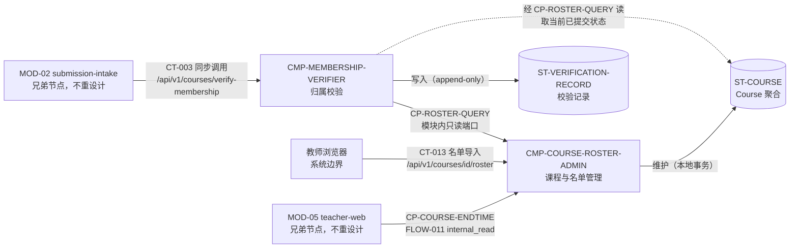

# 02 Architecture Decomposition — MOD-03 course-roster（L1 架构分解）

## 1. 本地语义细化

仅细化 MOD-03 边界内的语义；不重做战略 DDD，不重画父边界，不设计兄弟节点内部。

### 1.1 概念与聚合

- **Course 聚合**（继承，owner 见 §3 子节点清单）：`Course`（课程）、`InviteCode`（邀请码）、`RosterEntry`（名单条目：student_name + group_name）、`course_end_time`（课程结束时间）。
- **VerificationRecord（校验记录）**：一次 CT-003 调用的不可变审计事实（本层新增，CT-003 `side_effects`「记录校验结果」的承载；字段模型见 03-state-and-data §1）。
- **值对象** `VerificationOutcome`：`verified` + `reason?`（通过时附 `course_id`）。
- **命令**：`VerifyMembership`（每次提交触发）、`ImportRoster`（教师维护）、`ProvisionCourse`（运维预置，v1 非公共契约，LCD-004）。
- **内部事件**：**不定义**。无跨子节点异步协作需求；校验直读已提交名单即可保证当前性；模块 `publishes_events` 保持 `[]`（父组件接口卡不变）。

### 1.2 策略与不变量

| 编号 | 策略 / 不变量 | 来源 |
|---|---|---|
| P1 | 邀请码唯一映射课程 | 父包 03 §Aggregate 不变量（inherited-fixed） |
| P2 | 姓名+小组命中名单才通过校验 | 父包 03 §Aggregate 不变量（inherited-fixed） |
| P3 | 每次 CT-003 调用直读当前已提交名单；不缓存通过结论（服务方不备忘、调用方须每次重新调用） | REQ-006、CT-003 幂等条款 |
| P4 | 每次产生结论的调用写入一条独立校验记录；结论与记录在同一本地事务（未成功记录则不应答结论） | CT-003 side_effects、D-AC-REQ-006-01 oracle |
| P5 | 拒绝原因至少区分「邀请码无效」与「姓名/小组未命中名单」两类可判定原因；具体编码枚举 delegated 至下一层 | D-AC-REQ-006-01「记录具体原因」 |

### 1.3 生命周期状态

- **Course**：已预置 → 维护中（名单可导入/调整）→ 已结束（`course_end_time` 设定）。「课程结束后的提交是否拒绝」父包未定义策略，本层不增设课程状态判定（01-design-context §9 开放问题）。
- **VerificationRecord**：无状态机，append-only。

## 2. C1-C6 映射应用

| 映射 | 本层应用 |
|---|---|
| C1（父节点→直接子节点） | MOD-03 → `CMP-MEMBERSHIP-VERIFIER`（DU-2 内，无新部署边界）；`CMP-COURSE-ROSTER-ADMIN` 保留为内部支撑组件 |
| C2（状态→所有权与一致性边界） | Course 聚合 → ADMIN（单聚合本地事务）；VerificationRecord → VERIFIER（append-only，同事务写入）；详见 03 |
| C3（父流→内部协作） | FLOW-003 → 运行流 R1（成功/拒绝）与 R2（不可用与恢复）；CT-013 触发面 → 运行流 R3（导入→下次校验生效）；FLOW-011 → CP-COURSE-ENDTIME 端口 |
| C4（继承契约→内部实现与子级契约） | CT-003 → VERIFIER 端点实现；CT-013 → ADMIN 端点实现；子级端口 CP-ROSTER-QUERY、CP-COURSE-ENDTIME（04 §3） |
| C5（外部依赖→Adapter/ACL） | 外部名单系统当前无接入（A-002 首版手工维护）；未来对接时在 ADMIN 内新增名单来源 Adapter，不改变本层结构 |
| C6（局部驱动→内部战术） | 低延迟驱动 → 单次索引化直读 + 无远程调用（LCD-002）；不缓存 → 无结论缓存/无名单读缓存；审计 → append-only 记录；均不引入父级平台/存储/总线 |

## 3. 叶子节点判定（C1）

MOD-03 在 L1 停止分层。`REQ-D001` 与 `REQ-D002` 共同构成课程归属校验这一单一、有界责任；课程与名单管理、归属校验是模块内实现边界，不是独立的产品 PRD 或部署边界。因此没有直接 `child_id`，也不应生成 L2 PRD。

## 3A. 内部实现组件登记（均非直接 child_id；不可作为 `[NEXT ...]` target）

`CMP-COURSE-ROSTER-ADMIN` 负责 Course/名单数据与 CT-013/只读端口，`CMP-MEMBERSHIP-VERIFIER` 承担 REQ-D001/REQ-D002 的归属校验；二者均为 MOD-03 的内部实现组件，不作为 L2 target。

| component_id | 名称 | 职责 | 排除项 | 拥有状态 | 需求 / 父追踪 | trace_exemption_reason | 依赖 | 存在理由 |
|---|---|---|---|---|---|---|---|---|
| CMP-COURSE-ROSTER-ADMIN | 课程与名单管理 | CT-013 端点实现（教师会话鉴权、课程范围授权、逐条校验、去重、冲突报告）；Course 聚合维护（课程/邀请码/名单条目/课程结束时间）；v1 课程与邀请码运维预置；提供 CP-ROSTER-QUERY（当前名单查询）与 CP-COURSE-ENDTIME（课程结束时间只读）两个端口 | 不执行归属校验判定；不持有校验记录；不发布任何事件；不自建公共建课 API（LCD-004） | ST-COURSE | CT-013；FR-005（名单维护）；A-002；父 03 §Course 聚合所有权与不变量；FLOW-011 / DF-3 步骤 1；LCD-004 | - | DU-2 共享数据库；DU-2 教师会话鉴权平台能力（KD-003/005） | 名单来源与课程生命周期是独立变化原因（A-002 未来外部名单系统接入经 C5 落在本节点）；Course 聚合一致性边界需要单一 owner |
| CMP-MEMBERSHIP-VERIFIER | 归属校验 | CT-003 端点实现；校验策略执行（P1–P5）；每次调用写入独立校验记录；内部故障映射为 ROSTER_UNAVAILABLE（不泄露内部细节） | 不维护名单/课程；不缓存通过结论或名单快照；不向客户端暴露内部错误细节；不发布任何事件 | ST-VERIFICATION-RECORD | REQ-D001（REQ-005/FR-005）、REQ-D002（REQ-006/FR-006）；CT-003；F1-4；FLOW-003；D-AC-REQ-003-01 MOD-03 slice；D-AC-REQ-006-01 | - | CP-ROSTER-QUERY（模块内只读端口）；DU-2 共享数据库 | 校验位于 CT-001 30 秒同步热路径与认证签发路径，与名单管理的负载特征、变化原因（校验策略 vs 名单来源）不同；P3/P4 策略要求独立的状态所有权 |

## 4. 依赖图与外部边界

| 边界 | 类型 | 说明 |
|---|---|---|
| MOD-02 → VERIFIER | 继承契约 CT-003（sync_api） | 消费场景含 CT-001 处理（FLOW-003）与认证端点签发（名单核对语义同 CT-003，04 §通用约定） |
| 教师浏览器 → ADMIN | 继承契约 CT-013（sync_api） | 教师界面宿主在 MOD-05，契约 Consumer 为教师浏览器，不与 MOD-05 新建网络契约 |
| MOD-05 → ADMIN | 继承边界 FLOW-011（internal_read） | 无网络契约；仅暴露 `course_end_time` 只读语义（CP-COURSE-ENDTIME） |
| VERIFIER → ADMIN | 子级端口 CP-ROSTER-QUERY | 模块内只读；不引入网络契约与缓存 |
| 两子节点 → 数据库 | DU-2 共享单一关系型数据库（KD-002） | 同库分表，各表仅由其 owner 子节点写入（03 §1） |

## 5. 兄弟节点引用确认

MOD-01/02/04/05 仅作为协作约束被引用：MOD-02 为 CT-003 消费方、MOD-05 为 FLOW-011 只读引用方、MOD-01 为端到端链路间接相关方（学生侧设置姓名/小组）。本层未设计任何兄弟节点内部结构，未触碰 CT-001/CT-002/CT-004~CT-012/CT-014 的语义，未向兄弟节点提出任何新契约或状态所有权变更。

## 6. 划分理由

- **职责**：热路径的运行时校验判定（每次提交一次同步调用）与低频的课程/名单行政管理天然分离。
- **状态**：VerificationRecord（高频 append-only）与 Course 聚合（低频维护、强一致性边界）各自独立，互不嵌套。
- **不变量**：P1/P2 由 ADMIN 在写入侧保证；P3/P4/P5 由 VERIFIER 在执行侧保证；任一子节点都不需为对方的不变量加锁。
- **生命周期**：校验随提交流量（并发、毫秒级）；名单维护随教师操作（稀疏、分钟级）；课程预置随学期（极稀疏）。
- **变化原因**：校验策略/原因分类演进只动 VERIFIER；名单来源演进（A-002 外部名单系统对接）只动 ADMIN；契约变更受父层约束，两侧均不外溢。
- **交互**：单向依赖（VERIFIER → ADMIN 只读端口），无环、无双向协商、无分布式事务。
- **被否方案**：① 单子节点合并（混合热路径与行政管理的状态与变化原因，P3/P4 策略无法独立保障）；② 按 Controller/Service/Repository 三层拆 3+ 子节点（通用分层而非按职责/状态拆分，skill 明令禁止）；③ 邀请码管理独立子节点（肢解 Course 聚合一致性边界，违反 C2）。详见 05-local-decisions LCD-001。
