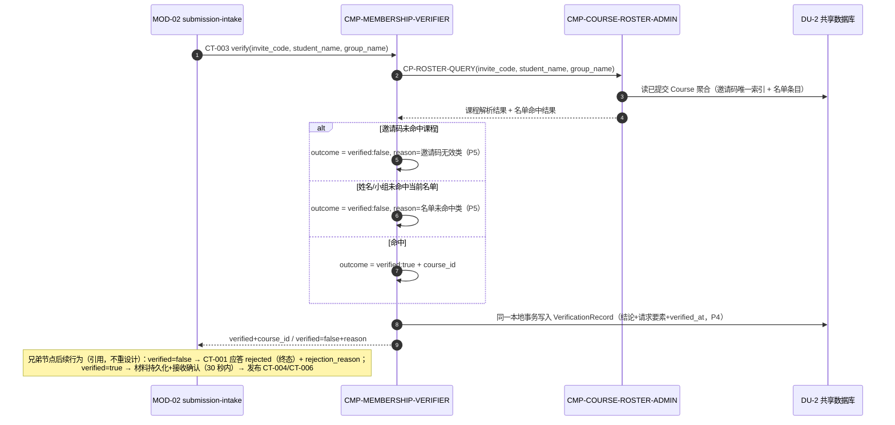
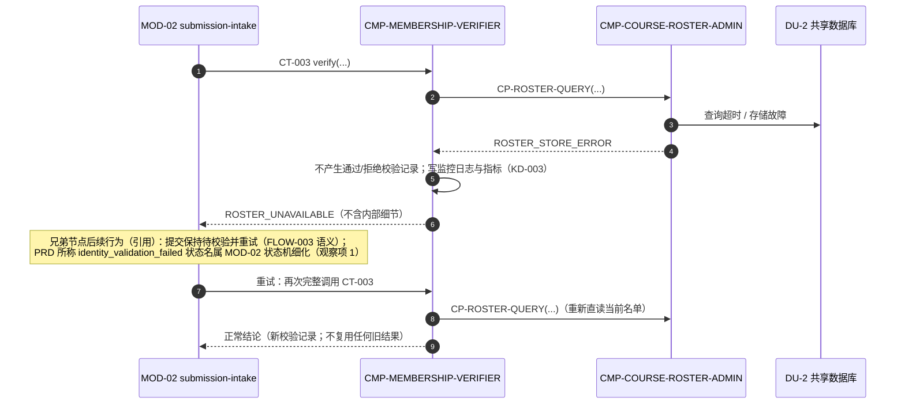
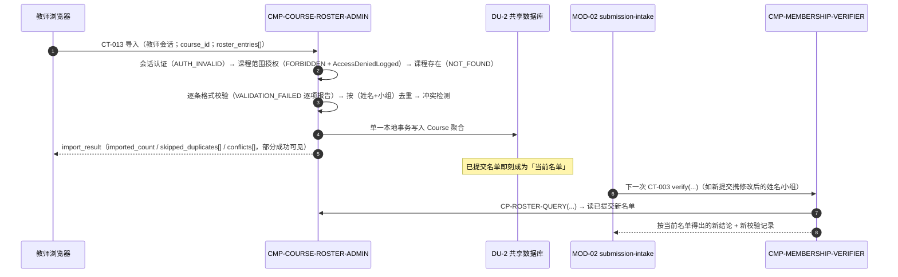

# 04 Contracts and Runtime — MOD-03 course-roster（L1 契约与运行时）

## 1. 继承契约清单（逐字继承，语义不变）

### 1.1 CT-003 课程归属校验（Provider 侧实现）

- `contract_id`: CT-003；`contract_type`: api
- Provider: **MOD-03 course-roster**；Consumer: MOD-02 submission-intake
- Trigger / Protocol: CT-001 处理过程中；服务间 HTTPS `POST /api/v1/courses/verify-membership`
- Sync / Async: Sync
- Schema: 请求 `invite_code`、`student_name`、`group_name`；应答 `verified: bool`、`reason?`、`course_id`
- `side_effects`: 记录校验结果（通过/拒绝原因）
- `dependencies`: 名单数据（CT-013）
- Error / Timeout / Retry: 名单服务超时 → 提交保持待校验状态并重试；不向客户端暴露内部错误细节
- Idempotency: 同一请求重复执行结果一致；每次提交必须重新调用（REQ-006），不得缓存通过结论
- Versioning: `/api/v1`
- Source FR / Flow / Event: FR-005、FR-006；F1-4

```yaml
contract_fields:                     # 逐字引自父包 04，未改一字
  contract_id: CT-003
  provider: MOD-03
  consumer: MOD-02
  direction: sync_api
  inbound_required_fields: [invite_code, student_name, group_name]
  inbound_optional_fields: []
  outbound_produced_fields: [verified, course_id]
  outbound_conditional_fields: [reason]   # verified=false 时返回
  error_codes: [ROSTER_UNAVAILABLE]   # 超时/内部错误；不向客户端暴露内部细节
  publishes_events: []
```

消费场景注记：CT-003 由 MOD-02 在两类场景调用——CT-001 提交处理（FLOW-003）与认证端点 `POST /api/v1/auth/token` 签发（名单核对语义同 CT-003，父 04 §通用约定）。对本模块而言为同一契约、同一语义，不新增变体。

### 1.2 CT-013 名单导入（Provider 侧实现）

- `contract_id`: CT-013；`contract_type`: api
- Provider: **MOD-03 course-roster**；Consumer: 教师浏览器 / 名单文件
- Trigger / Protocol: 教师维护名单；`POST /api/v1/courses/{id}/roster`（录入或文件上传）
- Sync / Async: Sync
- Schema: 名单条目（姓名、小组）；应答导入结果与冲突项
- `side_effects`: 创建/更新名单记录
- `dependencies`: 课程已创建
- Error / Timeout / Retry: 格式错误条目逐项拒绝并报告；部分成功可见
- Idempotency: 同一文件重复导入按（姓名+小组）去重，不产生重复条目
- Versioning: `/api/v1`
- Source FR / Flow / Event: FR-005；名单维护（A-002）

```yaml
contract_fields:                     # 逐字引自父包 04，未改一字
  contract_id: CT-013
  provider: MOD-03
  consumer: "教师浏览器 / 名单文件"
  direction: sync_api
  inbound_required_fields: [course_id, "roster_entries[]"]   # roster_entries[] 元素：student_name、group_name
  inbound_optional_fields: []
  outbound_produced_fields: [import_result]   # 含 imported_count、skipped_duplicates[]、conflicts[]；格式错误条目逐项报告
  outbound_conditional_fields: []
  error_codes: [AUTH_INVALID, FORBIDDEN, NOT_FOUND, VALIDATION_FAILED]
  publishes_events: []
```

授权注记（继承）：FORBIDDEN = 课程范围授权失败，须记录 AccessDeniedLogged（父 04 §错误码汇总，适用契约含 CT-013）；AUTH_INVALID = 教师会话缺失/无效（KD-005 教师账号会话）。

### 1.3 FLOW-011 课程结束时间只读引用（无网络契约的继承边界）

- 形态：`internal_read`，同 DU-2 进程内只读引用，**无网络契约**（父 02 §FLOW-011：`contract: none`；justification：变更频率极低且同部署单元，不引入网络契约）。
- 语义：MOD-05 保留期到期标记批处理执行时读取最新 `course_end_time`（DF-3 步骤 1）；`retention_due_at = course_end_time + 1 年` 的计算在 MOD-05 侧，本模块只提供读取。
- 本层以子级端口 CP-COURSE-ENDTIME（§3）实现该边界；若未来出现跨部署单元访问需求，须 return_to_parent 引入网络契约。

## 2. 继承契约实现映射（C4）

| 继承契约 / 边界 | 实现子节点 | 实现方式 | 语义保障 |
|---|---|---|---|
| CT-003 | CMP-MEMBERSHIP-VERIFIER | 端点 + 校验策略（P1–P5）+ 校验记录写入 + ROSTER_UNAVAILABLE 映射 | 字段/错误码/幂等/版本逐字不变；每次调用直读当前名单（P3） |
| CT-013 | CMP-COURSE-ROSTER-ADMIN | 端点 + 授权与留痕 + 逐条校验/去重/冲突报告 + 单事务写 Course 聚合 | 字段/错误码/幂等/版本逐字不变；部分成功可见 |
| FLOW-011 | CMP-COURSE-ROSTER-ADMIN | CP-COURSE-ENDTIME 模块内只读端口 | 无网络契约；只读；批处理时读最新值 |

一个继承契约可由多个子节点协作实现：CT-003 的「当前名单」数据由 ADMIN 经 CP-ROSTER-QUERY 供给，校验判定与记录由 VERIFIER 完成；对外语义不因内部协作改变（C4 边界规则）。

## 3. 子级契约（按 contract_id 排序；仅模块内/继承边界内可见）

### 3.1 CP-COURSE-ENDTIME 课程结束时间只读端口

- `contract_id`: CP-COURSE-ENDTIME；`contract_type`: module-internal read port（无网络契约）
- Provider: CMP-COURSE-ROSTER-ADMIN；Consumer: MOD-05 teacher-web（兄弟节点，继承 FLOW-011）
- Trigger: MOD-05 保留期到期标记定时批处理执行时（DF-3 步骤 1）
- Schema: 入 `course_id`；出 `course_end_time`（课程不存在时返回「未找到」语义，由消费方按无课程处理）
- `side_effects`: None; read-only
- Error / Retry: 同进程内读，无网络错误码；存储故障由消费方批处理失败重试覆盖（MOD-05 侧语义，不重设计）
- Idempotency: 只读，天然幂等；每次调用返回最新已提交值
- Compatibility: 继承 FLOW-011 语义；不得扩展为读写端口或网络契约（否则 return_to_parent）

### 3.2 CP-ROSTER-QUERY 当前名单查询端口

- `contract_id`: CP-ROSTER-QUERY；`contract_type`: module-internal read port（无网络契约）
- Provider: CMP-COURSE-ROSTER-ADMIN；Consumer: CMP-MEMBERSHIP-VERIFIER
- Trigger: 每次 CT-003 调用
- Schema: 入 `invite_code`、`student_name`、`group_name`；出 ① 课程解析结果（`course_id` | 未命中）② 该课程下（姓名+小组）名单命中结果（基于调用时刻已提交状态）
- `side_effects`: None; read-only
- Error / Retry: 存储故障 → `ROSTER_STORE_ERROR`，由 VERIFIER 映射为 CT-003 的 ROSTER_UNAVAILABLE（不携带内部细节）；消费方（MOD-02）按 CT-003 语义重试
- Idempotency: 只读；名单状态不变时同一请求结果一致；**不提供、不允许结论缓存**（P3）
- Compatibility: 模块内端口，不暴露至模块边界外；签名演进只影响本模块内部

## 4. 本地运行流

### R1 归属校验：通过与拒绝（成功/业务拒绝主链路）

对应：FLOW-003、SCENARIO-001 seq 2、DF-1 步骤 4–5（F1-4）、D-AC-REQ-003-01 MOD-03 slice、D-AC-REQ-006-01 response。



要点：每次调用均完整执行 ①–⑥（P3 不缓存）；学生修改姓名/小组后的新提交以**本次请求要素**与**当前名单**判定（REQ-D002）；校验记录与提交的多对一关联由调用方 MOD-02 侧持有（CT-003 契约无 submission_id，不得新增字段，LCD-003）。

### R2 名单不可用：失败与恢复（failure/recovery）

对应：CT-003 Error/Timeout 语义、D-AC-REQ-006-01 exceptions（「课程名单服务不可用 → 不复用旧校验结果，记录可重试原因」）。



要点：不可用调用**不产生**通过/拒绝记录（避免把基础设施故障误记为身份结论）；失败以可重试错误码表达；恢复后重试走 R1 完整路径。

### R3 名单导入 → 后续校验生效（生命周期）

对应：CT-013、A-002、D-AC-REQ-006-01（修改姓名/小组后新提交按当前名单校验）。



要点：无名单快照、无失效广播、无事件——直读已提交状态天然保证「下一次校验即生效」（P3）；学生侧无缓存、服务端无结论缓存，三类修改场景（仅姓名/仅小组/两者同改）均触发本次提交独立校验（D-AC-REQ-006-01 boundaries）。

## 5. 错误、重试、超时、幂等、可观测、兼容注记

| 策略 | 本层规则 |
|---|---|
| 错误 | CT-003 仅 ROSTER_UNAVAILABLE（内部细节不出模块）；CT-013 按父错误码集（AUTH_INVALID/FORBIDDEN/NOT_FOUND/VALIDATION_FAILED），FORBIDDEN 必记 AccessDeniedLogged；拒绝结论是业务应答（verified=false+reason）而非错误码（与父一致：REJECTED_MEMBERSHIP 表达在 CT-001 应答侧） |
| 超时 | CT-003 在 CT-001 的 30 秒窗口内：校验为毫秒级索引直读 + 单条记录写入；存储访问快速失败以预留 MOD-02 重试余量（具体预算毫秒值 = implementation_detail） |
| 重试 | 本模块不主动重试；重试由消费方按 CT-003 语义发起；每次重试都是一次完整独立校验（新记录） |
| 幂等 | CT-003：结果幂等 + 记录逐条（P4）；CT-013：同文件重复导入按（姓名+小组）去重；两个子级端口只读天然幂等 |
| 可观测 | 校验结论计数（verified/rejected/unavailable 三态）支撑 SM-001 链路 REJECTED_MEMBERSHIP 统计口径（父 01 §SM 分配注记）；ROSTER_UNAVAILABLE 率纳入基础监控告警（KD-003）；日志不含超出契约字段的学生信息 |
| 兼容 | 继承契约零变更；子级端口不外露；CT-003 端点（`/api/v1` 前缀下）的网络暴露面收敛为 DU-2 内部可达属部署/详细设计事项，不改变契约语义 |

## 6. 继承语义未改确认

- CT-003 / CT-013 的标识、Provider/Consumer、路径、字段、副作用、依赖、失败语义、幂等条款、版本策略逐字继承（§1），未改名、未弱化、未移动、未版本升级、未增删字段。
- FLOW-011 保持无网络契约的 internal_read。
- 未新增任何父级/跨模块契约、事件、公共运行时边界；无 `parent-change-request.md`（无 return_to_parent 项）。
