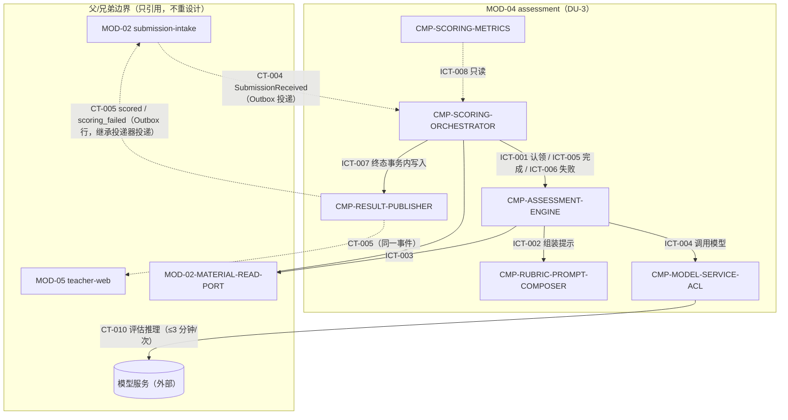

# 02 Architecture Decomposition — MOD-04 assessment 内部结构

本文件给出 MOD-04 内部的直接子节点与支撑组件划分。全部组件运行在 DU-3 assessment-worker 内，
不引入新的部署单元、服务边界或消息中间件（KD-002、父层「不采用方案」）。

## 1. 局部概念

- **聚合（局部细化）**：AssessmentResult（父层聚合，本层内部拆为“任务状态”与“结果内容”两个写入面，同一聚合、同一终态事务，见 03）。
- **实体/值对象**：ScoringTask（任务）、DimensionRationale（维度依据）、TeacherSuggestion（教师专用建议）、Grade（A–E）、RubricDimension（五维度枚举：需求理解 / Codex 迭代过程 / 代码质量 / 最终功能 / 文档/展示完整性）。
- **命令**：ClaimScoringTask、ComposeEvaluationPrompt、InvokeModelAssessment、CompleteAssessment、FailAssessment、PublishScoringOutcome（详见 04 内部契约）。
- **内部事件**：不引入消息总线；任务状态迁移即协作信号（任务表认领，KD-002 任务表机制）。
- **策略**：五维度评分准则与等级区间（RubricPolicy，版本化）；重试一次策略（RetryOncePolicy）；材料最小化策略（MinimizationPolicy）。
- **生命周期**：pending → in_progress →（一次重试）→ scored | scoring_failed；终态不可逆。

## 2. 直接子节点清单（C1；按 child_id 排序）

| child_id | 责任 | 分配需求 | 直接验收追踪 | 拥有状态 | 依赖 | 存在理由 |
|---|---|---|---|---|---|---|
| CMP-ASSESSMENT-ENGINE | 评估执行、等级/五维依据/教师建议校验与结果装配 | REQ-D001 | D-AC-REQ-008-01；AC-REQ-008-01 | 无（结果由编排器持久化） | Rubric、材料只读端口、ACL、Orchestrator | 直接拥有五维评分结果这一 L1 产品义务 |
| CMP-SCORING-ORCHESTRATOR | 评分任务创建、状态机、一次重试、失败终态及结果事件事务 | REQ-D002 | D-AC-REQ-008-01；AC-REQ-007-01 | ST-001、ST-002 | Assessment Engine、Result Publisher、Metrics | 直接拥有“重试一次、失败标记并通知教师”的 L1 产品行为 |

> 直接清单约束：每行至少拥有一条当前 L1 PRD 的 `REQ-Dxxx`/`NFR-Dxxx`。CT/FLOW/状态/SM/FR/父层 REQ 仅作为补充追踪。

## 2A. 内部实现组件登记（非直接 child_id；不可作为 `[NEXT ...]` target）

以下组件是评分主流程的实现支撑或横切观测能力，不拥有独立的当前 L1 产品义务。

| component_id | 职责 | 排除项 | 拥有状态 | 需求分配 / 父层追踪 | 依赖（内部 / 边界） | 存在理由 | trace_exemption_reason |
|---|---|---|---|---|---|---|---|
| CMP-ASSESSMENT-ENGINE | 无状态评估执行器：驱动一次任务的评估——请求提示组装、触发材料装载、经 ACL 调用模型、做领域校验（等级 ∈ A–E、依据恰为五维度、建议带教师专用标记）并装配结果（原始等级、五维度依据、教师专用建议、scored_at、缺失材料影响说明），向编排器回报完成/失败 | 不管理任务生命周期、重试次数与调度；不直接访问网络/供应商；不写库、不发布事件；不拥有提示模板与准则 | 无（无状态执行；结果由编排器在终态事务内持久化） | REQ-D001；FR-008；AC-REQ-008-01 / D-AC-REQ-008-01（含缺失材料边界与教师专用 oracle） | → CMP-RUBRIC-PROMPT-COMPOSER（ICT-002）；→ 材料只读端口（ICT-003）；→ CMP-MODEL-SERVICE-ACL（ICT-004）；→ CMP-SCORING-ORCHESTRATOR（ICT-005/006） | 评估执行的变化原因（校验规则、结果装配、降级处理）独立于任务调度与供应商接入；无状态化使 worker 崩溃恢复只需重跑任务 | - |
| CMP-MODEL-SERVICE-ACL | 外部模型服务防腐层（KD-001）：材料最小化编排（对话摘要、代码、结果描述；绝不外发 submission_id、学生姓名等业务标识）；request_id 关联与重试去重；单次调用 ≤3 分钟超时；应答 schema 校验；错误分类为 MODEL_TIMEOUT / MODEL_ERROR / INVALID_RESPONSE_SCHEMA；供应商客户端封装、可替换 | 不决定重试次数与失败终态；不拥有业务状态；不感知任务与提交语义 | 无（每次调用无状态；request_id 仅调用期关联） | KD-001；CT-010；REQ-D002（向重试策略提供标准化失败输入）；FR-012 | 被 CMP-ASSESSMENT-ENGINE 调用（ICT-004）；边界外：模型服务（外部，CT-010） | 父层明确“经 ACL 隔离、供应商可替换”；最小化合规与错误分类必须单点收口 | - |
| CMP-RESULT-PUBLISHER | CT-005 组包与 Outbox 写入：按 CT-005 schema 组装 scored / scoring_failed 两种载荷（含 v=1），在编排器终态事务内插入 Outbox 行；保证同一任务最多一条逻辑终态事件 | 不决定 outcome；不承担事件投递（继承的 Outbox 投递器负责）；不改变 CT-005 任何字段语义 | ST-003（Outbox 事件行的写入协议） | CT-005；KD-002；REQ-D002（scoring_failed 触发教师通知的载体）；FLOW-006/007 | 被 CMP-SCORING-ORCHESTRATOR 调用（ICT-007）；边界外：Outbox 投递器（继承基础设施）→ MOD-02、MOD-05 | “状态 + 结果 + 事件同一事务”是父层一致性模型的要求（03 跨边界一致性；KD-002），需独立写入点保证不丢不重 | - |
| CMP-RUBRIC-PROMPT-COMPOSER | 五维度评分准则与提示编排：维护 RubricPolicy（五维度定义、A–E 默认区间 A=90–100 … E=0–59）、提示模板；按任务上下文（assignment、材料清单、missing_items[]）组装 evaluation_prompt 并注入缺失材料声明；输出版本号（prompt_version、rubric_version）供结果存证 | 不装载材料内容；不调用模型；不判定单条提交的最终等级（模型产出，引擎校验） | ST-004（准则/模板配置，版本化只读引用） | REQ-D001；FR-008（默认区间）；ubiquitous-language「维度依据」；AC-REQ-008-01 boundaries（缺失材料声明） | 被 CMP-ASSESSMENT-ENGINE 调用（ICT-002） | 准则/提示词是最高频调优点且直接影响评估质量，与执行流、供应商接入的变化原因不同；版本化支撑可审计与回归对比（LCD-003） | - |
| CMP-SCORING-METRICS | 指标与观测：按 SM-002 口径（任务创建至 outcome=scored 时长）与 SM-003 口径（任务创建至终态比例）从任务状态派生统计；暴露任务积压、模型调用失败率、重试率等监控钩子（对接 KD-003 基础监控） | 不读写业务决策路径；不改变任务与结果；不产出报表之外的任何副作用 | 无（查询派生，不持有独立持久状态） | SM-002、SM-003；NFR-003；KD-003 / 06 监控列表（评分任务积压、模型调用失败率） | 只读 CMP-SCORING-ORCHESTRATOR 状态（ICT-008）；边界外：基础监控设施（KD-003） | SM-002/SM-003 由 MOD-04 承接（01 Success Metric 分配），统计口径必须与任务状态同源且不影响评分主路径 | - |
| CMP-SCORING-ORCHESTRATOR | 评分任务编排：幂等消费 CT-004（按 submission_id 去重）并创建评分任务；持有任务状态机（pending → in_progress → scored / scoring_failed）；多副本经任务表认领协调（租约）；执行重试一次策略（仅一次，有界退避）；10 分钟期限跟踪；在终态事务内写入结果 + 重试记录 + Outbox 事件 | 不执行评估本身；不组装提示；不直接调用模型；不投递事件 | ST-001（ScoringTask 任务行，含重试记录）、ST-002（AssessmentResult 结果内容，终态事务内一次性写入） | REQ-D002；FR-012；DF-2；CT-004；SM-002（期限口径起点）；AC-REQ-007-01 MOD-04 slice | 边界外：CT-004（MOD-02）；→ CMP-ASSESSMENT-ENGINE（ICT-001/005/006）；→ CMP-RESULT-PUBLISHER（ICT-007）；被 CMP-SCORING-METRICS 只读（ICT-008） | 任务生命周期、幂等、重试次数与终态事务是单点一致性责任；“仅自动重试一次、不得伪造等级”的不变量只能由状态机持有者强制执行 | - |

机器可读约定：以下 `children` YAML 块只登记直接 child_id；内部组件另列于 `internal_support_components`，不得作为 L2 target。

```yaml
children:
  - child_id: CMP-ASSESSMENT-ENGINE
    owns_state: []
    traces: [REQ-D001, FR-008, AC-REQ-008-01, D-AC-REQ-008-01]
    trace_exemption_reason: null
  - child_id: CMP-SCORING-ORCHESTRATOR
    owns_state: [ST-001, ST-002]
    traces: [REQ-D002, FR-012, DF-2, CT-004, SM-002, AC-REQ-007-01]
    trace_exemption_reason: null

internal_support_components:
  - component_id: CMP-MODEL-SERVICE-ACL
    traces: [KD-001, CT-010, REQ-D002, FR-012]
    reason: 外部模型调用防腐层与失败分类，仅为编排/评估提供实现支撑
    l2_target: false
  - component_id: CMP-RESULT-PUBLISHER
    traces: [CT-005, KD-002, REQ-D002, FLOW-006, FLOW-007]
    reason: Outbox 载荷组装与写入，不独立承担产品义务
    l2_target: false
  - component_id: CMP-RUBRIC-PROMPT-COMPOSER
    traces: [REQ-D001, FR-008, AC-REQ-008-01]
    reason: 准则/提示模板支撑，最终评分结果由 Assessment Engine 负责
    l2_target: false
  - component_id: CMP-SCORING-METRICS
    traces: [SM-002, SM-003, NFR-003, KD-003]
    reason: 横切观测与指标派生，没有当前 REQ-D/NFR-D 产品义务
    l2_target: false
```

## 3. 子节点与父/兄弟边界依赖图



图注：实线为进程内调用，虚线为跨边界事件/只读引用；`ORCH --- DISK` 为任务表/Outbox 表持久化（KD-002）。
MOD-02、MOD-05 仅作为契约对端引用，其内部结构不在本层设计范围（兄弟节点未重设计确认）。

## 4. 分解理由

按职责、状态、不变量、生命周期、变化原因与交互分解，而非通用分层：

1. **状态所有权收敛**：任务状态机与结果持久化收敛于 CMP-SCORING-ORCHESTRATOR 一处，因为父层不变量（最多重试一次、原始等级不可变、结果与重试记录同一事务）只能由单一写入方保证；评估执行因此设计为无状态（CMP-ASSESSMENT-ENGINE），崩溃恢复等价于重跑任务。
2. **变化原因分离**：评分准则/提示词（调优频繁）→ CMP-RUBRIC-PROMPT-COMPOSER；供应商接入与合规最小化（供应商协议、API 演进）→ CMP-MODEL-SERVICE-ACL；评估装配与校验（结构演进）→ CMP-ASSESSMENT-ENGINE；调度与恢复（容量与稳定性）→ 编排器。
3. **父层一致性模型落地**：CT-005 与状态迁移同事务（KD-002 Outbox）独立为 CMP-RESULT-PUBLISHER；指标派生（SM-002/003）只读隔离为 CMP-SCORING-METRICS，避免观测影响主路径。
4. **交互边界**：全部内部协作为进程内调用或任务表协调；无内部消息总线（父层不采用消息中间件）。

## 5. C1–C6 检查

| 检查 | 结论 | 证据 |
|---|---|---|
| C1 直接子节点均在 MOD-04 内部且带稳定 child_id | 通过 | 2 个直接子节点与 4 个内部支撑组件全部限定于 DU-3 内，无新部署单元/服务/公共边界 |
| C2 状态所有者与局部一致性边界明确，父/兄弟所有权不变 | 通过 | ST-001~ST-004 归属见 03；MOD-02 材料/提交、MOD-05 读模型所有权不变（仅只读/契约协作） |
| C3 内部协作保留父业务顺序与外部承诺 | 通过 | CT-004 → 任务创建 → CT-010（≤3 分钟）→ CT-005，与 FLOW-004~007、SCENARIO-012 顺序一致；重试仅一次（DF-2） |
| C4 父契约语义不变 | 通过 | CT-004/005/010 标识、字段、所有者、副作用、失败、版本原样实现（04 实现映射逐字段核对） |
| C5 父外部依赖仅经已委托 ACL 内部封装 | 通过 | 模型服务接入全部收口于 CMP-MODEL-SERVICE-ACL（KD-001）；不重设计其他父节点依赖 |
| C6 局部驱动只产生内部策略 | 通过 | LCD-001~004 均为内部策略；未引入父层禁止的平台/存储/消息/部署元素 |
