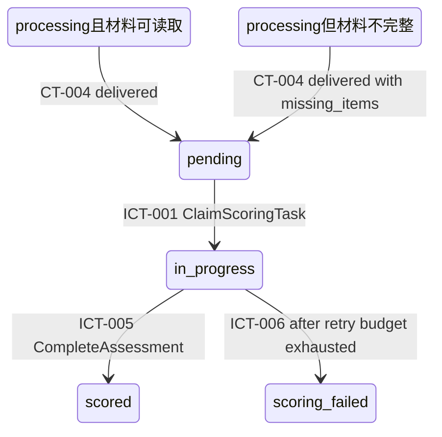

# 03 State and Data — MOD-04 状态与数据

MOD-04 仅拥有父层指定的 AssessmentResult 聚合（评分任务、原始等级、五维度依据、教师专用建议、
重试记录、失败原因）。存储形态受父层约束：单一关系型数据库（产品选型 defer_to_detail_design，
要求事务 + 备份）、任务表 + Outbox 表持久化（KD-002）、存储加密（KD-003）。
本层不新增存储平台，不转移任何父/兄弟数据所有权。

## 1. 状态所有权清单（按稳定状态 ID 排序）

| state_id | 状态 | owner（child_id） | 读方 | 写方 | 生命周期 | 一致性边界 | 保留 / 隐私约束 | 父层追踪 |
|---|---|---|---|---|---|---|---|---|
| ST-001 | ScoringTask 任务行：task_id、submission_id（幂等唯一键）、course_id、assignment、material_refs[]、missing_items[]、status、attempts（0/1/2）、created_at、started_at、deadline_at（created_at+10min）、finished_at、failure_reason、retry_record{first_failure{error_kind,at},second_failure{error_kind,at}}、claim_lease（认领租约，含 reclaim_count 崩溃重认领计数） | CMP-SCORING-ORCHESTRATOR | CMP-ASSESSMENT-ENGINE（认领载荷）、CMP-SCORING-METRICS（只读统计） | 仅 CMP-SCORING-ORCHESTRATOR | pending → in_progress → scored \| scoring_failed（终态不可逆）；崩溃后经租约过期回到可认领态（attempts 不增，reclaim_count+1） | 单行事务：状态迁移 + attempts + retry_record 原子更新 | 随课程数据保留（删除接线为父层未决 Q-001）；含学生标识，库内存储加密（KD-003）；**不出境**（KD-001） | AssessmentResult 聚合（03 数据所有权）；REQ-D002；FR-012；SM-002 口径起点 |
| ST-002 | AssessmentResult 结果内容：original_grade（A–E）、dimension_rationales[5]{dimension, rationale}、teacher_suggestions[]（教师专用标记）、scored_at、missing_materials_impact、prompt_version、rubric_version、model_meta{request_id, duration_ms, attempts_used} | CMP-SCORING-ORCHESTRATOR（持久化）；CMP-ASSESSMENT-ENGINE（装配产出） | CMP-RESULT-PUBLISHER（组包 CT-005）、CMP-SCORING-METRICS（只读） | 仅终态事务内一次性写入（写后不可变） | 随任务进入 scored 时写入；写入后不可变（原始等级不可变） | 与 ST-001 终态迁移 + ST-003 插入同一本地事务 | 建议标记为教师专用；材料内容不落库为本状态（仅存模型应答结果与元数据） | 聚合不变量（原始等级不可变、结果+重试记录同事务）；FR-008；CT-005 载荷来源 |
| ST-003 | Outbox 事件行（CT-005 待投递记录）：event_id、submission_id、outcome、payload（按 CT-005 schema，v=1）、created_at、投递状态 | CMP-RESULT-PUBLISHER（写入协议） | Outbox 投递器（继承基础设施，KD-002） | 仅 CMP-RESULT-PUBLISHER（在终态事务内插入） | pending → dispatched（投递器推进）；至少一次投递 | 与 ST-001/ST-002 同一事务；同一任务最多一条逻辑终态事件（submission_id + outcome 唯一） | 载荷含等级/依据/建议，仅投递至 MOD-02、MOD-05（父层既定消费者） | KD-002；CT-005；02「事件投递机制」 |
| ST-004 | RubricPolicy 配置：五维度定义、等级默认区间（A=90–100 … E=0–59）、提示模板、prompt_version、rubric_version | CMP-RUBRIC-PROMPT-COMPOSER | CMP-RUBRIC-PROMPT-COMPOSER（组装时读取）、CMP-ASSESSMENT-ENGINE（结果存证引用版本号） | 仅发布/调优流程写（配置变更），评分主路径只读 | 版本化演进；旧版本随结果存证保留可追溯 | 单版本一致读取（一次评估固定使用一个版本） | 不含学生数据；版本变更不要求历史结果重算 | FR-008（默认区间）；LCD-003 |

派生状态：SM-002/SM-003 统计、积压/失败率为 CMP-SCORING-METRICS 对 ST-001/ST-002 的只读查询派生，
无独立持久状态；已投递的 CT-005 为外部化状态（MOD-02/MOD-05 各自派生，本层不持有其副本）。

### 1.1 跨层状态投影（机器可解析）

`processing` 是 MOD-02 Submission 的外部状态，不是 MOD-04 的本地任务状态。CT-004 到达并完成幂等持久化后，才建立本层 ST-001 状态。

机器状态投影链：外部 `processing -> pending`；本地成功 `pending -> in_progress -> scored`；本地失败 `in_progress -> scoring_failed`。

| projection_id | external_owner | external_state | bridge_contract | local_state | invariant |
|---|---|---|---|---|---|
| SP-001 | MOD-02 | Submission.processing | CT-004 SubmissionReceived | ST-001.pending | 归属校验通过、材料已持久化、submission_id 已完成幂等落库 |
| SP-002 | MOD-04 | ST-001.pending | ICT-001 ClaimScoringTask | ST-001.in_progress | 仅一个 worker 持有有效 claim_lease |
| SP-003 | MOD-04 | ST-001.in_progress + attempts=1 | ICT-006 FailAssessment | ST-001.in_progress + attempts=2 | 仅允许一次自动重试 |
| SP-004 | MOD-04 | ST-001.in_progress + attempts=2 | ICT-006 FailAssessment | ST-001.scoring_failed | 写入 failure_reason、retry_record，并经 ICT-007 产生 CT-005 |

以下两个节点是 Feature 前置条件的解析别名，不是 MOD-04 持有的新业务状态；它们均由 MOD-02 的 `processing` 状态和材料条件投影到 ST-001.pending。

## 2. 关键数据流

### 写入流

1. **任务创建**：消费 CT-004 → 校验 submission_id 未存在 → 事务写入 ST-001（status=pending, attempts=0, deadline_at=received 后 +10min 口径起点为任务创建时 created_at）。重复事件命中唯一键 → 直接确认，不产生重复任务（CT-004 消费幂等）。
2. **终态事务（scored）**：引擎回报成功 → 单事务内：UPDATE ST-001（status=scored, attempts, finished_at）+ INSERT ST-002（结果内容）+ INSERT ST-003（CT-005 outcome=scored 载荷）。
3. **终态事务（scoring_failed）**：第二次尝试失败 → 单事务内：UPDATE ST-001（status=scoring_failed, attempts=2, retry_record 完整, failure_reason）+ INSERT ST-003（CT-005 outcome=scoring_failed 载荷，含 failure_reason、retry_record）。**不写入任何等级**（不得伪造等级，DF-2）。

### 读取流

- 引擎认领任务读取 ST-001 载荷（材料引用、缺失项、作业信息）；准则组装读取 ST-004；
- 材料内容经 ICT-003 对 MOD-02 所有的材料磁盘/清单做**只读引用**（LCD-001；所有权不转移，等同 FLOW-011 的只读引用模式，依据 KD-002 同组共部署存储）。

### 派生与外部化

- 指标派生：SM-002 =（任务 created_at → CT-005 outcome=scored 时长 ≤10min 的任务数 / 有效任务总数）；SM-003 =（进入终态 scored/scoring_failed 的任务数 / 已创建任务总数，课程结束前口径）。来源均仅 ST-001/ST-002，与父层 01 度量口径一致。
- 外部化：ST-003 经继承投递器发出 CT-005 后，MOD-02 回写提交状态、MOD-05 派生复核记录/读模型/教师通知——均为父层既定消费语义，本层不感知其内部。

## 3. 不变量、一致性、幂等与并发规则

| 规则 | 内容 | 执行点 |
|---|---|---|
| INV-1 | 原始等级一经写入不可变；scoring_failed 任务不得携带任何等级 | ST-002 写后不可变；终态事务仅执行一次 |
| INV-2 | 自动重试仅一次：attempts ≤ 2，第二次失败必须进入 scoring_failed 并含完整 retry_record | 编排器状态机强制；重试决策表见 04 |
| INV-3 | 结果 + 重试记录 + 终态 + Outbox 事件在同一本地事务 | 终态事务（写入流 2/3） |
| INV-4 | 等级 ∈ {A,B,C,D,E}；dimension_rationales 恰为五维度；teacher_suggestions 携带教师专用标记 | 引擎领域校验（ICT-005 前置） |
| INV-5 | 任务创建幂等：submission_id 唯一；重复 CT-004 不产生重复任务 | ST-001 唯一键 |
| CON-1 | 多 worker 副本经任务表认领协调：claim 为条件更新（pending/租约过期 → in_progress + claim_lease），同一任务同一时刻仅一个执行者 | ICT-001 |
| CON-2 | worker 崩溃：租约过期后任务可被重新认领；终态任务永不被重认领（终态不可逆） | ICT-001；06 故障隔离 |
| IDM-1 | CT-010 幂等：同一尝试一个 request_id；重试用新 request_id（同一任务结果以任务内记录为准，不产生重复评估记录） | CMP-MODEL-SERVICE-ACL |
| IDM-2 | CT-005 幂等：同一任务最多一条逻辑终态事件；消费方按 submission_id+终态去重（父层既定） | ST-003 唯一约束 |
| CONS-1 | 跨模块一致性为最终一致（Outbox 投递），本层无分布式事务 | KD-002；父层 03 |

## 4. 所有权未转移确认

- MOD-02 所有的 Submission、材料文件、完整性报告：本层仅经 CT-004 载荷与 ICT-003 只读引用，不复制可写状态、不修改。
- MOD-05 所有的 ReviewRecord/读模型/通知呈现：本层仅按 CT-005 发布事件，不感知其内部。
- MOD-03 所有的 Course：本层不读取（删除/保留计算均不在 MOD-04 边界内，见 01 Q-001）。
- 模型服务应答为外部数据，其业务化解释（等级校验、五维度核对）在本层完成后才写入 ST-002。
