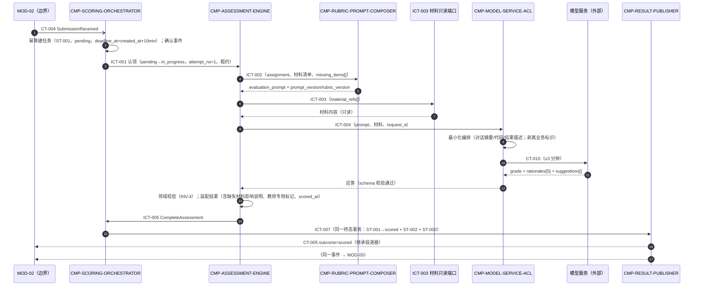
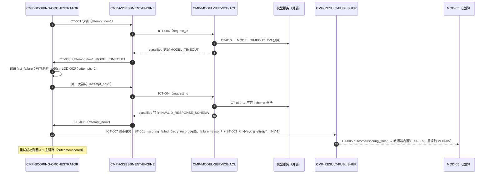
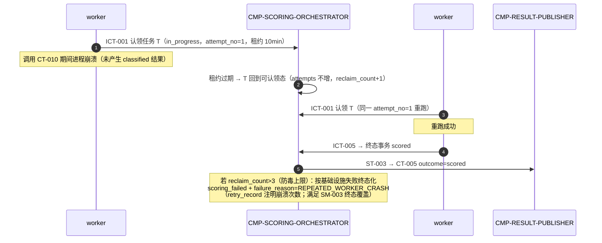

# 04 Contracts and Runtime — MOD-04 契约与运行流

## 1. 父契约清单（继承，语义不变）

| 父契约 ID | 类型 | 所有者（Provider） | 路径/主题/名称 | 字段（本层相关） | 副作用 | 依赖 | 失败语义 | 版本 |
|---|---|---|---|---|---|---|---|---|
| CT-004 SubmissionReceived | event | MOD-02 | Outbox 投递 | submission_id、course_id、assignment、student_name、group_name、material_refs[]、missing_items[]、received_at、v | 创建评分任务（ScoringTaskCreated） | CT-001 | 消费失败由投递器重试；任务持久化后才推进事件确认 | v=1，向后兼容追加 |
| CT-005 SubmissionScored/ScoringFailed | event | MOD-04（本节点） | Outbox 投递 → MOD-02、MOD-05 | submission_id、outcome；outcome=scored：original_grade、dimension_rationales[5]、teacher_suggestions[]、scored_at；outcome=scoring_failed：failure_reason、retry_record；v | 回写提交状态；创建复核记录；派生读模型；触发教师端内通知 | CT-004 | 业务失败以 outcome=scoring_failed + failure_reason 表达，不作传输错误 | v=1，向后兼容追加 |
| CT-010 模型评估推理 | external_api | 模型服务（外部） | HTTPS 模型推理 API（端点由 ACL 封装） | 入：evaluation_prompt、materials（最小化编排）、request_id（可选）；出：grade、dimension_rationales[5]、suggestions[] | 产生评估结果；材料内容出境（KD-001 最小化控制） | 材料包内容；供应商可用性 | MODEL_TIMEOUT / MODEL_ERROR / INVALID_RESPONSE_SCHEMA，均计入评分失败策略（自动重试一次） | 供应商版本由 ACL 封装 |

消费/产生约定（原样继承，逐字核对自 04-interface-contracts）：
- CT-004 幂等：按 `submission_id` 去重，重复事件不创建重复任务。
- CT-005 幂等：按 `submission_id` + 终态去重；重复事件不改变终态。
- CT-010 幂等：同一评分任务重复调用以任务内结果为准；`request_id` 仅用于单次调用关联与重试去重；**不向供应商发送 submission_id、学生姓名等业务标识**（KD-001 数据最小化）。
- 超时：CT-010 单次 ≤3 分钟；任务创建至 CT-005 outcome=scored ≤10 分钟（SM-002 口径）。

## 2. 父契约 → 子节点实现映射

| 父契约 | 实现子节点 | 实现方式 | 字段/语义核对 |
|---|---|---|---|
| CT-004（消费） | CMP-SCORING-ORCHESTRATOR | 事件确认前先完成 ST-001 事务写入（任务持久化后才推进确认）；submission_id 唯一键实现消费幂等 | 载荷全部字段落入 ST-001；student_name/group_name 仅任务上下文留存，**不经 CT-010 出境** |
| CT-010（消费，外部） | CMP-MODEL-SERVICE-ACL（调用方）；CMP-ASSESSMENT-ENGINE（驱动与结果领域校验） | ACL 完成最小化编排、request_id 生成、≤3 分钟超时、应答 schema 校验与错误分类；引擎校验等级枚举与五维度齐备 | 错误三分类与“计入评分失败策略”语义原样保留；不出网任何业务标识 |
| CT-005（发布） | CMP-RESULT-PUBLISHER（组包 + Outbox 写入）；载荷来源：CMP-ASSESSMENT-ENGINE（结果字段）、CMP-SCORING-ORCHESTRATOR（failure_reason、retry_record、终态） | scored / scoring_failed 两种载荷按 contract_fields 条件字段组包；与任务终态同一事务写入 ST-003；v=1 | 条件字段规则原样：scored→四件套，scoring_failed→failure_reason+retry_record；不作传输错误 |

## 3. 内部契约（按稳定契约 ID 排序；全部限定在 MOD-04 内，进程内调用或任务表协调，无消息总线）

### ICT-001 ClaimScoringTask（command）

- Provider：CMP-SCORING-ORCHESTRATOR；Consumer：执行运行器（CMP-ASSESSMENT-ENGINE 所在 worker 循环）
- Trigger：worker 空闲轮询任务表
- Schema：出参 = 任务载荷（task_id、submission_id、assignment、material_refs[]、missing_items[]、attempt_no、deadline_at）或 NO_TASK
- `side_effects`：条件更新 ST-001：pending 或租约过期 → in_progress + claim_lease（重认领时 reclaim_count+1）
- Error / Timeout / Retry：NO_TASK 为正常控制流；认领冲突（并发条件更新失败）→ 重新轮询
- Idempotency：条件更新保证同一任务同一时刻仅一个执行者；终态任务永不可认领
- Compatibility：内部契约，随本包版本演进

### ICT-002 ComposeEvaluationPrompt（command）

- Provider：CMP-RUBRIC-PROMPT-COMPOSER；Consumer：CMP-ASSESSMENT-ENGINE
- Schema：入参 = assignment、材料清单（类别标注）、missing_items[]；出参 = evaluation_prompt（五维度准则、A–E 默认区间、输出格式要求、缺失材料声明）、prompt_version、rubric_version
- `side_effects`：None（纯组装；一次评估固定使用单一 ST-004 版本）
- Error / Timeout / Retry：PROMPT_ASSEMBLY_FAILED（准则/模板缺失）→ 作为 classified 失败进入 ICT-006
- Idempotency：同一版本同一输入产出同一提示
- Compatibility：模板向后兼容演进；版本号随结果存证（LCD-003）

### ICT-003 LoadMaterialContents（query / 边界只读端口）

- Provider：材料只读端口（LCD-001；对 MOD-02 所有的同组共享材料磁盘/清单只读引用）；Consumer：CMP-ASSESSMENT-ENGINE
- Schema：入参 = material_refs[]；出参 = 材料内容 + 逐项可读性
- `side_effects`：None; read-only（不修改、不复制可写状态；所有权留在 MOD-02）
- Error / Timeout / Retry：MATERIAL_UNREADABLE（IO 错误）→ 作为 classified 失败进入 ICT-006（按 A-001 走 REQ-D002 路径）；missing_items[] 声明的缺失不属于本端口错误
- Idempotency：只读，天然幂等
- Compatibility：材料清单结构以 CT-004 载荷为准；存储布局变更影响本端口实现（属 MOD-02 边界协商项，不在本层）

### ICT-004 InvokeModelAssessment（command）

- Provider：CMP-MODEL-SERVICE-ACL；Consumer：CMP-ASSESSMENT-ENGINE
- Schema：入参 = evaluation_prompt、材料内容、request_id（每次尝试新值）；出参 = grade（A–E）、dimension_rationales[5]、suggestions[]，或 classified 错误（MODEL_TIMEOUT / MODEL_ERROR / INVALID_RESPONSE_SCHEMA）
- `side_effects`：材料最小化编排（对话摘要、代码、结果描述）后调用 CT-010；无本地持久化
- Error / Timeout / Retry：超时 ≤3 分钟（继承 CT-010，固定）；重试决策不在本契约（由编排器按 REQ-D002 执行）
- Idempotency：request_id 单次调用关联；同一任务多次尝试不产生重复评估记录（任务内结果为准）
- Compatibility：供应商 API 版本封装于本契约内，升级不影响其他子节点（KD-001）

### ICT-005 CompleteAssessment（command）

- Provider：CMP-SCORING-ORCHESTRATOR；Consumer：CMP-ASSESSMENT-ENGINE（回报）
- Schema：入参 = original_grade、dimension_rationales[5]{dimension, rationale}、teacher_suggestions[]（教师专用标记）、scored_at、missing_materials_impact、prompt_version、rubric_version、model_meta{request_id, duration_ms, attempt_no}
- `side_effects`：终态事务（ST-001 → scored + ST-002 写入 + 经 ICT-007 插入 ST-003）
- Error / Timeout / Retry：领域校验未过（等级非 A–E、维度不足五个、建议缺教师专用标记）→ 转 ICT-006（INVALID_RESPONSE_SCHEMA）
- Idempotency：终态事务仅执行一次；重复回报按状态检查拒绝
- Compatibility：字段集为 CT-005 scored 载荷的超集（多出内部存证字段，不出网）

### ICT-006 FailAssessment（command）

- Provider：CMP-SCORING-ORCHESTRATOR；Consumer：CMP-ASSESSMENT-ENGINE（回报）
- Schema：入参 = error_kind（MODEL_TIMEOUT / MODEL_ERROR / INVALID_RESPONSE_SCHEMA / MATERIAL_UNREADABLE / PROMPT_ASSEMBLY_FAILED）、attempt_no、at
- `side_effects`：attempt_no=1 → 记录 first_failure，有界退避后发起第二次尝试（attempts=2）；attempt_no=2 → 终态事务（ST-001 → scoring_failed，retry_record 完整 + 经 ICT-007 插入 ST-003）
- Error / Timeout / Retry：重试策略见下「重试决策表」；退避时长为有界配置（默认 ≤60 秒，LCD-002）
- Idempotency：同一 attempt_no 重复回报去重
- Compatibility：error_kind 三分类（模型类）与 CT-010 错误码一一对应；材料/提示类为本层扩展内部分类，不外发

### ICT-007 PublishScoringOutcome（command）

- Provider：CMP-RESULT-PUBLISHER；Consumer：CMP-SCORING-ORCHESTRATOR
- Schema：入参 = outcome、结果引用或失败详情、事务上下文；写入 = ST-003（CT-005 载荷，v=1）
- `side_effects`：在调用方终态事务内插入 Outbox 行
- Error / Timeout / Retry：事务失败整体回滚（状态、结果、事件三者同生共死，INV-3）
- Idempotency：submission_id + outcome 唯一；同一任务第二次调用拒绝（终态不可逆）
- Compatibility：CT-005 标识、字段、版本语义原样（父契约实现映射第 2 节）

### ICT-008 QueryScoringMetrics（query）

- Provider：CMP-SCORING-ORCHESTRATOR（状态只读视图）；Consumer：CMP-SCORING-METRICS
- Schema：出参 = 任务计数与时长分布（created_at → scored 时长、终态分布、积压量、失败率、重试率）
- `side_effects`：None; read-only
- Error / Timeout / Retry：查询超时 → 指标方自行重试，不影响主路径
- Idempotency：只读，天然幂等
- Compatibility：统计口径与父层 01 SM-002/SM-003 度量口径同源

```yaml
internal_contracts:
  - { id: ICT-001, name: ClaimScoringTask, kind: command, provider: CMP-SCORING-ORCHESTRATOR, consumer: "执行运行器（worker 循环）", side_effects: "ST-001 条件认领更新", idempotency: "条件更新单执行者" }
  - { id: ICT-002, name: ComposeEvaluationPrompt, kind: command, provider: CMP-RUBRIC-PROMPT-COMPOSER, consumer: CMP-ASSESSMENT-ENGINE, side_effects: "None", idempotency: "同版本同输入同输出" }
  - { id: ICT-003, name: LoadMaterialContents, kind: query_port, provider: "材料只读端口（MOD-02 所有权）", consumer: CMP-ASSESSMENT-ENGINE, side_effects: "None; read-only", idempotency: "只读" }
  - { id: ICT-004, name: InvokeModelAssessment, kind: command, provider: CMP-MODEL-SERVICE-ACL, consumer: CMP-ASSESSMENT-ENGINE, side_effects: "CT-010 调用（材料最小化后出境）", idempotency: "request_id 单次关联" }
  - { id: ICT-005, name: CompleteAssessment, kind: command, provider: CMP-SCORING-ORCHESTRATOR, consumer: CMP-ASSESSMENT-ENGINE, side_effects: "scored 终态事务", idempotency: "终态仅一次" }
  - { id: ICT-006, name: FailAssessment, kind: command, provider: CMP-SCORING-ORCHESTRATOR, consumer: CMP-ASSESSMENT-ENGINE, side_effects: "重试推进或 scoring_failed 终态事务", idempotency: "按 attempt_no 去重" }
  - { id: ICT-007, name: PublishScoringOutcome, kind: command, provider: CMP-RESULT-PUBLISHER, consumer: CMP-SCORING-ORCHESTRATOR, side_effects: "终态事务内插入 ST-003", idempotency: "submission_id+outcome 唯一" }
  - { id: ICT-008, name: QueryScoringMetrics, kind: query, provider: CMP-SCORING-ORCHESTRATOR, consumer: CMP-SCORING-METRICS, side_effects: "None; read-only", idempotency: "只读" }
```

## 3.1 Machine-readable contract cards

The cards below are the machine-readable form of ICT-001~008. They do not add a public API or change the inherited CT-004/CT-005/CT-010 semantics.

### `ICT-001` ClaimScoringTask

| Field | Contract |
|---|---|
| contract_id | ICT-001 |
| contract_type | command |
| Provider | CMP-SCORING-ORCHESTRATOR |
| Consumer | CMP-ASSESSMENT-ENGINE |
| Trigger | worker claims a pending or expired-lease task |
| Schema | Output: task_id, submission_id, assignment, material_refs[], missing_items[], attempt_no, deadline_at; no task: NO_TASK |
| Side_effects | ST-001 pending/expired lease -> in_progress + claim_lease |
| Errors | NO_TASK, CLAIM_CONFLICT |
| Idempotency | conditional update; one executor per task |

### `ICT-002` ComposeEvaluationPrompt

| Field | Contract |
|---|---|
| contract_id | ICT-002 |
| contract_type | command |
| Provider | CMP-RUBRIC-PROMPT-COMPOSER |
| Consumer | CMP-ASSESSMENT-ENGINE |
| Schema | Input: assignment, material_refs[], missing_items[]; output: evaluation_prompt, prompt_version, rubric_version |
| Errors | PROMPT_ASSEMBLY_FAILED |
| Side_effects | None |
| Idempotency | same version and input produce the same output |

### `ICT-003` LoadMaterialContents

| Field | Contract |
|---|---|
| contract_id | ICT-003 |
| contract_type | query_port |
| Provider | MOD-02-MATERIAL-READ-PORT |
| Consumer | CMP-ASSESSMENT-ENGINE |
| Schema | Input: material_refs[]; output: materials[], readability[] |
| Required | material_refs[] |
| Errors | MATERIAL_UNREADABLE |
| Timeout | bounded by the task 10-minute budget; does not set the scoring terminal state |
| Side_effects | read_only; no mutation or ownership transfer; ownership remains MOD-02 |
| Idempotency | read-only, naturally idempotent |

### `ICT-004` InvokeModelAssessment

| Field | Contract |
|---|---|
| contract_id | ICT-004 |
| contract_type | command |
| Provider | CMP-MODEL-SERVICE-ACL |
| Consumer | CMP-ASSESSMENT-ENGINE |
| Schema | Input: evaluation_prompt, materials, request_id; output: grade, dimension_rationales[5], suggestions[] |
| Errors | MODEL_TIMEOUT, MODEL_ERROR, INVALID_RESPONSE_SCHEMA |
| Side_effects | calls CT-010 after minimization; no local material persistence |
| Idempotency | request_id identifies one attempt; retries use a new request_id |

### `ICT-005` CompleteAssessment

| Field | Contract |
|---|---|
| contract_id | ICT-005 |
| contract_type | command |
| Provider | CMP-SCORING-ORCHESTRATOR |
| Consumer | CMP-ASSESSMENT-ENGINE |
| Schema | original_grade, dimension_rationales[5], teacher_suggestions[], scored_at, missing_materials_impact, prompt_version, rubric_version, model_meta |
| Errors | INVALID_RESPONSE_SCHEMA |
| Side_effects | terminal transaction writes ST-001 and ST-002, then ICT-007 writes ST-003 |
| Idempotency | terminal transition executes once |

### `ICT-006` FailAssessment

| Field | Contract |
|---|---|
| contract_id | ICT-006 |
| contract_type | command |
| Provider | CMP-SCORING-ORCHESTRATOR |
| Consumer | CMP-ASSESSMENT-ENGINE |
| Schema | error_kind, attempt_no, at |
| Errors | MODEL_TIMEOUT, MODEL_ERROR, INVALID_RESPONSE_SCHEMA, MATERIAL_UNREADABLE, PROMPT_ASSEMBLY_FAILED |
| Side_effects | attempt 1 schedules the only retry; attempt 2 enters scoring_failed and produces CT-005 via ICT-007 |
| Idempotency | deduplicated by attempt_no |

### `ICT-007` PublishScoringOutcome

| Field | Contract |
|---|---|
| contract_id | ICT-007 |
| contract_type | command |
| Provider | CMP-RESULT-PUBLISHER |
| Consumer | CMP-SCORING-ORCHESTRATOR |
| Schema | outcome, result_ref or failure_details, transaction_context; writes ST-003 |
| Errors | TRANSACTION_FAILED |
| Side_effects | inserts the CT-005 Outbox row inside the terminal transaction |
| Idempotency | unique by submission_id + outcome |

### `ICT-008` QueryScoringMetrics

| Field | Contract |
|---|---|
| contract_id | ICT-008 |
| contract_type | query |
| Provider | CMP-SCORING-ORCHESTRATOR |
| Consumer | CMP-SCORING-METRICS |
| Schema | output: task_count, created_at-to-finished_at latency distribution, terminal outcome distribution, backlog, failure_rate, retry_rate |
| Source | ST-001 and ST-002; SM-002 uses CT-005 outcome=scored as the completion marker |
| Side_effects | None; read-only |
| Errors | METRICS_QUERY_FAILED |
| Idempotency | read-only, naturally idempotent |

## 4. 运行流

### 4.1 成功路径：一次提交的五维度评分



### 4.2 失败/恢复路径：首次失败 → 一次重试 → 仍失败（DF-2 内部化）



### 4.3 生命周期路径：worker 崩溃恢复与防毒保护



## 5. 错误、重试、超时、幂等、可观测与兼容汇总

**重试决策表（REQ-D002 唯一权威实现点：CMP-SCORING-ORCHESTRATOR）：**

| 情形 | attempts 变化 | 动作 | 终态 |
|---|---|---|---|
| 首次 classified 失败（模型三分类 / 材料不可读 / 提示组装失败） | 1→2 | 记录 first_failure；有界退避 ≤60s；第二次尝试（新 request_id） | — |
| 第二次 classified 失败 | 2（不变） | 写 retry_record{first_failure, second_failure}；终态事务 | scoring_failed |
| 任一次成功 | — | 终态事务 | scored |
| worker 崩溃（无 classified 结果） | 不增 | 租约过期重认领，同一 attempt 重跑，reclaim_count+1 | — |
| reclaim_count>3 | — | 按基础设施失败终态化，failure_reason=REPEATED_WORKER_CRASH | scoring_failed |

- **超时**：CT-010 单次 ≤3 分钟（继承固定）；任务 deadline_at=created_at+10min 仅作跟踪与 SM-002 统计口径，到期不强杀、不伪标记失败（LCD-004）；退避 + 双次尝试最坏约 7 分钟，预算内。
- **幂等**：CT-004 消费（submission_id 唯一键）；CT-010 调用（request_id）；CT-005 发布（submission_id+outcome 唯一、终态事务仅一次）；内部回报（attempt_no 去重）；只读端口天然幂等。
- **可观测**：CMP-SCORING-METRICS 经 ICT-008 派生 SM-002/SM-003、积压、失败率、重试率（对接 KD-003 基础监控）；日志仅含标识符、时长、error_kind、request_id——**禁止记录材料内容与学生标识**（KD-001 最小化延伸至日志）。
- **兼容**：父契约（CT-004/005/010）标识、所有者、字段、副作用、失败与版本语义本层原样实现，未改名、未弱化、未新增必需字段、未升级版本；内部契约（ICT-001~008）限定于 MOD-04 内，随本包演进，不影响任何跨节点消费者。
