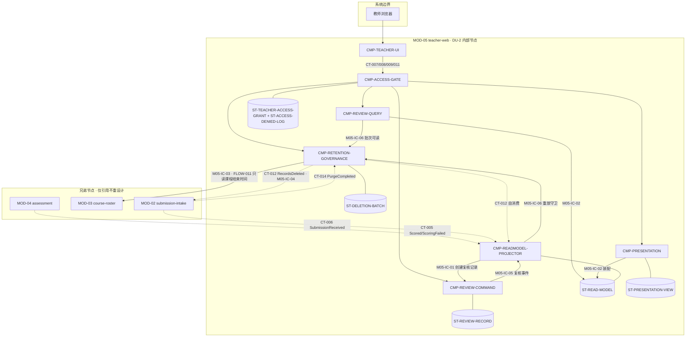

# 02 Architecture Decomposition — 架构分解（L1 / MOD-05 teacher-web）

> 范围纪律：仅细化 MOD-05 内部；不重跑顶层战略 DDD、不重划父 BC/模块、不设计兄弟节点内部。
> C1 映射：MOD-05 → 4 个直接子节点（§3，按 `child_id` 稳定排序）；3 个内部支撑组件见 §3A。C2 状态归属详见 `03-state-and-data.md`。

## 1. 局部概念细化（继承父层 aggregates.md，在 MOD-05 内部展开）

### 1.1 局部聚合与组成

| 聚合 | 组成（Entity / Value Object） | 父层不变量（原样保留） | 本层细化 |
|---|---|---|---|
| ReviewRecord | Entity: Annotation；VO: FinalGrade、GradeAdjustmentRecord（原始等级复制值+来源 ID、最终等级、操作者、时间） | 调整后必须同时保留原始等级（引用）、最终等级、操作者、时间；评分失败的提交不得产生最终等级 | 原始等级在复核记录创建时以「复制值 + 来源 submission_id」方式固化（父 03：只读引用），此后对 CT-005 重复事件与读模型重建均不可变；`final_grade` 未调整时等于原始等级（统一语言） |
| PresentationView | Entity: GroupSection（每选定小组一个区块）；VO: ProcessSummary（引用 CT-005 流入的评估产出，A-003） | 仅当每个选定小组至少有一个可用提交时才允许生成；缺失材料在视图中显式标记；生成时快照不随源数据实时更新 | 区块内容 = 项目结果引用 + 过程摘要 + 评分（原始/最终）+ 批注 + 缺失标记；重新生成以获取最新内容（F4-1） |
| DeletionBatch | Entity: DeletionAuditRecord（范围/操作者/时间）；VO: RetentionPeriod（课程结束 + 1 年） | 未经教师确认不得执行删除；删除后教师端不可读；审计记录不在删除范围内，含范围/操作者/时间 | 批次生命周期：marking(到期标记) → pending_confirmation → confirmed → executing → completed / partial_failed（failed_items[] 留批供重跑）；审计记录先于任何清除写入（DF-3 步骤 4） |

### 1.2 命令（教师/系统意图 → 聚合）

| 命令 | 处理聚合 / 子节点 | 来源流 |
|---|---|---|
| 保存批注 | ReviewRecord / CMP-REVIEW-COMMAND | F3-2（CT-008） |
| 调整最终等级 | ReviewRecord / CMP-REVIEW-COMMAND | F3-3（CT-008） |
| 生成展示视图 | PresentationView / CMP-PRESENTATION | F4-1（CT-009） |
| 标记保留期到期 | DeletionBatch / CMP-RETENTION-GOVERNANCE | F5-1（定时批处理） |
| 确认删除 | DeletionBatch / CMP-RETENTION-GOVERNANCE | F5-2（CT-011） |
| 创建复核记录（系统） | ReviewRecord / CMP-REVIEW-COMMAND（经 M05-IC-01 由投影触发） | DF-1 步骤 11（CT-005） |
| 回写批次执行结果（系统） | DeletionBatch / CMP-RETENTION-GOVERNANCE | DF-3 步骤 5（CT-014） |

### 1.3 模块内事件（父层已定性「不跨模块投递」，仅 MOD-05 内部流动）

AnnotationSaved、GradeAdjusted（CT-008 注记）、PresentationViewGenerated（CT-009 注记）、RetentionExpired、DeletionConfirmed（F5-1/F5-2 模块内推进）、AccessDeniedLogged（F3-1，安全审计留痕）。
跨模块事件仅 CT-012（RecordsDeleted，经 Outbox 发布）——**唯一由 MOD-05 发出的父层事件**，不得新增其他跨模块事件。

### 1.4 局部策略（Policy）

- **P-禁伪造等级**：scoring_failed 且无原始等级的提交拒绝设置最终等级（NO_ORIGINAL_GRADE）；教师端只展示失败原因与重试结果（DF-2 步骤 6）。
- **P-课程范围授权**：每个教师请求先过课程范围授权；拒绝 → 403 + AccessDeniedLogged（FR-009 不变量）。
- **P-生成资格**：任一选定小组无可用提交 → 拒绝生成并说明原因（NO_AVAILABLE_SUBMISSION）；缺材料不隐藏，显式 missing_marks。
- **P-保留到期**：retention_due_at = 课程结束时间（FLOW-011 只读引用）+ 1 年；到期仅标记不删除（F5-1）。
- **P-审计先行**：DeletionConfirmed 后先写 DeletionAuditRecord，再发布 CT-012（DF-3 步骤 4）。
- **P-重放守卫**：读模型重建/投影时过滤已在完成批次中清除的 submission_id，防止删除后复活（本层新增内部策略，见 05 LCD-005）。

### 1.5 生命周期（本层细化）

- **ReviewRecord**：created_on_scored（CT-005 触发，可复核） → annotated（批注） / adjusted（最终等级≠原始等级，可多次调整，后写为准+全量留痕） → purged（批次清除后内容擦除，见 LCD-005）。
- **PresentationView**：snapshot_created（一次性写入） → superseded（同参数再生成返回最新快照，CT-009 幂等） → purged（随批次清除）。
- **DeletionBatch**：见 §1.1 状态机；partial_failed 批次可整体重跑，重跑结果再次经 CT-014 回流（父 04 CT-014）。
- **教师读模型条目**：projected（CT-006/CT-005 投影） → updated（本地复核事件投影） → purged（CT-012 自消费清除）；全量可经事件重放重建（受 P-重放守卫约束）。

## 2. 分解理由（职责 / 状态 / 不变量 / 生命周期 / 变更原因 / 交互）

1. **写侧与读侧分离**（CMP-REVIEW-COMMAND vs CMP-REVIEW-QUERY / CMP-READMODEL-PROJECTOR）：写侧承载 ReviewRecord 不变量（留痕、禁伪造），读侧承载 NFR-001 查询负载与秒级最终一致；变更原因不同（复核规则 vs 查询视图/事件 schema）。
2. **按聚合划分状态所有者**：PresentationView（CMP-PRESENTATION）、DeletionBatch（CMP-RETENTION-GOVERNANCE）各自独占聚合与本地事务边界（父 03），不共享写路径。
3. **保留治理独立子节点**：DF-3 有独立触发器（时间批处理）与审计不变量，与交互式复核的负载/可用性特征完全不同；同 DU-2 内作为模块内批处理组件，不新增部署单元（KD-002）。
4. **事件接入集中为一个投影子节点**：CT-005/CT-006/CT-012(自消费) 的消费幂等、去重、重放重建是同一套机制；读模型是唯一被投影的状态，所有权单点化（C2）。
5. **授权与审计横切但显式化**：课程范围授权 + AccessDeniedLogged 是全部四个父 API 的公共前置（FR-009 不变量、06 合规节），独立为 CMP-ACCESS-GATE 使其不被分散实现；它有直接父层追踪，非基础设施豁免项。
6. **前端单独成子节点**：implementation_surfaces 含 frontend；渲染技术为父层 delegated 项，隔离到 CMP-TEACHER-UI 便于下一层独立决策（LCD-007）。

## 3. 直接子节点清单（C1；按 `child_id` 稳定排序）

| child_id | 责任 | 分配需求 | 直接验收追踪 | 拥有状态 | 依赖 | 存在理由 |
|---|---|---|---|---|---|---|
| CMP-PRESENTATION | 展示视图生成、缺失标记装配、快照写入与幂等再生成 | REQ-D002 | D-AC-REQ-010-01；CT-009 | PresentationView | CMP-READMODEL-PROJECTOR、CMP-ACCESS-GATE | 直接承接教师选择小组并生成展示视图的产品义务 |
| CMP-REVIEW-COMMAND | 批注、最终等级调整、ReviewRecord 留痕与禁伪造校验 | REQ-D001 | D-AC-REQ-009-01；CT-008 | ReviewRecord | CMP-ACCESS-GATE、CMP-READMODEL-PROJECTOR | 直接承接教师批注和调整最终等级的产品义务 |
| CMP-REVIEW-QUERY | 教师课程/小组/学生/提交详情查询与失败结果装配 | REQ-D001 | D-AC-REQ-009-01；CT-007；AC-NFR-001-01 | 无（只读） | CMP-READMODEL-PROJECTOR、CMP-RETENTION-GOVERNANCE、CMP-ACCESS-GATE | 直接承接教师查看提交详情与评分依据的产品义务 |
| CMP-TEACHER-UI | 教师网页中的查询、批注、展示视图和删除确认可观察面 | REQ-D001、REQ-D002 | D-AC-REQ-009-01；D-AC-REQ-010-01 | 浏览器瞬时状态 | CMP-ACCESS-GATE | 直接承接 L1 PRD 的 frontend surface 与教师可观察结果 |

> 直接清单约束：每行至少拥有一条当前 L1 PRD 的 `REQ-Dxxx`/`NFR-Dxxx`。CT/FLOW/状态/SM/FR/父层 REQ/NFR 仅作为补充追踪。

## 3A. 内部实现组件登记（非直接 child_id；不可作为 `[NEXT ...]` target）

以下组件保留运行时职责，但不作为 L2 直接派发目标。`CMP-RETENTION-GOVERNANCE` 当前仅有 inherited `NFR-004`；如需 L2 细化，必须先补充经确认的 current `NFR-Dxxx` 到 L1 PRD。

| component_id | 责任 | 排除项 | 拥有状态 | 需求 / 父层追踪 | trace_exemption_reason | 依赖 | 存在理由 |
|---|---|---|---|---|---|---|---|
| CMP-ACCESS-GATE | 教师 API 边界：教师会话认证（KD-005）、课程范围授权（P-课程范围授权）、访问拒绝留痕（AccessDeniedLogged）、写请求幂等键受理与校验、`/api/v1` 路由到内部处理器 | 不持有任何业务聚合；不实现查询/写业务逻辑；不签发教师账号（A-001 管理员发放） | TeacherAccessGrant（教师-课程授权数据，本地持有，LCD-006）；AccessDeniedLog（审计留痕）；写幂等键登记 | REQ-D001（exceptions：无权限访问→拒绝并记录）；FR-009 不变量；F3-1；CT-007/008/009/011 错误码 AUTH_INVALID/FORBIDDEN；06-deployment 合规节 | - | CMP-REVIEW-QUERY、CMP-REVIEW-COMMAND、CMP-PRESENTATION、CMP-RETENTION-GOVERNANCE（鉴权后路由） | 四个父 API 共享的授权与留痕前置；单点实现避免语义漂移 |
| CMP-PRESENTATION | 展示视图生成（P-生成资格校验、缺失标记装配、快照写入、幂等再生成返回最新快照）；PresentationView 聚合全部写读 | 不生成过程摘要（A-003 引用评估产出）；不读 MOD-02/04 源数据（仅经读模型装配）；不做导出渲染（LCD-008 下放） | PresentationView 聚合（GroupSection、ProcessSummary 引用、快照） | REQ-D002；parent REQ-010 / FR-010；F4-1；AC-REQ-010-01 / D-AC-REQ-010-01；CT-009 | - | CMP-READMODEL-PROJECTOR（M05-IC-02 读装配）；CMP-ACCESS-GATE（入口） | 独占 PresentationView 聚合与「一次性快照」不变量；生成资格策略唯一实现点 |
| CMP-READMODEL-PROJECTOR | 事件接入与读模型投影：消费 CT-005/CT-006/CT-012(自消费)；消费幂等去重；派生教师读模型（课程/小组/学生/提交详情/缺失标记/失败原因与重试结果/端内通知条目）；触发复核记录创建（M05-IC-01）；投影本地复核事件（M05-IC-05）；重放重建与 P-重放守卫 | 不实现 CT-007 查询装配（读侧归 CMP-REVIEW-QUERY）；不改写 ReviewRecord/PresentationView/DeletionBatch 聚合本体；不新增跨模块事件 | 教师读模型（派生，唯一写方）；事件消费位点与去重记录 | CT-005（副作用：创建复核记录、派生读模型、端内通知）；CT-006（派生读模型）；CT-012 自消费（模块内清除读模型）；DF-1 步骤 11、DF-2 步骤 4–6；A-005；父 03 读模型说明（重放可重建） | - | CMP-REVIEW-COMMAND（M05-IC-01）；CMP-RETENTION-GOVERNANCE（M05-IC-06 重放守卫数据）；Outbox 投递器（父基础设施） | 读模型唯一写方（C2）；事件消费幂等/重放机制单点化；端内通知作为派生数据自然落地（LCD-001） |
| CMP-RETENTION-GOVERNANCE | 保留治理：到期标记批处理（P-保留到期，FLOW-011 只读引用课程结束时间）；DeletionBatch 聚合；CT-011 确认受理（排除标记、BATCH_NOT_EXPIRED、确认幂等）；P-审计先行；CT-012 发布（M05-IC-04）；CT-014 消费回写批次状态；重跑 partial_failed 批次；批次读端口（M05-IC-06） | 不执行实际材料/记录清除（MOD-02 数据所有权）；不读取 MOD-03 除课程结束时间外的任何数据；审计记录不删除、不修改 | DeletionBatch 聚合（批次、确认记录、DeletionAuditRecord、教师排除标记、执行状态与 failed_items[]） | NFR-004（inherited）/ FR-016；F5-1~F5-3；DF-3；SCENARIO-016；CT-011/CT-012/CT-014；AC-NFR-004-01（module_local，owning MOD-05）；FLOW-011 | - | MOD-03（FLOW-011 internal_read，经 M05-IC-03）；Outbox（M05-IC-04 发布 CT-012）；CMP-ACCESS-GATE（CT-011 入口） | DF-3 独立触发器与审计不变量的唯一载体；批次状态机与清除回流的闭环端点 |
| CMP-REVIEW-COMMAND | 复核写侧：保存批注、调整最终等级（P-禁伪造等级：NO_ORIGINAL_GRADE 校验）；ReviewRecord 聚合全部写入；调整记录留痕；并发后写为准；写幂等（request_id）；创建复核记录（M05-IC-01，CT-005 触发）；发布模块内复核事件（M05-IC-05） | 不实现查询装配（CT-007 归 CMP-REVIEW-QUERY）；不修改原始等级（只读引用固化）；不跨模块发事件 | ReviewRecord 聚合（Annotation、FinalGrade、GradeAdjustmentRecord、原始等级复制值+来源 ID） | REQ-D001（写半侧）；parent REQ-009 / FR-009；F3-2、F3-3；AC-REQ-009-01 observable_oracles；CT-008 | - | CMP-ACCESS-GATE（入口）；CMP-READMODEL-PROJECTOR（M05-IC-01 调用方、M05-IC-05 消费方） | 独占 ReviewRecord 聚合与留痕/禁伪造不变量；写路径唯一（LCD-003） |
| CMP-REVIEW-QUERY | 教师查询读侧：实现 CT-007 全部出参装配（课程/小组/学生/提交详情/材料引用/处理状态/原始等级/五维依据/建议/批注/最终等级/失败原因与重试结果/删除批次列表）；只读，≤10 秒查询时限 | 不写任何状态；不直接消费事件；不装配展示视图快照（归 CMP-PRESENTATION） | 无（无状态读侧；读取教师读模型与 M05-IC-06） | REQ-D001（读半侧）；parent REQ-009 / FR-009；F3-1；AC-REQ-009-01 response；CT-007；NFR-001（AC-NFR-001-01 查询侧） | - | CMP-READMODEL-PROJECTOR（M05-IC-02）；CMP-RETENTION-GOVERNANCE（M05-IC-06 批次可读）；CMP-ACCESS-GATE（入口） | CT-007 装配单点化；读模型消费方与写方分离，查询演进不影响投影 |
| CMP-TEACHER-UI | 教师网页前端：课程/小组/学生/提交详情页、批注与最终等级编辑、展示视图页、删除批次确认台、端内通知列表/失败可见；调用 CT-007/008/009/011（经 CMP-ACCESS-GATE）；写操作生成幂等键（KD-005） | 不直连任何内部存储；不绕过 CMP-ACCESS-GATE；不实现服务端业务规则 | 无（浏览器侧瞬时状态除外） | REQ-D001、REQ-D002（implementation_surfaces: frontend）；AC-REQ-009-01 / AC-REQ-010-01（教师可观察面）；A-005（端内通知展示面） | - | CMP-ACCESS-GATE（唯一服务端入口） | frontend surface 的载体；父层 delegated 渲染技术决策的隔离点（LCD-007） |

**追踪列检查**：4 个直接子节点全部具有当前 L1 需求；内部支撑组件不作为直接 child_id，也不进入 `[NEXT ...]` 清单。

## 4. 子节点依赖图（含父/兄弟边界）

图注：实线为同步内部调用，虚线为 Outbox 异步事件；`( )` 为状态存储（同 DU-2 共享数据库，KD-002）。
**兄弟节点确认**：MOD-02/03/04 仅作为契约对端与 internal_read 来源引用，本包未读取、未重设计其内部结构；MOD-01 与 MOD-05 无任何交互（01-design-context Q-01）。

## 5. 边界再确认

- 4 个直接子节点与 3 个内部支撑组件均位于 MOD-05 内部，均为 DU-2 进程内组件：不创建服务、容器、部署单元或公共运行时边界。
- 父契约实现分配（C4 详表见 04）：CT-007→CMP-ACCESS-GATE+CMP-REVIEW-QUERY；CT-008→CMP-ACCESS-GATE+CMP-REVIEW-COMMAND；CT-009→CMP-ACCESS-GATE+CMP-PRESENTATION；CT-011→CMP-ACCESS-GATE+CMP-RETENTION-GOVERNANCE；CT-005/006/012(自)→CMP-READMODEL-PROJECTOR；CT-012(发布)/CT-014→CMP-RETENTION-GOVERNANCE；FLOW-011→CMP-RETENTION-GOVERNANCE。
- 兄弟/父数据所有权未转移：读模型为派生数据；ReviewRecord/PresentationView/DeletionBatch 为 MOD-05 自有聚合；TeacherAccessGrant 为本层新增内部授权数据（LCD-006，不属于任何父聚合）。
