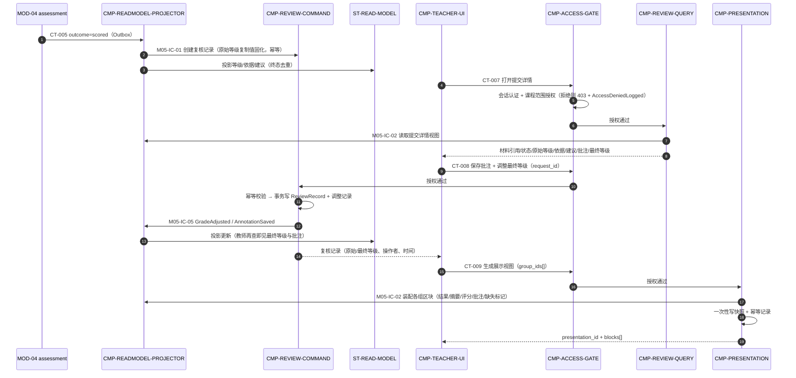
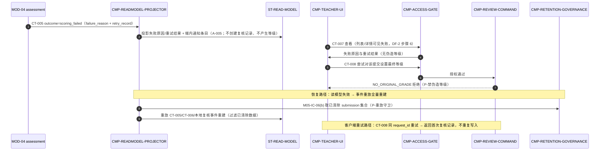
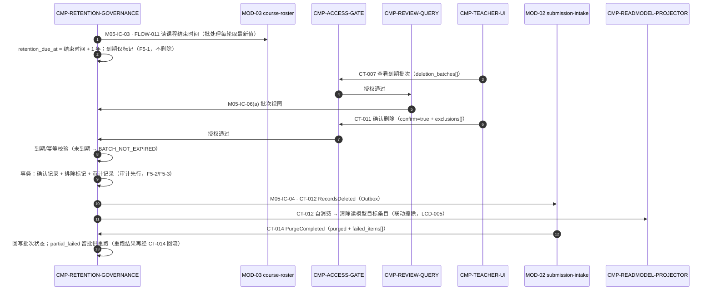

# 04 Contracts and Runtime — 契约与运行时（L1 / MOD-05 teacher-web）

> C3/C4/C5 映射落点：父运行流 → 内部协作；父契约 → 子节点实现映射；父外部/兄弟依赖 → 内部端口。
> **父外部契约语义不变确认**：本层未新增、改名、弱化、移动、升级或删除任何父契约的标识、路径/主题、必需/产出字段、副作用、依赖、错误/重试语义与版本；无 parent-change-request。

## 1. 父契约清单与实现映射（C4）

### 1.1 提供的 API（Provider；教师浏览器 → MOD-05，FLOW-009 边界入口）

| 父契约 | 路径 / 语义（不可变要点） | 实现子节点 | 内部协作 |
|---|---|---|---|
| CT-007 教师课程数据查询 | `GET /api/v1/teacher/courses/...`；read-only；出参含 `deletion_batches[]`；FORBIDDEN 记录 AccessDeniedLogged；查询 ≤10 秒 | CMP-ACCESS-GATE（认证/授权/留痕）+ CMP-REVIEW-QUERY（装配） | GATE 鉴权通过 → RQ 经 M05-IC-02 读模型 + M05-IC-06 批次视图装配出参 |
| CT-008 批注与最终等级调整 | `PUT /api/v1/teacher/submissions/{id}/review`；`request_id` 幂等；annotation/final_grade 至少其一；NO_ORIGINAL_GRADE；并发后写为准+留痕；应答复核记录 | CMP-ACCESS-GATE + CMP-REVIEW-COMMAND | GATE 鉴权 → RC 幂等校验 → NO_ORIGINAL_GRADE 校验 → 事务写 ReviewRecord+调整记录+幂等记录 → M05-IC-05 发模块内事件 → 返回复核记录 |
| CT-009 展示视图生成 | `POST /api/v1/teacher/presentations`；请求 `group_ids[]`；应答 `presentation_id`+`blocks[]`（含 missing_marks）；NO_AVAILABLE_SUBMISSION；幂等键=教师+小组集合+时间窗 | CMP-ACCESS-GATE + CMP-PRESENTATION | GATE 鉴权 → PV 资格校验（M05-IC-02 查各组可用提交）→ 装配区块 → 一次性写快照+幂等记录 → 返回区块 |
| CT-011 删除确认 | `POST /api/v1/teacher/deletion-batches/{id}/confirm`；仅 confirm=true 触发；`exclusions[]`；BATCH_NOT_EXPIRED；同步确认+异步执行；publishes CT-012 | CMP-ACCESS-GATE + CMP-RETENTION-GOVERNANCE | GATE 鉴权 → RG 到期/幂等校验 → 事务写确认+排除标记+**审计先行** → M05-IC-04 经 Outbox 发布 CT-012 → 返回批次状态与待删范围 |

### 1.2 消费的事件（Consumer；Outbox 投递，消费方必须幂等）

| 父契约 | Provider | 语义（不可变要点） | 消费子节点 | 消费动作 |
|---|---|---|---|---|
| CT-005 SubmissionScored / ScoringFailed | MOD-04 | 按 submission_id+终态去重；重复事件不改终态 | CMP-READMODEL-PROJECTOR | scored：M05-IC-01 创建复核记录 + 投影等级/依据/建议；scoring_failed：投影失败原因+重试结果+端内通知条目（A-005） |
| CT-006 SubmissionReceived（读模型派生） | MOD-02 | 按 submission_id 去重；可全量重建 | CMP-READMODEL-PROJECTOR | 投影提交列表/处理状态/缺失标记 |
| CT-014 PurgeCompleted | MOD-02 | 按 batch_id+purged_at 去重；failed_items[] 留批重跑 | CMP-RETENTION-GOVERNANCE | 回写批次执行状态；partial_failed 批次可整体重跑 |

### 1.3 发布的事件与内部读取

| 父契约 | 语义（不可变要点） | 子节点 | 说明 |
|---|---|---|---|
| CT-012 RecordsDeleted（发布） | 批次执行完成后经 Outbox 发布；字段 batch_id/submission_ids[]/scope/operator/executed_at/audit_record_id/v=1 | CMP-RETENTION-GOVERNANCE（经 M05-IC-04） | 审计记录先于发布写入（DF-3 步骤 4）；消费方 MOD-02 + MOD-05 自消费 |
| CT-012 RecordsDeleted（自消费） | 模块内清除读模型 | CMP-READMODEL-PROJECTOR | 清除 ST-READ-MODEL 目标 submission 条目（联动 LCD-005 擦除规则） |
| FLOW-011 课程结束时间 | internal_read，无网络契约；仅课程结束时间一个用途 | CMP-RETENTION-GOVERNANCE（经 M05-IC-03） | retention_due_at = 课程结束时间 + 1 年；不得扩展读取范围 |

### 1.4 父契约字段（机器可读；继承语义不可变）

以下字段块是父层 CT-005/006/007/008/009/011/012/014 的 L1 机器可读投影。`required_fields` / `produced_fields` 用于组件间兼容性检查；`inbound_required_fields` / `outbound_produced_fields` 保留父层契约字段命名。两组字段必须保持一一对应，不得在 L1 增删父契约字段。

### `CT-005`
```yaml
contract_id: CT-005
contract_type: async_event
owner: MOD-04
provider: MOD-04
consumer: CMP-READMODEL-PROJECTOR
required_fields: [submission_id, outcome, v]
produced_fields: [submission_id, outcome, v, original_grade, dimension_rationales, scored_at, failure_reason, retry_record]
inbound_required_fields: [submission_id, outcome, v]
outbound_produced_fields: [submission_id, outcome, v, original_grade, dimension_rationales, scored_at, failure_reason, retry_record]
side_effects: "scored 创建 ReviewRecord；scoring_failed 仅投影失败原因、重试结果和端内通知"
dependencies: [Outbox, CMP-READMODEL-PROJECTOR]
errors: []
idempotency: "submission_id + outcome 终态去重"
version: v=1
```

### `CT-006`
```yaml
contract_id: CT-006
contract_type: async_event
owner: MOD-02
provider: MOD-02
consumer: CMP-READMODEL-PROJECTOR
required_fields: [submission_id, course_id, assignment, student_name, group_name, status, missing_items, received_at, v]
produced_fields: [submission_id, course_id, assignment, student_name, group_name, status, missing_items, received_at, v]
inbound_required_fields: [submission_id, course_id, assignment, student_name, group_name, status, missing_items, received_at, v]
outbound_produced_fields: [submission_id, course_id, assignment, student_name, group_name, status, missing_items, received_at, v]
side_effects: "派生教师侧提交列表与处理状态读模型"
dependencies: [Outbox, CMP-READMODEL-PROJECTOR]
errors: []
idempotency: "submission_id 去重；支持全量重建"
version: v=1
```

### `CT-007`
```yaml
contract_id: CT-007
contract_type: sync_api_boundary
owner: MOD-05
provider: MOD-05
consumer: "教师浏览器"
required_fields: [teacher_session]
produced_fields: [courses, groups, students, submissions, material_refs, status, original_grade, dimension_rationales, teacher_suggestions, annotations, final_grade, deletion_batches, failure_reason, retry_record]
inbound_required_fields: [teacher_session]
outbound_produced_fields: [courses, groups, students, submissions, material_refs, status, original_grade, dimension_rationales, teacher_suggestions, annotations, final_grade, deletion_batches, failure_reason, retry_record]
side_effects: "None; read-only；FORBIDDEN 时记录 AccessDeniedLogged"
dependencies: [ST-READ-MODEL, ST-DELETION-BATCH]
errors: [AUTH_INVALID, FORBIDDEN, NOT_FOUND, VALIDATION_FAILED]
idempotency: "只读天然幂等"
version: /api/v1
```

### `CT-008`
```yaml
contract_id: CT-008
contract_type: sync_api
owner: MOD-05
provider: MOD-05
consumer: "教师浏览器"
required_fields: [teacher_session, submission_id, request_id]
produced_fields: [review_record]
inbound_required_fields: [submission_id, request_id]
outbound_produced_fields: [review_record]
side_effects: "事务写 ReviewRecord、GradeAdjustmentRecord 和幂等记录；发布模块内事件"
dependencies: [ST-REVIEW-RECORD, ST-IDEMPOTENCY-REVIEW]
errors: [AUTH_INVALID, FORBIDDEN, NOT_FOUND, VALIDATION_FAILED, NO_ORIGINAL_GRADE]
idempotency: "request_id；重复请求返回首次复核记录"
version: /api/v1
```

### `CT-009`
```yaml
contract_id: CT-009
contract_type: sync_api
owner: MOD-05
provider: MOD-05
consumer: "教师浏览器"
required_fields: [teacher_session, group_ids]
produced_fields: [presentation_id, blocks]
inbound_required_fields: [group_ids]
outbound_produced_fields: [presentation_id, blocks]
side_effects: "事务写 PresentationView 快照和幂等记录"
dependencies: [ST-READ-MODEL, ST-PRESENTATION-VIEW, ST-IDEMPOTENCY-PRESENTATION]
errors: [AUTH_INVALID, FORBIDDEN, NOT_FOUND, VALIDATION_FAILED, NO_AVAILABLE_SUBMISSION]
idempotency: "教师 + 小组集合 + 时间窗；重复生成返回最新快照"
version: /api/v1
```

### `CT-011`
```yaml
contract_id: CT-011
contract_type: sync_api_then_async
owner: MOD-05
provider: MOD-05
consumer: "教师浏览器"
required_fields: [teacher_session, batch_id, confirm]
produced_fields: [batch_id, batch_status, pending_deletion_scope]
inbound_required_fields: [batch_id, confirm]
outbound_produced_fields: [batch_id, batch_status, pending_deletion_scope]
side_effects: "confirm=true 时审计先行写入 DeletionBatch，并经 Outbox 发布 CT-012"
dependencies: [ST-DELETION-BATCH, M05-IC-04, CT-012]
errors: [AUTH_INVALID, FORBIDDEN, NOT_FOUND, VALIDATION_FAILED, BATCH_NOT_EXPIRED]
idempotency: "batch_id 确认幂等"
version: /api/v1
```

### `CT-012`
```yaml
contract_id: CT-012
contract_type: async_event
owner: CMP-RETENTION-GOVERNANCE
provider: CMP-RETENTION-GOVERNANCE
consumer: "MOD-02, CMP-READMODEL-PROJECTOR"
required_fields: [batch_id, submission_ids, scope, operator, executed_at, audit_record_id, v]
produced_fields: [batch_id, submission_ids, scope, operator, executed_at, audit_record_id, v]
inbound_required_fields: [batch_id, submission_ids, scope, operator, executed_at, audit_record_id, v]
outbound_produced_fields: [batch_id, submission_ids, scope, operator, executed_at, audit_record_id, v]
side_effects: "MOD-02 清除材料与提交记录；MOD-05 自消费清除教师读模型及相关内容"
dependencies: [M05-IC-04, Outbox, ST-DELETION-BATCH]
errors: []
idempotency: "消费方按 batch_id + submission_id 去重"
version: v=1
```

### `CT-014`
```yaml
contract_id: CT-014
contract_type: async_event
owner: MOD-02
provider: MOD-02
consumer: CMP-RETENTION-GOVERNANCE
required_fields: [batch_id, purged_submission_ids, failed_items, purged_at, v]
produced_fields: [batch_id, purged_submission_ids, failed_items, purged_at, v]
inbound_required_fields: [batch_id, purged_submission_ids, failed_items, purged_at, v]
outbound_produced_fields: [batch_id, purged_submission_ids, failed_items, purged_at, v]
side_effects: "回写 DeletionBatch 执行状态；failed_items[] 留批供重跑"
dependencies: [Outbox, ST-DELETION-BATCH]
errors: []
idempotency: "batch_id + purged_at 去重"
version: v=1
```

### 1.5 组件入口与路由绑定（机器可读）

这些绑定只描述 MOD-05 内部组件边界，不改变 CT-007/008/009/011 的父契约 Provider/Consumer。`required_fields` 是下游组件真正需要的字段，`produced_fields` 是上游组件传递的字段。

| 契约 ID | 所有者 → 消费者 | 触发与 schema | 错误、幂等与兼容性 |
|---|---|---|---|
| M05-BIND-FLOW-009-BROWSER-UI | 教师浏览器 → CMP-TEACHER-UI | 输入：`teacher_session`, `action`, `payload`；输出：`teacher_session`, `action`, `payload`；next_hop=`CMP-TEACHER-UI` | 浏览器边界；UI 不直连内部存储；写操作幂等键由 UI 生成 |
| M05-BIND-CT-007-UI-GATE | CMP-TEACHER-UI → CMP-ACCESS-GATE | 输入：`teacher_session`；输出：`teacher_session`, `course_id`, `group_id`, `student_id`, `submission_id`；next_hop=`CMP-ACCESS-GATE` | AUTH_INVALID / FORBIDDEN；FORBIDDEN 写 AccessDeniedLogged；保留 CT-007 只读语义 |
| M05-BIND-CT-007-GATE-RQ | CMP-ACCESS-GATE → CMP-REVIEW-QUERY | 输入：`auth_context`, `course_id`；输出：`auth_context`, `course_id`, `group_id`, `student_id`, `submission_id`；next_hop=`CMP-REVIEW-QUERY` | 授权通过后路由；不写业务聚合；失败不降级为缺字段响应 |
| M05-BIND-CT-008-UI-GATE | CMP-TEACHER-UI → CMP-ACCESS-GATE | 输入：`teacher_session`, `submission_id`, `request_id`, `annotation`, `final_grade`；输出：`teacher_session`, `submission_id`, `request_id`, `annotation`, `final_grade`；next_hop=`CMP-ACCESS-GATE` | AUTH_INVALID / FORBIDDEN；request_id 原样透传；不改变 CT-008 幂等语义 |
| M05-BIND-CT-008-GATE-RC | CMP-ACCESS-GATE → CMP-REVIEW-COMMAND | 输入：`auth_context`, `submission_id`, `request_id`, `annotation`, `final_grade`；输出：`auth_context`, `submission_id`, `request_id`, `annotation`, `final_grade`；next_hop=`CMP-REVIEW-COMMAND` | NO_ORIGINAL_GRADE 由 RC 判定；GATE 不实现复核业务规则 |
| M05-BIND-CT-009-UI-GATE | CMP-TEACHER-UI → CMP-ACCESS-GATE | 输入：`teacher_session`, `group_ids`；输出：`teacher_session`, `group_ids`；next_hop=`CMP-ACCESS-GATE` | AUTH_INVALID / FORBIDDEN；幂等上下文由教师 + 小组集合 + 时间窗组成 |
| M05-BIND-CT-009-GATE-PV | CMP-ACCESS-GATE → CMP-PRESENTATION | 输入：`auth_context`, `group_ids`；输出：`auth_context`, `group_ids`；next_hop=`CMP-PRESENTATION` | NO_AVAILABLE_SUBMISSION 由 PV 判定；GATE 只负责授权与路由 |
| M05-BIND-CT-011-UI-GATE | CMP-TEACHER-UI → CMP-ACCESS-GATE | 输入：`teacher_session`, `batch_id`, `confirm`, `exclusions`；输出：`teacher_session`, `batch_id`, `confirm`, `exclusions`；next_hop=`CMP-ACCESS-GATE` | AUTH_INVALID / FORBIDDEN；confirm=false 不触发删除 |
| M05-BIND-CT-011-GATE-RG | CMP-ACCESS-GATE → CMP-RETENTION-GOVERNANCE | 输入：`auth_context`, `batch_id`, `confirm`, `exclusions`；输出：`auth_context`, `batch_id`, `confirm`, `exclusions`；next_hop=`CMP-RETENTION-GOVERNANCE` | BATCH_NOT_EXPIRED 由 RG 判定；审计先行与 CT-012 发布保持不变 |
| M05-BIND-CT-005-M04-RMP | MOD-04 → CMP-READMODEL-PROJECTOR | 输入：`submission_id`, `outcome`, `v`, `original_grade`, `dimension_rationales`, `scored_at`, `failure_reason`, `retry_record`；输出：同字段集；next_hop=`CMP-READMODEL-PROJECTOR` | submission_id + outcome 去重；scoring_failed 不创建复核记录 |
| M05-BIND-CT-006-M02-RMP | MOD-02 → CMP-READMODEL-PROJECTOR | 输入：`submission_id`, `course_id`, `assignment`, `student_name`, `group_name`, `status`, `missing_items`, `received_at`, `v`；输出：同字段集；next_hop=`CMP-READMODEL-PROJECTOR` | submission_id 去重；支持全量重建 |
| M05-BIND-CT-012-RG-RMP | CMP-RETENTION-GOVERNANCE → CMP-READMODEL-PROJECTOR | 输入：`batch_id`, `submission_ids`, `scope`, `operator`, `executed_at`, `audit_record_id`, `v`；输出：同字段集；next_hop=`CMP-READMODEL-PROJECTOR` | CT-012 自消费；按 batch_id + submission_id 去重 |
| M05-BIND-CT-014-M02-RG | MOD-02 → CMP-RETENTION-GOVERNANCE | 输入：`batch_id`, `purged_submission_ids`, `failed_items`, `purged_at`, `v`；输出：同字段集；next_hop=`CMP-RETENTION-GOVERNANCE` | batch_id + purged_at 去重；failed_items[] 留批重跑 |

### 1.6 组件绑定字段的 YAML 投影

```yaml
component_bindings:
  - binding_id: M05-BIND-FLOW-009-BROWSER-UI
    contract_id: FLOW-009
    provider_component: 教师浏览器
    consumer_component: CMP-TEACHER-UI
    required_fields: [teacher_session, action, payload]
    produced_fields: [teacher_session, action, payload]
    next_hop: CMP-TEACHER-UI
  - binding_id: M05-BIND-CT-007-UI-GATE
    contract_id: CT-007
    provider_component: CMP-TEACHER-UI
    consumer_component: CMP-ACCESS-GATE
    required_fields: [teacher_session]
    produced_fields: [teacher_session, course_id, group_id, student_id, submission_id]
    next_hop: CMP-ACCESS-GATE
  - binding_id: M05-BIND-CT-007-GATE-RQ
    contract_id: CT-007
    provider_component: CMP-ACCESS-GATE
    consumer_component: CMP-REVIEW-QUERY
    required_fields: [auth_context, course_id]
    produced_fields: [auth_context, course_id, group_id, student_id, submission_id]
    next_hop: CMP-REVIEW-QUERY
  - binding_id: M05-BIND-CT-008-UI-GATE
    contract_id: CT-008
    provider_component: CMP-TEACHER-UI
    consumer_component: CMP-ACCESS-GATE
    required_fields: [teacher_session, submission_id, request_id]
    produced_fields: [teacher_session, submission_id, request_id, annotation, final_grade]
    next_hop: CMP-ACCESS-GATE
  - binding_id: M05-BIND-CT-008-GATE-RC
    contract_id: CT-008
    provider_component: CMP-ACCESS-GATE
    consumer_component: CMP-REVIEW-COMMAND
    required_fields: [auth_context, submission_id, request_id]
    produced_fields: [auth_context, submission_id, request_id, annotation, final_grade]
    next_hop: CMP-REVIEW-COMMAND
  - binding_id: M05-BIND-CT-009-UI-GATE
    contract_id: CT-009
    provider_component: CMP-TEACHER-UI
    consumer_component: CMP-ACCESS-GATE
    required_fields: [teacher_session, group_ids]
    produced_fields: [teacher_session, group_ids]
    next_hop: CMP-ACCESS-GATE
  - binding_id: M05-BIND-CT-009-GATE-PV
    contract_id: CT-009
    provider_component: CMP-ACCESS-GATE
    consumer_component: CMP-PRESENTATION
    required_fields: [auth_context, group_ids]
    produced_fields: [auth_context, group_ids]
    next_hop: CMP-PRESENTATION
  - binding_id: M05-BIND-CT-011-UI-GATE
    contract_id: CT-011
    provider_component: CMP-TEACHER-UI
    consumer_component: CMP-ACCESS-GATE
    required_fields: [teacher_session, batch_id, confirm]
    produced_fields: [teacher_session, batch_id, confirm, exclusions]
    next_hop: CMP-ACCESS-GATE
  - binding_id: M05-BIND-CT-011-GATE-RG
    contract_id: CT-011
    provider_component: CMP-ACCESS-GATE
    consumer_component: CMP-RETENTION-GOVERNANCE
    required_fields: [auth_context, batch_id, confirm]
    produced_fields: [auth_context, batch_id, confirm, exclusions]
    next_hop: CMP-RETENTION-GOVERNANCE
  - binding_id: M05-BIND-CT-005-M04-RMP
    contract_id: CT-005
    provider_component: MOD-04
    consumer_component: CMP-READMODEL-PROJECTOR
    required_fields: [submission_id, outcome, v]
    produced_fields: [submission_id, outcome, v, original_grade, dimension_rationales, scored_at, failure_reason, retry_record]
    next_hop: CMP-READMODEL-PROJECTOR
  - binding_id: M05-BIND-CT-006-M02-RMP
    contract_id: CT-006
    provider_component: MOD-02
    consumer_component: CMP-READMODEL-PROJECTOR
    required_fields: [submission_id, course_id, assignment, student_name, group_name, status, missing_items, received_at, v]
    produced_fields: [submission_id, course_id, assignment, student_name, group_name, status, missing_items, received_at, v]
    next_hop: CMP-READMODEL-PROJECTOR
  - binding_id: M05-BIND-CT-012-RG-RMP
    contract_id: CT-012
    provider_component: CMP-RETENTION-GOVERNANCE
    consumer_component: CMP-READMODEL-PROJECTOR
    required_fields: [batch_id, submission_ids, scope, operator, executed_at, audit_record_id, v]
    produced_fields: [batch_id, submission_ids, scope, operator, executed_at, audit_record_id, v]
    next_hop: CMP-READMODEL-PROJECTOR
  - binding_id: M05-BIND-CT-014-M02-RG
    contract_id: CT-014
    provider_component: MOD-02
    consumer_component: CMP-RETENTION-GOVERNANCE
    required_fields: [batch_id, purged_submission_ids, failed_items, purged_at, v]
    produced_fields: [batch_id, purged_submission_ids, failed_items, purged_at, v]
    next_hop: CMP-RETENTION-GOVERNANCE
```

## 2. 节点内部契约（按稳定 ID 排序；标识均限定在 MOD-05 内）

| internal_id | 类型 | Owner → Consumer | 触发 | Schema（要点） | 副作用 | 错误 / 超时 / 重试 | 幂等性 | 依赖 |
|---|---|---|---|---|---|---|---|---|
| M05-IC-01 | 内部命令 | CMP-READMODEL-PROJECTOR → CMP-REVIEW-COMMAND | CT-005 outcome=scored 消费 | 输入：`submission_id`, `original_grade`, `dimension_rationales`, `scored_at`；输出：`review_record` | 创建 ReviewRecord（原始等级复制值固化）；无记录则建、有则跳过 | 写失败 → 投影事务回滚，事件由投递器重投 | 按 submission_id 幂等，重复调用不产生重复复核记录 | CT-005 |
| M05-IC-02 | 内部查询端口 | CMP-READMODEL-PROJECTOR（owner）← CMP-REVIEW-QUERY / CMP-PRESENTATION | CT-007 装配、CT-009 装配 | 输入：`course_id`, `group_id`, `student_id`, `submission_id`；输出：`courses`, `groups`, `students`, `submissions`, `material_refs`, `status`, `original_grade`, `dimension_rationales`, `teacher_suggestions`, `annotations`, `final_grade`, `missing_marks` | None; read-only | 读模型短暂落后由调用方按最终一致接受；无重试放大 | 只读天然幂等 | ST-READ-MODEL |
| M05-IC-03 | 内部读取端口（封 FLOW-011） | CMP-RETENTION-GOVERNANCE → MOD-03（同 DU-2 进程内） | 保留到期标记批处理每次运行 | 输入：`course_id`；输出：`course_end_time` | None; read-only | 读取失败 → 本轮批处理跳过该课程并告警（监控面），下轮重试；不得用缓存旧值替代失败告警 | 只读；每轮批处理读取最新值（父 03） | FLOW-011（justification 同父包） |
| M05-IC-04 | 内部发布端口（封 Outbox） | CMP-RETENTION-GOVERNANCE → Outbox（→ MOD-02 + 自消费） | 删除批次执行记录与审计写入同事务提交 | 输入：`batch_id`, `submission_ids`, `scope`, `operator`, `executed_at`, `audit_record_id`, `v`；输出：`batch_id`, `submission_ids`, `scope`, `operator`, `executed_at`, `audit_record_id`, `v` | Outbox 记录落库；投递器外发 | 投递失败由父层投递器无限重试（KD-002）；本端口不做业务重试 | 同事务写入保证不丢；重复投递由消费方去重 | CT-012、KD-002 |
| M05-IC-05 | 模块内事件 | CMP-REVIEW-COMMAND → CMP-READMODEL-PROJECTOR | 批注保存 / 最终等级调整事务提交 | 输入：`submission_id`, `annotation_excerpt`, `operator`, `updated_at`, `adjustment_id`；输出：`AnnotationSaved`, `GradeAdjusted` | 投影更新 ST-READ-MODEL 对应条目 | 投影失败 → 按调整记录 ID 重放补齐（本地事件表可追溯） | 按 adjustment_id / (submission_id+updated_at) 去重 | CT-008 注记（模块内事件不跨模块投递） |
| M05-IC-06 | 内部查询端口 | CMP-RETENTION-GOVERNANCE（owner）← CMP-REVIEW-QUERY / CMP-READMODEL-PROJECTOR | CT-007 批次视图装配；读模型投影/重放前过滤 | 输入：`batch_id`, `submission_id`；输出：`batch_id`, `retention_due_at`, `scope`, `batch_status`, `exclusions`, `cleared_submission_ids` | None; read-only | 读取失败 → 调用方整体失败并由客户端/前端重试；不得降级为缺字段应答（`deletion_batches[]` 为 CT-007 必需出参） | 只读天然幂等 | ST-DELETION-BATCH；CT-007 出参完整性 |

### 2.1 M05-IC 机器可读投影

| 契约 ID | 所有者 → 消费者 | 触发与 schema | 错误、幂等与兼容性 |
|---|---|---|---|
| M05-IC-01 | CMP-READMODEL-PROJECTOR → CMP-REVIEW-COMMAND | 输入：`submission_id`, `original_grade`, `dimension_rationales`, `scored_at`；输出：`review_record` | CT-005；submission_id 幂等；失败由投影事务回滚并重投 |
| M05-IC-02 | CMP-READMODEL-PROJECTOR → CMP-REVIEW-QUERY, CMP-PRESENTATION | 输入：`course_id`, `group_id`, `student_id`, `submission_id`；输出：`courses`, `groups`, `students`, `submissions`, `material_refs`, `status`, `original_grade`, `dimension_rationales`, `teacher_suggestions`, `annotations`, `final_grade`, `missing_marks` | None; read-only；读模型短暂落后按最终一致处理 |
| M05-IC-03 | CMP-RETENTION-GOVERNANCE → MOD-03 | 输入：`course_id`；输出：`course_end_time` | FLOW-011；None; read-only；失败下轮重试，不使用旧缓存值 |
| M05-IC-04 | CMP-RETENTION-GOVERNANCE → MOD-02, CMP-READMODEL-PROJECTOR | 输入：`batch_id`, `submission_ids`, `scope`, `operator`, `executed_at`, `audit_record_id`, `v`；输出：同字段集 | CT-012；Outbox 投递；消费方幂等 |
| M05-IC-05 | CMP-REVIEW-COMMAND → CMP-READMODEL-PROJECTOR | 输入：`submission_id`, `annotation_excerpt`, `operator`, `updated_at`, `adjustment_id`；输出：`AnnotationSaved`, `GradeAdjusted` | CT-008 模块内事件；按 adjustment_id 去重；失败可追溯重放 |
| M05-IC-06 | CMP-RETENTION-GOVERNANCE → CMP-REVIEW-QUERY, CMP-READMODEL-PROJECTOR | 输入：`batch_id`, `submission_id`；输出：`batch_id`, `retention_due_at`, `scope`, `batch_status`, `exclusions`, `cleared_submission_ids` | None; read-only；不得降级为缺字段应答 |

> 兼容行为：内部契约可随实现演进，但不得改变其封装的父契约外部语义；M05-IC-03/04 任何字段调整若影响 FLOW-011/CT-012 外部语义即触发 return_to_parent。

## 2.1 本层合法数据流声明（机器可读）

本节是 MOD-05 内部组件协作的规范化流声明。父层 FLOW-007/008/009/010/011/012 的外部语义保持不变；本节只把其在 L1 子节点中的入口条件、`next_hop`、返回值和终止状态展开，供 contract-check 与 strict audit 绑定。

```yaml
local_legal_flows:
  - flow_id: M05-FLOW-001
    from: CMP-TEACHER-UI
    to: CMP-ACCESS-GATE
    contract: [CT-007, CT-008, CT-009, CT-011]
    kind: sync_api_boundary
    entry_condition: "教师会话已携带；写请求已生成幂等键；请求仍处于教师网页边界"
    next_hop:
      - {to: CMP-REVIEW-QUERY, contract: CT-007, condition: "认证与课程范围授权通过"}
      - {to: CMP-REVIEW-COMMAND, contract: CT-008, condition: "认证与课程范围授权通过"}
      - {to: CMP-PRESENTATION, contract: CT-009, condition: "认证与课程范围授权通过"}
      - {to: CMP-RETENTION-GOVERNANCE, contract: CT-011, condition: "认证与课程范围授权通过"}
    return_to_caller: ["业务响应或父契约错误码", "FORBIDDEN + AccessDeniedLogged"]
    terminal_states: [rejected]

  - flow_id: M05-FLOW-002
    from: CMP-ACCESS-GATE
    to: CMP-REVIEW-QUERY
    contract: CT-007
    kind: sync_internal
    entry_condition: "CT-007 认证和课程范围授权通过"
    next_hop: []
    return_to_caller: ["courses/groups/students/submissions/material_refs/status/grades/annotations", "deletion_batches[]", "failure_reason?", "retry_record?"]
    terminal_states: [completed, rejected]

  - flow_id: M05-FLOW-003
    from: CMP-ACCESS-GATE
    to: CMP-REVIEW-COMMAND
    contract: CT-008
    kind: sync_internal
    entry_condition: "CT-008 认证和课程范围授权通过，request_id 已受理"
    next_hop:
      - {to: CMP-READMODEL-PROJECTOR, contract: M05-IC-05, condition: "ReviewRecord 事务提交"}
    return_to_caller: ["review_record", "NO_ORIGINAL_GRADE", "VALIDATION_FAILED"]
    terminal_states: [completed, rejected]

  - flow_id: M05-FLOW-004
    from: CMP-ACCESS-GATE
    to: CMP-PRESENTATION
    contract: CT-009
    kind: sync_internal
    entry_condition: "CT-009 认证和课程范围授权通过，group_ids[] 已校验"
    next_hop: []
    return_to_caller: ["presentation_id + blocks[]", "NO_AVAILABLE_SUBMISSION", "VALIDATION_FAILED"]
    terminal_states: [completed, rejected]

  - flow_id: M05-FLOW-005
    from: CMP-ACCESS-GATE
    to: CMP-RETENTION-GOVERNANCE
    contract: CT-011
    kind: sync_internal_then_async
    entry_condition: "CT-011 认证和课程范围授权通过，confirm=true 才允许继续"
    next_hop:
      - {to: MOD-02, contract: CT-012, condition: "审计先行写入且删除批次执行完成"}
    return_to_caller: ["batch_id + batch_status + pending_deletion_scope", "BATCH_NOT_EXPIRED", "VALIDATION_FAILED"]
    terminal_states: [confirmed, rejected]

  - flow_id: M05-FLOW-006
    from: MOD-04
    to: CMP-READMODEL-PROJECTOR
    contract: CT-005
    kind: async_event
    entry_condition: "评分完成或一次重试后仍为 scoring_failed"
    next_hop:
      - {to: CMP-REVIEW-COMMAND, contract: M05-IC-01, condition: "outcome=scored"}
    return_to_caller: []
    terminal_states: [projected, projection_retry]

  - flow_id: M05-FLOW-007
    from: MOD-02
    to: CMP-READMODEL-PROJECTOR
    contract: CT-006
    kind: async_event
    entry_condition: "提交接收完成并发布 SubmissionReceived"
    next_hop: []
    return_to_caller: []
    terminal_states: [projected, projection_retry]

  - flow_id: M05-FLOW-008
    from: CMP-RETENTION-GOVERNANCE
    to: MOD-02
    contract: CT-012
    kind: async_event
    entry_condition: "教师确认删除、审计记录已先写入且批次执行完成"
    next_hop:
      - {to: CMP-READMODEL-PROJECTOR, contract: CT-012, condition: "MOD-05 自消费清除教师读模型"}
      - {to: CMP-RETENTION-GOVERNANCE, contract: CT-014, condition: "MOD-02 清除完成或部分失败后回流"}
    return_to_caller: []
    terminal_states: [deleted, partial_failed]

  - flow_id: M05-FLOW-009
    from: MOD-02
    to: CMP-RETENTION-GOVERNANCE
    contract: CT-014
    kind: async_event
    entry_condition: "CT-012 目标提交清除完成或出现 failed_items[]"
    next_hop: []
    return_to_caller: []
    terminal_states: [completed, partial_failed]

  - flow_id: M05-FLOW-010
    from: CMP-RETENTION-GOVERNANCE
    to: MOD-03
    contract: FLOW-011
    kind: internal_read
    entry_condition: "保留期到期标记批处理执行时读取最新课程结束时间"
    next_hop: []
    return_to_caller: [course_end_time]
    terminal_states: [read_completed, read_failed_retry]

  - flow_id: M05-FLOW-011
    from: CMP-READMODEL-PROJECTOR
    to: CMP-REVIEW-COMMAND
    contract: M05-IC-01
    kind: sync_internal
    entry_condition: "CT-005 outcome=scored 且投影事务正在提交"
    next_hop: []
    return_to_caller: ["review_record_created", "duplicate_skipped"]
    terminal_states: [completed, retry]

  - flow_id: M05-FLOW-012
    from: CMP-REVIEW-COMMAND
    to: CMP-READMODEL-PROJECTOR
    contract: M05-IC-05
    kind: local_event
    entry_condition: "批注或等级调整事务提交"
    next_hop: []
    return_to_caller: []
    terminal_states: [projected, replay_required]

  - flow_id: M05-FLOW-013
    from: CMP-READMODEL-PROJECTOR
    to: CMP-RETENTION-GOVERNANCE
    contract: M05-IC-06
    kind: sync_internal
    entry_condition: "读模型重放或投影前需要已清除 submission_id 集合"
    next_hop: []
    return_to_caller: [cleared_submission_ids]
    terminal_states: [read_completed, read_failed_retry]

  - flow_id: M05-FLOW-014
    from: CMP-REVIEW-QUERY
    to: CMP-READMODEL-PROJECTOR
    contract: M05-IC-02
    kind: sync_internal_read
    entry_condition: "CT-007 查询或 CT-009 展示装配请求读模型视图"
    next_hop: []
    return_to_caller: ["teacher_read_model_view"]
    terminal_states: [read_completed, read_failed_retry]

  - flow_id: M05-FLOW-015
    from: CMP-PRESENTATION
    to: CMP-READMODEL-PROJECTOR
    contract: M05-IC-02
    kind: sync_internal_read
    entry_condition: "CT-009 资格校验通过，开始装配小组区块"
    next_hop: []
    return_to_caller: ["presentation_blocks_source"]
    terminal_states: [read_completed, read_failed_retry]
```

## 3. 运行流（C3；成功 / 失败·恢复 / 生命周期 三类）

### 3.1 成功流：评分完成 → 教师查看 → 批注/调整 → 展示视图（REQ-D001/D002 主路径）



父层承诺保持：DF-1 步骤 11–12、F3-1~F3-3、F4-1 的顺序与外部语义不变；CT-007 只读无副作用。

### 3.2 失败/恢复流：评分失败可见、禁伪造等级与读模型重建（DF-2 步骤 6 + 恢复）



### 3.3 生命周期流：保留到期 → 教师确认删除 → 清除回流（DF-3 / SCENARIO-016 / NFR-004）



## 4. 错误、超时、重试、幂等、可观测与兼容说明

| 面 | 规则（继承父层 + 本层落实） |
|---|---|
| 错误 | 父错误码原样实现：AUTH_INVALID / FORBIDDEN（+AccessDeniedLogged）/ NOT_FOUND / VALIDATION_FAILED / NO_ORIGINAL_GRADE / NO_AVAILABLE_SUBMISSION / BATCH_NOT_EXPIRED；事件契约无同步错误码，业务失败以字段表达（CT-005 outcome、CT-014 failed_items[]） |
| 超时 | 查询类 ≤10 秒（父策略汇总）；CT-008/009/011 为交互式同步调用；CT-011 确认动作同步、执行异步；内部端口 M05-IC-02/06 读超时应整体失败重试而非降级缺字段（保 CT-007 出参完整性） |
| 重试 | 事件消费失败由 Outbox 投递器重试直至确认；M05-IC-03 读取失败下轮批处理重试并告警；展示生成超时可重试（幂等键收敛）；前端指数退避（父策略） |
| 幂等 | 见 03 §4.5；全部幂等记录与业务写入同事务 |
| 可观测 | 基础级监控（KD-003）下，本层暴露：CT-007 查询时延、CT-008/009 成功率、投影滞后（事件位点差）、批次状态分布与 partial_failed 告警、AccessDeniedLogged 计数；对接 SM-003 可见性统计（contributing） |
| 兼容 | `/api/v1` 路径版本与事件 `v=1` 不变；内部契约演进不波及父语义；读模型 schema 变更必须可经全量重放重建（父失效策略） |

## 5. 父契约不变性自检（本层承诺）

- 四个提供端点路径、方法、出入参、错误码、幂等语义与父 04 逐字段一致；未新增任何对外端点（展示视图再获取经 CT-009 幂等再生成，不新增 GET）。
- 三个消费事件与一个发布/自消费事件的字段、去重键、版本 `v=1` 不变。
- FLOW-011 读取范围未扩展；未与 MOD-01 建立任何交互；未引入新的跨模块事件、平台、存储或部署单元。
