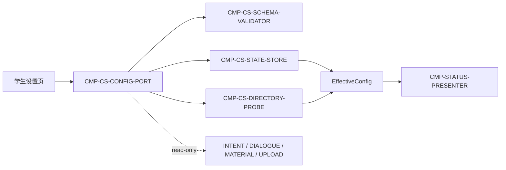

# 02 Architecture Decomposition — CMP-CONFIG-STORE

## 1. Local semantic refinement

### 1.1 Local concepts

| Concept | Type | Meaning and invariant |
|---|---|---|
| `PluginConfigCandidate` | value object | 本次保存请求的全量候选值；未通过 schema 校验前不可写入 |
| `PluginConfig` | local aggregate | 最近一次有效配置及完整性元数据；由状态存储器单一持有 |
| `EffectiveConfig` | derived view | 配置值 + `completeness[]` + 当前目录 `dir_errors[]`；不作为独立持久化聚合 |
| `DirectoryProbeResult` | value object | 每个配置目录的存在、可读、为空及具体错误信息 |
| `ConfigSchemaVersion` | value object | 持久化格式版本；仅用于兼容读取，不改变父契约字段语义 |

### 1.2 Commands, events and policies

- **Commands**：`SaveConfig`、`ReadEffectiveConfig`、`ValidateConfigCandidate`、`ProbeConfiguredDirectories`、`CommitValidConfig`。
- **Internal events**：`ConfigValidated`、`DirectoryProbeCompleted`、`ConfigSaved`、`ConfigRejected`。其中 `ConfigSaved`/`ConfigRejected` 的父层外部语义保持不变。
- **Policies**：schema 校验先于任何写入；目录问题进入完整性/错误元数据；原子提交失败时保留旧状态；读取时目录探测不产生写副作用。

## 2. Child registry

| child_id | Responsibility | Exclusions | Owned state | Requirement / parent trace | Dependencies | Reason for existence |
|---|---|---|---|---|---|---|
| `CMP-CS-CONFIG-PORT` | 承接保存/读取请求，编排校验、目录探测、提交与 `EffectiveConfig` 装配 | 不直接解析文件格式；不直接写状态；不做网络/上传 | 请求上下文、派生视图（均为 ephemeral） | `REQ-DD002`; `D-AC-REQ-002-01`; `IC-M01-02`; `IC-M01-05` | SCHEMA-VALIDATOR、DIRECTORY-PROBE、STATE-STORE、STATUS-PRESENTER | 需要一个唯一内部入口维持父契约顺序与只读访问边界 |
| `CMP-CS-DIRECTORY-PROBE` | 检查代码/截图/结果目录的存在性、可读性、空目录和具体错误 | 不保存配置；不改变目录；不决定服务端白名单/配额 | `DirectoryProbeResult`（ephemeral） | `REQ-DD002`; `D-AC-REQ-002-01.observable_oracles/boundaries` | 本机文件系统边界；CONFIG-PORT | 目录状态是可变化的本地事实，需与 schema 校验和持久化解耦 |
| `CMP-CS-SCHEMA-VALIDATOR` | 校验全量配置字段、格式、必需字段及 schema 版本兼容性 | 不探测目录；不写持久化；不做姓名/小组归属校验 | `ValidatedConfigCandidate`（ephemeral） | `REQ-DD002`; `D-AC-REQ-002-01.exceptions`; `ST-01` invariant | CONFIG-PORT | “格式无效不覆盖旧配置”需要一个纯校验边界，避免写入前后语义混杂 |
| `CMP-CS-STATE-STORE` | 读取最近有效配置，原子替换有效配置，保留旧值并维护本地 schema 版本 | 不接受未验证候选；不负责目录探测；不向兄弟节点暴露可写接口 | `ST-01 PluginConfig` | `ST-01`; `REQ-D002/REQ-DD002`; `IC-M01-02`; `A-007` | 父允许的本地持久化机制 | 单一写方是父层核心不变量；原子提交与旧值保留必须集中管理 |

**追踪豁免**：无。四个子节点均有当前需求或父层契约/状态/决策追踪。

## 3. Dependency map

外部读取方只消费父层配置端口返回的视图；不会直接读取 `CMP-CS-STATE-STORE`。`CMP-STATUS-PRESENTER` 只消费派生的 `ConfigView`，不拥有任何配置状态。

## 4. C1-C6 mapping

| Mapping | Result | Boundary check |
|---|---|---|
| C1 | `CMP-CONFIG-STORE` → 四个 `CMP-CS-*` 子节点 | 全部位于父组件内部，无新公共运行时边界 |
| C2 | `ST-01` → `CMP-CS-STATE-STORE`；探测和校验结果均为派生临时状态 | 未转移父/兄弟状态所有权 |
| C3 | 父 R3 → PORT → SCHEMA/PROBE → STORE → ConfigSaved/Rejected → ConfigView | 父层保存成功/拒绝顺序与终态语义不变 |
| C4 | `IC-M01-02` → PORT 外部入口 + SCHEMA/PROBE/STORE 内部实现；`IC-M01-05` → 视图装配 | 父契约 ID、字段、owner、失败语义和版本不变 |
| C5 | 本机文件系统依赖 → DIRECTORY-PROBE ACL/Adapter | 未重设计本机文件系统或其他兄弟组件 |
| C6 | 无效不覆盖、目录错误可见、读取无副作用 → 校验先行、单写原子提交、读时探测 | 仅增加内部策略，不引入父层平台 |

## 5. Siblings are referenced, not redesigned

`CMP-INTENT-PARSER`、`CMP-DIALOGUE-COLLECTOR`、`CMP-MATERIAL-COLLECTOR`、`CMP-PENDING-QUEUE`、`CMP-UPLOAD-CLIENT` 和 `CMP-STATUS-PRESENTER` 只作为父契约消费者/协作者引用。本包不重新设计它们的内部职责、状态、契约或生命周期。
