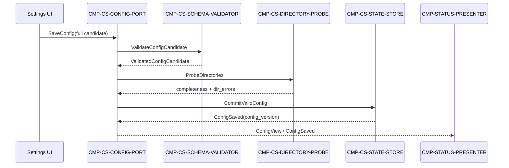

# 04 Contracts and Runtime — CMP-CONFIG-STORE

## 1. Inherited contract inventory

| Parent contract | Owner | Consumers | Fields / response | Side effects | Dependencies | Failures | Versioning |
|---|---|---|---|---|---|---|---|
| `IC-M01-02` 配置端口 | `CMP-CONFIG-STORE` | 保存设置页；INTENT-PARSER、DIALOGUE-COLLECTOR、MATERIAL-COLLECTOR、UPLOAD-CLIENT、STATUS-PRESENTER（只读） | 写入全量 `PluginConfig`；读取 `EffectiveConfig{fields..., completeness[], dir_errors[]}` | 有效保存原子替换 `ST-01`；产生 `ConfigSaved` 或 `ConfigRejected` | 本地插件持久化、本机目录探测 | `INVALID_CONFIG`；`DIRECTORY_UNREADABLE`；持久化失败 | 父契约 ID 和字段保持不变；仅允许兼容性追加内部元数据 |
| `IC-M01-05` ConfigView 部分 | `CMP-CONFIG-STORE` / `CMP-PENDING-QUEUE` | `CMP-STATUS-PRESENTER` | `ConfigView{values, completeness[], dir_errors[]}` | 仅派生展示，不修改状态 | `IC-M01-02` 读取结果 | 视图读取失败时展示可识别错误，不伪造配置结论 | 不改变父层视图字段或展示数据源 |

## 2. Inherited-contract realization map

| Parent contract | Internal realization | Semantic preservation |
|---|---|---|
| `IC-M01-02` save | `CONFIG-PORT` → `SCHEMA-VALIDATOR` → `DIRECTORY-PROBE` → `STATE-STORE` → `ConfigSaved/ConfigRejected` | 仍是单一配置入口；格式无效不写；目录问题显式返回 |
| `IC-M01-02` read | `CONFIG-PORT` → `STATE-STORE` + `DIRECTORY-PROBE` → `EffectiveConfig` | 读者得到最近有效值和当前完整性信息；不直接获得写权限 |
| `IC-M01-05` | `EffectiveConfig` → `STATUS-PRESENTER` | 展示字段、错误来源和“不伪造结论”规则不变 |

## 3. Child-only contracts

### `IC-CS-001` Schema validation port

- **Owner / consumer**：`CMP-CS-SCHEMA-VALIDATOR` / `CMP-CS-CONFIG-PORT`。
- **Trigger**：`SaveConfig`。
- **Schema**：`ValidateConfigCandidate{candidate, requested_schema_version}` → `ValidatedConfigCandidate` 或 `{error_code: INVALID_CONFIG, field_errors[]}`。
- **Side effects**：无；不得读写 `ST-01`。
- **Timeout/retry**：进程内同步调用；无自动重试。
- **Idempotency**：同一候选产生确定性相同结果。
- **Compatibility**：只接受父契约允许的字段；未知字段不能改变公共响应语义。

### `IC-CS-002` Directory probe port

- **Owner / consumer**：`CMP-CS-DIRECTORY-PROBE` / `CMP-CS-CONFIG-PORT`。
- **Trigger**：保存通过 schema 校验后，或读取 `EffectiveConfig` 时。
- **Schema**：`ProbeDirectories{code_dir, screenshot_dir, result_dir}` → 三目录的 `{exists, readable, empty, error_code, error_detail}`。
- **Side effects**：只读访问本机目录；不写配置、不修改文件。
- **Timeout/retry**：单次探测不做无限重试；权限/路径错误原样归档为具体目录错误。
- **Idempotency**：同一时刻相同目录事实产生等价结果；环境变化允许后续读取得到新结果。
- **Compatibility**：结果映射到父层 `completeness[]` / `dir_errors[]`，不改变父层字段名。

### `IC-CS-003` Atomic commit port

- **Owner / consumer**：`CMP-CS-STATE-STORE` / `CMP-CS-CONFIG-PORT`。
- **Trigger**：schema 校验通过，且 PORT 已合并目录完整性元数据。
- **Schema**：`CommitValidConfig{validated_candidate, completeness[], dir_errors[], schema_version}` → `CommitResult{config_version}`。
- **Side effects**：原子替换 `ST-01`；成功后旧版本被替换，失败时旧版本保持可读。
- **Timeout/retry**：本地持久化失败返回明确错误；不得自动重试造成重复覆盖。
- **Idempotency**：相同候选重复提交不会产生部分状态；每次成功提交仍是一个完整版本。
- **Compatibility**：不得新增父公共字段；内部 schema 迁移必须保持 `EffectiveConfig` 兼容。

## 4. Runtime flows

### R-CS-01 Successful or incomplete save



目录为空或不可读时仍可保存值，但返回不完整/目录错误；这不改变父层“格式无效拒绝”的例外语义。

### R-CS-02 Invalid format or persistence failure

```mermaid
sequenceDiagram
  participant UI as Settings UI
  participant P as CMP-CS-CONFIG-PORT
  participant V as CMP-CS-SCHEMA-VALIDATOR
  participant S as CMP-CS-STATE-STORE
  participant SP as CMP-STATUS-PRESENTER
  UI->>P: SaveConfig
  P->>V: ValidateConfigCandidate
  alt invalid format
    V-->>P: INVALID_CONFIG + field_errors
    P-->>SP: ConfigRejected
    Note over S: ST-01 remains last valid value
  else storage failure after valid validation
    V-->>P: ValidatedConfigCandidate
    P->>S: CommitValidConfig
    S-->>P: persistence_error; old value retained
    P-->>SP: ConfigRejected / local persistence error
  end
```

### R-CS-03 Read with changed directory state

1. `CONFIG-PORT` 从 `STATE-STORE` 读取最近有效 `ST-01`。
2. `DIRECTORY-PROBE` 重新检查当前目录；只生成本次响应的派生结果。
3. PORT 组装 `EffectiveConfig` 并返回给父层读取方/STATUS-PRESENTER。
4. 不因读取时目录变化而偷偷覆盖 `ST-01`；学生可看到具体目录错误。

## 5. Error, retry, observability and compatibility

- `INVALID_CONFIG` 必须包含字段级错误，且不产生写入。
- `DIRECTORY_UNREADABLE` 必须关联目录字段和可读错误明细；目录空则进入 `completeness[]`。
- 原子写入失败必须可观测为本地持久化错误，且证明旧值仍可读取。
- 本层不把保存失败自动转成网络重试；网络重试属于父层上传组件。
- 可观测记录只需包含操作类型、结果、配置版本（不记录邀请码明文或目录文件内容）。
- 父契约的 owner、字段、side effects、依赖方向、失败语义和 versioning 均未改变。

**契约不变确认**：本包没有 `parent-change-request.md`；所有变化均限于 `CMP-CONFIG-STORE` 内部实现。

## 6. Machine-readable contract annex

本附录是 §1–§5 的机器可读投影，不引入任何新语义；字段、错误码、流程顺序与上文散文描述一一对应。若两者出现偏差，以上文语义为准并修正本附录。

### 6.1 Interface field contracts

```yaml
interface_contracts:
  - component: CMP-CS-CONFIG-PORT
    contract: IC-M01-02
    inbound:
      - message: SaveConfig
        required_fields: [invite_code, student_name, group, code_dir, screenshot_dir, result_dir]
        optional_fields: [schema_version]
      - message: ReadEffectiveConfig
        required_fields: []
    outbound:
      - event: ConfigSaved
        produced_fields: [config_version, completeness, dir_errors]
      - event: ConfigRejected
        produced_fields: [error_code, field_errors, dir_errors]
      - event: EffectiveConfig
        produced_fields: [invite_code, student_name, group, code_dir, screenshot_dir, result_dir, completeness, dir_errors]
    error_codes: [INVALID_CONFIG, DIRECTORY_UNREADABLE, PERSISTENCE_FAILED]
  - component: CMP-CS-SCHEMA-VALIDATOR
    contract: IC-CS-001
    inbound:
      - message: ValidateConfigCandidate
        required_fields: [candidate, requested_schema_version]
    outbound:
      - event: ValidatedConfigCandidate
        produced_fields: [validated_candidate, schema_version]
      - event: ConfigRejected
        produced_fields: [error_code, field_errors]
    error_codes: [INVALID_CONFIG]
  - component: CMP-CS-DIRECTORY-PROBE
    contract: IC-CS-002
    inbound:
      - message: ProbeDirectories
        required_fields: [code_dir, screenshot_dir, result_dir]
    outbound:
      - event: DirectoryProbeCompleted
        produced_fields: [exists, readable, empty, error_code, error_detail]  # 每个目录一份
    error_codes: [DIRECTORY_UNREADABLE, DIRECTORY_NOT_FOUND]
  - component: CMP-CS-STATE-STORE
    contract: IC-CS-003
    inbound:
      - message: CommitValidConfig
        required_fields: [validated_candidate, completeness, dir_errors, schema_version]
      - message: ReadConfig
        required_fields: []
    outbound:
      - event: ConfigSaved
        produced_fields: [config_version]
      - event: ConfigSnapshot
        produced_fields: [plugin_config, schema_version, config_version]
    error_codes: [PERSISTENCE_FAILED, UNSUPPORTED_SCHEMA_VERSION]
```

### 6.2 Legal data-flow declarations

```yaml
legal_flows:
  - flow_id: R-CS-01
    name: save (valid or incomplete)
    entry: {component: CMP-CS-CONFIG-PORT, trigger: SaveConfig}
    hops:
      - {from: CMP-CS-CONFIG-PORT, to: CMP-CS-SCHEMA-VALIDATOR, next_hop_condition: "always"}
      - {from: CMP-CS-SCHEMA-VALIDATOR, to: CMP-CS-DIRECTORY-PROBE, next_hop_condition: "schema validation passed"}
      - {from: CMP-CS-DIRECTORY-PROBE, to: CMP-CS-STATE-STORE, next_hop_condition: "probe completed (empty/unreadable dirs allowed, carried in completeness[]/dir_errors[])"}
    return_events: [ConfigSaved]
    termination: "ConfigSaved(config_version) emitted; ST-01 atomically replaced; ConfigView delivered to STATUS-PRESENTER"
  - flow_id: R-CS-02
    name: save rejected
    entry: {component: CMP-CS-CONFIG-PORT, trigger: SaveConfig}
    hops:
      - {from: CMP-CS-CONFIG-PORT, to: CMP-CS-SCHEMA-VALIDATOR, next_hop_condition: "always"}
      - {from: CMP-CS-CONFIG-PORT, to: CMP-CS-STATE-STORE, next_hop_condition: "validation passed but commit attempted"}
    return_events: [ConfigRejected]
    termination: "ConfigRejected emitted; ST-01 unchanged and last valid value still readable; no retry write"
  - flow_id: R-CS-03
    name: read effective config
    entry: {component: CMP-CS-CONFIG-PORT, trigger: ReadEffectiveConfig}
    hops:
      - {from: CMP-CS-CONFIG-PORT, to: CMP-CS-STATE-STORE, next_hop_condition: "always"}
      - {from: CMP-CS-CONFIG-PORT, to: CMP-CS-DIRECTORY-PROBE, next_hop_condition: "always (re-probe current dirs)"}
    return_events: [EffectiveConfig]
    termination: "EffectiveConfig assembled from one consistent snapshot + current probe; no write side effect on ST-01"
```

### 6.3 Observability contracts

```yaml
observability_contracts:
  - metric: config_save_outcome            # 保存操作结果记录
    owner: CMP-CS-CONFIG-PORT
    caliber: "按单次 SaveConfig 请求计 1 条，结果 ∈ {saved, rejected_invalid, rejected_persistence}"
    start_event: SaveConfig
    end_event: ConfigSaved | ConfigRejected
    data_source: "CONFIG-PORT 编排上下文（不落盘敏感字段）"
    window: 单次请求
    threshold: 无告警阈值（学生本机诊断用途）
    query_interface: "本地诊断日志读取；不向父层/网络暴露指标查询 API"
  - metric: config_commit_result           # 原子提交结果记录
    owner: CMP-CS-STATE-STORE
    caliber: "按单次 CommitValidConfig 计 1 条，结果 ∈ {committed(config_version), failed_old_value_retained}"
    start_event: CommitValidConfig
    end_event: ConfigSaved | PERSISTENCE_FAILED
    data_source: "STATE-STORE 提交路径"
    window: 单次提交
    threshold: 无告警阈值
    query_interface: "本地诊断日志读取"
  note: "当前需求（REQ-DD002 / D-AC-REQ-002-01）不含指标聚合或指标查询接口；以上为操作级可观测记录，字段限于操作类型、结果、配置版本，与 §5 一致。"
```
