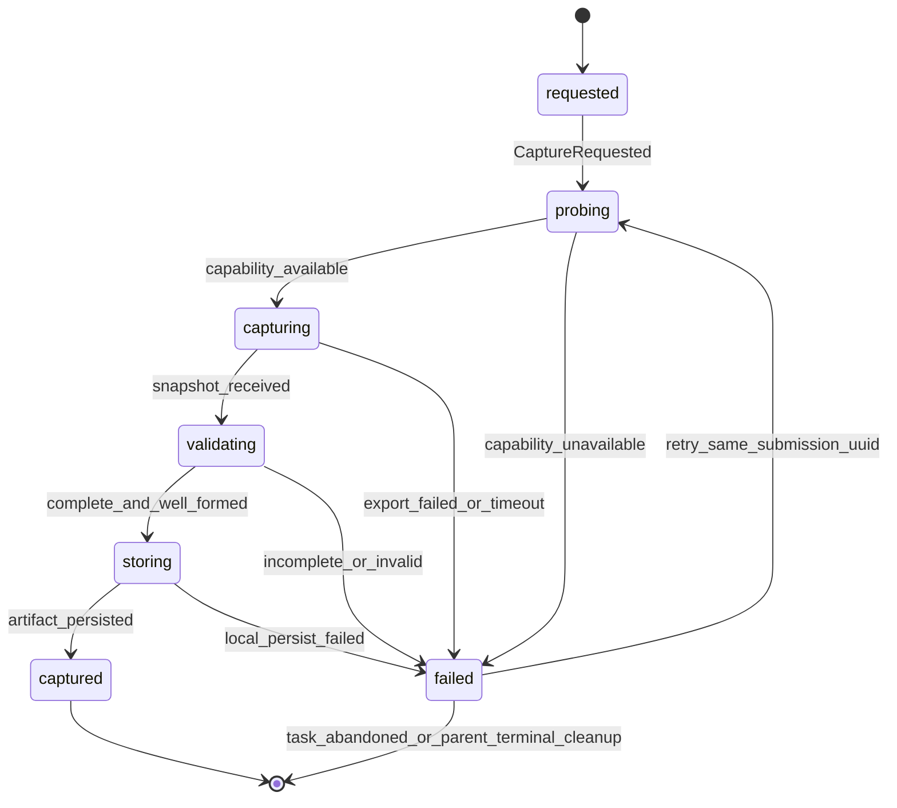
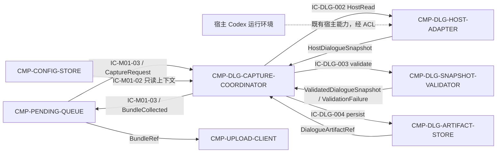

# 02 Architecture Decomposition — CMP-DIALOGUE-COLLECTOR（L2）

> 本文件只细化 `CMP-DIALOGUE-COLLECTOR` 内部。父模块 MOD-01、兄弟组件及宿主 Codex 环境不在本层重设计。

## 1. 局部语义模型

### 1.1 局部概念、值对象与不变量

| 概念 | 类型 | 含义 | 关键不变量 |
|---|---|---|---|
| `DialogueCaptureRequest` | 命令值对象 | `submission_uuid`、父层 task_ref、作业/项目上下文、由 ST-04 任务记录解析出的 capture anchor | 必须携带父层 task_ref；anchor 来自既有任务时间戳，不新增 IC-M01-03 字段 |
| `HostDialogueSnapshot` | 值对象 | 宿主返回的有序对话条目、来源能力版本、capture anchor、完整性证明 | 顺序稳定；来源可追踪；若宿主报告截断/分页未完成则不可标记 complete |
| `DialogueEntry` | 实体 | 单条角色/时间/内容/附件引用及原始序号 | 原始序号在规范化过程中保持可追踪；不凭空补写内容 |
| `DialogueArtifact` | 聚合 | 可上传的不可变对话材料及 manifest | 每个 `submission_uuid` 至多一个有效 artifact；类别恒为 `dialogue` |
| `CaptureFailure` | 值对象 | 稳定错误码、阶段、来源、可恢复性和诊断摘要 | 不携带宿主内部堆栈；可恢复性不等于自动重试网络 |

### 1.2 局部生命周期

`captured` 是本组件本地 artifact 成功状态，不等价于服务端 `received`、`processing` 或 `rejected`。服务端状态仍由 MOD-02 经 CT-001/CT-002 管理。

## 2. 子节点注册表（按稳定 child_id 排序）

| child_id | 职责 | 排除项 | 拥有状态 | 需求/父层追踪 | 依赖 | 存在理由 | trace_exemption_reason |
|---|---|---|---|---|---|---|---|
| CMP-DLG-ARTIFACT-STORE | 将通过验证的对话快照和 manifest 以不可变本地产物保存、读取、按任务终态清理 | 不连接宿主；不验证语义；不上传；不改变 CT-001 字段 | ST-DLG-02 DialogueArtifact | REQ-DD003；REQ-D003；L1 ST-02；IC-DLG-004 | Capture Coordinator、DU-1 本机文件能力 | 对话产物的单一写方和生命周期清理边界需要独立不变量 | —（存在直接需求与父层追踪） |
| CMP-DLG-CAPTURE-COORDINATOR | 接收队列采集命令，固定快照锚点，编排探测/导出/验证/保存，提供幂等结果 | 不直接调用宿主 API；不持有任务状态机；不发网络请求 | ST-DLG-01 DialogueCaptureSession | REQ-DD003；D-AC-REQ-003-01 dialogue slice；IC-M01-03 | Host Adapter、Snapshot Validator、Artifact Store、PENDING-QUEUE | 捕获生命周期、幂等和失败语义不同于宿主适配与存储，需单一协调者 | —（存在直接需求与父层追踪） |
| CMP-DLG-HOST-ADAPTER | 以 ACL 形式探测宿主能力并获取任务锚定的对话快照，屏蔽宿主 API/导出格式变化 | 不新增外部依赖；不把宿主变成公共服务；不持久化提交状态；不做服务端判断 | 无持久状态；仅有短生命周期 probe/read 上下文 | REQ-DD003；REQ-D003；L1 C5 委托；宿主 Codex 环境边界 | 宿主 Codex 运行环境、Capture Coordinator | 宿主机制是本节点唯一高变化外部适配面，必须与领域校验和 artifact 生命周期隔离 | —（存在直接需求与父层 C5 追踪） |
| CMP-DLG-SNAPSHOT-VALIDATOR | 校验快照锚点、顺序、完整性证据、条目可读性和 dialogue 类别，输出规范化快照 | 不判断课程/成员资格；不校验代码/截图/结果；不替代服务端材料校验；不修补缺失内容 | 无持久状态；仅输出校验结果 | REQ-DD003；D-AC-REQ-003-01 dialogue slice；L1 INV-4 | Host Adapter 输出、Capture Coordinator | “完整”是本组件的本地放行不变量，不能由通用上传器或宿主适配器隐式承担 | —（存在直接需求与父层追踪） |

## 3. 依赖图与边界

本组件采用 Coordinator 编排模型：`CMP-DLG-HOST-ADAPTER`、`CMP-DLG-SNAPSHOT-VALIDATOR`、`CMP-DLG-ARTIFACT-STORE` 之间不存在直接调用边，所有交互均由 `CMP-DLG-CAPTURE-COORDINATOR` 中转，与 `04-contracts-and-runtime.md §5` 的运行流一致。

### 3.1 外部边界确认

- 宿主 Codex 环境只被 `CMP-DLG-HOST-ADAPTER` 引用；本层不决定宿主内部结构。
- `CMP-MATERIAL-COLLECTOR` 仍独立负责代码、截图、结果目录；本层不读取这些目录。
- `CMP-PENDING-QUEUE` 仍拥有 PendingTask、任务状态机和恢复调度；本层仅回传采集成功/失败。
- `CMP-UPLOAD-CLIENT` 仍拥有 CT-001/CT-002/auth-token 网络实现；本层不产生网络出口。
- 未创建服务、容器、公共 API、数据库或消息队列。

## 4. C1-C6 映射检查

| 映射 | 本层结果 | 结论 |
|---|---|---|
| C1 | CMP-DIALOGUE-COLLECTOR → 4 个稳定 child_id，均在 MOD-01/DU-1 内 | 通过 |
| C2 | ST-02 拆为采集会话 ST-DLG-01 与不可变产物 ST-DLG-02；产物最终 owner 仍在本组件 | 通过 |
| C3 | L1 IC-M01-03/R1/R2 映射为 probe→capture→validate→store→return；队列顺序不变 | 通过 |
| C4 | CT-001 只接收 dialogue 类内容来源；字段、owner、网络和失败语义均不改 | 通过 |
| C5 | 宿主依赖封装为 Host Adapter/ACL；无新外部依赖 | 通过 |
| C6 | 完整性、锚点、幂等和失败可诊断性转化为内部不变量与端口 | 通过 |

## 5. 分解理由

1. **Coordinator 独立**：捕获锚点、同 UUID 幂等和错误归因是跨宿主、验证、存储的生命周期不变量。
2. **Host Adapter 独立**：宿主导出机制是父层明确委托且变化概率最高的 ACL 面；不能让宿主格式直接渗透到父契约。
3. **Snapshot Validator 独立**：完整性、顺序和 provenance 是本组件的放行条件；“宿主返回了数据”不等于“数据完整”。
4. **Artifact Store 独立**：ST-02 必须一次写入、不可变、可被队列和上传器读取，并在终态清理；需要单一写方。

## 6. 兄弟节点引用确认

本层只引用 `CMP-CONFIG-STORE` 的只读上下文、`CMP-PENDING-QUEUE` 的编排端口、`CMP-MATERIAL-COLLECTOR` 的并行材料职责和 `CMP-UPLOAD-CLIENT` 的消费职责；未读取、未分解、未重设计任何兄弟内部。
