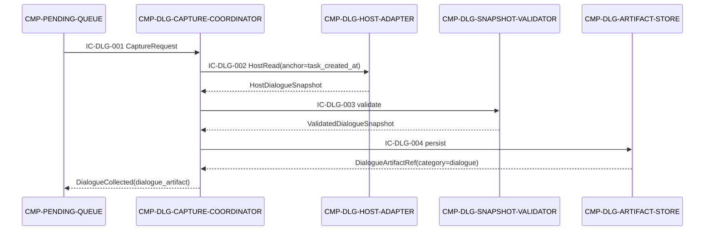

# 04 Contracts and Runtime — CMP-DIALOGUE-COLLECTOR（L2）

## 1. 继承契约清单

| 父契约 | 本组件角色 | 本组件实现范围 | 不变内容 |
|---|---|---|---|
| CT-001 提交材料包上传 | material source / Consumer-side collaborator | 产生 `material_chunks[]` 中一条 `category=dialogue` 的内容来源和 manifest | Provider、路径、必需字段、幂等键、失败/超时/版本语义不变 |
| CT-002 提交状态查询 | 不参与 | 不调用、不解释服务端状态 | 由 UPLOAD-CLIENT 实现；本组件不复制状态机 |
| auth/token 附属端点 | 不参与 | 不调用、不缓存 token | 由 UPLOAD-CLIENT 实现 |
| IC-M01-02 | 只读 Consumer | 使用父层已提供的 `config_ref`/上下文，不持有配置 | Owner 仍为 CONFIG-STORE，字段语义不变 |
| IC-M01-03 | 被调用方/返回方 | 接收 task_ref，返回 dialogue_artifact 或 CollectionFailed | Owner 仍为 PENDING-QUEUE，返回字段不改 |

## 2. 父契约到本层映射

| 父契约/流程 | 本层子节点 | 映射结果 |
|---|---|---|
| CT-001 `material_chunks[]` dialogue 条目 | Artifact Store → Coordinator → PENDING-QUEUE → UPLOAD-CLIENT | 本层只提供内容、类别和 provenance；不编码上传协议、不改变字段 |
| IC-M01-03 采集编排 | Capture Coordinator；Host Adapter；Snapshot Validator；Artifact Store | `task_ref` 进入，`dialogue_artifact` 或稳定失败返回；同 UUID 重复返回既有结果 |
| L1 R1 成功链路 | PENDING-QUEUE → Coordinator → Host Adapter → Validator → Store | 成功后回到原 R1，材料包仍由 UPLOAD-CLIENT 负责上传 |
| L1 R2 失败/恢复 | Coordinator/Host Adapter/Validator | 失败原因回传队列；不发网络，不伪造上传结果；恢复沿父层调度重试 |

## 3. 本层子契约（按稳定 ID 排序）

### IC-DLG-001 Dialogue Capture Command

- **Owner / Consumer**：`CMP-DLG-CAPTURE-COORDINATOR` → `CMP-PENDING-QUEUE`
- **触发**：父层任务创建完成且前置检查通过，调用 IC-M01-03 的 dialogue 分支。
- **Schema**：入参 `CaptureRequest{submission_uuid, assignment_context, config_ref, capture_anchor}`；其中 `capture_anchor` 由 PENDING-QUEUE 既有 ST-04 任务创建时间解析，不是对 IC-M01-03 新增的必需字段；出参 `DialogueCaptureResult{dialogue_artifact_ref, capture_anchor, completeness}` 或 `CollectionFailed{error_code, stage, recoverable, safe_message}`。其中 `dialogue_artifact_ref` 即 IC-DLG-004 返回的 `DialogueArtifactRef{artifact_id, local_ref, checksum, byte_size, category=dialogue}`，字段语义一一对应，不做重命名或裁剪。
- **副作用**：创建/更新 ST-DLG-01；成功时调用 Artifact Store 写 ST-DLG-02；不产生网络调用。
- **错误/超时/重试**：宿主不可用、导出失败、超时、快照不完整均返回稳定错误；重试复用 submission_uuid 和 anchor；不由本契约直接调度网络重试。
- **幂等**：同 UUID 已有有效 artifact 时返回相同 ref；active session 重复调用被合并或返回进行中。
- **兼容**：只允许追加可选诊断字段；不得改变 IC-M01-03 的外部字段。

### IC-DLG-002 Host Dialogue Source Port

- **Owner / Consumer**：`CMP-DLG-HOST-ADAPTER` → `CMP-DLG-CAPTURE-COORDINATOR`
- **触发**：Coordinator 需要在 capture anchor 下读取宿主对话。
- **Schema**：入参 `HostReadRequest{capture_anchor, assignment_context, source_context?}`；出参 `HostDialogueSnapshot{entries[], source, capability, completeness, pagination, truncation}`。
- **副作用**：仅读取宿主能力；不写父/兄弟状态，不联网，不修改宿主内容。
- **错误/超时/重试**：`HOST_CAPABILITY_UNAVAILABLE`、`HOST_EXPORT_FAILED`、`HOST_EXPORT_TIMEOUT`、`HOST_SNAPSHOT_NOT_REPLAYABLE`；可重试错误由 Coordinator 重新调用同 anchor。
- **幂等**：相同 anchor + source revision 应返回等价快照；不得隐式返回新的实时会话作为旧 anchor 的替代。
- **兼容**：宿主 API 版本和格式只封装在 Adapter；宿主变化不得进入 CT-001 或父层公共契约。

### IC-DLG-003 Snapshot Validation Port

- **Owner / Consumer**：`CMP-DLG-SNAPSHOT-VALIDATOR` → `CMP-DLG-CAPTURE-COORDINATOR`
- **触发**：Host Adapter 返回 HostDialogueSnapshot。
- **Schema**：入参 `HostDialogueSnapshot`；出参 `ValidatedDialogueSnapshot{normalized_entries[], manifest, completeness=complete}` 或 `ValidationFailure{error_code, missing_evidence[], safe_message}`。
- **副作用**：无持久写入；不修补或补写宿主缺失内容。
- **错误/超时/重试**：顺序异常、截断、分页未完成、内容不可读或类别不一致时失败；验证为确定性纯计算，可安全重复。
- **幂等**：同一 snapshot provenance + payload checksum 产生同一 manifest。
- **兼容**：内部 schema 可追加 metadata；CT-001 类别必须保持 dialogue，外部类别变化需 return_to_parent。

### IC-DLG-004 Dialogue Artifact Persistence Port

- **Owner / Consumer**：`CMP-DLG-ARTIFACT-STORE` → `CMP-DLG-CAPTURE-COORDINATOR`
- **触发**：Validator 返回 complete 的规范化快照。
- **Schema**：入参 `PersistDialogueArtifact{submission_uuid, capture_anchor, normalized_entries, manifest}`；出参 `DialogueArtifactRef{artifact_id, local_ref, checksum, byte_size, category=dialogue}`。
- **副作用**：一次性写 ST-DLG-02；同 UUID 已存在等价 artifact 时只读返回；任务终态接收清理命令时删除本地 artifact。
- **错误/超时/重试**：本地空间不足、写入失败、校验和不一致返回 `ARTIFACT_PERSIST_FAILED`；写入采用临时文件/原子提交语义，重试不得产生两个有效 artifact。
- **幂等**：`submission_uuid + payload_checksum` 是幂等键；同 UUID 不允许用不同 payload 覆盖既有 artifact。
- **兼容**：manifest 只追加可选 provenance；`category=dialogue` 和父层 `dialogue_artifact` 语义不变。

## 4. 机器可读契约绑定

```yaml
contract_fields:
  - contract_id: IC-DLG-001
    contract_type: internal_command
    provider: CMP-DLG-CAPTURE-COORDINATOR
    consumer: CMP-PENDING-QUEUE
    inbound_required_fields: [submission_uuid, assignment_context, config_ref, capture_anchor]
    outbound_produced_fields: [dialogue_artifact_ref, capture_anchor, completeness]
    outbound_conditional_fields: [error_code, stage, recoverable, safe_message]
    side_effects: [ST-DLG-01, ST-DLG-02_on_success]
    dependencies: [IC-M01-03, IC-DLG-002, IC-DLG-003, IC-DLG-004]
    next_hop: CMP-PENDING-QUEUE
    return_event: [DialogueCollected, DialogueCollectionFailed]
  - contract_id: IC-DLG-002
    contract_type: acl_port
    provider: CMP-DLG-HOST-ADAPTER
    consumer: CMP-DLG-CAPTURE-COORDINATOR
    inbound_required_fields: [capture_anchor, assignment_context]
    outbound_produced_fields: [entries, source, capability, completeness, pagination, truncation]
    outbound_conditional_fields: [error_code, retryable]
    side_effects: read_host_only
    dependencies: [host_codex_runtime]
    next_hop: CMP-DLG-CAPTURE-COORDINATOR
    return_event: [HostSnapshotReceived, HostSnapshotUnavailable]
  - contract_id: IC-DLG-003
    contract_type: internal_command
    provider: CMP-DLG-SNAPSHOT-VALIDATOR
    consumer: CMP-DLG-CAPTURE-COORDINATOR
    inbound_required_fields: [host_snapshot]
    outbound_produced_fields: [normalized_entries, manifest, completeness]
    outbound_conditional_fields: [missing_evidence, error_code]
    side_effects: none_read_only_computation
    dependencies: [HostDialogueSnapshot]
    next_hop: CMP-DLG-CAPTURE-COORDINATOR
    return_event: [SnapshotValidated, SnapshotRejected]
  - contract_id: IC-DLG-004
    contract_type: internal_command
    provider: CMP-DLG-ARTIFACT-STORE
    consumer: CMP-DLG-CAPTURE-COORDINATOR
    inbound_required_fields: [submission_uuid, capture_anchor, normalized_entries, manifest]
    outbound_produced_fields: [artifact_id, local_ref, checksum, byte_size, category]
    outbound_conditional_fields: [error_code]
    side_effects: [write_ST-DLG-02, purge_on_parent_terminal_cleanup]
    dependencies: [DU-1_local_storage]
    next_hop: CMP-DLG-CAPTURE-COORDINATOR
    return_event: [DialogueArtifactPersisted, DialogueArtifactPersistenceFailed]
```

`next_hop` 指调用返回后的下一站。本组件采用 Coordinator 编排模型：IC-DLG-002/003/004 的结果均先返回 `CMP-DLG-CAPTURE-COORDINATOR`，再由 Coordinator 依 §5 运行流调用下一组件；Host Adapter、Snapshot Validator、Artifact Store 之间无直接调用关系。

## 5. 本地运行流

### R-DLG-1 成功采集



### R-DLG-2 宿主失败或不完整恢复

1. Adapter 不可用、导出超时或 Validator 发现截断时，Coordinator 返回 `DialogueCollectionFailed`，不交给 UPLOAD-CLIENT。
2. PENDING-QUEUE 保留同一任务；在父层调度触发后，使用同一 `submission_uuid` 和同一 anchor 再次调用。
3. 若重试仍无法取得可证明的完整快照，保持失败并展示稳定原因；不得以当前最新对话替代原 anchor，也不得新增外部依赖。

### R-DLG-3 任务终态清理

1. UPLOAD-CLIENT 经父层 CT-001/CT-002 得到服务端终态后，PENDING-QUEUE 触发既有本地清理。
2. Artifact Store 删除 ST-DLG-02，Coordinator 清除 ST-DLG-01。
3. 清理失败只记录本地 `local_cleanup_error` 并重试，不改变父层状态机。

## 6. 错误、重试、幂等、可观测和兼容

- 本层错误码仅限 `HOST_CAPABILITY_UNAVAILABLE`、`HOST_EXPORT_FAILED`、`HOST_EXPORT_TIMEOUT`、`HOST_SNAPSHOT_NOT_REPLAYABLE`、`DIALOGUE_SNAPSHOT_INCOMPLETE`、`DIALOGUE_SNAPSHOT_INVALID`、`ARTIFACT_PERSIST_FAILED`；由父层安全映射为采集失败原因。
- 本层不重试网络上传；宿主读取可按稳定 anchor 重试，重试策略由 PENDING-QUEUE 调度，不由 Adapter 自行创建后台任务。
- 日志记录阶段、submission_uuid、source capability、checksum、entry_count 和失败类别，不记录额外完整正文副本或宿主秘密。
- 任何跨模块新增字段、类别、端点、错误语义或状态所有权变化都必须 `return_to_parent`。

## 7. 父契约语义不变确认

本层未修改 CT-001、CT-002、auth/token 的标识符、路径、字段、owner、失败/超时/幂等/版本语义；未创建新的跨模块契约；未改变 L1 R1/R2 的外部顺序或 DU-1 部署边界。
