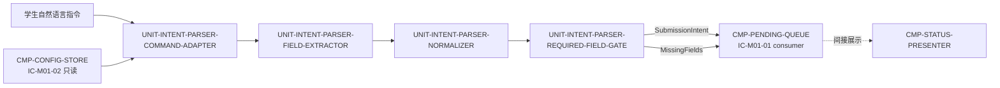

# 02 Architecture Decomposition — CMP-INTENT-PARSER（L2）

本层只在 `CMP-INTENT-PARSER` 内部细化。分解依据为职责、瞬态数据所有权、不变量、生命周期、变化原因和交互；不按通用分层重画 MOD-01。

## 1. 局部概念、不变量与生命周期

### 1.1 局部概念

| 概念 | 类型 | 含义 | 关键不变量 |
|---|---|---|---|
| `IntentFieldCandidate` | 瞬态值对象 | 某字段的候选值、来源片段和确定性标记 | 不含未验证的默认填充值；来源可追溯到当前 `command_text` |
| `NormalizedIntentCandidate` | 瞬态值对象 | 字段名已归一、空白已处理、格式已标准化的候选集合 | 不改变当次指令语义；同一输入快照结果稳定 |
| `SubmissionIntent` | 输出值对象 | `assignment`、`student_name`、`group_name` 三个最终字段 | 三字段均非空且确定；仅交给 `CMP-PENDING-QUEUE`，不在本层持久化 |
| `MissingFields` | 输出值对象 | 缺失、空值或无法确定的字段及诊断原因 | 至少包含一个具体字段；返回后不得创建任务 |

### 1.2 关键不变量

- `INV-IP-01`：缺少或不确定任一必填字段时，结果只能是 `MissingFields`，不得生成 `SubmissionIntent`。
- `INV-IP-02`：解析器无网络副作用、无持久化副作用、无任务创建副作用。
- `INV-IP-03`：当次指令文本是字段值的优先来源；配置仅可作为只读上下文，不能静默覆盖或补齐必填字段。
- `INV-IP-04`：同一 `command_text` 与同一 `config_version` 下，解析结果可重复；不同请求之间不共享可变解析状态。
- `INV-IP-05`：解析不确定时采用 fail-closed；禁止猜测姓名、小组或作业。

### 1.3 请求生命周期

`Received → Extracted → Normalized → GateChecked → {IntentParsed | MissingFieldsDetected} → Returned`。
该生命周期完全在一次进程内调用中完成；不产生后台任务，不进入服务器状态机。

## 2. 子节点清单（按稳定 child_id 排序）

| child_id | 名称 | 职责 | 排除项 | 拥有状态 | 需求/父层追踪 | 依赖 | 存在理由 | trace_exemption_reason |
|---|---|---|---|---|---|---|---|---|
| UNIT-INTENT-PARSER-COMMAND-ADAPTER | 指令端口适配器 | 实现 `IC-M01-01` 入口/出口；接收 `command_text`，读取可用配置上下文，编排内部解析链并把结果返回给 `CMP-PENDING-QUEUE` | 不创建任务；不展示 UI；不发起网络 | `ST-IP-01 ParseRequestContext`（瞬态） | `REQ-DD001`；`REQ-D001`；`IC-M01-01/02`；`FLOW-M01-001` | `CMP-PENDING-QUEUE`、`CMP-CONFIG-STORE` | 将父契约稳定边界与内部可替换实现隔离 | — |
| UNIT-INTENT-PARSER-FIELD-EXTRACTOR | 字段提取器 | 从当前自然语言文本识别 assignment/name/group 的候选值和来源片段 | 不做最终完整性放行；不使用外部 NLU 服务；不持久化 | `ST-IP-02 ExtractedSlotCandidates`（瞬态） | `REQ-DD001`；L1 `LCD-001`；`IC-M01-01` | `UNIT-INTENT-PARSER-COMMAND-ADAPTER` | 提取策略是变化最快的局部实现面，需要独立替换而不改变闸门 | — |
| UNIT-INTENT-PARSER-NORMALIZER | 字段规范化器 | 对候选字段做 trim、空值识别、字段名映射和最小格式规范化，保留来源与确定性信息 | 不补齐必填字段；不决定服务端归属；不修改配置 | `ST-IP-03 NormalizedIntentCandidate`（瞬态） | `REQ-DD001`；`D-AC-REQ-001-01`；`INV-IP-03` | `FIELD-EXTRACTOR`、可选配置上下文 | 将输入差异与确定性闸门解耦，避免把格式处理塞进队列 | — |
| UNIT-INTENT-PARSER-REQUIRED-FIELD-GATE | 必填字段确定性闸门 | 检查三个必填字段是否非空、唯一且可确定；输出 `SubmissionIntent` 或 `MissingFields` | 不解析材料；不创建提交；不向服务端验证姓名/小组 | `ST-IP-04 ParseResult`（瞬态输出） | `REQ-DD001`；`D-AC-REQ-001-01`；`F1-1`；`INV-1` | `NORMALIZER`、父层规则 | 将“能否放行”集中为单一确定性决策点，保证缺项不产生网络调用 | — |

所有子节点均有需求或父层追踪，`trace_exemption_reason` 缺省数为 0。

## 3. 内部依赖图（C1/C2/C4/C5）

- `CMP-CONFIG-STORE`、`CMP-PENDING-QUEUE` 和 `CMP-STATUS-PRESENTER` 是兄弟/父层边界，只引用其既有契约，不在本层重设计。
- 本节点没有对外服务边界；适配器是进程内契约实现，不是独立服务。
- 任何把解析器改成外部 NLU 服务、把结果存入共享数据库或直接调用状态展示器的方案都超出本层边界。

## 4. 局部聚合、命令与内部事件

- 局部聚合：无持久聚合；每次调用形成一个 request-scoped `ParseRequestContext`。
- 命令：继承 `ParseSubmitCommand(command_text)`；内部为 `ExtractSlots`、`NormalizeSlots`、`CheckRequiredFields`。
- 内部结果：`IntentParsed`、`MissingFieldsDetected`、`ParseUncertain`，仅作为进程内结果，不跨模块投递。
- 策略：提取策略可替换；规范化策略必须无损；必填闸门固定且 fail-closed。

## 5. 分解理由与兄弟确认

### 分解理由

1. 提取与闸门变化原因不同：宿主 NL 能力可能变化，但必填判定由 PRD/父契约固定。
2. 规范化是独立的确定性边界，能够统一空白、别名和空值处理，并保留来源证据。
3. 端口适配器隔离 `IC-M01-01/02`，避免内部实现字段泄漏到父层契约。
4. 所有子节点都不持久化，保证解析器可重复、无副作用且不会夺取 `PendingTask` 所有权。

### 兄弟节点只引用、不重设计

- `CMP-CONFIG-STORE`：只读 `EffectiveConfig`，配置持久化和无效覆盖规则归其所有。
- `CMP-PENDING-QUEUE`：接收解析结果、创建任务和持有 `submission_uuid`；本层不定义其状态机。
- `CMP-STATUS-PRESENTER`：经 L1 既有状态展示端口呈现缺项；本层不定义文案或 UI。
- `CMP-DIALOGUE-COLLECTOR`、`CMP-MATERIAL-COLLECTOR`、`CMP-UPLOAD-CLIENT`：本层不读取其状态、不重设计其内部。
