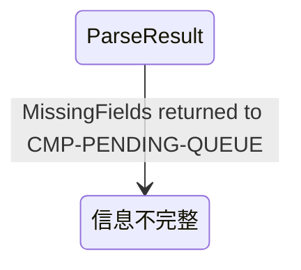

# 03 State and Data — CMP-INTENT-PARSER（L2）

本层没有持久状态。下表只登记请求范围的瞬态数据，明确其 owner、读写边界和销毁时机，避免把解析结果误认为 `PendingTask` 或服务端 `Submission`。

## 1. 瞬态状态所有权清单（按稳定状态 ID 排序）

| 状态 ID | 状态 | Owner (child_id) | 读方 | 写方 | 生命周期 | 一致性边界 | 保留/隐私约束 | 父层追踪 |
|---|---|---|---|---|---|---|---|---|
| ST-IP-01 | `ParseRequestContext`：当前 `command_text`、请求关联信息、可选 `config_version` | UNIT-INTENT-PARSER-COMMAND-ADAPTER | EXTRACTOR、NORMALIZER | COMMAND-ADAPTER | 单次调用；返回后销毁 | 单请求只读快照；不可被并发请求共享 | 可能含姓名/作业文本；仅进程内，日志不得记录完整原文 | `IC-M01-01/02`；L1 `INV-1` |
| ST-IP-02 | `ExtractedSlotCandidates`：候选字段、来源片段、确定性标记 | UNIT-INTENT-PARSER-FIELD-EXTRACTOR | NORMALIZER | FIELD-EXTRACTOR | `ExtractedSlots` 到规范化完成 | 同一输入快照内只写一次；不跨请求缓存 | 来源片段只在内存中存在；默认不落日志 | L1 `LCD-001`；`REQ-DD001` |
| ST-IP-03 | `NormalizedIntentCandidate`：规范化后的三字段候选与诊断 | UNIT-INTENT-PARSER-NORMALIZER | REQUIRED-FIELD-GATE | NORMALIZER | 规范化完成到闸门返回 | 必填槽位一一映射；空值和歧义不可被转换成有效值 | 只保留当前调用；不得写入 PluginConfig | `D-AC-REQ-001-01`；`INV-IP-03` |
| ST-IP-04 | `ParseResult`：`SubmissionIntent` 或 `MissingFields` | UNIT-INTENT-PARSER-REQUIRED-FIELD-GATE | COMMAND-ADAPTER、PENDING-QUEUE（通过 IC-M01-01） | REQUIRED-FIELD-GATE | 返回调用方后即由调用方接管/销毁；本节点不持久化 | 结果为互斥联合类型；不得同时含完整意图和缺项放行标志 | 不落盘；错误诊断只包含必要字段，不暴露原文 | `IC-M01-01`；`REQ-D001`；`F1-1` |

### 1.1 验收状态标签映射（边界观测，不转移所有权）

验收场景中的“提交状态为 `信息不完整`”是 `MissingFields` 结果交给
`CMP-PENDING-QUEUE` 后的边界展示/状态标签，不是本节点新增的持久状态。
本节点只产生 `ST-IP-04=MissingFields`；队列负责将其映射为已有的
“信息不完整”提交状态并决定不创建可评分任务。为让架构验证器能够检查该
语义映射，以下状态图只登记观测标签，不改变本节点的状态所有权、持久化
边界或 `IC-M01-01` 输出契约。

## 2. 存储意图与隐私边界

- `persistence: none`：所有 ST-IP 状态仅存在于一次插件进程内调用。
- 不创建解析缓存、共享数据库、消息队列或本地文件；本层没有恢复语义。
- 完整 `command_text` 和来源片段默认不写日志；可观测性只记录字段级结果（如缺失字段名、结果类型、耗时）。
- `PluginConfig` 仍由 `CMP-CONFIG-STORE` 持有；本层仅读快照/参考，不复制、不修改、不持久化。
- `PendingTask`、`submission_uuid`、材料清单和服务端 `Submission` 分别归 L1 已定义 owner，本层不承接。

## 3. 数据流

### 3.1 写入/派生流

1. `IC-M01-01` 进入后，COMMAND-ADAPTER 创建 ST-IP-01。
2. FIELD-EXTRACTOR 从 ST-IP-01 派生 ST-IP-02；不产生外部副作用。
3. NORMALIZER 从 ST-IP-02 派生 ST-IP-03；保留来源和不确定性标记。
4. REQUIRED-FIELD-GATE 从 ST-IP-03 派生 ST-IP-04。
5. 完整结果通过 `IC-M01-01` 返回 `CMP-PENDING-QUEUE`；缺项结果只作为诊断返回，不触发任务创建。

### 3.2 配置读取流

`CMP-CONFIG-STORE --IC-M01-02--> COMMAND-ADAPTER`。配置只提供只读上下文/版本参考；不得以配置值静默补齐指令中缺失的必填字段，也不得改变父契约输入 schema。

### 3.3 外部化流

无。本层不直接调用 CT-001、CT-002 或 auth/token；所有网络外部化仍由 `CMP-UPLOAD-CLIENT` 负责。

## 4. 不变量、一致性、幂等与并发

| 规则 | 内容 | 依据 |
|---|---|---|
| INV-IP-01 | 缺失/歧义任一必填字段 → `MissingFields`，不得产生 `SubmissionIntent` | L1 `F1-1`、`D-AC-REQ-001-01` |
| INV-IP-02 | 解析调用无网络、无持久化、无任务创建副作用 | L1 `IC-M01-01`、组件排除项 |
| INV-IP-03 | 当次指令优先；配置不覆盖、不静默补齐必填字段 | L1 `LCD-001` |
| INV-IP-04 | 同一文本+配置快照得到可重复结果；不同请求不共享可变状态 | L1 `IC-M01-01` 幂等语义 |
| INV-IP-05 | `SubmissionIntent` 与 `MissingFields` 互斥返回 | 本层值对象模型 |
| CON-IP-01 | 每个调用的 ST-IP 状态只允许当前调用链写入；并发调用隔离 | `persistence=none` |
| IDEM-IP-01 | 同一输入重复调用可重复，不生成额外任务或网络请求 | L1 `INV-1` |

## 5. 父/兄弟所有权未转移确认

- 没有新增持久状态 owner；ST-IP-01~04 都是本节点请求范围瞬态。
- `PluginConfig` 仍归 `CMP-CONFIG-STORE`；`PendingTask` 和 `submission_uuid` 仍归 `CMP-PENDING-QUEUE`。
- 对话、材料、UploadCheckpoint、服务端 Submission 和归属校验结论均未被本层复制或转移。
