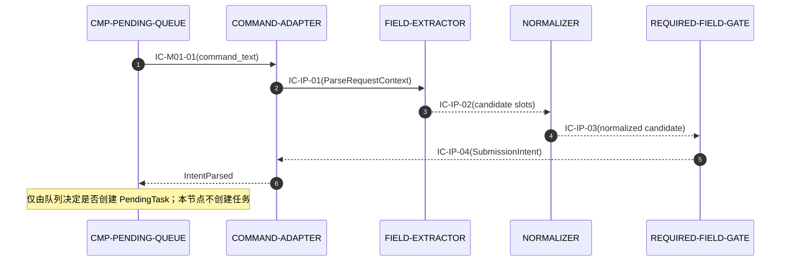
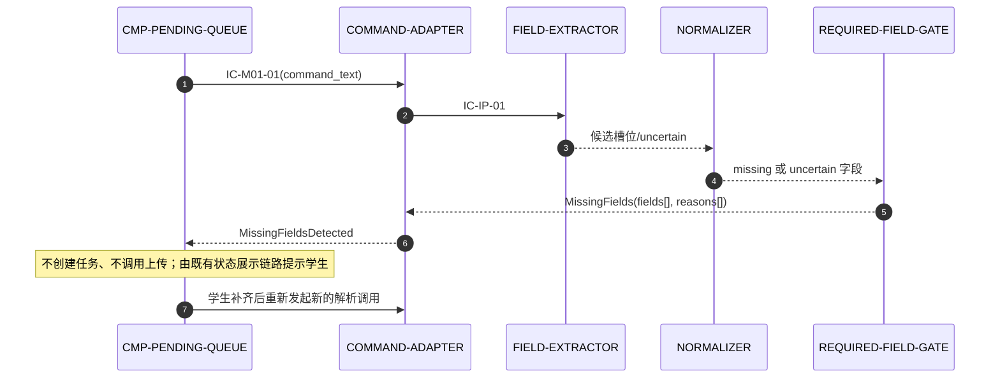

# 04 Contracts and Runtime — CMP-INTENT-PARSER（L2）

父层契约是绑定接口。本文件仅做内部实现映射；不修改父契约的标识、owner、字段、副作用、错误、幂等或版本语义。

## 1. 父契约清单（本节点视角）

下表为机器可读父契约绑定。`当前实现子节点` 列给出父契约在本节点内部的实现链，链首即父契约在本节点的入口/出口实现者；角色列保持父层 provider/consumer 不变。

| 父契约 | 角色 | 不可变字段/语义 | 当前实现子节点 | 失败、幂等与版本 |
|---|---|---|---|---|
| `IC-M01-01` | CMP-INTENT-PARSER 提供方；CMP-PENDING-QUEUE 消费方 | 输入：`command_text`；输出：`SubmissionIntent` 或 `MissingFields`。意图解析端口；`SubmissionIntent{assignment,student_name,group_name}` 或 `MissingFields{fields[]}` | UNIT-INTENT-PARSER-COMMAND-ADAPTER → UNIT-INTENT-PARSER-FIELD-EXTRACTOR → UNIT-INTENT-PARSER-NORMALIZER → UNIT-INTENT-PARSER-REQUIRED-FIELD-GATE | 缺项/不确定返回具体字段；无网络；纯函数式重复调用结果一致 |
| `IC-M01-02` | CMP-CONFIG-STORE 提供方；CMP-INTENT-PARSER 消费方 | 输入：无必填字段（进程内只读查询）；输出：`EffectiveConfig`。配置端口（只读）；`EffectiveConfig{...,completeness[],dir_errors[]}` 只作上下文参考 | UNIT-INTENT-PARSER-COMMAND-ADAPTER | 不改变配置 owner；配置错误由 CONFIG-STORE/队列处理；本节点不伪造配置成功 |

本节点不消费 CT-001/CT-002，不提供跨模块契约，不直接连接服务器。

## 2. 父契约到子节点实现映射

| 父契约 | 实现子节点 | 分工 | 语义保持确认 |
|---|---|---|---|
| `IC-M01-01` | COMMAND-ADAPTER → FIELD-EXTRACTOR → NORMALIZER → REQUIRED-FIELD-GATE | 适配器负责入口/出口；提取器产生候选；规范化器清理值；闸门是唯一放行点 | 入参仍仅为 `command_text`；出参仍为完整意图或具体缺项；无副作用 |
| `IC-M01-02` | COMMAND-ADAPTER | 在调用边界读取可用配置快照 | 只读；不把配置字段提升为 `IC-M01-01` 必填输入；不改变配置所有权 |

## 3. 节点内部契约（按稳定契约 ID 排序）

下表为机器可读内部契约绑定，字段与 §3.1 的 YAML 视图一一对应；后续散文小节为同一契约的语义说明。

| 契约 ID | 所有者 → 消费者 | 触发与 schema | 错误、幂等与兼容性 |
|---|---|---|---|
| IC-IP-01 | UNIT-INTENT-PARSER-COMMAND-ADAPTER → UNIT-INTENT-PARSER-FIELD-EXTRACTOR | 输入：`command_text`；输出：`command_text, source_kind` | EMPTY_COMMAND；无副作用；幂等 |
| IC-IP-02 | UNIT-INTENT-PARSER-FIELD-EXTRACTOR → UNIT-INTENT-PARSER-NORMALIZER | 输入：`command_text`；输出：`assignment, student_name, group_name, source_spans, certainty` | PARSE_UNCERTAIN；不确定保留 `uncertain`，不得猜测 |
| IC-IP-03 | UNIT-INTENT-PARSER-NORMALIZER → UNIT-INTENT-PARSER-REQUIRED-FIELD-GATE | 输入：`candidate_slots`；输出：`normalized_candidate` | EMPTY_FIELD, CONFLICTING_FIELD；规范化幂等；不以配置补齐必填字段 |
| IC-IP-04 | UNIT-INTENT-PARSER-REQUIRED-FIELD-GATE → UNIT-INTENT-PARSER-COMMAND-ADAPTER | 输入：`normalized_candidate`；输出：`result_type` | MISSING_REQUIRED_FIELD, PARSE_UNCERTAIN；字段名沿用父契约，诊断只可追加 |

### IC-IP-01：解析请求上下文

- Owner：`UNIT-INTENT-PARSER-COMMAND-ADAPTER`；Consumer：`UNIT-INTENT-PARSER-FIELD-EXTRACTOR`
- 入参：`command_text`；可选 `config_version`/只读上下文引用
- 出参：`ParseRequestContext{command_text, source_kind, config_version?}`
- 副作用：无；幂等：同一输入不改变状态
- 错误：空文本直接形成 `MissingFields[assignment,student_name,group_name]` 的失败闭合结果，不进入提取器

### IC-IP-02：候选字段提取

- Owner：`UNIT-INTENT-PARSER-FIELD-EXTRACTOR`；Consumer：`UNIT-INTENT-PARSER-NORMALIZER`
- 入参：`ParseRequestContext`
- 出参：`ExtractedSlotCandidates{assignment?,student_name?,group_name?,source_spans[],certainty}`
- 副作用：无；错误：无法确定的候选保留 `uncertain`，不得猜测
- 兼容：提取规则/宿主能力可替换，只要出参可映射到三字段且不改变父契约

### IC-IP-03：规范化候选

- Owner：`UNIT-INTENT-PARSER-NORMALIZER`；Consumer：`UNIT-INTENT-PARSER-REQUIRED-FIELD-GATE`
- 入参：`ExtractedSlotCandidates`
- 出参：`NormalizedIntentCandidate{assignment?,student_name?,group_name?,missing[],uncertain[]}`
- 副作用：无；幂等：同一候选集合规范化结果一致
- 规则：去除外围空白、识别空字符串和重复冲突；不以配置值补齐必填字段

### IC-IP-04：确定性放行结果

- Owner：`UNIT-INTENT-PARSER-REQUIRED-FIELD-GATE`；Consumer：COMMAND-ADAPTER
- 入参：`NormalizedIntentCandidate`
- 出参：互斥联合类型 `SubmissionIntent` 或 `MissingFields{fields[], reasons[]}`
- 副作用：无；错误：`MISSING_REQUIRED_FIELD`、`PARSE_UNCERTAIN`
- 兼容：字段名沿用父契约；诊断可追加但不得移除既有具体字段语义

### 3.1 机器可读字段绑定

以下 YAML 为 §3 表格的等价视图，供人工核对；规范性的机器可读绑定以 §3 表格为准。

```yaml
contract_fields:
  - contract_id: IC-IP-01
    provider: UNIT-INTENT-PARSER-COMMAND-ADAPTER
    consumer: UNIT-INTENT-PARSER-FIELD-EXTRACTOR
    inbound_required_fields: [command_text]
    inbound_optional_fields: [config_version]
    outbound_produced_fields: [command_text, source_kind]
    error_codes: [EMPTY_COMMAND]
    side_effects: none
  - contract_id: IC-IP-02
    provider: UNIT-INTENT-PARSER-FIELD-EXTRACTOR
    consumer: UNIT-INTENT-PARSER-NORMALIZER
    inbound_required_fields: [command_text]
    inbound_optional_fields: []
    outbound_produced_fields: [assignment, student_name, group_name, source_spans, certainty]
    error_codes: [PARSE_UNCERTAIN]
    side_effects: none
  - contract_id: IC-IP-03
    provider: UNIT-INTENT-PARSER-NORMALIZER
    consumer: UNIT-INTENT-PARSER-REQUIRED-FIELD-GATE
    inbound_required_fields: [candidate_slots]
    inbound_optional_fields: [missing, uncertain]
    outbound_produced_fields: [normalized_candidate]
    error_codes: [EMPTY_FIELD, CONFLICTING_FIELD]
    side_effects: none
  - contract_id: IC-IP-04
    provider: UNIT-INTENT-PARSER-REQUIRED-FIELD-GATE
    consumer: UNIT-INTENT-PARSER-COMMAND-ADAPTER
    inbound_required_fields: [normalized_candidate]
    inbound_optional_fields: []
    outbound_produced_fields: [result_type]
    outbound_conditional_fields:
      intent: [assignment, student_name, group_name]
      missing: [missing_fields, reasons]
    error_codes: [MISSING_REQUIRED_FIELD, PARSE_UNCERTAIN]
    side_effects: none
```

## 4. 运行流

### R1 成功：完整指令解析



### R2 失败/恢复：缺项或不确定



### R3 生命周期/兼容：重复调用与提取器演进

- 同一 `command_text` 与相同配置快照重复调用时，解析器返回等价结果，不创建任何新状态。
- 提取器可替换为宿主能力或本地规则，但必须继续产生可被 NORMALIZER/GATE 消费的三字段候选。
- 若新实现需要外部服务、持久化缓存或修改 `IC-M01-01` 字段，流程停止并返回父层，不作为本层兼容演进。

## 5. 错误、超时、重试、幂等、可观测性与兼容

| 主题 | 本层规则 | 父层依据 |
|---|---|---|
| 错误 | `MISSING_REQUIRED_FIELD` 返回具体字段；`PARSE_UNCERTAIN` 进入 fail-closed；不暴露原文 | L1 `IC-M01-01` |
| 超时 | 本层不等待网络；提取若超出本地调用预算则返回 `PARSE_UNCERTAIN`，不阻塞队列 | `INV-1`；父层网络超时由 UPLOAD-CLIENT 处理 |
| 重试 | 不自动重试解析；学生修正后重新发起调用；重复调用保持幂等 | L1 LCD-001、IC-M01-01 |
| 幂等 | 纯请求范围计算；不生成 UUID、不写队列 | L1 `IC-M01-01` |
| 可观测 | 仅记录结果类型、缺失字段名、耗时和 parser 版本；不记录完整自然语言文本 | 本地隐私边界 |
| 兼容 | 内部候选字段可追加可选诊断；父输出三字段和 `MissingFields` 语义不可削弱 | 父契约版本规则 |

## 6. 父契约语义不变确认

本层没有改变 `IC-M01-01`、`IC-M01-02` 的 provider、consumer、输入/输出字段、错误语义、幂等、副作用或版本；没有新增跨模块契约，没有改变 L1 `FLOW-M01-001` 的缺项分支和 `INV-1`。
