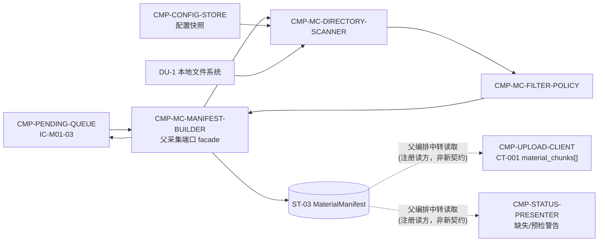

# 02 Architecture Decomposition — CMP-MATERIAL-COLLECTOR（L2）

> 只细化材料收集器内部；不重跑顶层 DDD，不重划 MOD-01 边界，不设计兄弟组件内部。

## 1. 局部语义细化

### 1.1 局部概念

| 概念 | 类型 | 含义 | 关键不变量 |
|---|---|---|---|
| `MaterialCollectionRequest` | 命令值对象 | 任务 UUID、作业/姓名/小组快照、三个目录配置和采集时刻 | 任务 UUID 与身份来自父编排；本层不重新生成或校验课程归属 |
| `MaterialCandidate` | 实体值对象 | 扫描到的单个文件路径、类别候选、大小、修改时间 | 只来自配置目录；不得把对话文件误归入三类材料 |
| `FilteredMaterialSet` | 局部集合 | 通过白名单的候选文件及过滤原因、预算统计 | 预算统计只针对白名单候选；不超过预算时 `over_budget=false` |
| `MaterialManifest` | 父状态 `ST-03` 的本层实现 | 代码/截图/结果条目、大小、路径引用、缺失类别、警告和身份上下文 | 类别语义与 CT-001 `material_chunks[]` 一致；生成后重传不重采 |

### 1.2 命令、事件与策略

- **命令**：`CollectConfiguredMaterials`、`ScanConfiguredDirectory`、`ApplyMaterialPolicy`、`BuildMaterialManifest`。
- **内部事件**：`CandidatesDiscovered`、`MaterialsFiltered`、`ManifestBuilt`、`MaterialCollectionFailed`。
- **策略**：目录到材料类别映射、白名单匹配、预算累计、空类别保留、快照时间锁定。
- **生命周期**：请求进入 → 扫描 → 过滤/预算预检 → 清单构建 → 交回队列 → 任务终态时由 MOD-01 协调清理。

## 2. 子节点清单（按稳定 child_id 排序）

| child_id | 名称 | 职责 | 排除项 | 拥有状态 | 需求/父层追踪 | 依赖 | 存在理由 | trace_exemption_reason |
|---|---|---|---|---|---|---|---|---|
| CMP-MC-DIRECTORY-SCANNER | 配置目录扫描器 | 读取三个配置目录，发现文件候选并标注代码/截图/结果类别候选 | 不执行白名单决策、预算统计、身份关联、上传；不读取 Codex 对话 | `ST-L2-MC-01` 候选文件集（请求级） | `REQ-DD004`；父 `REQ-D004/FR-004`；父 `ST-03`；父本地文件系统边界 | `CMP-CONFIG-STORE` 配置快照；DU-1 本地文件系统 | 将不稳定的文件系统读取与业务过滤/清单语义隔离 | |
| CMP-MC-FILTER-POLICY | 材料过滤与预算策略 | 应用文件类型白名单，计算过滤后大小预算并产生可解释警告 | 不生成最终 Manifest；不替代服务端权威拒绝；不上传或持久化任务 | `ST-L2-MC-02` 过滤结果与预检诊断（请求级） | `REQ-DD004`；`D-AC-REQ-003-01`；`KD-004`；`LCD-003` | `CMP-MC-DIRECTORY-SCANNER` 候选集；白名单与 500MB 约束 | 过滤规则和预算规则的变化原因独立于目录遍历和清单 schema | |
| CMP-MC-MANIFEST-BUILDER | 材料清单构建器 | 将通过预检的材料与身份快照、类别、缺失项和警告组装为 `MaterialManifest`，实现父采集端口返回 | 不扫描目录、不改变过滤结果、不上传、不执行服务端校验 | `ST-03`；内部 `ST-L2-MC-03` 清单构建结果 | `REQ-DD004`；`D-AC-REQ-003-01`；父 `IC-M01-03`；CT-001 `material_chunks[]` | `CMP-MC-FILTER-POLICY` 结果；`CMP-PENDING-QUEUE` 任务上下文 | 清单是上传与展示读取的单一来源，必须由单一 child 负责 schema 与身份绑定 | |

## 3. 依赖图与协作边界

- `CMP-PENDING-QUEUE` 是父层编排者；`IC-M01-03` 入口唯一，由 `CMP-MC-MANIFEST-BUILDER` 作为 facade 实现，目标组件不创建新的公共入口。
- `CMP-UPLOAD-CLIENT` 和 `CMP-STATUS-PRESENTER` 只作为 `ST-03` 注册读方经父编排读取清单/诊断（见 `03-state-and-data.md` §1）；图中虚线读边不是直接调用，不构成新的跨组件数据流；其内部不在本包重设计。
- 兄弟组件被引用但未被重设计；无新的跨 MOD-01 公共契约。

## 4. 局部状态与不变量映射

| 状态/不变量 | Owner | 说明 |
|---|---|---|
| `ST-L2-MC-01` 候选集 | `CMP-MC-DIRECTORY-SCANNER` | 仅存在于一次采集请求；不作为父级持久状态外发 |
| `ST-L2-MC-02` 过滤结果 | `CMP-MC-FILTER-POLICY` | 包含可上传候选与过滤/预算诊断；不拥有服务端判定 |
| `ST-L2-MC-03` 清单构建结果 | `CMP-MC-MANIFEST-BUILDER` | 构建完成后交给父 `ST-03` 所有权；本层不另建长期副本 |
| `INV-L2-MC-01` | 组件 | 代码、截图、结果类别必须分别映射到父 `material_chunks[]` 类别 |
| `INV-L2-MC-02` | 组件 | 预检告警不等于服务端拒绝；服务端仍是 KD-004 权威 |
| `INV-L2-MC-03` | 组件 | 同一任务 UUID 的重传复用同一采集快照，不重扫生成新清单 |
| `INV-L2-MC-04` | 组件 | 空目录类别保留并产生可展示缺失信息，不由本层阻断提交 |

## 5. C1-C6 结果

| 映射 | 结果 |
|---|---|
| C1 | 一个父节点细化为扫描、过滤策略、清单构建三个内部 child；均无独立部署身份 |
| C2 | 候选集/过滤结果为请求级内部状态；`ST-03` 最终仍由目标组件拥有 |
| C3 | 父采集流按扫描→过滤→组装顺序实现；失败时返回可解释的材料收集错误 |
| C4 | `IC-M01-03` 由清单构建器代表目标组件实现；两个内部契约均以 `IC-L2-MC-*` 作用域隔离 |
| C5 | 文件系统访问封装在扫描器内作为 ACL/Adapter；不引入新外部系统 |
| C6 | 白名单、预算、空类别和快照规则均为组件内策略；不改变父技术/部署决策 |
