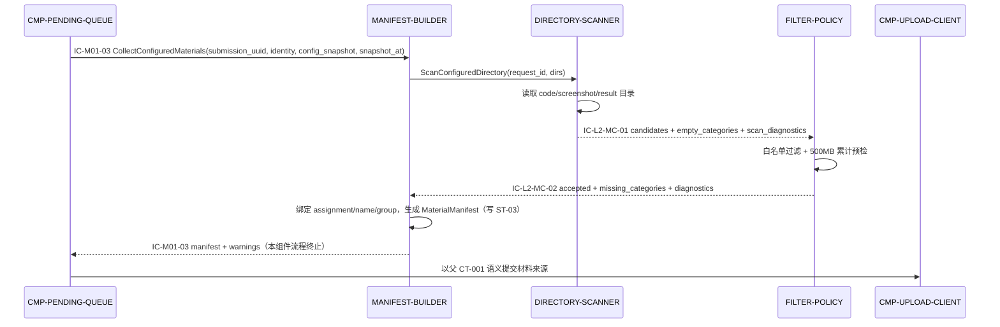
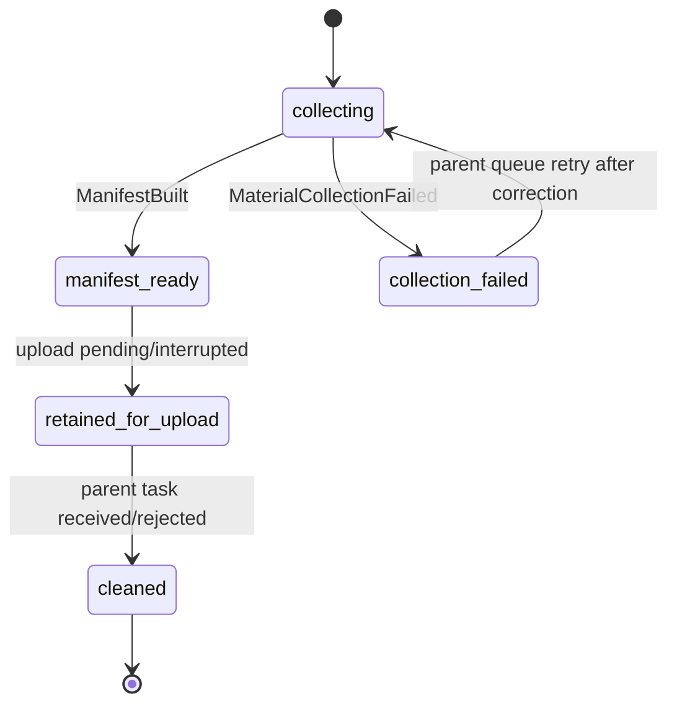

# 04 Contracts and Runtime — CMP-MATERIAL-COLLECTOR（L2）

## 1. 继承契约清单

| contract_id | 本层角色 | Owner | Path/topic/name | 字段/副作用 | 依赖 | 失败/超时 | 版本 |
|---|---|---|---|---|---|---|---|
| CT-001 | 间接材料来源；由 UPLOAD-CLIENT 执行 consumer 侧 | MOD-02 | 父包定义的上传契约 | `material_chunks[]` 的类别、字段、顺序和提交副作用遵循父包；本层只提供内容来源 | IC-M01-03、UPLOAD-CLIENT、令牌/幂等/分片约定 | 服务端错误码和 30 秒未知结果语义原样传递；本层不重试整包、不改错误码 | 父包 CT-001 版本；本层不升级 |
| IC-M01-03 | Consumer 实现的一部分 | CMP-PENDING-QUEUE → CMP-MATERIAL-COLLECTOR | MOD-01 内采集编排端口 | 输入包含 submission UUID、身份快照、配置快照/目录引用、采集时刻；输出为 MaterialManifest 或材料收集错误 | CONFIG-STORE、本地文件系统 | 配置失效/目录不可读返回可解释材料收集失败；不产生 CT-001 网络调用 | L1 定义；本层不改名/不升版 |

### 父契约不可变确认

本层没有修改 CT-001 或 IC-M01-03 的 owner、标识符、路径、必需字段、产出字段、外部副作用、依赖、错误/超时/重试、幂等或版本语义；没有新增跨模块契约。

## 2. 父契约实现映射

| 父契约 | 当前 L2 实现 | 语义保持 |
|---|---|---|
| IC-M01-03 输入 | `CMP-MC-DIRECTORY-SCANNER` 接收目录/任务上下文；`CMP-MC-MANIFEST-BUILDER` 负责最终返回 | 输入身份与 UUID 来自队列；本层不重新解释父编排条件 |
| IC-M01-03 输出 | `CMP-MC-MANIFEST-BUILDER` 产出 `MaterialManifest`、缺失类别和诊断 | 清单仍归 ST-03；错误仍回到队列本地任务视图 |
| CT-001 `material_chunks[]` | `CMP-MC-MANIFEST-BUILDER` 将三类条目交给 `CMP-UPLOAD-CLIENT` | 类别、字段、服务端权威和版本均不变 |

## 3. L2 内部契约（按稳定 ID 排序）

| contract_id | Owner → Consumer | Trigger | Schema | 副作用/依赖 | 错误、重试、幂等、兼容 |
|---|---|---|---|---|---|
| IC-L2-MC-01 | CMP-MC-DIRECTORY-SCANNER → CMP-MC-FILTER-POLICY | 候选扫描完成 | `MaterialCandidateSet{request_id, task_uuid, candidates[{path, category_candidate, size, modified_at}], empty_categories[], scan_diagnostics[]}` | 只传递本机路径/元数据；依赖本地文件系统 | 单请求幂等；扫描失败按类别记录诊断；重试由父队列触发，不改变 task UUID；只允许向后追加诊断字段 |
| IC-L2-MC-02 | CMP-MC-FILTER-POLICY → CMP-MC-MANIFEST-BUILDER | 白名单与预算预检完成 | `FilteredMaterialSet{request_id, task_uuid, accepted[{path, category, size}], filtered[{path, reason}], total_accepted_bytes, over_budget, warnings[], missing_categories[], diagnostics[]}` | 不读网络、不改变源文件；依赖 KD-004 | 过滤失败返回显式错误；同一候选集重复处理结果稳定；新诊断字段可追加，类别值不可私自扩展 |

内部契约均限定在 `CMP-MATERIAL-COLLECTOR` 内，不提升为 MOD-01 跨组件公共接口。`IC-M01-03` 的外部语义由 L2 child 的内部实现组合完成。

### 3.1 字段级契约（机器可读）

以下字段级契约供 validator 与 L3 细化稳定消费；与上文表格语义一致，字段名为稳定标识。

```yaml
IC-M01-03-L2-view:                      # 父契约 IC-M01-03 的本层实现视图，不改父语义
  entry_component: CMP-MC-MANIFEST-BUILDER   # 父采集端口唯一入口（facade），内部再编排扫描/过滤
  owner: CMP-MATERIAL-COLLECTOR
  consumer: CMP-PENDING-QUEUE
  inbound_required_fields:
    - submission_uuid                 # 任务/提交 UUID，兼作幂等关联键
    - identity_snapshot: {assignment, student_name, group_name}
    - config_snapshot: {code_dir, screenshot_dir, result_dir}
    - snapshot_at                     # 任务创建时刻，快照锁定基准
  outbound_produced_fields:
    - MaterialManifest:
        submission_uuid: string
        identity: {assignment, student_name, group_name}
        entries: [{path, category, size, modified_at}]   # category ∈ {code, screenshot, result}
        missing_categories: [string]
        warnings: [string]
        total_accepted_bytes: int
        over_budget: bool
        snapshot_at: timestamp
  error_codes:                        # 统一包装为 MaterialCollectionFailed{code, category?, reason}
    - MC-ERR-CONFIG-INVALID           # 配置快照失效或目录字段缺失
    - MC-ERR-DIR-UNREADABLE           # 关键目录不可读/元数据无法取得；category 定位类别
    - MC-ERR-COLLECT-BUSY             # 同一 task_uuid 已有 active collection（INV-L2-MC-06）
  events: [ManifestBuilt, MaterialCollectionFailed]
  next_hop: 成功或失败均返回 CMP-PENDING-QUEUE 后本组件流程终止；重试由队列在修复后重新触发

IC-L2-MC-01:
  owner: CMP-MC-DIRECTORY-SCANNER
  consumer: CMP-MC-FILTER-POLICY
  inbound_required_fields: [request_id, task_uuid, config_snapshot{code_dir, screenshot_dir, result_dir}]
  outbound_produced_fields:
    - request_id
    - task_uuid
    - candidates: [{path, category_candidate, size, modified_at}]
    - empty_categories: [string]
    - scan_diagnostics: [string]
  error_codes: [MC-ERR-DIR-UNREADABLE]   # 类别级诊断；关键目录全失败时上抛
  events: [CandidatesDiscovered, MaterialCollectionFailed]
  next_hop: CMP-MC-FILTER-POLICY

IC-L2-MC-02:
  owner: CMP-MC-FILTER-POLICY
  consumer: CMP-MC-MANIFEST-BUILDER
  inbound_required_fields:               # 全部由 IC-L2-MC-01 outbound 覆盖
    [request_id, task_uuid, candidates, empty_categories, scan_diagnostics]
  outbound_produced_fields:
    - request_id
    - task_uuid
    - accepted: [{path, category, size}]
    - filtered: [{path, reason}]
    - total_accepted_bytes
    - over_budget
    - warnings: [string]
    - missing_categories: [string]       # 透传自 IC-L2-MC-01.empty_categories
    - diagnostics: [string]              # 合并 scan_diagnostics 与过滤/预算诊断
  error_codes: [MC-ERR-CONFIG-INVALID]   # 白名单/预算规则所依赖的约束不可解析时显式失败
  events: [MaterialsFiltered]
  next_hop: CMP-MC-MANIFEST-BUILDER
```

字段覆盖断言（验证器可直接检查）：

- `IC-L2-MC-01.outbound_produced_fields ⊇ IC-L2-MC-02.inbound_required_fields`（含 `empty_categories`、`scan_diagnostics` 透传，不在过滤器处断裂）。
- `IC-L2-MC-02.outbound_produced_fields ⊇ CMP-MC-MANIFEST-BUILDER 组装 MaterialManifest 所需的全部输入`（`missing_categories[]`、`warnings[]`、`over_budget`、`total_accepted_bytes`、`accepted[]` 均有来源）。
- `IC-M01-03-L2-view.inbound_required_fields` 全部来自父编排既有语义；`outbound_produced_fields` 不新增父契约未定义的对外字段。

## 4. 运行流

### 4.1 成功流：生成可上传清单



- 入口唯一：`IC-M01-03` 由 `CMP-MC-MANIFEST-BUILDER` 作为父采集端口的 facade 实现；扫描器/过滤器不直接暴露给 `CMP-PENDING-QUEUE`。
- 终止条件：队列收到 `MaterialManifest` 或 `MaterialCollectionFailed{code}` 即本组件流程终止；`PQ->>UC` 属于父层上传编排，不是本组件的数据流。

### 4.2 失败/恢复流：目录变为不可读

1. 队列以同一任务 UUID 发起采集。
2. 扫描器发现某配置目录不可读或文件元数据无法取得，经 `CMP-MC-MANIFEST-BUILDER` 返回 `MaterialCollectionFailed{code=MC-ERR-DIR-UNREADABLE, category, reason}`（错误码枚举见 §3.1）与类别级原因；不发起网络调用，不触碰已有 `ST-03`。
3. 队列记录本地失败原因并交给状态展示器；修复配置/目录后由队列重新触发采集。
4. 若已有成功快照且任务只是上传中断，恢复路径复用原 `ST-03`，不得因恢复而重新扫描。

### 4.3 生命周期流：任务终态清理



状态机要素表（owner、前置条件、触发、分支与可观测副作用）：

| 迁移 | Owner | 前置条件 | 触发事件 | 成功/失败分支 | 可观测副作用 |
|---|---|---|---|---|---|
| `[*] → collecting` | CMP-MC-MANIFEST-BUILDER | 同一 `task_uuid` 无 active collection（INV-L2-MC-06），否则直接返回 `MC-ERR-COLLECT-BUSY` 不进入本状态 | `IC-M01-03` 采集请求 | 配置快照失效 → 直接 `collection_failed`（`MC-ERR-CONFIG-INVALID`） | 创建请求级 `ST-L2-MC-01`；记录采集开始（类别、目录摘要） |
| `collecting → manifest_ready` | CMP-MC-MANIFEST-BUILDER | `IC-L2-MC-02` 成功返回且字段覆盖断言满足 | `ManifestBuilt` | — | 写入 `ST-03`；向队列返回 manifest + warnings；记录条目数、大小累计、缺失类别 |
| `collecting → collection_failed` | CMP-MC-MANIFEST-BUILDER | 扫描/过滤/构建任一环节显式失败 | `MaterialCollectionFailed{code}` | 按 `code` 区分配置失效、目录不可读等分支 | **不触碰已有 `ST-03`**；返回错误码与类别级原因；释放请求级 `ST-L2-MC-01/02` |
| `collection_failed → collecting` | CMP-PENDING-QUEUE（父编排触发） | 配置/目录已修复 | 队列以同一 `task_uuid` 重新触发采集 | — | 新建请求级候选集；失败历史保留在队列本地任务视图 |
| `manifest_ready → retained_for_upload` | CMP-MC-MANIFEST-BUILDER | 清单已交回队列，上传 pending 或中断 | 父上传编排状态 | `upload_failed`/结果未知时保持本状态，不清理 | 保留清单与暂存引用；同一 submission UUID 复用快照（INV-L2-MC-04/05） |
| `retained_for_upload → cleaned` | CMP-PENDING-QUEUE 协调，本组件执行 | 任务进入父层终态 `received`/`rejected` | 父终态清理通知 | 非终态不得进入本迁移 | 删除/释放 `ST-03` 关联路径引用与请求级缓存；记录清理完成 |
| `cleaned → [*]` | CMP-MC-MANIFEST-BUILDER | 清理完成 | — | — | 不再持有该任务任何材料引用 |

## 5. 错误、超时、重试、幂等与可观测

| 主题 | L2 规则 | 父层依据 |
|---|---|---|
| 文件读取错误 | 以类别/路径诊断返回；不伪造空成功；是否允许继续由清单构建规则决定，关键目录完全不可读则返回 `MaterialCollectionFailed{code=MC-ERR-DIR-UNREADABLE}`（枚举见 §3.1） | `IC-M01-03`、父材料收集流 |
| 预算超限 | 生成 `over_budget=true` 与警告；不代替服务端 `PAYLOAD_TOO_LARGE`，不自行把任务置为远端 rejected | KD-004、LCD-003 |
| 白名单不匹配 | 过滤并记录原因，不把被过滤文件放入 `material_chunks[]`；服务端仍可再次判定 | KD-004 |
| 超时 | 本组件无远端超时；CT-001 30 秒未知结果由 UPLOAD-CLIENT/PENDING-QUEUE 转 CT-002 | L1 `04` CT-001/CT-002 |
| 重试 | 采集失败可在修复后重采；上传中断不重采，沿用原清单和 UUID | LCD-002、KD-005 |
| 幂等 | `task_uuid/submission_uuid` 作为请求关联键；同一请求不生成第二份有效清单 | L1 INV-2/INV-4 |
| 可观测 | 记录类别、路径摘要、过滤原因、大小累计、缺失类别和收集失败原因；不记录材料正文到展示日志 | D-AC-REQ-003-01、隐私约束 |
| 兼容 | 内部结果允许追加诊断字段；父 CT-001 类别和值不可私自扩展，涉及变更必须 return_to_parent | 父 CT-001 versioning |

## 6. 父/兄弟边界确认

- 不向 `CMP-CONFIG-STORE`、`CMP-PENDING-QUEUE`、`CMP-UPLOAD-CLIENT` 或 `CMP-STATUS-PRESENTER` 转移状态所有权。
- `CMP-UPLOAD-CLIENT` 与 `CMP-STATUS-PRESENTER` 对清单/诊断的访问是 `ST-03` 注册读方语义（见 `03-state-and-data.md` §1/§3.2），经父编排中转读取；本组件不向它们发起直接调用，不因此产生新的跨组件数据流或契约。
- 不创建新的网络 endpoint、事件总线、服务容器或部署单元。
- 不设计 `CMP-DIALOGUE-COLLECTOR` 的对话导出内部；对话材料通过父编排与材料清单并行汇合。
