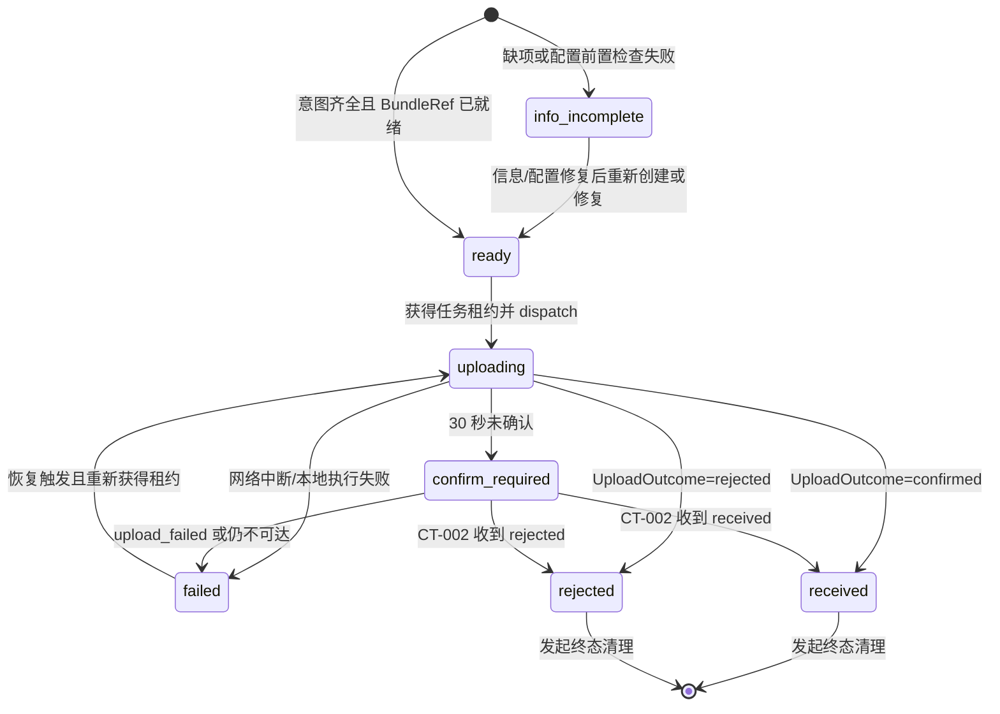
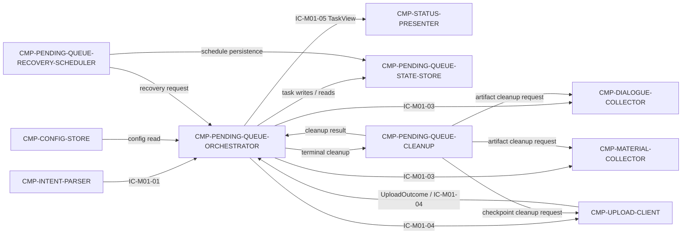

# 02 Architecture Decomposition — CMP-PENDING-QUEUE 内部结构

> 本文件只细化 `MOD-01` 的 `CMP-PENDING-QUEUE`，不重划父 BC/模块，不设计兄弟组件内部，不引入新的运行时边界。

## 1. 局部概念、聚合与策略

| 局部概念 | 类型 | 含义 | 关键不变量 | 主要 owner |
|---|---|---|---|---|
| `PendingTask` | 局部聚合 | 一次提交的本地任务记录，包含 uuid、意图快照、BundleRef、客户端状态、失败原因和时间戳 | uuid 创建后不可变；状态迁移必须合法且原子 | ORCHESTRATOR |
| `TaskLease` | 值对象 | 当前任务的执行租约，包含 lease_id、owner、expires_at | 同一 uuid 同时最多一个活跃租约 | ORCHESTRATOR |
| `RecoveryTrigger` | 值对象 | 启动、可达性提示、退避定时器或手动重试产生的恢复原因 | 触发只能请求恢复，不能直接改任务状态 | RECOVERY-SCHEDULER |
| `CleanupIntent` | 值对象 | 终态清理请求，包含 uuid、terminal_state、关联 artifact refs | 仅 received/rejected 可触发；清理失败不得删除非终态任务 | CLEANUP |
| `TaskTransitionPolicy` | 策略 | 校验 `ready/uploading/confirm_required/failed/received/rejected` 的合法迁移 | 不复制 MOD-02 权威状态机；只维护客户端视图 | ORCHESTRATOR |

### 1.1 本地状态机

`received/rejected` 是来自 `CMP-UPLOAD-CLIENT` 的远端应答；本层不自行判定服务端状态。

## 2. 子节点清单（按稳定 child_id 排序）

| child_id | 职责 | 排除项 | 拥有状态 | 需求/父层追踪 | 依赖 | 存在理由 | trace_exemption_reason |
|---|---|---|---|---|---|---|---|
| `CMP-PENDING-QUEUE-CLEANUP` | 协调 received/rejected 终态后的本地任务与关联 artifact 清理；记录清理失败并安排重试 | 不执行服务端删除；不清理 failed/confirm_required；不改变远端保留策略 | `ST-PQ-04 CleanupLedger` | `REQ-DD001`；当前 PRD「任务终态清理」；L1 `retention_boundary` | ORCHESTRATOR、DIALOGUE-COLLECTOR、MATERIAL-COLLECTOR、UPLOAD-CLIENT | 终态清理的生命周期与任务状态推进不同，需要集中保证隐私和失败恢复 | — |
| `CMP-PENDING-QUEUE-ORCHESTRATOR` | 创建 PendingTask、执行前置检查、推进本地状态、生成/冻结 uuid、编排采集和上传、生成 TaskView 数据 | 不解析指令、不采集、不执行网络协议、不展示 UI | `ST-PQ-01 PendingTask`、`ST-PQ-02 TaskLease` | `REQ-DD001`；`D-AC-REQ-001-01`；L1 `ST-04`、`IC-M01-03/04/05`、`INV-1/2/3` | INTENT-PARSER、CONFIG-STORE、DIALOGUE-COLLECTOR、MATERIAL-COLLECTOR、UPLOAD-CLIENT、STATE-STORE | 任务聚合、不变量和父内部契约编排必须有单一业务 owner | — |
| `CMP-PENDING-QUEUE-RECOVERY-SCHEDULER` | 产生恢复触发、按退避策略选择候选任务、请求 ORCHESTRATOR 恢复；支持启动、可达性提示、定时和手动触发 | 不直接修改 PendingTask；不调用 CT-001/CT-002；不创建新 uuid | `ST-PQ-03 RecoverySchedule` | L1 `LCD-005`；AC-REQ-001-01 exceptions；CT-001 Retry | ORCHESTRATOR、STATE-STORE、宿主 worker/网络提示 | 恢复触发机制是 L1 明确委托项，且有独立失败策略和调度生命周期 | — |
| `CMP-PENDING-QUEUE-STATE-STORE` | 提供本地 PendingTask/lease/schedule/cleanup 的持久化端口；保证原子写入、重启可恢复和版本校验 | 不决定业务迁移；不选择服务端存储；具体文件/KV 产品与序列化格式下沉 | `ST-PQ-05 StateStoreEnvelope` | L1 `A-007`；父 `ST-04`、`KD-005`；`REQ-DD001` | 本机持久化介质、ORCHESTRATOR、RECOVERY-SCHEDULER、CLEANUP | 将业务状态与持久化机制隔离，保证不把 implementation_detail 变成父层边界 | — |

追踪豁免数：0。所有子节点均有当前需求或父层追踪。

## 3. 子节点依赖图

`MOD-02`、宿主 Codex 环境和本地文件系统只作为父边界依赖引用；本层不重设计它们。既有 sibling `CMP-CONFIG-STORE`、`CMP-DIALOGUE-COLLECTOR` 的内部结构不在本文件展开。

## 4. C1–C6 映射记录

| 映射 | 结果 |
|---|---|
| C1 | `CMP-PENDING-QUEUE` 细化为 4 个稳定 child_id，全部留在 `MOD-01` 内，未创建新服务或部署单元 |
| C2 | `ST-04` 的业务 owner 由 ORCHESTRATOR 承接；STATE-STORE 只持有持久化包络，未转移 MOD-02 Submission 所有权 |
| C3 | L1 R1/R2 的创建、上传、失败、恢复、终态顺序由 ORCHESTRATOR + RECOVERY-SCHEDULER + CLEANUP 实现 |
| C4 | IC-M01-03/04/05 通过内部子契约映射；父字段、owner、side_effects、失败与版本语义不变 |
| C5 | L1 的本机 worker/持久化介质仅通过 STATE-STORE 与 scheduler trigger port 适配；没有新增外部系统 |
| C6 | 本地可靠性、原子性、单任务串行化、恢复与隐私清理转为内部策略；未引入父层平台 |

## 5. 分解理由

1. ORCHESTRATOR 拥有 PendingTask 业务不变量，避免状态迁移、上传调度和任务创建出现多个写方。
2. STATE-STORE 与 ORCHESTRATOR 分离，允许 A-007 的具体持久化产品下沉，同时保留原子性和崩溃恢复架构语义。
3. RECOVERY-SCHEDULER 独立承接 LCD-005，触发来源可演进而不改变任务状态机和 CT-001/CT-002。
4. CLEANUP 独立承接终态删除和清理失败重试，避免终态清理逻辑侵入上传状态迁移，并保持 ST-02/ST-03/ST-05 各自清理 owner。
