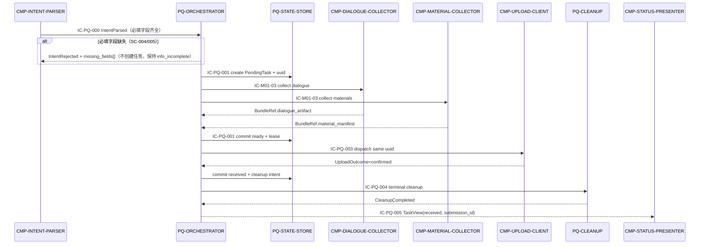

# 04 Contracts and Runtime — CMP-PENDING-QUEUE 契约与运行时

> 本层只定义 `CMP-PENDING-QUEUE` 内部实现映射。父契约的 identifier、owner、路径、字段、副作用、失败、重试、幂等和版本语义保持不变。

## 1. 父契约与当前节点实现映射

| 父契约 | 当前节点角色 | 子节点映射 | 保持确认 |
|---|---|---|---|
| `IC-M01-01` 意图解析结果端口 | Consumer/接收方 | ORCHESTRATOR 消费 IntentParsed，前置检查通过后创建 PendingTask，缺项时返回缺失字段并保持 info_incomplete | 意图字段、缺项不创建可评分提交、command_id 幂等语义不变 |
| `IC-M01-03` 采集编排端口 | Provider/编排方 | ORCHESTRATOR 产生 task_ref；DC/MC 返回 BundleRef 后由 ORCHESTRATOR 写入任务 | task_ref 点路径、一次性快照、错误码和不重复采集语义不变 |
| `IC-M01-04` 上传执行端口 | Consumer/驱动方 | ORCHESTRATOR 生成 UploadJob；RECOVERY-SCHEDULER 触发恢复；UPLOAD-CLIENT 仍是执行方 | uuid、checkpoint、UploadOutcome、30 秒 unknown 和 CT-002 查询语义不变 |
| `IC-M01-05` 状态展示端口 | Provider/数据源 | ORCHESTRATOR 从 ST-PQ-01 生成 TaskView，STATUS-PRESENTER 只读消费 | `confirm_required` 不伪造结论；展示字段只追加 |
| CT-001/CT-002/auth-token | 间接约束 | 不在本层直接调用；通过 IC-M01-04 委托 CMP-UPLOAD-CLIENT | HTTPS、`/api/v1`、错误码、重试与版本策略不变 |

## 2. 当前节点内部契约（按稳定 ID 排序）

### `IC-PQ-000` Intent Intake Port

- `contract_type`: internal_command
- `provider`: `CMP-INTENT-PARSER`
- `consumer`: `CMP-PENDING-QUEUE-ORCHESTRATOR`
- `trigger`: student submission intent parsed with complete or incomplete required fields
- `inbound_required_fields`: `course_id`, `assignment_ref`, `identity`, `group_ref`
- `inbound_optional_fields`: `command_id`, `bundle_ref`
- `outbound_produced_fields`: `task_ref`, `missing_fields[]`, `intake_result`
- `side_effects`: on complete intent, create `ST-PQ-01` via IC-PQ-001; on missing fields, no task is created and intake_result=info_incomplete
- `dependencies`: [`IC-M01-01`, `ST-PQ-01`]
- `errors`: `INTENT_INCOMPLETE`, `CONFIG_UNAVAILABLE`, `INTENT_DUPLICATE`
- `idempotency`: same command_id returns the existing task_ref; repeated intent does not create a second task
- `compatibility`: parent IC-M01-01 field semantics unchanged; optional fields append-only
- 父字段映射：`assignment_ref`/`identity`/`group_ref` 分别承接父 `SubmissionIntent{assignment, student_name, group_name}`；`course_id` 来自课程绑定配置（IC-M01-02 只读）；`missing_fields[]` 即父 `MissingFields{fields[]}`；`bundle_ref` 为恢复/补采场景下的既有 BundleRef 引用；`command_id` 为指令级幂等键

### `IC-PQ-001` Task Lifecycle Port

- `contract_type`: internal_port
- `provider`: `CMP-PENDING-QUEUE-ORCHESTRATOR`
- `consumer`: `CMP-PENDING-QUEUE-STATE-STORE`
- `trigger`: create, transition, lease change or recovery outcome
- `inbound_required_fields`: `task_uuid`, `expected_revision`, `transition`, `reason?`
- `outbound_produced_fields`: `task_record`, `new_revision`, `transition_result`
- `side_effects`: atomic write of `ST-PQ-01` and related `ST-PQ-02`; no network
- `dependencies`: [`ST-PQ-01`, `ST-PQ-02`, `ST-PQ-05`]
- `errors`: `REVISION_CONFLICT`, `INVALID_TRANSITION`, `STATE_CORRUPT`
- `idempotency`: same task_uuid + same transition_id returns the existing result
- `compatibility`: add optional fields only; state names remain parent-compatible

### `IC-PQ-002` Recovery Trigger Port

- `contract_type`: internal_command
- `provider`: `CMP-PENDING-QUEUE-RECOVERY-SCHEDULER`
- `consumer`: `CMP-PENDING-QUEUE-ORCHESTRATOR`
- `trigger`: process_start, reachability_hint, backoff_due or manual_retry
- `inbound_required_fields`: `trigger_id`, `trigger_type`
- `inbound_optional_fields`: `task_uuid`, `observed_at`, `reason`
- `outbound_produced_fields`: `recovery_request_id`, `candidate_task_uuids[]`
- `side_effects`: none on trigger receipt; ORCHESTRATOR later updates state
- `dependencies`: [`ST-PQ-01`, `ST-PQ-03`, `ST-PQ-05`]
- `errors`: `TRIGGER_DUPLICATE`, `SCHEDULE_UNAVAILABLE`
- `idempotency`: trigger_id deduplicated; repeated scan does not create duplicate leases
- `compatibility`: trigger types may be appended; existing trigger meaning remains stable

### `IC-PQ-003` Upload Dispatch Port

- `contract_type`: internal_command_callback
- `provider`: `CMP-PENDING-QUEUE-ORCHESTRATOR`
- `consumer`: `CMP-UPLOAD-CLIENT`
- `trigger`: ready task or recovery request after lease acquisition
- `inbound_required_fields`: `submission_uuid`, `bundle_ref`, `identity`, `dispatch_id`
- `inbound_optional_fields`: `checkpoint_ref`, `lease_id`
- `outbound_produced_fields`: `upload_outcome.status`, `submission_id?`, `received_at?`, `missing_items[]?`, `rejection_reason?`, `cause?`
- `side_effects`: consumer performs the inherited IC-M01-04 / CT-001/CT-002 interaction; current node updates ST-PQ-01 after callback
- `dependencies`: [`IC-M01-04`, `ST-PQ-01`, `ST-PQ-02`]
- `errors`: `LEASE_CONFLICT`, `NETWORK_INTERRUPTED`, `REMOTE_STATUS_UNKNOWN`, inherited upload errors
- `idempotency`: same dispatch_id is single-flight; same uuid resumes via the existing checkpoint
- `compatibility`: no new parent-required fields; internal optional fields only

### `IC-PQ-004` Terminal Cleanup Port

- `contract_type`: internal_command_callback
- `provider`: `CMP-PENDING-QUEUE-ORCHESTRATOR`
- `consumer`: `CMP-PENDING-QUEUE-CLEANUP`
- `trigger`: task enters received or rejected
- `inbound_required_fields`: `task_uuid`, `terminal_state`, `artifact_refs[]`
- `outbound_produced_fields`: `cleanup_status`, `pending_items[]`, `last_error?`
- `side_effects`: local cleanup of ST-02/ST-03/ST-04/ST-05 through their existing owners; no network
- `dependencies`: [`ST-PQ-01`, `ST-PQ-04`]
- `errors`: `LOCAL_CLEANUP_FAILED`, `ARTIFACT_NOT_FOUND` (not-found is idempotent success when already absent)
- `idempotency`: repeated cleanup for same task_uuid and artifact ref is safe
- `compatibility`: terminal states remain exactly `received` and `rejected`

### `IC-PQ-005` Task View Port

- `contract_type`: internal_query
- `provider`: `CMP-PENDING-QUEUE-ORCHESTRATOR`
- `consumer`: `CMP-STATUS-PRESENTER`
- `trigger`: task changed or student requests status
- `inbound_required_fields`: `task_uuid?`
- `outbound_produced_fields`: `status`, `submission_id?`, `missing_items[]`, `failure_reason?`, `progress?`, `retry_at?`
- `side_effects`: None; read-only
- `dependencies`: [`ST-PQ-01`, `ST-PQ-03`]
- `errors`: `VIEW_NOT_AVAILABLE`
- `idempotency`: naturally idempotent
- `compatibility`: append-only view fields; no remote state inference

### `IC-PQ-006` Cleanup Ledger Port

- `contract_type`: internal_port
- `provider`: `CMP-PENDING-QUEUE-STATE-STORE`
- `consumer`: `CMP-PENDING-QUEUE-CLEANUP`
- `trigger`: task enters received/rejected, or a cleanup retry becomes due
- `inbound_required_fields`: `task_uuid`, `ledger_operation`
- `inbound_optional_fields`: `terminal_state`, `artifact_refs[]`, `pending_items[]`, `last_error`, `next_retry_at`
- `outbound_produced_fields`: `ledger_record`, `new_revision`, `operation_result`
- `side_effects`: atomic write of `ST-PQ-04` through STATE-STORE; no network
- `dependencies`: [`ST-PQ-04`, `ST-PQ-05`]
- `errors`: `REVISION_CONFLICT`, `STATE_CORRUPT`, `LEDGER_NOT_FOUND`
- `idempotency`: same task_uuid + same ledger_operation returns the existing result
- `compatibility`: ledger fields append-only; terminal_state values remain `received`/`rejected`

### `IC-PQ-007` Dialogue Artifact Cleanup Port

- `contract_type`: internal_command_callback
- `provider`: `CMP-PENDING-QUEUE-CLEANUP`
- `consumer`: `CMP-DIALOGUE-COLLECTOR`
- `trigger`: terminal cleanup for a received/rejected task reaches the dialogue artifact
- `inbound_required_fields`: `task_uuid`, `artifact_refs[]`, `cleanup_scope`
- `outbound_produced_fields`: `artifact_cleanup_status[]`, `last_error?`
- `side_effects`: consumer deletes its own ST-02 artifacts; CLEANUP only coordinates, no network
- `dependencies`: [`ST-PQ-04`, parent `ST-02`]
- `errors`: `ARTIFACT_NOT_FOUND` (idempotent success when already absent), `ARTIFACT_BUSY`, `LOCAL_CLEANUP_FAILED`
- `idempotency`: repeated cleanup of the same artifact ref is safe
- `compatibility`: does not change ST-02 ownership or non-terminal retention

### `IC-PQ-008` Material Artifact Cleanup Port

- `contract_type`: internal_command_callback
- `provider`: `CMP-PENDING-QUEUE-CLEANUP`
- `consumer`: `CMP-MATERIAL-COLLECTOR`
- `trigger`: terminal cleanup for a received/rejected task reaches the material manifest
- `inbound_required_fields`: `task_uuid`, `artifact_refs[]`, `cleanup_scope`
- `outbound_produced_fields`: `artifact_cleanup_status[]`, `last_error?`
- `side_effects`: consumer deletes its own ST-03 artifacts; CLEANUP only coordinates, no network
- `dependencies`: [`ST-PQ-04`, parent `ST-03`]
- `errors`: `ARTIFACT_NOT_FOUND` (idempotent success when already absent), `ARTIFACT_BUSY`, `LOCAL_CLEANUP_FAILED`
- `idempotency`: repeated cleanup of the same artifact ref is safe
- `compatibility`: does not change ST-03 ownership or non-terminal retention

### `IC-PQ-009` Checkpoint Cleanup Port

- `contract_type`: internal_command_callback
- `provider`: `CMP-PENDING-QUEUE-CLEANUP`
- `consumer`: `CMP-UPLOAD-CLIENT`
- `trigger`: terminal cleanup for a received/rejected task reaches the upload checkpoint
- `inbound_required_fields`: `task_uuid`, `artifact_refs[]`, `cleanup_scope`
- `outbound_produced_fields`: `artifact_cleanup_status[]`, `last_error?`
- `side_effects`: consumer deletes its own ST-05 checkpoint; CLEANUP only coordinates, no network
- `dependencies`: [`ST-PQ-04`, parent `ST-05`]
- `errors`: `ARTIFACT_NOT_FOUND` (idempotent success when already absent), `ARTIFACT_BUSY`, `LOCAL_CLEANUP_FAILED`
- `idempotency`: repeated cleanup of the same checkpoint ref is safe
- `compatibility`: does not change ST-05 ownership; failed/confirm_required checkpoints are never in scope

### 2.1 机器可读契约绑定

```yaml
contract_fields:
  - contract_id: IC-PQ-000
    contract_type: internal_command
    provider: CMP-INTENT-PARSER
    consumer: CMP-PENDING-QUEUE-ORCHESTRATOR
    trigger: student submission intent parsed with complete or incomplete required fields
    inbound_required_fields: [course_id, assignment_ref, identity, group_ref]
    inbound_optional_fields: [command_id, bundle_ref]
    outbound_produced_fields: [task_ref, missing_fields[], intake_result]
    side_effects: create ST-PQ-01 via IC-PQ-001 on complete intent; no task on missing fields
    dependencies: [IC-M01-01, ST-PQ-01]
    errors: [INTENT_INCOMPLETE, CONFIG_UNAVAILABLE, INTENT_DUPLICATE]
    idempotency: same command_id returns existing task_ref; no duplicate task
    next_hop: CMP-PENDING-QUEUE-ORCHESTRATOR
    return_event: [TaskCreated, IntentRejected]
  - contract_id: IC-PQ-001
    contract_type: internal_port
    provider: CMP-PENDING-QUEUE-ORCHESTRATOR
    consumer: CMP-PENDING-QUEUE-STATE-STORE
    trigger: create, transition, lease change or recovery outcome
    inbound_required_fields: [task_uuid, expected_revision, transition]
    inbound_optional_fields: [reason, transition_id]
    outbound_produced_fields: [task_record, new_revision, transition_result]
    side_effects: atomic write of ST-PQ-01 and ST-PQ-02; no network
    dependencies: [ST-PQ-01, ST-PQ-02, ST-PQ-05]
    errors: [REVISION_CONFLICT, INVALID_TRANSITION, STATE_CORRUPT]
    idempotency: same task_uuid + same transition_id returns the existing result
    next_hop: CMP-PENDING-QUEUE-STATE-STORE
    return_event: [TaskPersisted, TransitionRejected]
  - contract_id: IC-PQ-002
    contract_type: internal_command
    provider: CMP-PENDING-QUEUE-RECOVERY-SCHEDULER
    consumer: CMP-PENDING-QUEUE-ORCHESTRATOR
    trigger: process_start, reachability_hint, backoff_due or manual_retry
    inbound_required_fields: [trigger_id, trigger_type]
    inbound_optional_fields: [task_uuid, observed_at, reason]
    outbound_produced_fields: [recovery_request_id, candidate_task_uuids[]]
    side_effects: None; request only
    dependencies: [ST-PQ-01, ST-PQ-03, ST-PQ-05]
    errors: [TRIGGER_DUPLICATE, SCHEDULE_UNAVAILABLE]
    idempotency: trigger_id deduplicated; repeated scan does not create duplicate leases
    next_hop: CMP-PENDING-QUEUE-ORCHESTRATOR
    return_event: [RecoveryRequested, RecoverySuppressed]
  - contract_id: IC-PQ-003
    contract_type: internal_command_callback
    provider: CMP-PENDING-QUEUE-ORCHESTRATOR
    consumer: CMP-UPLOAD-CLIENT
    trigger: ready task or recovery request after lease acquisition
    inbound_required_fields: [submission_uuid, bundle_ref, identity, dispatch_id]
    inbound_optional_fields: [checkpoint_ref, lease_id]
    outbound_produced_fields: [upload_outcome.status, upload_outcome.submission_id, upload_outcome.received_at, upload_outcome.missing_items[], upload_outcome.rejection_reason, upload_outcome.cause]
    side_effects: consume inherited IC-M01-04; update ST-PQ-01 on callback
    dependencies: [IC-M01-04, ST-PQ-01, ST-PQ-02]
    errors: [LEASE_CONFLICT, NETWORK_INTERRUPTED, REMOTE_STATUS_UNKNOWN]
    idempotency: same dispatch_id is single-flight; same uuid resumes via existing checkpoint
    next_hop: CMP-UPLOAD-CLIENT
    return_event: [UploadOutcomeReceived]
  - contract_id: IC-PQ-004
    contract_type: internal_command_callback
    provider: CMP-PENDING-QUEUE-ORCHESTRATOR
    consumer: CMP-PENDING-QUEUE-CLEANUP
    trigger: task enters received or rejected
    inbound_required_fields: [task_uuid, terminal_state, artifact_refs[]]
    inbound_optional_fields: []
    outbound_produced_fields: [cleanup_status, pending_items[], last_error]
    side_effects: local cleanup only; no network
    dependencies: [ST-PQ-01, ST-PQ-04]
    errors: [LOCAL_CLEANUP_FAILED, ARTIFACT_NOT_FOUND]
    idempotency: repeated cleanup for same task_uuid and artifact ref is safe
    next_hop: CMP-PENDING-QUEUE-CLEANUP
    return_event: [CleanupCompleted, CleanupRetryScheduled]
  - contract_id: IC-PQ-005
    contract_type: internal_query
    provider: CMP-PENDING-QUEUE-ORCHESTRATOR
    consumer: CMP-STATUS-PRESENTER
    trigger: task changed or student requests status
    inbound_required_fields: []
    inbound_optional_fields: [task_uuid]
    outbound_produced_fields: [status, submission_id, missing_items[], failure_reason, progress, retry_at]
    side_effects: None; read-only
    dependencies: [ST-PQ-01, ST-PQ-03]
    errors: [VIEW_NOT_AVAILABLE]
    idempotency: naturally idempotent
    next_hop: CMP-STATUS-PRESENTER
    return_event: [TaskViewUpdated]
  - contract_id: IC-PQ-006
    contract_type: internal_port
    provider: CMP-PENDING-QUEUE-STATE-STORE
    consumer: CMP-PENDING-QUEUE-CLEANUP
    trigger: task enters received/rejected, or a cleanup retry becomes due
    inbound_required_fields: [task_uuid, ledger_operation]
    inbound_optional_fields: [terminal_state, artifact_refs[], pending_items[], last_error, next_retry_at]
    outbound_produced_fields: [ledger_record, new_revision, operation_result]
    side_effects: atomic write of ST-PQ-04 through STATE-STORE; no network
    dependencies: [ST-PQ-04, ST-PQ-05]
    errors: [REVISION_CONFLICT, STATE_CORRUPT, LEDGER_NOT_FOUND]
    idempotency: same task_uuid + same ledger_operation returns the existing result
    next_hop: CMP-PENDING-QUEUE-STATE-STORE
    return_event: [CleanupLedgerPersisted]
  - contract_id: IC-PQ-007
    contract_type: internal_command_callback
    provider: CMP-PENDING-QUEUE-CLEANUP
    consumer: CMP-DIALOGUE-COLLECTOR
    trigger: terminal cleanup reaches the dialogue artifact
    inbound_required_fields: [task_uuid, artifact_refs[], cleanup_scope]
    inbound_optional_fields: []
    outbound_produced_fields: [artifact_cleanup_status[], last_error]
    side_effects: consumer deletes its own ST-02 artifacts; no network
    dependencies: [ST-PQ-04, ST-02]
    errors: [ARTIFACT_NOT_FOUND, ARTIFACT_BUSY, LOCAL_CLEANUP_FAILED]
    idempotency: repeated cleanup of the same artifact ref is safe
    next_hop: CMP-DIALOGUE-COLLECTOR
    return_event: [ArtifactCleanupCompleted]
  - contract_id: IC-PQ-008
    contract_type: internal_command_callback
    provider: CMP-PENDING-QUEUE-CLEANUP
    consumer: CMP-MATERIAL-COLLECTOR
    trigger: terminal cleanup reaches the material manifest
    inbound_required_fields: [task_uuid, artifact_refs[], cleanup_scope]
    inbound_optional_fields: []
    outbound_produced_fields: [artifact_cleanup_status[], last_error]
    side_effects: consumer deletes its own ST-03 artifacts; no network
    dependencies: [ST-PQ-04, ST-03]
    errors: [ARTIFACT_NOT_FOUND, ARTIFACT_BUSY, LOCAL_CLEANUP_FAILED]
    idempotency: repeated cleanup of the same artifact ref is safe
    next_hop: CMP-MATERIAL-COLLECTOR
    return_event: [ArtifactCleanupCompleted]
  - contract_id: IC-PQ-009
    contract_type: internal_command_callback
    provider: CMP-PENDING-QUEUE-CLEANUP
    consumer: CMP-UPLOAD-CLIENT
    trigger: terminal cleanup reaches the upload checkpoint
    inbound_required_fields: [task_uuid, artifact_refs[], cleanup_scope]
    inbound_optional_fields: []
    outbound_produced_fields: [artifact_cleanup_status[], last_error]
    side_effects: consumer deletes its own ST-05 checkpoint; no network
    dependencies: [ST-PQ-04, ST-05]
    errors: [ARTIFACT_NOT_FOUND, ARTIFACT_BUSY, LOCAL_CLEANUP_FAILED]
    idempotency: repeated cleanup of the same checkpoint ref is safe
    next_hop: CMP-UPLOAD-CLIENT
    return_event: [ArtifactCleanupCompleted]
```

## 3. 运行流

### R1：成功提交与终态清理



### R2：网络中断、退避恢复与断点续传

```mermaid
sequenceDiagram
    participant UC as CMP-UPLOAD-CLIENT
    participant O as PQ-ORCHESTRATOR
    participant SS as PQ-STATE-STORE
    participant RS as PQ-RECOVERY-SCHEDULER

    UC-->>O: UploadOutcome=interrupted
    O->>SS: atomic commit failed + checkpoint_ref
    SS-->>O: persisted revision
    O->>RS: schedule recovery
    RS->>SS: persist next_attempt_at / attempt_count
    Note over RS: startup, reachability_hint, timer_due or manual_retry
    RS->>O: IC-PQ-002 RecoveryRequested
    O->>SS: acquire single TaskLease
    O->>UC: IC-PQ-003 same uuid + checkpoint_ref
    UC-->>O: confirmed or interrupted
    O->>SS: commit outcome; reschedule only if still recoverable
```

### R3：30 秒未知结果与终态/清理边界

```mermaid
sequenceDiagram
    participant UC as CMP-UPLOAD-CLIENT
    participant O as PQ-ORCHESTRATOR
    participant SS as PQ-STATE-STORE
    participant SP as CMP-STATUS-PRESENTER
    participant CL as PQ-CLEANUP
    participant DC as CMP-DIALOGUE-COLLECTOR
    participant MC as CMP-MATERIAL-COLLECTOR

    UC-->>O: UploadOutcome=unknown
    O->>SS: commit confirm_required; preserve task
    O-->>SP: TaskView(status=confirm_required)
    Note over SP: 只展示结果未知/查询中，不显示伪造成功
    UC-->>O: CT-002 resolved received/rejected
    O->>SS: commit terminal state
    O->>CL: IC-PQ-004 cleanup artifacts
    CL->>SS: IC-PQ-006 persist CleanupLedger
    CL->>DC: IC-PQ-007 cleanup dialogue artifact
    CL->>MC: IC-PQ-008 cleanup material manifest
    CL->>UC: IC-PQ-009 cleanup upload checkpoint
    alt cleanup failure
        CL-->>O: CleanupRetryScheduled
        CL->>SS: IC-PQ-006 retain CleanupLedger only
    else cleanup complete
        CL-->>O: CleanupCompleted
        O->>SS: purge local terminal records
    end
```

## 4. 错误、超时、重试、幂等、可观测与兼容

| 主题 | 本层规则 | 依据 |
|---|---|---|
| 超时 | 队列不重新解释 30 秒超时；接受 UPLOAD-CLIENT 的 unknown，保持 `confirm_required` | L1 CT-001/CT-002、NFR-003 |
| 重试 | 可恢复网络错误进入 RecoverySchedule；认证/校验/归属拒绝不自动重试；CT-002 指数退避由 UPLOAD-CLIENT 保持 | L1 04、KD-005 |
| 幂等 | trigger_id、transition_id、dispatch_id 和 uuid 分别去重；同一 uuid 不创建第二任务 | PQ-INV-002/003、IC-PQ-001/002/003 |
| 可观测 | 持久化状态迁移、失败原因、attempt_count、last_trigger、cleanup error；不记录材料内容或令牌 | L1 SM-001、隐私约束 |
| 兼容 | 父契约不增必需字段；内部契约只追加可选字段；状态名和 terminal_state 不改 | L1 04 §6、父边界规则 |

## 5. 父外部契约语义不变确认

本层没有修改 CT-001、CT-002、auth/token 或 IC-M01-03/04/05 的 provider、consumer、路径、字段、side_effects、dependencies、失败/重试、幂等和版本策略；没有新增跨模块契约，没有改变 MOD-01/DU-1 的部署形态。
