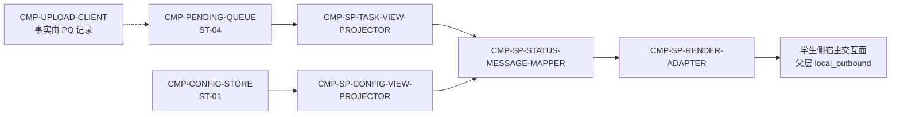

# 02 Architecture Decomposition — CMP-STATUS-PRESENTER（L2）

## 1. 局部语义细化

本节点不是 DDD 聚合，也不拥有业务实体。它是 MOD-01 内部的只读展示投影边界：把父层已经确定的事实转换为瞬时视图模型，再交给宿主展示适配器。

| 概念 | 本层定义 |
|---|---|
| `TaskView` | 来自 ST-04/IC-M01-05 的提交任务事实集合；包含状态、提交编号、缺失项、失败原因和进度 |
| `ConfigView` | 来自 ST-01/IC-M01-05 的配置完整性与目录错误事实集合 |
| `PresentationView` | 供学生侧展示的无持久化视图模型；不改变输入事实 |
| `StatusMessage` | 对状态或错误的可读映射；不是新的业务状态 |
| Projection | 同一输入快照到同一视图模型的纯转换 |
| Renderer Adapter | 将视图模型接入宿主交互面；具体 API 留给下一层 |

没有本地聚合根、命令、领域事件或业务策略。`received`、`rejected`、`upload_failed` 等是上游事实，不由本节点产生或迁移。

## 2. 子节点注册表

子节点按稳定 `child_id` 排序。每个节点均位于 `CMP-STATUS-PRESENTER` 内部；`trace_exemption_reason` 仅作为必备列，均不适用。

| child_id | 职责 | 排除项 | owned_state | 需求/父层追踪 | 依赖 | 存在理由 | trace_exemption_reason |
|---|---|---|---|---|---|---|---|
| `CMP-SP-CONFIG-VIEW-PROJECTOR` | 将 `completeness[]`、`dir_errors[]` 与配置事实投影为配置视图模型 | 不读取/写入配置存储，不决定配置是否保存 | `DS-SP-CONFIG-VIEW-MODEL`（瞬时） | `REQ-DD002`、`D-AC-REQ-002-01`、ST-01、IC-M01-05 | CMP-CONFIG-STORE → IC-M01-05 | 隔离配置展示与任务展示的变化原因 | — |
| `CMP-SP-RENDER-ADAPTER` | 将标准展示视图交给学生侧宿主交互面 | 不决定状态、不生成文案事实、不调用网络 | 无持久状态；渲染缓冲为瞬时 | `REQ-DD001/002`、父层 local_outbound、IC-M01-05 | CMP-SP-STATUS-MESSAGE-MAPPER；宿主交互面 | 隔离宿主 API/交互形式，避免污染领域语义 | — |
| `CMP-SP-STATUS-MESSAGE-MAPPER` | 将状态、缺失项、目录错误和失败原因映射为可读展示语义 | 不改变状态值、不吞掉失败原因、不执行补偿 | `DS-SP-PRESENTATION-VIEW`（瞬时） | `D-AC-REQ-001-01`、`D-AC-REQ-002-01`、FLOW-M01-001~003 | 两个 projector → IC-L2-SP-01/02 | 统一错误与状态语义，避免各展示入口出现不一致文案 | — |
| `CMP-SP-TASK-VIEW-PROJECTOR` | 将 ST-04/IC-M01-05 的任务事实投影为任务视图模型 | 不拥有 PendingTask，不查询 MOD-02，不修改状态 | `DS-SP-TASK-VIEW-MODEL`（瞬时） | `REQ-DD001`、`D-AC-REQ-001-01`、ST-04、IC-M01-05 | CMP-PENDING-QUEUE → IC-M01-05 | 隔离提交任务事实读取与状态文案决策 | — |

## 3. 局部依赖图

边界说明：`CMP-UPLOAD-CLIENT` 只通过 `CMP-PENDING-QUEUE` 产生被展示的任务事实；本层不直接消费 CT-001/CT-002。

## 4. 瞬时生命周期

`view_requested → input_snapshot_read → projected → mapped → rendered`

异常路径为 `input_unavailable → VIEW_NOT_AVAILABLE`。任何异常都不写入 ST-01/ST-04，也不触发上传、重试或状态迁移。

## 5. 分解依据

- **职责**：任务事实、配置事实、语义映射、宿主渲染分别有独立变化原因。
- **状态**：持久状态仍由父层子节点拥有；本层只产生调用级派生视图。
- **不变量**：真实状态不改写、缺项具体、失败原因保留、无网络副作用。
- **生命周期**：投影和渲染随一次展示请求创建并释放，不参与提交任务生命周期。
- **交互**：上游通过 IC-M01-05 进入，内部经过 projector/mapper，最后通过 renderer 退出。

## 6. 兄弟节点声明

本文件只引用 `CMP-PENDING-QUEUE`、`CMP-CONFIG-STORE` 和 `CMP-UPLOAD-CLIENT` 的已交接职责与契约；未设计、重命名或转移任何兄弟节点内部职责、状态所有权或跨节点契约。
