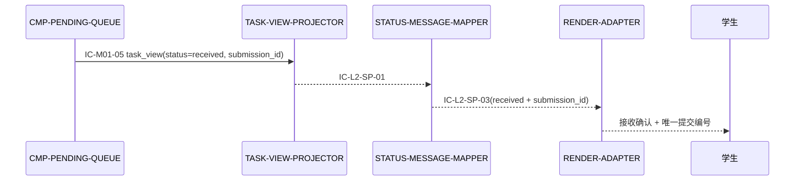
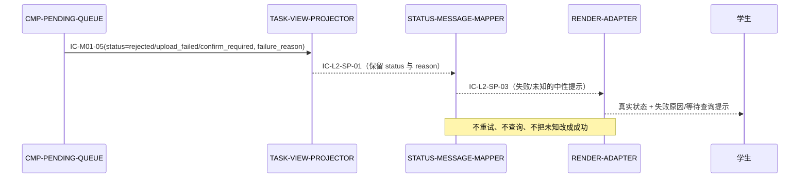
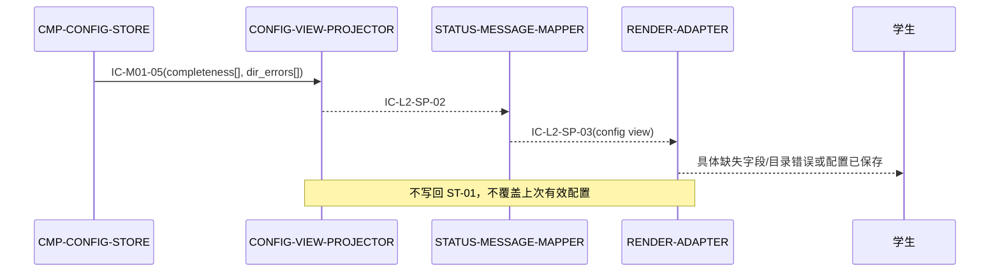

# 04 Contracts and Runtime — CMP-STATUS-PRESENTER（L2）

## 1. 继承契约清单

| contract_id | owner → consumer | path/topic/name | fields | side_effects | dependencies | failures/timeouts/retries | versioning |
|---|---|---|---|---|---|---|---|
| `IC-M01-05` | CMP-PENDING-QUEUE / CMP-CONFIG-STORE → CMP-STATUS-PRESENTER | MOD-01 内部状态展示端口 | required: `status`, `submission_id`, `missing_items[]`, `failure_reason`, `progress`, `completeness[]`, `dir_errors[]`; produced: `task_view`, `config_view`; event: `view_type` | `None; read-only` | ST-01、ST-04 | `VIEW_NOT_AVAILABLE`；本层不重试、不改变上游状态 | 仅允许父层约定的兼容追加；本层不改 ID、owner、字段或版本 |

`CT-001`、`CT-002` 和 `auth/token` 不由本节点直接消费；本节点只展示由 `CMP-PENDING-QUEUE` 依据这些契约记录的事实。

## 2. 父契约实现映射

| 父契约字段/语义 | 当前实现节点 | 保留规则 |
|---|---|---|
| `status`、`submission_id`、`progress` | CMP-SP-TASK-VIEW-PROJECTOR → STATUS-MESSAGE-MAPPER | 原样保留；不生成新的远端状态 |
| `missing_items[]`、`failure_reason` | TASK-VIEW-PROJECTOR → STATUS-MESSAGE-MAPPER | 逐项呈现；失败原因不吞掉、不替换为成功 |
| `completeness[]`、`dir_errors[]` | CMP-SP-CONFIG-VIEW-PROJECTOR → STATUS-MESSAGE-MAPPER | 保留具体字段/目录信息 |
| `task_view`、`config_view` | STATUS-MESSAGE-MAPPER → RENDER-ADAPTER | 作为学生侧只读输出，不写回父状态 |

### 2.1 字段覆盖链

逐字段声明 `IC-M01-05` 输入到 `IC-L2-SP-03` 输出的覆盖路径，保证上游 produced_fields 覆盖下游 required_fields；`message_*` 字段是由原始事实派生的可读文案，不替代原值。

| IC-M01-05 字段 | 经 | IC-L2-SP-03 字段 | 映射规则 |
|---|---|---|---|
| `status` | `IC-L2-SP-01` | `status` | 原样保留；`rejected`/`upload_failed`/`confirm_required` 不可改写为 `received` |
| `submission_id` | `IC-L2-SP-01` | `submission_id` | 原样透传，可展示 |
| `missing_items[]` | `IC-L2-SP-01` | `missing_items[]` | 逐项透传，不合并为泛化失败 |
| `failure_reason` | `IC-L2-SP-01` | `failure_reason` + `message_params.reason` | 原值透传给 renderer；另派生可读文案，不吞掉、不替换为成功 |
| `progress` | `IC-L2-SP-01` | `progress` | 原样透传 |
| `completeness[]` | `IC-L2-SP-02` | `completeness[]` | 逐项透传配置缺失字段 |
| `dir_errors[]` | `IC-L2-SP-02` | `dir_errors[]` | 逐项透传具体目录错误 |
| —（派生） | STATUS-MESSAGE-MAPPER | `view_type`, `severity`, `message_key`, `message_params`, `action_hint` | 由上述原值确定性派生；同一输入快照产出等价结果 |

## 3. 子节点内部契约

以下契约仅限 `CMP-STATUS-PRESENTER` 内部，不能升级为 MOD-01 或跨模块公共契约。

| contract_id | contract_type | provider → consumer | trigger | schema | side_effects | dependencies | errors/timeouts/retries | idempotency/compatibility |
|---|---|---|---|---|---|---|---|---|
| `IC-L2-SP-01` | internal_port | TASK-VIEW-PROJECTOR → STATUS-MESSAGE-MAPPER | task view requested or changed | `status`, `submission_id`, `missing_items[]`, `failure_reason`, `progress` | `None; read-only` | DS-SP-TASK-VIEW-MODEL | projection failure → `VIEW_NOT_AVAILABLE`; no retry | 同一输入产生等价输出；字段只允许兼容追加 |
| `IC-L2-SP-02` | internal_port | CONFIG-VIEW-PROJECTOR → STATUS-MESSAGE-MAPPER | config view requested or changed | `completeness[]`, `dir_errors[]`, `config_view` | `None; read-only` | DS-SP-CONFIG-VIEW-MODEL | projection failure → `VIEW_NOT_AVAILABLE`; no retry | 同一输入产生等价输出；不覆盖上次有效配置 |
| `IC-L2-SP-03` | internal_port | STATUS-MESSAGE-MAPPER → RENDER-ADAPTER | mapped view ready | `view_type`, `status`, `severity`, `message_key`, `message_params`, `submission_id`, `missing_items[]`, `failure_reason`, `completeness[]`, `dir_errors[]`, `progress`, `action_hint` | `None` at presenter boundary; host rendering effect delegated | DS-SP-PRESENTATION-VIEW | host unavailable → `VIEW_NOT_AVAILABLE`; no network retry | `message_key`/`message_params` 可兼容追加；status 语义不可改写；`failure_reason`/`completeness[]`/`dir_errors[]` 原样透传 |

## 4. 运行流

### 4.1 运行流声明

| flow_id | 入口组件 | 入口契约 | next_hop 条件 | 返回事件 | 终止条件 | 父流程追踪 |
|---|---|---|---|---|---|---|
| `RF-SP-01` | CMP-PENDING-QUEUE → CMP-SP-TASK-VIEW-PROJECTOR | `IC-M01-05`（`status=received` + `submission_id`） | TVP → MAPPER：投影成功（`IC-L2-SP-01`）；MAPPER → RENDER-ADAPTER：映射成功（`IC-L2-SP-03`） | 接收确认 + 唯一提交编号展示 | 渲染输出或 `VIEW_NOT_AVAILABLE`；无后继 hop，不写回上游 | `FLOW-M01-001`（R1） |
| `RF-SP-02` | CMP-PENDING-QUEUE → CMP-SP-TASK-VIEW-PROJECTOR | `IC-M01-05`（`status=rejected`/`upload_failed`/`confirm_required` + `failure_reason`） | TVP → MAPPER：投影成功（`IC-L2-SP-01`，保留 status 与 reason）；MAPPER → RENDER-ADAPTER：映射成功（`IC-L2-SP-03`） | 真实状态 + 失败原因/等待查询提示 | 渲染输出或 `VIEW_NOT_AVAILABLE`；不重试、不查询远端、无后继 hop | `FLOW-M01-002`（R2） |
| `RF-SP-03` | CMP-CONFIG-STORE → CMP-SP-CONFIG-VIEW-PROJECTOR | `IC-M01-05`（`completeness[]`、`dir_errors[]`） | CVP → MAPPER：投影成功（`IC-L2-SP-02`）；MAPPER → RENDER-ADAPTER：映射成功（`IC-L2-SP-03`） | 具体缺失字段/目录错误或配置已保存 | 渲染输出或 `VIEW_NOT_AVAILABLE`；不写回 ST-01、不覆盖上次有效配置、无后继 hop | `FLOW-M01-003`（R3） |

禁止的 hop：presenter 任一子节点 → CMP-PENDING-QUEUE / CMP-CONFIG-STORE / MOD-02 / 外部网络（对应 `03-state-and-data.md §3.3`）。

### 4.2 时序图

### R1 成功接收与提交编号展示

### R2 失败、结果未知与远端拒绝展示

### R3 配置问题生命周期

## 5. 错误、重试、幂等、可观测与兼容

| 主题 | 本层规则 | 父层依据 |
|---|---|---|
| 错误 | 上游失败原因和远端状态原样进入映射；展示不可用仅返回 `VIEW_NOT_AVAILABLE` | IC-M01-05；L1 错误呈现语义 |
| 重试/超时 | 无网络调用、无业务重试；宿主渲染不可用不触发上传重试 | L1 DU-1 与父流程边界 |
| 幂等 | 相同输入快照 → 相同视图；不保存上次视图、不重复提交 | INV-SP-005 |
| 状态真实性 | `rejected`、`upload_failed`、`confirm_required` 不能转换为 `received` | CT-001/CT-002 事实由父层记录 |
| 可观测 | 可记录非敏感的 view_type 与失败类别；不得记录原始姓名、邀请码、目录内容或完整对话 | L1 隐私边界 |
| 兼容 | 父契约只能由父层演进；本层内部字段只允许兼容追加 | IC-M01-05 versioning |

## 6. 父契约不变确认

本层没有修改 `IC-M01-05` 的标识符、owner、consumer、字段、只读副作用、依赖、错误语义或版本策略；没有新增跨模块契约；没有改变 FLOW-M01-001~003 的业务顺序、终止状态或数据所有权。
