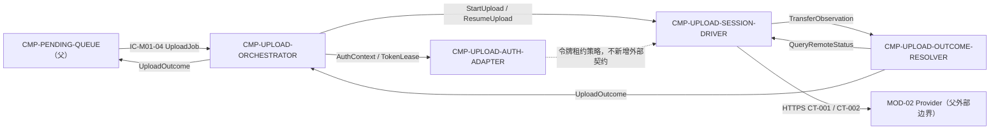

# 02 Architecture Decomposition — CMP-UPLOAD-CLIENT（L2）

> 本文件只在 L1 `CMP-UPLOAD-CLIENT` 内部细化；不重划 MOD-01、不重设计 MOD-02、不创建新的部署边界。

## 1. 局部概念、命令、事件与不变量

| 局部概念 | 类型 | 含义 | 关键不变量 |
|---|---|---|---|
| `UploadExecution` | 局部协调对象 | 绑定 `submission_uuid`、`bundle_ref`、身份和当前执行阶段 | 同一 uuid 同时至多一个 active execution；重复启动归并 |
| `UploadSession` | 外部会话引用 | CT-001 创建会话后得到的会话标识、总分片数和合并状态 | 仅用于同一 uuid；不等同于 MOD-02 Submission 状态 |
| `ChunkTransfer` | 值对象 | 一个材料分片及其索引、大小、类别和校验信息 | 分片类别沿用 `material_chunks[]`；不改变父 schema |
| `RemoteUploadObservation` | 值对象 | CT-001/CT-002 的原始或规范化观察结果 | `unknown` 只表示未确认，不是服务端终态 |
| `AccessTokenLease` | 本地短生命周期值对象 | Bearer token、过期时间与凭据上下文 | 只在内存使用，不落盘；AUTH_INVALID 后不能复用失效 lease |

命令：`StartUpload`、`ResumeUpload`、`QueryUploadStatus`、`RefreshAccessToken`、`ReleaseUploadExecution`。

内部事件：`UploadSessionCreated`、`ChunkAcknowledged`、`UploadMerged`、`UploadInterrupted`、`UploadConfirmationTimedOut`、`RemoteStatusResolved`、`RemoteStatusUnresolved`、`UploadOutcomeProduced`。

局部策略：单任务执行保护；服务端确认后写 checkpoint；401 触发一次令牌重新获取后重放当前请求；30 秒未确认转状态查询；CT-002 返回终态后才向父队列返回终态结果。

## 2. 子节点清单（按稳定 child_id 排序）

| child_id | 名称 | 职责 | 排除项 | 拥有状态 | 需求/父层追踪 | 依赖 | 存在理由 |
|---|---|---|---|---|---|---|---|
| `CMP-UPLOAD-AUTH-ADAPTER` | 上传认证适配器 | 从 `UploadJob.identity` 准备 auth/token 请求上下文；持有短生命周期令牌租约；处理 401/令牌失效协作 | 不改变 auth/token 字段；不做名单校验；不持久化凭据；不发送材料分片 | `ST-L2-01 AccessTokenLease` | `REQ-DD001`；父 CT-001 auth/token；`KD-005`；父 `IC-M01-04` identity | `CMP-UPLOAD-ORCHESTRATOR`、`CMP-UPLOAD-SESSION-DRIVER` | 认证凭据生命周期与分片传输的变化原因不同，且需要单独隐私边界 |
| `CMP-UPLOAD-ORCHESTRATOR` | 上传执行编排器 | 接收父 `UploadJob`；建立/释放单任务执行保护；编排认证、会话驱动和结果收敛；返回父 `UploadOutcome` | 不直接拼装 CT-001 字段；不写 checkpoint；不决定服务端终态；不改变队列状态机 | `ST-L2-02 ActiveUploadGuard` | `REQ-DD001`；`D-AC-REQ-001-01`；父 `IC-M01-04`；`INV-2` | `CMP-UPLOAD-AUTH-ADAPTER`、`CMP-UPLOAD-SESSION-DRIVER`、`CMP-UPLOAD-OUTCOME-RESOLVER`、`CMP-PENDING-QUEUE`（父） | 需要一个稳定的内部入口把父契约映射到四个局部职责，同时防止同 uuid 并发 |
| `CMP-UPLOAD-OUTCOME-RESOLVER` | 上传结果收敛器 | 将 CT-001 应答、网络中断、30 秒未知和 CT-002 响应转换为 `UploadOutcome`；维护未知→查询→终态的局部流程 | 不主动重发整包；不自行判定 membership；不写父 PendingTask；不把 unknown 当终态 | 无持久状态（瞬态 `RemoteUploadObservation`） | `REQ-DD001`；`D-AC-REQ-001-01` exceptions/oracles；CT-002；NFR-003 | `CMP-UPLOAD-ORCHESTRATOR`、`CMP-UPLOAD-SESSION-DRIVER`、父 `CMP-PENDING-QUEUE` | 结果语义与传输机制不同；单独隔离可保证未知结果不被误报为成功/失败 |
| `CMP-UPLOAD-SESSION-DRIVER` | 上传会话与分片驱动器 | 执行创建会话、逐分片、合并、恢复续传；在服务端确认后更新 checkpoint；承接 HTTPS 网络调用 | 不拥有 Submission；不决定任务终态；不改变 CT-001/CT-002 schema；不直接调用兄弟模块 | `ST-05 UploadCheckpoint`（细化 owner） | `REQ-DD001/003/004`；`D-AC-REQ-001-01`；`D-AC-REQ-003-01`；CT-001/CT-002；`KD-003/005`；`INV-5` | `CMP-UPLOAD-AUTH-ADAPTER`、父 `CMP-PENDING-QUEUE` 提供的 `bundle_ref`、MOD-02 Provider | 分片顺序、会话恢复和 checkpoint 有独立生命周期与强一致性要求 |

**追踪豁免**：无。四个 child_id 均有当前 PRD 或父 Requirement/契约/决策追踪，不填写 `trace_exemption_reason`。

## 3. 子节点与外部边界依赖图

所有 child_id 都留在 `CMP-UPLOAD-CLIENT` 的 DU-1 进程内；图中的 MOD-02 仍是父层已定义的 Provider，未重设计其内部。网络调用虽由 `SESSION-DRIVER` 执行，但对外仍属于 L1 `CMP-UPLOAD-CLIENT` 唯一网络出口。

## 4. 分解理由

1. **按变化原因拆分认证与传输**：令牌失效、凭据隐私和 401 重取的变化原因不同于分片会话与 checkpoint。
2. **按生命周期拆分会话驱动与结果收敛**：分片上传有“逐分片确认”的生命周期，30 秒未知/CT-002 有“查询收敛”的生命周期；合并会使 unknown 被误当作传输失败。
3. **按交互所有权保留编排器**：父队列只依赖 `IC-M01-04`，编排器是该入口在本节点内的唯一适配点，不把父契约字段散落到多个内部 child。
4. **按不变量下沉状态**：`ST-05` 必须由执行分片且能观察服务端 ack 的 `SESSION-DRIVER` 单写；`ActiveUploadGuard` 由编排器单写。

## 5. C1-C6 检查记录

| 映射 | 结果 | 结论 |
|---|---|---|
| C1 | CMP-UPLOAD-CLIENT → 4 个稳定 child_id | 通过，全部留在父节点内部 |
| C2 | ST-05 细化给 SESSION-DRIVER；租约与执行保护为本机瞬态状态 | 通过，未转移父/兄弟状态 |
| C3 | IC-M01-04 → ORCHESTRATOR → SESSION/OUTCOME → ORCHESTRATOR | 通过，保留父流程顺序 |
| C4 | CT-001/CT-002/auth-token 映射到 SESSION/AUTH/OUTCOME | 通过，字段、owner、错误、版本不变 |
| C5 | MOD-02 只作为 Provider；内部不设计其实现 | 通过 |
| C6 | HTTPS、幂等 uuid、checkpoint、30 秒查询均成为局部策略 | 通过，未引入父层平台或部署单元 |

