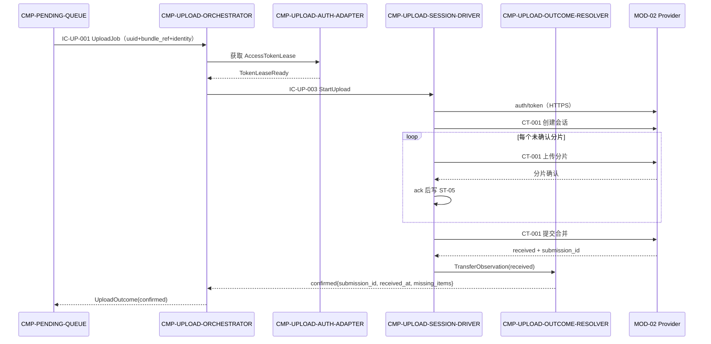
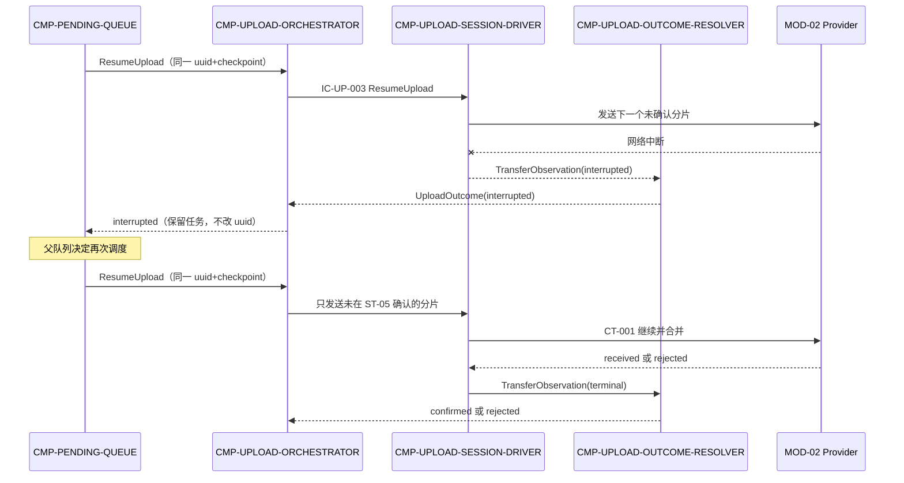
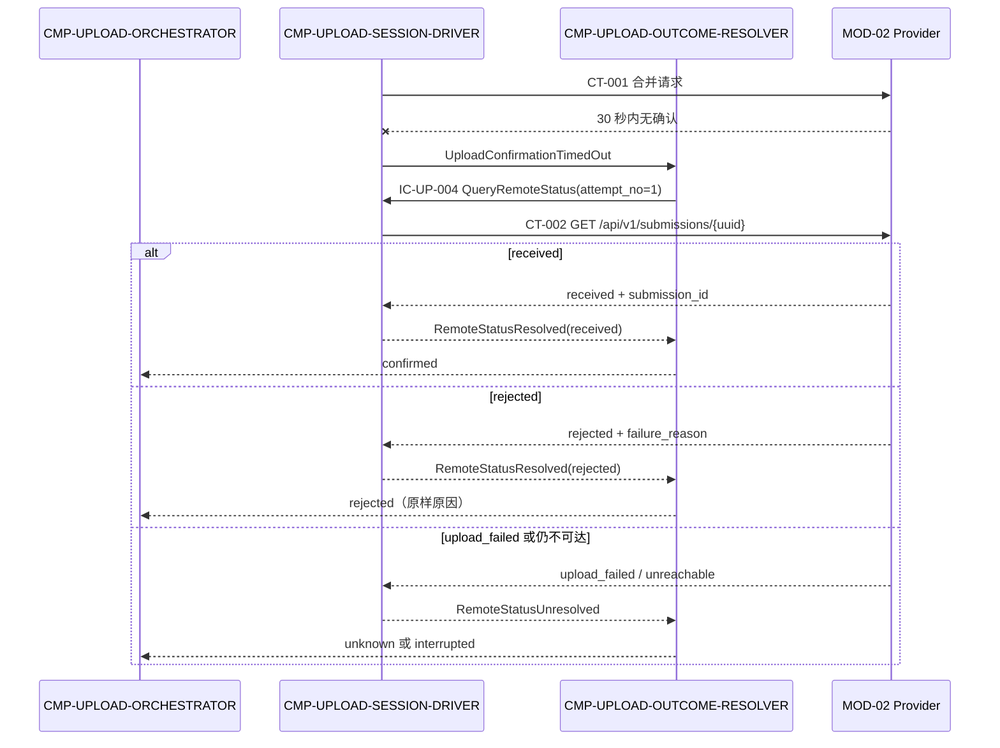

# 04 Contracts and Runtime — CMP-UPLOAD-CLIENT（L2）

> 本文件把 L1 `IC-M01-04` 与 CT-001/CT-002/auth-token 映射到本层四个 child；父契约字段、所有者、路径、失败、幂等和版本语义不变。

## 1. 父契约清单

| 父契约 | Provider | 本层角色 | 路径/协议 | 发送/接收字段 | 失败、超时、幂等与版本 |
|---|---|---|---|---|---|
| `CT-001` 提交材料包上传 | MOD-02 | Consumer | HTTPS `POST /api/v1/submissions`；创建上传会话→逐分片→提交合并 | 发送：`submission_uuid`、`invite_code`、`student_name`、`group_name`、`assignment`、`material_chunks[]`；接收：`submission_id`、`received_at`、`status`、`missing_items[]`、拒绝时 `rejection_reason` | 中断时服务端可为 `upload_failed`；客户端断点续传；30 秒未确认转 CT-002；uuid 幂等；`/api/v1` 不变 |
| `CT-002` 提交状态查询 | MOD-02 | Consumer | HTTPS `GET /api/v1/submissions/{submission_uuid}` | 发送路径参数 `submission_uuid`；接收 `submission_id`、`status`、`failure_reason?`、`missing_items[]` | 未知 UUID→404；指数退避；只读天然幂等 |
| auth/token 附属交互 | MOD-02 | Consumer | HTTPS `POST /api/v1/auth/token` | 发送 `invite_code`、`student_name`、`group_name`；接收 Bearer token | `AUTH_INVALID`；名单核对语义归父 Provider；属于 CT-001 契约族，不单独升级为新契约 |

父契约错误码原样保留：CT-001 使用 `AUTH_INVALID`、`VALIDATION_FAILED`、`PAYLOAD_TOO_LARGE`、`UNSUPPORTED_MEDIA_TYPE`、`REJECTED_MEMBERSHIP`；CT-002 使用 `AUTH_INVALID`、`NOT_FOUND`。

## 2. 父契约到内部 child 的实现映射

| 父契约/流程 | 实现 child | 分工 | 语义保持确认 |
|---|---|---|---|
| `IC-M01-04` UploadJob 入口 | `CMP-UPLOAD-ORCHESTRATOR` | 接收父队列调用，创建执行保护，协调内部 child，回传 `UploadOutcome` | 父入口/回调结构不改 |
| auth/token | `CMP-UPLOAD-AUTH-ADAPTER` + `CMP-UPLOAD-SESSION-DRIVER` | AUTH-ADAPTER 管理 credentials/lease；SESSION-DRIVER 执行 HTTPS 请求 | 端点、字段、AUTH_INVALID 语义不改 |
| CT-001 创建会话/逐分片/合并 | `CMP-UPLOAD-SESSION-DRIVER` | 编码 bundle、发送分片、仅按 ack 更新 ST-05、提交合并 | 顺序、类别、uuid 幂等和错误语义不改 |
| 30 秒未确认 | `CMP-UPLOAD-OUTCOME-RESOLVER` | 接收 unknown，发起 QueryRemoteStatus，经 CT-002 收敛 | unknown 不是终态；不重发整包 |
| CT-002 状态查询 | `CMP-UPLOAD-SESSION-DRIVER` 执行 + `CMP-UPLOAD-OUTCOME-RESOLVER` 判定 | SESSION-DRIVER 发查询；RESOLVER 解释 received/rejected/upload_failed/仍不可达 | 只读、404、指数退避不改 |

## 3. 本层内部契约（按稳定 contract_id 排序）

> 视角约定：本节散文的 Owner/Provider 指端口/职责的实现者；§3.1 机器可读绑定采用消息边视角——`provider`=消息发送方、`consumer`=接收执行方、`next_hop`=consumer。两种视角描述同一交互，§3.1 为校验唯一来源。

### IC-UP-001 UploadJob 编排入口

- **Owner/Consumer**：`CMP-UPLOAD-ORCHESTRATOR` ← 父 `CMP-PENDING-QUEUE`
- **触发**：任务 `ready` 或 `failed` 恢复。
- **Schema**：输入 `UploadJob{submission_uuid, bundle_ref, identity{invite_code, student_name, group_name, assignment}, checkpoint?}`；输出 `UploadOutcome{confirmed{submission_id, received_at, missing_items[]} | rejected{rejection_reason} | interrupted{interruption_cause} | unknown{unknown_reason}}`。
- **副作用**：创建/释放 `ST-L2-02`；不直接写 ST-05。
- **失败/重试**：同 uuid 重复启动归并；内部错误统一返回 `interrupted` 或 `unknown`，不伪造服务端终态。
- **幂等/兼容**：uuid 不变；字段只允许向后兼容追加。
- **追踪**：父 `IC-M01-04`、`REQ-DD001`、`D-AC-REQ-001-01`。

### IC-UP-002 AccessTokenLease 端口

- **Owner/Provider**：`CMP-UPLOAD-AUTH-ADAPTER`；Consumer：`CMP-UPLOAD-ORCHESTRATOR`、`CMP-UPLOAD-SESSION-DRIVER`。
- **触发**：首次上传、lease 过期或请求返回 401/AUTH_INVALID。
- **Schema**：输入 `CredentialContext{invite_code, student_name, group_name}`；输出 `AccessTokenLease{token_lease_ref, token, expires_at, context_hash}` 或 `AuthFailure{code=AUTH_INVALID}`。
- **副作用**：仅写/替换内存 `ST-L2-01`；不落盘、不进入材料包。
- **失败/重试**：AUTH_INVALID 立即失效 lease；不得自动修改 identity；重新获取失败回传父错误。
- **幂等/兼容**：同一有效 lease 可复用；字段只追加可选元数据。
- **追踪**：父 auth/token、`KD-005`、`LCD-006`。

### IC-UP-003 ChunkSessionExecution

- **Owner/Provider**：`CMP-UPLOAD-SESSION-DRIVER`；Consumer：`CMP-UPLOAD-ORCHESTRATOR`。
- **触发**：StartUpload/ResumeUpload。
- **Schema**：输入 `SessionCommand{submission_uuid, bundle_ref, identity, checkpoint?, token_lease_ref}`；输出 `TransferObservation{submission_uuid, source, observation, session_id?, acked_chunk_indices[], merged?, received?, rejected?, interrupted?, unknown?}`。
- **副作用**：CT-001 网络调用；服务端 ack 后写 ST-05；不写父任务状态。
- **失败/超时**：网络中断→`interrupted`；当前请求 401→请求新的 token lease 后只重放当前未确认请求；30 秒无接收确认→`unknown`。
- **幂等/兼容**：同一 uuid/session/checkpoint 跳过已确认分片；不新建重复 Submission；父分片字段只向后兼容追加。
- **追踪**：CT-001、`REQ-DD001/003/004`、`D-AC-REQ-003-01`、`KD-003/005`。

### IC-UP-004 RemoteStatusQuery

- **Owner/Provider**：`CMP-UPLOAD-SESSION-DRIVER`；Consumer：`CMP-UPLOAD-OUTCOME-RESOLVER`。
- **触发**：IC-UP-003 产生 unknown，或父队列要求 QueryRemoteStatus。
- **Schema**：输入 `RemoteStatusQuery{submission_uuid, attempt_no}`；输出 `RemoteStatusSnapshot{submission_uuid, source, observation, submission_id?, status, failure_reason?, missing_items[]}` 或 `RemoteQueryFailure{NOT_FOUND|AUTH_INVALID|UNREACHABLE}`。
- **副作用**：CT-002 只读请求；不写服务端状态；本地只把观察结果交给 resolver。
- **失败/重试**：指数退避；404 按父语义返回 NOT_FOUND；仍不可达回 `UNREACHABLE`，不直接标记 received/rejected。
- **幂等/兼容**：同 uuid 重复查询无副作用；字段只追加可选字段。
- **追踪**：CT-002、NFR-003、父 R2。

### IC-UP-005 UploadOutcome 收敛回传

- **Owner/Provider**：`CMP-UPLOAD-OUTCOME-RESOLVER`；Consumer：`CMP-UPLOAD-ORCHESTRATOR`。
- **触发**：IC-UP-006 观察收敛出 `UploadOutcome` 后回传编排器。
- **Schema**：输入 `UploadOutcome{submission_uuid, outcome_type, confirmed{submission_id, received_at, missing_items[]} | rejected{rejection_reason} | interrupted{interruption_cause} | unknown{unknown_reason}}`；ORC 接收后经 IC-UP-001 回传父队列。
- **副作用**：无持久写入；产生 `UploadOutcomeProduced` 内部事件。
- **失败/分支**：unknown 只在查询尚未确认时存在；不伪造服务端终态。
- **幂等/兼容**：同一终态观察重复输入只产出一次逻辑终态；输出字段只追加。
- **追踪**：`D-AC-REQ-001-01`、CT-001/CT-002、父 `IC-M01-04`。

### IC-UP-006 TransferObservation 观察投递

- **Owner/Provider**：`CMP-UPLOAD-SESSION-DRIVER`；Consumer：`CMP-UPLOAD-OUTCOME-RESOLVER`。
- **触发**：IC-UP-003 产生 TransferObservation，或 IC-UP-004 查询得到 RemoteStatusSnapshot（此时 `source=CT002`）。
- **Schema**：输入 `ObservationEnvelope{submission_uuid, source=CT001|CT002|transport, observation}`；RES 将其收敛为 `UploadOutcome`，经 IC-UP-005 回传。
- **副作用**：无持久写入；unknown 观察触发 IC-UP-004 查询，不重发整包。
- **失败/分支**：received→confirmed；rejected→rejected+原因；upload_failed/不可达→interrupted；查询未决→unknown；不生成本地服务端结论。
- **幂等/兼容**：同一观察重复投递只收敛一次；字段只追加。
- **追踪**：`D-AC-REQ-001-01`、CT-001/CT-002、NFR-003。

## 3.1 机器可读契约绑定（唯一校验来源）

> 约定：`provider`=消息发送方，`consumer`=接收执行方，`next_hop`=consumer；`inbound_required_fields` 为 consumer 处理本消息所必需的字段，`outbound_produced_fields` 为本契约执行后产出并回传/转发的字段。每条消息边一条契约，上游 produced 必须覆盖下游 required。

```yaml
contract_fields:
  - contract_id: IC-UP-001
    contract_type: internal_port
    provider: CMP-PENDING-QUEUE
    consumer: CMP-UPLOAD-ORCHESTRATOR
    inbound_required_fields: [submission_uuid, bundle_ref, identity.invite_code, identity.student_name, identity.group_name, identity.assignment]
    inbound_optional_fields: [checkpoint]
    outbound_produced_fields: [outcome_type, submission_id, received_at, missing_items, rejection_reason, interruption_cause]
    outbound_conditional_fields:
      unknown: [unknown_reason]
    event_required_fields: [submission_uuid, outcome_type]
    error_codes: [UPLOAD_INTERRUPTED, UPLOAD_UNKNOWN]
    side_effects: "create or release ST-L2-02; no direct checkpoint write"
    dependencies: [CMP-UPLOAD-AUTH-ADAPTER, CMP-UPLOAD-SESSION-DRIVER, CMP-UPLOAD-OUTCOME-RESOLVER]
    next_hop: CMP-UPLOAD-ORCHESTRATOR
    return_event: [UploadOutcomeProduced]

  - contract_id: IC-UP-002
    contract_type: internal_port
    provider: CMP-UPLOAD-ORCHESTRATOR
    consumer: CMP-UPLOAD-AUTH-ADAPTER
    inbound_required_fields: [invite_code, student_name, group_name]
    inbound_optional_fields: [force_refresh]
    outbound_produced_fields: [token_lease_ref, token, expires_at, context_hash]
    outbound_conditional_fields:
      auth_failure: [error_code]
    event_required_fields: [context_hash, lease_status]
    error_codes: [AUTH_INVALID]
    side_effects: "replace memory-only ST-L2-01"
    dependencies: [MOD-02]
    next_hop: CMP-UPLOAD-AUTH-ADAPTER
    return_event: [TokenLeaseReady, TokenLeaseInvalidated]

  - contract_id: IC-UP-003
    contract_type: internal_port
    provider: CMP-UPLOAD-ORCHESTRATOR
    consumer: CMP-UPLOAD-SESSION-DRIVER
    inbound_required_fields: [submission_uuid, bundle_ref, identity, token_lease_ref]
    inbound_optional_fields: [checkpoint]
    outbound_produced_fields: [submission_uuid, source, observation, session_id, acked_chunk_indices]
    outbound_conditional_fields:
      terminal: [merged, received, rejected, rejection_reason]
      failure: [interrupted, unknown, failure_cause]
    event_required_fields: [submission_uuid, observation_type]
    error_codes: [AUTH_INVALID, VALIDATION_FAILED, PAYLOAD_TOO_LARGE, UNSUPPORTED_MEDIA_TYPE, REJECTED_MEMBERSHIP, NETWORK_INTERRUPTED]
    side_effects: "CT-001 calls and ack-gated ST-05 writes"
    dependencies: [MOD-02, ST-05]
    next_hop: CMP-UPLOAD-SESSION-DRIVER
    return_event: [ChunkAcknowledged, UploadConfirmationTimedOut, UploadInterrupted]

  - contract_id: IC-UP-004
    contract_type: internal_port
    provider: CMP-UPLOAD-OUTCOME-RESOLVER
    consumer: CMP-UPLOAD-SESSION-DRIVER
    inbound_required_fields: [submission_uuid, attempt_no]
    inbound_optional_fields: []
    outbound_produced_fields: [submission_uuid, source, observation, status, submission_id, missing_items]
    outbound_conditional_fields:
      failure: [failure_reason, error_code]
    event_required_fields: [submission_uuid, query_attempt]
    error_codes: [NOT_FOUND, AUTH_INVALID, UNREACHABLE]
    side_effects: "CT-002 read-only request"
    dependencies: [MOD-02]
    next_hop: CMP-UPLOAD-SESSION-DRIVER
    return_event: [RemoteStatusResolved, RemoteStatusUnresolved]

  - contract_id: IC-UP-005
    contract_type: internal_port
    provider: CMP-UPLOAD-OUTCOME-RESOLVER
    consumer: CMP-UPLOAD-ORCHESTRATOR
    inbound_required_fields: [submission_uuid, outcome_type]
    inbound_optional_fields: [query_attempt]
    outbound_produced_fields: [outcome_type, submission_id, received_at, missing_items, rejection_reason, interruption_cause]
    outbound_conditional_fields:
      unknown: [unknown_reason]
    event_required_fields: [submission_uuid, outcome_type]
    error_codes: [UPLOAD_UNKNOWN, UPLOAD_INTERRUPTED]
    side_effects: "emit in-process UploadOutcomeProduced only"
    dependencies: [IC-UP-006, IC-UP-004]
    next_hop: CMP-UPLOAD-ORCHESTRATOR
    return_event: [UploadOutcomeProduced]

  - contract_id: IC-UP-006
    contract_type: internal_port
    provider: CMP-UPLOAD-SESSION-DRIVER
    consumer: CMP-UPLOAD-OUTCOME-RESOLVER
    inbound_required_fields: [submission_uuid, source, observation]
    inbound_optional_fields: [session_id, acked_chunk_indices]
    outbound_produced_fields: [submission_uuid, outcome_type, submission_id, received_at, missing_items, failure_reason]
    outbound_conditional_fields:
      unknown: [unknown_reason]
      query_pending: [query_attempt]
    event_required_fields: [submission_uuid, observation_type]
    error_codes: [UPLOAD_UNKNOWN, UPLOAD_INTERRUPTED]
    side_effects: "no persistence; unresolved observation triggers IC-UP-004 query"
    dependencies: [IC-UP-003, IC-UP-004]
    next_hop: CMP-UPLOAD-OUTCOME-RESOLVER
    return_event: [UploadOutcomeProduced]
```

## 4. 关键运行流

### R-UP-01 成功上传



### R-UP-02 分片中断与恢复



### R-UP-03 30 秒未知、查询与拒绝生命周期



## 5. 错误、重试、幂等、可观测与兼容

| 主题 | 本层规则 | 父层依据 |
|---|---|---|
| 认证 | AUTH_INVALID 使当前 lease 失效；只允许在不改变 identity 的前提下重取并重放当前请求 | auth/token、`LCD-006` |
| 分片失败 | 网络中断返回 interrupted；已确认分片留在 ST-05，恢复时跳过 | CT-001 Retry、`INV-5` |
| 超时 | 30 秒未确认返回 unknown，随后 CT-002 指数退避；不重发整包 | NFR-003、CT-001 timeout |
| 查询 | 404、AUTH_INVALID、不可达保留父错误含义；查询不写服务端状态 | CT-002 |
| 可观测 | 产生带 uuid、session_id、chunk_index、attempt_no、outcome_type 的本地结构化记录；不得记录 token、材料内容或个人信息全文 | 本机诊断边界、隐私约束 |
| 兼容 | 内部字段仅追加；父契约字段/错误码/路径/版本不变；任何新增必填外部字段都必须 return_to_parent | 父 05、父 04 |

## 6. 父外部契约语义不变确认

本层没有修改 CT-001、CT-002、auth/token 或 IC-M01-04 的标识符、所有者、路径、输入/输出字段、错误码、超时、重试、幂等键、版本或部署语义；没有新增跨模块契约，也没有把 `UploadOutcome` 提升为公共 API。
