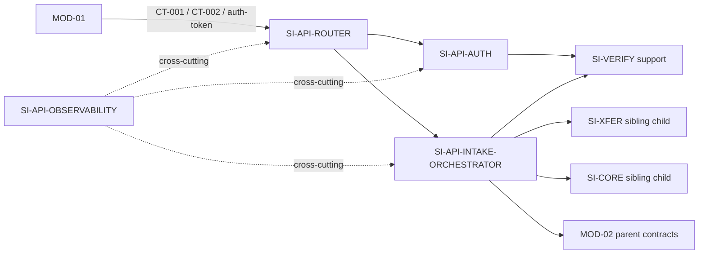

# 02 Architecture Decomposition — SI-API L2

## 1. 局部语义细化

### 概念与聚合

- **AdmissionRequest**：一次 API 接入请求的短生命周期上下文，包含认证结果、`submission_uuid`、请求相关性标识和预算计时；不替代 Submission 聚合。
- **AuthTokenGrant**：令牌签发审计记录，对应父状态 `ST-06`，由 `SI-API-AUTH` 拥有。
- **IntakeAdmission**：编排视图，记录本次请求已完成的端口步骤和响应决策；不持久化为父层业务状态。
- **Submission**：父层聚合，仍由 SI-CORE 拥有；API 只通过 `IC-SI-04` 发送命令或读取结果。

### 局部不变量

1. 任何公开端点先完成父定义的认证语义，再进入业务端口。
2. `submission_uuid` 是 CT-001 幂等主键；重复请求不得重复创建、合并或发布业务效果。
3. API 不得直接写 ST-01/ST-02/ST-03；所有改变通过父包内部端口完成。
4. CT-003 每次需要时实时调用，不缓存“通过”结论；`ROSTER_UNAVAILABLE` 不转译成新的公共错误码。
5. 30 秒预算耗尽时只能沿用父 CT-001/CT-002 失败或可恢复语义，不能伪造 `received`。
6. CT-001 成功响应字段保持 `submission_id`、`received_at`、`status`、`missing_items[]` 的父定义。

### 命令与策略

| 命令/策略 | 所属 child | 作用 |
|---|---|---|
| `IssueToken` | SI-API-AUTH | 调用 IC-SI-03 校验后签发令牌并写 ST-06 审计 |
| `AuthenticateRequest` | SI-API-AUTH | 校验 Bearer/端点认证上下文，返回标准化认证结果 |
| `RouteSubmissionUpload` | SI-API-ROUTER | 将 CT-001 分阶段请求路由到编排器 |
| `OrchestrateIntake` | SI-API-INTAKE-ORCHESTRATOR | 在固定预算内协调 IC-SI-01/03/04 |
| `QuerySubmissionStatus` | SI-API-INTAKE-ORCHESTRATOR | 通过 IC-SI-04 查询 ST-01，不改变状态 |
| `RecordMetric` | SI-API-OBSERVABILITY | 记录 SM-001 与请求级诊断信号 |

## 2. Child registry（按稳定 ID 排序）

| child_id | responsibility | exclusions | owned_state | requirement/parent trace | dependencies | reason_for_existence | trace_exemption_reason |
|---|---|---|---|---|---|---|---|
| SI-API-AUTH | 认证、Bearer 校验、auth-token 签发及 ST-06 审计 | 不拥有课程名单；不改变 token 公共形态；不写 Submission | ST-06 AuthTokenGrant；短生命周期 AuthContext | REQ-DD003；REQ-D003；CT-001/auth-token；ST-06 | SI-API-ROUTER、SI-VERIFY | 把安全认证与业务编排隔离，避免认证失败污染提交状态 | — |
| SI-API-INTAKE-ORCHESTRATOR | CT-001/CT-002 的同步接收编排、幂等结果复用、30 秒预算、端口协调 | 不写 ST-01/ST-02/ST-03；不执行评分；不发布父事件 | 瞬态 IntakeAdmission；只读父结果 | REQ-DD003；D-AC-REQ-007-01；REQ-D003；CT-001/CT-002；IC-SI-01/03/04 | SI-API-AUTH、SI-API-ROUTER、SI-XFER、SI-VERIFY、SI-CORE | 把父级接入流程落成可验证的顺序与预算边界 | — |
| SI-API-OBSERVABILITY | SM-001 计时、请求相关性、结果标签和诊断信号关联 | 不成为独立监控部署单元；不改变指标分母或成功定义 | 瞬态 AdmissionTelemetry；指标由父基础监控面承载 | SM-001；LCD-009；NFR-003；parent 04 observability rules | SI-API-AUTH、SI-API-ROUTER、SI-API-INTAKE-ORCHESTRATOR | 统一接收路径的成功点、耗时和失败标签，避免各端点口径漂移 | — |
| SI-API-ROUTER | CT-001/CT-002/auth-token 路由、中间件顺序、请求上下文与父错误码映射 | 不承载领域状态机；不改变路径、字段、错误码或版本 | 瞬态 RequestContext | REQ-DD003；CT-001；CT-002；auth-token；NFR-002 | SI-API-AUTH、SI-API-INTAKE-ORCHESTRATOR、SI-API-OBSERVABILITY | 将父公共契约绑定到稳定的入口与内部命令，防止端点逻辑重复 | — |

## 3. 依赖图与边界

入口方向表示公共 HTTP 请求首先进入 SI-API-ROUTER；AUTH 只返回标准化认证上下文，ORCHESTRATOR 才负责 CT-001/CT-002 的业务编排和响应字段组装。评分状态由父 SI-CORE/MOD-04 维护，不回流到 SI-API-AUTH。

依赖方向仅表示调用或信号关联，不表示状态所有权转移。`SI-STORE`、`SI-RELAY`、`SI-VERIFY` 是父包内部支撑；MOD-01、MOD-03、MOD-04、MOD-05 是兄弟边界，本层引用其契约但不设计其内部。

## 4. C1-C6 映射

| 映射 | 本层结果 | 边界确认 |
|---|---|---|
| C1 | SI-API → AUTH / INTAKE-ORCHESTRATOR / OBSERVABILITY / ROUTER | 四者均留在 SI-API 内部 |
| C2 | ST-06 → AUTH；RequestContext/Admission → ROUTER/ORCHESTRATOR | ST-01/02/03/04 不迁移 |
| C3 | 父 CT-001 成功、失败/恢复、生命周期流 → ORCHESTRATOR 协作 | 保留接收确认与状态推进顺序 |
| C4 | CT-001/002/auth-token → ROUTER/AUTH/ORCHESTRATOR 实现映射 | 父字段、错误、所有者、版本不变 |
| C5 | CT-003 → SI-VERIFY 端口适配调用 | 不把 MOD-03 依赖改造成 API 自有数据 |
| C6 | NFR-002/NFR-003/SM-001 → 无状态入口、预算、统一观测 | 不新增平台、队列或部署单元 |

## 5. 兄弟与支撑组件确认

本文件只引用 SI-XFER、SI-CORE、SI-VERIFY、SI-STORE、SI-RELAY 作为协作者或边界约束。没有重新拆解其内部职责、状态、数据库、消息投递器或部署形式；没有把 `SI-PURGE`、`SI-RELAY`、`SI-STORE`、`SI-VERIFY` 伪造为当前层 direct child。
