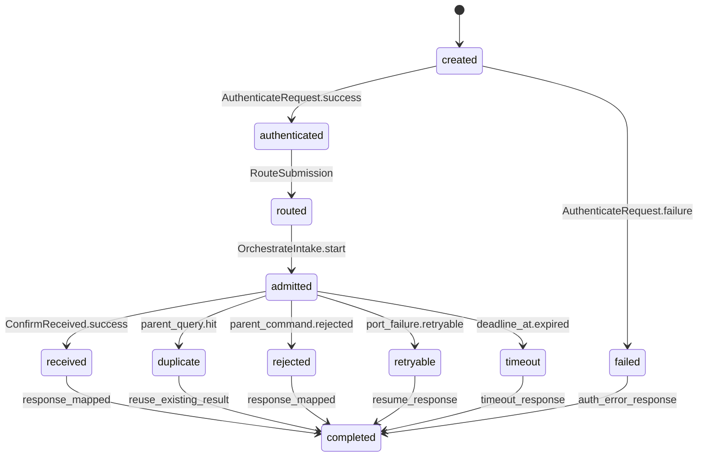

# 03 State and Data — SI-API L2

## 1. 状态所有权注册表（按 state/owner 稳定 ID 排序）

| state_id | state | owner child_id | readers | writers | lifecycle | consistency boundary | retention/privacy | parent trace |
|---|---|---|---|---|---|---|---|---|
| ST-06 | AuthTokenGrant（令牌签发审计：grant_id、调用主体、课程/邀请指纹、签发时间、过期时间、结果、request_id） | SI-API-AUTH | SI-API-AUTH、MOD-02 审计读取面 | SI-API-AUTH only | issued/rejected/expired；过期不再用于认证 | 单次签发记录写入边界；与 Submission 不共享事务 | 只保留父治理要求的审计字段；姓名/邀请信息按父隐私约束最小化 | parent `03-state-and-data.md` ST-06 |
| ST-API-01 | RequestContext（瞬态认证结果、submission_uuid、correlation_id、预算计时） | SI-API-ROUTER | ROUTER、AUTH、ORCHESTRATOR、OBSERVABILITY | ROUTER 创建，AUTH/ORCHESTRATOR 追加本地结果 | created/authenticated/routed/completed/failed；请求结束即释放 | 单请求内存边界，不跨请求共享 | 不持久化令牌原文或材料内容 | parent CT-001/CT-002/auth-token |
| ST-API-02 | IntakeAdmission（瞬态端口步骤、幂等命中、响应决策） | SI-API-INTAKE-ORCHESTRATOR | ORCHESTRATOR、OBSERVABILITY | ORCHESTRATOR only | admitted/duplicate/rejected/received/timeout/retryable | 单个 `submission_uuid` 请求编排边界 | 不替代 ST-01；不长期保留请求材料 | parent FLOW-008；IC-SI-01/03/04 |
| ST-API-03 | AdmissionTelemetry（起止时间、结果标签、failure_reason、route、correlation_id） | SI-API-OBSERVABILITY | 基础监控面、诊断消费者 | OBSERVABILITY only | opened/recorded/exported；按监控面生命周期 | 指标事件/诊断信号边界，不参与业务事务 | 沿用 LCD-009 标签与最小化原则；不写入材料内容 | parent SM-001；LCD-009 |

`ST-01 Submission`、`ST-02 UploadSession`、`ST-03 MaterialFile`、`ST-04 OutboxRecord`、`ST-05 InboundEventDedup` 不在本包重新登记为 API 所有状态；它们只作为父状态边界引用。

### 1.1 机器可读的局部状态迁移

上述迁移只覆盖 RequestContext/IntakeAdmission 的 API 局部生命周期。received → processing → scored/scoring_failed 属于父 ST-01，不得添加到 SI-API-AUTH 的状态机。

## 2. 存储意图

- `ST-06` 的持久化沿用父包的单一关系型数据库边界；本层不选择数据库产品。
- `ST-API-01/02/03` 是逻辑或瞬态状态，不要求新增持久化表、缓存、队列或独立运行时。
- API 不直接写本地材料磁盘；材料写入、提升、删除和配额计算均通过父 `IC-SI-02` 由 SI-STORE 支撑。
- CT-004、CT-006、CT-014 的 Outbox 持久化仍由 SI-CORE/SI-RELAY 的父内部契约负责；API 不复制 Outbox。

## 3. 重要数据流

### 3.1 令牌签发

`POST /api/v1/auth/token` → ROUTER 解析请求 → AUTH 经 LC-SIAPI-007 调用 IC-SI-03 实时校验 → AUTH 写入 ST-06 审计 → ROUTER 返回父定义的 Bearer token 响应。校验失败不产生可用令牌；不缓存名单通过结论。

### 3.2 CT-001 接收

MOD-01 → ROUTER → AUTH → ORCHESTRATOR → IC-SI-01 驱动 SI-XFER 会话/分片/合并 → IC-SI-03 驱动 SI-VERIFY → IC-SI-04 调用 SI-CORE ConfirmReceived/MarkRejected → SI-API 映射 CT-001 响应。MaterialFile 与 Submission 的写入分别由父所有者完成。

### 3.3 CT-002 查询

MOD-01 → ROUTER → AUTH → ORCHESTRATOR → IC-SI-04 `query_by_uuid` → 只读映射 `submission_id/status/failure_reason?/missing_items[]`。不写 ST-01，不触发评分或事件。

### 3.4 可观测数据流

ROUTER 在入口创建 correlation_id 和预算起点；AUTH、ORCHESTRATOR 在关键端口追加结果；OBSERVABILITY 在响应或失败路径记录耗时、status、failure_reason、course_id 等父允许标签。SM-001 的分母排除和成功定义保持 LCD-009。

## 4. 一致性、幂等与并发规则

| 规则 | 本层实现 | 所有权边界 |
|---|---|---|
| 请求幂等 | 以 `submission_uuid` 查询父结果；重复 finalize/确认复用既有结果 | SI-CORE 仍是 Submission 写所有者 |
| 分片幂等 | 通过 IC-SI-01 传递 `seq` 与 session 语义 | SI-XFER 仍是 UploadSession 写所有者 |
| 认证幂等 | 相同签发请求不会被 API 当作提交创建；审计记录按 grant/request 语义处理 | AUTH 只拥有 ST-06 |
| 事务一致性 | API 不模拟跨组件分布式事务；等待父端口返回明确结果 | SI-CORE/STORE 各自遵守父本地事务 |
| 并发 | 30 个并发提交互相隔离；无全局可变请求状态 | DU-2/NFR-002 不变 |
| 超时 | 每一步消耗固定预算；超时返回父允许的失败/可恢复语义，不伪造 received | NFR-003/CT-001 不变 |
| 隐私 | 日志/指标不记录令牌原文、材料内容或超出父契约的个人信息 | 父隐私与 retention 约束不变 |

## 5. 所有权确认

本层没有把父模块或兄弟模块的状态转移到 SI-API。新增的 `ST-API-*` 只描述 API 内部瞬态/观测语义；父层公共状态、存储平台、部署单元、事件 Outbox 和评分状态均保持原 owner。
