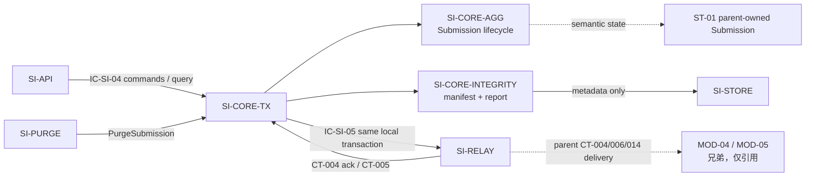

# 02 Architecture Decomposition — SI-CORE submission-core L2

> 本文件执行 C1（SI-CORE → L2 子节点）与局部语义细化。子节点仍属于 `MOD-02/SI-CORE`，不形成服务、容器、部署单元或公共运行时边界。

## 1. 局部语义细化

### 1.1 聚合与值对象

| 概念 | 类型 | 本层语义 |
|---|---|---|
| `Submission` | 聚合根 | 持有 `submission_id`、`submission_uuid`、课程/作业/身份关联、状态、失败原因、接收时间和生命周期时间戳；唯一写入口仍为 SI-CORE |
| `SubmissionIdentity` | 值对象 | `submission_uuid`、`course_id`、`assignment`、`student_name`、`group_name`；不承担外部名单校验 |
| `MaterialEntry` | 聚合内实体 | `material_ref`、`category`、`size_bytes`、`declared`；只保存 SI-STORE 返回的元数据，不解析文件内容 |
| `IntegrityReport` | 值对象 | `expected_categories[]`、`received_categories[]`、`missing_items[]`、`generated_at`；依据清单级存在性/类别/大小生成 |
| `SubmissionStatus` | 值对象/受限枚举 | 复用父层 `upload_failed/rejected/received/processing/scored/scoring_failed/deleted` 值域，不新增外部状态 |

### 1.2 命令、策略和内部事件

| 命令/查询 | 处理责任 | 状态效果 | 幂等/失败语义 |
|---|---|---|---|
| `ConfirmReceived` | 事务编排调用聚合守卫并提交材料清单/报告 | `∅ → received` | `submission_uuid` 唯一；重复请求返回首次结果 |
| `MarkRejected` | 记录归属校验拒绝 | `∅ → rejected` | 终态不可逆；不得发布 CT-004/CT-006 |
| `MarkUploadFailed` | 记录不可恢复上传失败 | `∅ → upload_failed` | 与 LCD-002 一致；同事务写 CT-006 Outbox |
| `AdvanceToProcessing` | 接收 CT-004 `task_persisted` 确认 | `received → processing` | 只接受预期状态；重复确认为空操作 |
| `ApplyScoringOutcome` | 应用 CT-005 结果 | `processing → scored/scoring_failed` | 按 `submission_id + outcome` 幂等，终态事件不反向迁移 |
| `PurgeSubmission` | 承接 SI-PURGE 单项清除结果 | 任一存续状态 → `deleted` | 已删记录为空操作；不决定清除范围 |
| `QuerySubmission` | 提供 CT-002 所需只读视图 | 无写副作用 | 未成立/未知 UUID 返回父契约语义的 `NOT_FOUND` |

内部事件仅用于本层进程内协作，不替代父契约：`SubmissionCommitted`、`SubmissionRejected`、`UploadFailedMarked`、`ProcessingAdvanced`、`ScoringOutcomeApplied`、`SubmissionPurged`。跨模块事件仍只使用 CT-004/005/006/012/014。

### 1.3 局部不变量

| 不变量 | 本层细化 | 父层来源 |
|---|---|---|
| `SIC-INV-01` | `submission_uuid` 唯一；重复 ConfirmReceived/创建命令解析为同一 Submission，不创建第二条记录 | INV-1、KD-005 |
| `SIC-INV-02` | 只允许 `∅→upload_failed/rejected/received`、`received→processing`、`processing→scored/scoring_failed`、存续状态→`deleted` | INV-2 |
| `SIC-INV-03` | `missing_items[]` 是显式报告，不是拒绝条件；空目录仍可 `received` 并发布 CT-004 | INV-3、REQ-D004 |
| `SIC-INV-04` | 每个 `material_ref` 必须来自 SI-STORE 的已登记元数据；SI-CORE 不操作文件内容 | INV-4 |
| `SIC-INV-05` | Submission 状态、MaterialEntry、IntegrityReport 和父 Outbox 写入在同一本地事务提交 | INV-5、KD-002 |
| `SIC-INV-06` | CT-005 结果、CT-004 ack、CT-012 清除命令均通过预期状态/业务键幂等处理 | L1 IC-SI-04/05 |

## 2. C1 直接子节点注册表（按稳定 child_id 排序）

| child_id | 责任 | 排除项 | 拥有状态/边界 | 需求或父层追踪 | 依赖 | 存在理由 | trace_exemption_reason |
|---|---|---|---|---|---|---|---|
| SI-CORE-AGG | Submission 聚合根、身份关联、状态机守卫、生命周期命令和终态幂等 | 不生成完整性报告；不操作文件/Outbox；不处理 HTTP；不直接调用兄弟模块 | 语义拥有 `SIC-ST-01 SubmissionIdentityAndLifecycle`；状态迁移一致性边界 | REQ-DD001、REQ-DD004；REQ-D001/D004；INV-1/2/3；IC-SI-04；ST-01 | SI-CORE-TX 调用；读取 SI-CORE-INTEGRITY 产物 | 状态机与完整性/持久化的变化原因不同；聚合守卫必须集中 | — |
| SI-CORE-INTEGRITY | MaterialEntry 清单、声明类别归一化、完整性报告和缺失项标记 | 不写文件；不解析材料内容；不决定拒绝；不拥有 Submission 生命周期 | 语义拥有 `SIC-ST-02 MaterialManifest`、`SIC-ST-03 IntegrityReport`；报告与清单同一提交边界 | REQ-DD001、REQ-DD002、REQ-DD004；REQ-D001/D002/D004；INV-3/4/5；ST-01 | SI-STORE 元数据端口；SI-CORE-TX 提交协调 | 清单/报告规则独立于状态迁移，且由类别变化和父 PRD 验收驱动 | — |
| SI-CORE-TX | 领域命令编排、事务边界、聚合/报告组合提交和父 Outbox 写入适配 | 不拥有业务状态语义；不投递外部事件；不选择数据库产品；不形成独立部署单元 | 拥有本地事务边界 `SIC-TX-BOUNDARY`；物理写入通过聚合/报告端口，Outbox 仍归 SI-RELAY | REQ-DD001、REQ-DD002、REQ-DD004；IC-SI-04/05；INV-5；KD-002；D-AC-REQ-003-01 | SI-CORE-AGG、SI-CORE-INTEGRITY、SI-RELAY、SI-STORE | 单事务和 Outbox 组合是跨聚合局部一致性职责，不应散落到接入层或各命令实现 | — |

无子节点使用追踪豁免：三个子节点均有当前 PRD 需求和父层契约/不变量追踪。

## 3. C1/C2 依赖与边界图

**依赖方向**：`SI-CORE-TX` 是应用协调者，调用聚合和完整性端口并把结果放入一个本地事务；它不反向拥有二者的领域语义。`SI-CORE-INTEGRITY` 只通过 SI-STORE 的元数据端口获取材料信息。SI-RELAY、SI-STORE、SI-PURGE 和 MOD-04/MOD-05 是父包已定义的协作者，本包只引用其契约，不重设计其内部。

## 4. 分解理由

1. **聚合与完整性分离**：状态机变化由生命周期/终态规则驱动，清单与报告变化由插件声明类别和材料元数据驱动；分开后可独立验证 INV-2 与 INV-3/5。
2. **事务编排单独存在**：状态、清单、报告与 Outbox 必须原子提交；若由接入层或聚合各自提交，会破坏父层 KD-002 和 NFR-003 的一致性边界。
3. **不拆出查询子节点**：CT-002 是 Submission 的一致读视图，不需要新的读模型或持久化所有权；查询端口由聚合语义拥有，事务协调只提供一致访问。
4. **不拆出 Outbox 子节点**：Outbox 状态和投递归父层 SI-RELAY；本层只保留事务内写入适配，避免转移 ST-04 所有权。
5. **不拆出文件存储子节点**：材料文件和配额已由 SI-STORE 拥有；本层只承载 `material_ref` 和清单元数据，避免转移 ST-03。

## 5. 兄弟边界确认

MOD-01、MOD-03、MOD-04、MOD-05 以及 L1 内部支撑节点 SI-API、SI-XFER、SI-RELAY、SI-STORE、SI-VERIFY、SI-PURGE 仅作为契约/依赖/流程约束被引用；本包未设计、未重设计其内部结构，也未为其新增公共边界。
