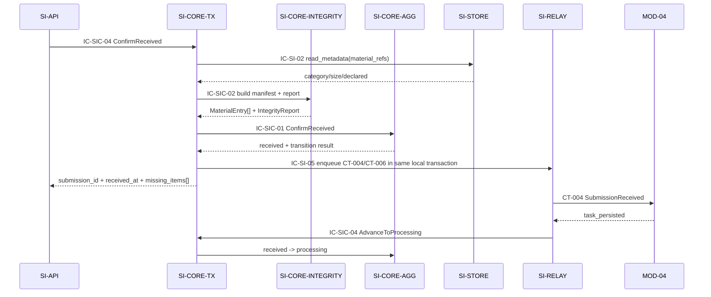
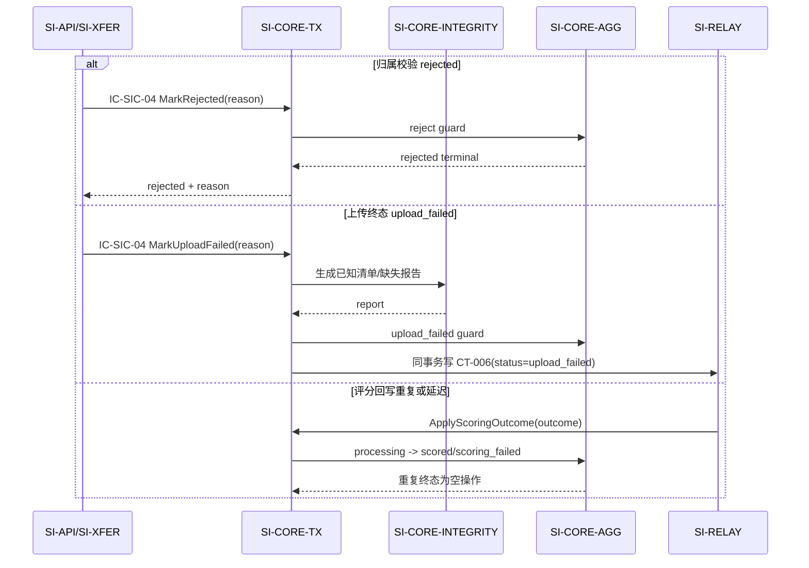
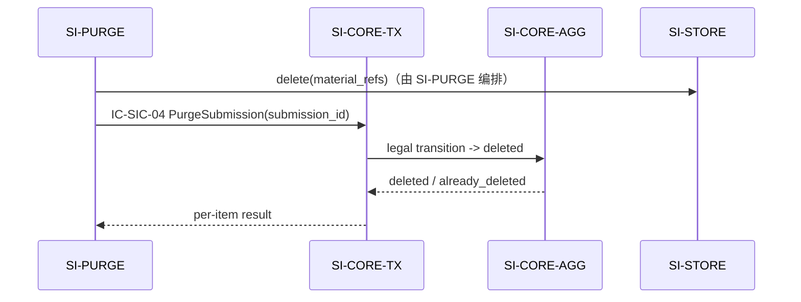

# 04 Contracts and Runtime — SI-CORE submission-core L2

> 本文件执行 C3（父流程 → L2 运行时协作）与 C4（继承契约 → 内部实现映射）。父契约的标识、所有者、字段、消费者、版本、失败和幂等语义保持不变；本层新增的契约只在 `SI-CORE` 内部有效。

## 1. 继承契约清单

| contract_id | 父层角色/所有者 | 路径/主题 | 关键字段 | 副作用 | 依赖与失败 | 版本/幂等 | L2 参与方式 |
|---|---|---|---|---|---|---|---|
| CT-001 | MOD-02 provides / MOD-01 consumes | `POST /api/v1/submissions` | `submission_uuid`、身份/作业、`material_chunks[]`；响应 `submission_id/status/missing_items[]` | 创建提交、校验、状态推进、报告和事件 | AUTH_INVALID、VALIDATION_FAILED、大小/类型/归属失败；中断可恢复，终态失败发布 upload_failed | 父 v=1；`submission_uuid` 幂等 | SI-API 调用 `IC-SIC-04`；TX 组合 AGG + INTEGRITY，并经 IC-SI-05 写 CT-004/006 |
| CT-002 | MOD-02 provides / MOD-01 consumes | `GET /api/v1/submissions/{submission_uuid}` | `submission_id/status/failure_reason?/missing_items[]` | 无 | AUTH_INVALID、NOT_FOUND | 只读；父错误语义不变 | SI-API 通过 `IC-SIC-03` 查询 AGG 的已提交状态 |
| CT-003 | MOD-02 consumes / MOD-03 provides | `POST /api/v1/courses/verify-membership` | `invite_code/student_name/group_name` → `verified/course_id?/reason?` | 归属校验 | ROSTER_UNAVAILABLE 保持待校验并重试；不暴露内部细节 | 每次提交重新调用，不缓存通过结论 | SI-CORE 只消费 SI-VERIFY 结论；失败调用 `MarkRejected`，成功调用 `ConfirmReceived` |
| CT-004 | MOD-02 publishes / MOD-04 consumes | 父 Outbox 事件 `SubmissionReceived` | `submission_id/course_id/assignment/student_name/group_name/material_refs[]/missing_items[]/received_at/v=1` | 创建评分任务；确认语义为 task_persisted | 投递失败由 SI-RELAY 无限重试；确认前保持 received | v=1；消费者按 submission_id 幂等 | TX 在 ConfirmReceived 同事务中请求父 Outbox 写入；ack 后回调 `AdvanceToProcessing` |
| CT-005 | MOD-04 publishes / MOD-02 consumes | 父 Outbox 事件 `SubmissionScored/ScoringFailed` | `submission_id/outcome` 及条件字段 | 回写提交终态 | 非法状态拒绝；重复事件为空操作 | 按 submission_id+终态幂等 | SI-RELAY 去重后调用 `IC-SIC-01 ApplyScoringOutcome` |
| CT-006 | MOD-02 publishes / MOD-05 consumes | 父 Outbox 派生事件 | `submission_id/course_id/assignment/student_name/group_name/status/missing_items[]/received_at/v=1` | 教师端可见 received 或 upload_failed | 投递失败由 SI-RELAY 重试；rejected 不发布 | v=1；按 submission_id 幂等 | TX 在 `ConfirmReceived` 或 `MarkUploadFailed` 同事务写入，严格沿用 LCD-002 |
| CT-012 | MOD-05 publishes / MOD-02 consumes | 父 Outbox 事件 `RecordsDeleted` | `batch_id/submission_ids[]/scope/operator/executed_at/audit_record_id/v=1` | 清除目标提交材料和记录 | 单项失败保留；重复清除为空操作 | 按 batch_id+payload 去重归 SI-RELAY | SI-PURGE 调用 `PurgeSubmission`；本层不处理批次和审计 |
| CT-014 | MOD-02 publishes / MOD-05 consumes | 父 Outbox 事件 `PurgeCompleted` | `batch_id/purged_submission_ids[]/failed_items[]/purged_at/v=1` | 教师端接收清除结果 | 失败项重跑；投递失败由 SI-RELAY 重试 | 按 batch_id+purged_at 幂等 | 仅通过 `PurgeSubmission` 返回单项结果；CT-014 仍由 SI-PURGE/SI-RELAY 组装发布 |

**继承不变性确认**：本层不修改父契约标识、所有者、路径/主题、必填字段、状态值域、side effects、错误语义、重试语义、消费者或版本。未新增跨模块契约。

## 2. 父契约到 L2 的实现映射（C3/C4）

| 父契约/流程 | L2 内部协作 | 终止条件 |
|---|---|---|
| CT-001 成功接收 | SI-API → `IC-SIC-04 ConfirmReceived` → `IC-SIC-02 BuildIntegrityReport` → `IC-SIC-01 ConfirmReceived` → TX 提交 ST-01/清单/报告 + IC-SI-05 Outbox | 返回 `received` 和 `missing_items[]`；父响应由 SI-API 生成 |
| CT-001 归属拒绝 | SI-API → `IC-SIC-04 MarkRejected` → AGG 守卫 → TX 提交 rejected+reason；不写 CT-004/006 | `rejected` 终态 |
| CT-001 上传终态失败 | SI-XFER/SI-API → `IC-SIC-04 MarkUploadFailed` → INTEGRITY 生成可用报告 → TX 同事务写 `upload_failed` + CT-006 | `upload_failed` 终态 |
| CT-004 投递确认 | SI-RELAY → `IC-SIC-01 AdvanceToProcessing` → AGG `received→processing` | 仅 `task_persisted` ack 可推进 |
| CT-005 评分结果 | SI-RELAY 去重 → `IC-SIC-01 ApplyScoringOutcome` → AGG 状态守卫 | scored/scoring_failed 终态；重复为空操作 |
| CT-012 清除 | SI-PURGE → `IC-SIC-01 PurgeSubmission` → AGG `→deleted` | 单条成功/已删为空操作；结果回 SI-PURGE |

## 3. L2 内部契约（按稳定 ID 排序）

内部契约只在 `SI-CORE` 进程内调用，不走网络、不单独版本化对外暴露；随本包发布，字段只追加，不改变已有父契约。

| contract_id | owner → consumer | 触发与 schema | 副作用 | 错误/超时/重试 | 幂等/兼容性 |
|---|---|---|---|---|---|
| IC-SIC-01 | SI-CORE-AGG → SI-CORE-TX | `ConfirmReceived(identity, material_refs, expected_categories, verification)`；`MarkRejected(reason)`；`MarkUploadFailed(reason)`；`AdvanceToProcessing(ack)`；`ApplyScoringOutcome(outcome)`；`PurgeSubmission(id)` | 计算迁移结果；不直接提交外部 IO | `ILLEGAL_TRANSITION`、`NOT_FOUND`；命令由 TX 在本地事务内重试 | `submission_uuid`、`submission_id+outcome` 幂等；父状态值域不变 |
| IC-SIC-02 | SI-CORE-INTEGRITY → SI-CORE-TX | 输入 `expected_categories[]`、`material_refs[]`、SI-STORE metadata；输出 `MaterialEntry[]`、`IntegrityReport` | 生成清单和缺失标记；不写文件 | `MATERIAL_METADATA_UNAVAILABLE` 使事务回滚，由上游按父错误/重试策略处理 | 同一输入快照生成同一报告；字段可追加 |
| IC-SIC-03 | SI-CORE-AGG → SI-CORE-TX/SI-API | `QuerySubmission(submission_uuid)` → `submission_id/status/failure_reason?/missing_items[]` | 无 | `NOT_FOUND`；无后台重试副作用 | 只读；返回已提交快照 |
| IC-SIC-04 | SI-CORE-TX → SI-API/SI-RELAY/SI-PURGE | 操作级字段绑定见下方 `operation_contract_registry`；父端口输出仍为 `submission_id/status/received_at?/missing_items[]/failure_reason?/transition_result` | 组合聚合、完整性和父 Outbox 的同一本地事务 | `DUPLICATE_UUID`、`ILLEGAL_TRANSITION`、`NOT_FOUND`；事务失败整体回滚；不改变父重试语义 | 事务重试必须安全；内部字段只追加；每个操作必须声明 required/optional/output/error/next_hop |

### 3.1 操作级机器契约绑定

`IC-SIC-04` 不再把多个命令压缩成一个不可分辨的 schema。以下注册表是组件验证的字段级权威来源；所有 `side_effects` 和 `dependencies` 使用英文 snake_case 字段，便于静态检查。

```yaml
operation_contract_registry:
  - contract_id: IC-SIC-04
    contract_type: internal_port
    operation: ConfirmReceived
    owner: SI-CORE-TX
    consumer: SI-API
    required_fields: [submission_uuid, course_id, assignment, student_name, group_name, material_refs, expected_categories, verification]
    optional_fields: [submission_id, expected_state]
    output_fields: [submission_id, status, received_at, missing_items, transition_result]
    errors: [DUPLICATE_UUID, ILLEGAL_TRANSITION, NOT_FOUND, MATERIAL_METADATA_UNAVAILABLE]
    preconditions: ["verification=verified", "material_refs_are_registered"]
    side_effects: [write_submission, write_material_manifest, write_integrity_report, enqueue_CT-004, enqueue_CT-006]
    dependencies: [SI-CORE-INTEGRITY, SI-CORE-AGG, SI-RELAY, SI-STORE]
    next_hop:
      - {when: input_validated, target: SI-CORE-INTEGRITY, contract_id: IC-SIC-02, action: build_manifest_and_report}
      - {when: report_ready, target: SI-CORE-AGG, contract_id: IC-SIC-01, action: ConfirmReceived}
      - {when: aggregate_committed, target: SI-RELAY, contract_id: IC-SI-05, action: enqueue_CT-004_and_CT-006}
    termination: return_received_response_to_SI-API

  - contract_id: IC-SIC-04
    contract_type: internal_port
    operation: MarkRejected
    owner: SI-CORE-TX
    consumer: SI-API
    required_fields: [submission_uuid, failure_reason, verification]
    optional_fields: [expected_state]
    output_fields: [status, failure_reason, transition_result]
    errors: [ILLEGAL_TRANSITION, NOT_FOUND]
    preconditions: ["verification=not_verified", "expected_state=empty"]
    side_effects: [write_failure_reason, cleanup_staged_materials]
    dependencies: [SI-CORE-AGG]
    next_hop:
      - {when: command_received, target: SI-CORE-AGG, contract_id: IC-SIC-01, action: MarkRejected}
    termination: return_rejected_response_to_SI-API_without_outbox

  - contract_id: IC-SIC-04
    contract_type: internal_port
    operation: MarkUploadFailed
    owner: SI-CORE-TX
    consumer: SI-API/SI-XFER
    required_fields: [submission_uuid, failure_reason, upload_session_state]
    optional_fields: [material_refs, missing_items, expected_state]
    output_fields: [status, failure_reason, transition_result]
    errors: [ILLEGAL_TRANSITION, NOT_FOUND, MATERIAL_METADATA_UNAVAILABLE]
    preconditions: ["upload_session_state=failed_terminal", "retry_window_exhausted"]
    side_effects: [write_failure_reason, write_integrity_report, enqueue_CT-006]
    dependencies: [SI-CORE-INTEGRITY, SI-CORE-AGG, SI-RELAY]
    next_hop:
      - {when: failure_context_available, target: SI-CORE-INTEGRITY, contract_id: IC-SIC-02, action: build_known_manifest_and_report}
      - {when: report_ready, target: SI-CORE-AGG, contract_id: IC-SIC-01, action: MarkUploadFailed}
      - {when: aggregate_committed, target: SI-RELAY, contract_id: IC-SI-05, action: enqueue_CT-006}
    termination: return_upload_failed_response_and_teacher_visibility_event

  - contract_id: IC-SIC-04
    contract_type: internal_port
    operation: AdvanceToProcessing
    owner: SI-CORE-TX
    consumer: SI-RELAY
    required_fields: [submission_id, expected_state, consumer_ack]
    optional_fields: []
    output_fields: [submission_id, status, processing_at, transition_result]
    errors: [ILLEGAL_TRANSITION, NOT_FOUND]
    preconditions: ["expected_state=received", "consumer_ack=task_persisted"]
    side_effects: [write_processing_at]
    dependencies: [SI-CORE-AGG]
    next_hop:
      - {when: ack_validated, target: SI-CORE-AGG, contract_id: IC-SIC-01, action: AdvanceToProcessing}
    termination: return_processing_ack_to_SI-RELAY

  - contract_id: IC-SIC-04
    contract_type: internal_port
    operation: ApplyScoringOutcome
    owner: SI-CORE-TX
    consumer: SI-RELAY
    required_fields: [submission_id, expected_state, outcome]
    optional_fields: [failure_reason]
    output_fields: [submission_id, status, failure_reason, transition_result]
    errors: [ILLEGAL_TRANSITION, NOT_FOUND]
    preconditions: ["expected_state=processing", "outcome in scored|scoring_failed"]
    side_effects: [write_scoring_terminal_or_failure_reason]
    dependencies: [SI-CORE-AGG]
    next_hop:
      - {when: event_deduplicated, target: SI-CORE-AGG, contract_id: IC-SIC-01, action: ApplyScoringOutcome}
    termination: return_terminal_result_to_SI-RELAY

  - contract_id: IC-SIC-04
    contract_type: internal_port
    operation: PurgeSubmission
    owner: SI-CORE-TX
    consumer: SI-PURGE
    required_fields: [submission_id]
    optional_fields: [expected_state]
    output_fields: [submission_id, status, transition_result, purge_result]
    errors: [NOT_FOUND, ILLEGAL_TRANSITION]
    preconditions: ["purge_item_succeeded"]
    side_effects: [remove_submission_record]
    dependencies: [SI-CORE-AGG]
    next_hop:
      - {when: material_delete_succeeded, target: SI-CORE-AGG, contract_id: IC-SIC-01, action: PurgeSubmission}
    termination: return_per_item_result_to_SI-PURGE

  - contract_id: IC-SIC-04
    contract_type: internal_port
    operation: QuerySubmission
    owner: SI-CORE-AGG
    consumer: SI-API
    required_fields: [submission_uuid]
    optional_fields: []
    output_fields: [submission_id, status, failure_reason, missing_items]
    errors: [NOT_FOUND]
    preconditions: ["read_committed_snapshot"]
    side_effects: ["None; read-only"]
    dependencies: [SI-CORE-AGG]
    next_hop: []
    termination: return_CT-002_response_to_SI-API
```

## 4. 内部事件与回调

| event_id | owner | consumer | 触发 | 约束 |
|---|---|---|---|---|
| EV-SIC-01 | SI-CORE-AGG | SI-CORE-TX | 聚合状态合法变更 | 进程内提示，不替代 CT-004/005/006 |
| EV-SIC-02 | SI-CORE-INTEGRITY | SI-CORE-TX | 清单/报告生成完成 | 只携带本次事务输入的元数据，不携带文件内容 |
| EV-SIC-03 | SI-CORE-TX | SI-CORE-AGG/父 SI-RELAY port | 事务准备提交 | 必须和业务写入同事务；失败不得产生部分提交 |

## 5. 运行流

### RF-SIC-01 成功：ConfirmReceived → received → processing



空目录只产生 `missing_items[]`，不阻断 received 或 CT-004；报告和状态仍原子提交。

### RF-SIC-02 失败与恢复：rejected / upload_failed / scoring callback



`ROSTER_UNAVAILABLE` 的待校验会话和重试由 SI-API/SI-XFER/SI-VERIFY 承担；本层只有在最终得到验证结论后才创建/拒绝 Submission，不创建新的外部状态。

### RF-SIC-03 生命周期：PurgeSubmission → deleted



本层不计算保留期限、不持有删除批次或审计记录、不发布 CT-014。

### 5.1 验证场景到运行流映射

| 场景 | 入口 | 必经 hop | 终止/断言 |
|---|---|---|---|
| SCENARIO-001 | `IC-SIC-04.ConfirmReceived` | TX → INTEGRITY/`IC-SIC-02` → AGG/`IC-SIC-01` → RELAY/`IC-SI-05` | `received`、CT-004/CT-006 已写入；异步 ack 后再转 `processing` |
| SCENARIO-002 | `IC-SIC-03.QuerySubmission` | API → AGG/`IC-SIC-03` | 只返回 CT-002 的 `submission_id/status/failure_reason?/missing_items[]` |
| SCENARIO-003 | `CT-004 task_persisted` → `AdvanceToProcessing` | RELAY → TX → AGG | `received → processing` |
| SCENARIO-004 | `IC-SIC-04.MarkRejected` | TX → AGG | `∅ → rejected`、记录 `failure_reason`、不写 CT-004/CT-006 |
| SCENARIO-005 | `IC-SIC-04.ConfirmReceived` + `CT-004 task_persisted` | TX → INTEGRITY → AGG → RELAY | `missing_items[]` 非空；先 `received`，ack 后 `processing` |
| SCENARIO-006 | `IC-SIC-04.MarkUploadFailed` | TX → INTEGRITY → AGG → RELAY | 仅 `failed_terminal` 后 `∅ → upload_failed`，并写 CT-006 |

## 6. 错误、超时、可观测与兼容

- **错误**：状态守卫失败返回 `ILLEGAL_TRANSITION`；未知提交返回 `NOT_FOUND`；重复 UUID 返回已有结果而不是新记录；内部元数据不可用使当前事务失败并按上游策略重试。
- **超时**：SI-CORE 只承担短事务；30 秒预算由 SI-API 分解，CT-003 网络等待、上传中断恢复和 Outbox 投递不在本层事务中同步等待。
- **重试**：本地事务失败可安全重试；Outbox 投递无限重试归 SI-RELAY；评分/清除命令由父层幂等语义保障。
- **幂等**：唯一键、终态守卫、业务键和空操作清除规则与父包一致。
- **可观测**：记录 `transition_result`、状态迁移、幂等命中、报告缺失项数量、事务耗时和 Outbox 写入结果；SM-001 的 owner、分子、分母和标签仍归 SI-API/基础监控，不在此重定义。
- **兼容**：父契约 v=1 不变；内部契约字段只追加；不新增跨模块字段或公共事件。
