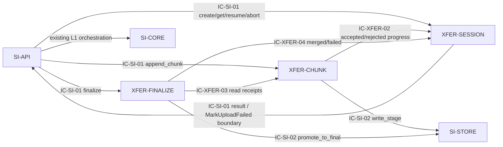

# 02 Architecture Decomposition — SI-XFER upload-transfer 内部分解

## 局部领域概念与不变量

### 局部概念

- `UploadSession`：以 `submission_uuid` 为业务幂等键的上传会话，拥有分片进度和外部可投影状态。
- `ChunkReceipt`：某一分片序号、大小、摘要和暂存引用的接收记录；用于顺序、重复和冲突判断。
- `FinalizeAttempt`：一次合并最终化尝试的检查点和结果，不是跨模块公共状态。
- `DeclaredCategory`：对话、代码、截图、结果等由调用方声明的材料类别；本层只保存声明和实际接收对照，不解释插件配置。

### 不变量

| ID | 不变量 | 保护位置 |
|---|---|---|
| INV-XFER-01 | 一个 `submission_uuid` 至多对应一个活动 UploadSession；重复建会话返回原会话 | XFER-SESSION |
| INV-XFER-02 | 同一 session 内 `seq` 唯一；相同 seq+相同摘要为幂等重复，seq+不同摘要为冲突 | XFER-CHUNK |
| INV-XFER-03 | 已接受字节总量不得超过 500MB；不允许类型不在白名单内的材料进入正式化 | XFER-CHUNK/XFER-FINALIZE |
| INV-XFER-04 | 只有所有必需分片已接收且暂存材料可读时才允许进入 `merged` | XFER-FINALIZE |
| INV-XFER-05 | 外部 UploadSession 状态只能沿父层允许路径迁移；内部恢复/最终化状态不得投影为新外部值 | XFER-SESSION |
| INV-XFER-06 | finalize、resume、abort 可重复调用；重复调用不产生重复材料引用或重复副作用 | XFER-SESSION/XFER-FINALIZE |

## 命令、查询、内部事件和策略

| 类型 | 标识 | 归属 | 作用 |
|---|---|---|---|
| command | `CMD-XFER-001 CreateSession` | XFER-SESSION | 建立或恢复 submission_uuid 对应会话 |
| command | `CMD-XFER-002 AppendChunk` | XFER-CHUNK | 校验并写入一个分片，更新进度 |
| command | `CMD-XFER-003 FinalizeTransfer` | XFER-FINALIZE | 校验分片完整性、调用 promote_to_final、产出 material_refs |
| command | `CMD-XFER-004 AbortTransfer` | XFER-SESSION | 标记会话不可继续并触发暂存清理请求 |
| query | `QRY-XFER-001 GetSessionProgress` | XFER-SESSION | 返回会话状态、进度、失败原因和可恢复信息 |
| event | `EV-XFER-001 ChunkAccepted` | XFER-CHUNK | 当前节点内部通知进度已持久化 |
| event | `EV-XFER-002 TransferMerged` | XFER-FINALIZE | 当前节点内部通知最终化已完成，携带 material_refs |
| event | `EV-XFER-003 TransferTerminalFailed` | XFER-SESSION | 当前节点内部通知会话进入 failed_terminal，由上层映射到 SI-CORE |
| policy | `POL-XFER-001 SizeAndTypePolicy` | XFER-CHUNK | 500MB、白名单、类别和分片大小检查 |
| policy | `POL-XFER-002 ResumeAndRetryPolicy` | XFER-SESSION | 中断可恢复、终止条件和 LCD-006 参数接入 |

## 子节点清单（按稳定 child_id 排序）

| child_id | 名称 | 职责 | 排除项 | 拥有状态 | 需求/父层追踪 | 依赖 | 存在理由 | trace_exemption_reason |
|---|---|---|---|---|---|---|---|---|
| XFER-CHUNK | chunk-receiver | 接收单分片，执行顺序/摘要/大小/类型校验，调用 SI-STORE 写入暂存并记录 ChunkReceipt | 不拥有会话生命周期；不拥有正式材料和配额；不调用外部 API | ST-XFER-02 ChunkReceipt | REQ-DD001、REQ-DD002；REQ-D001、REQ-D002；IC-SI-01.append_chunk；IC-SI-02.write_stage；KD-004/005 | XFER-SESSION、SI-STORE | 分片接收的变化原因、幂等和流式 I/O 独立于会话编排和最终化 | — |
| XFER-FINALIZE | transfer-finalizer | 检查分片完整性、协调合并/正式化、生成 material_refs，保证 finalize 可重试 | 不创建 Submission；不写外部状态机；不拥有 MaterialFile | ST-XFER-03 FinalizeAttempt | REQ-DD001、REQ-DD002；REQ-D001、REQ-D002；IC-SI-01.finalize；IC-SI-02.promote_to_final；INV-XFER-04/06 | XFER-CHUNK、XFER-SESSION、SI-STORE | 合并是高风险的边界动作，需要独立检查点和幂等结果 | — |
| XFER-SESSION | upload-session | 建立/恢复/中止会话，拥有 ST-02 外部状态投影，串行化同会话写入，并向 SI-API 返回进度 | 不处理文件字节；不执行类型/内容校验；不负责 Submission 状态持久化 | ST-XFER-01 UploadSession；会话级 TransferObservation | REQ-DD001、REQ-DD002；REQ-D001、REQ-D002；IC-SI-01.create_session/get_session/abort；LCD-001/005/006 | XFER-CHUNK、XFER-FINALIZE、SI-API | 会话生命周期和故障恢复是跨分片/最终化的稳定协调边界，必须由单一 owner 管理 | — |

## 父/兄弟外部边界依赖图

`append_chunk`、`finalize`、`abort` 均由 SI-API 作为外部入口分别发起；XFER-SESSION 不向 XFER-CHUNK 发起这些操作。XFER-SESSION 返回 `next_expected_seq` 后，下一次分片调用仍从 SI-API 到 XFER-CHUNK 开始。

SI-CORE、SI-VERIFY、SI-RELAY 仅作为确认过的兄弟边界引用：本包不设计其内部，不转移它们的数据或契约所有权。

## 生命周期与分解理由

生命周期：`new → receiving → interrupted_retryable → receiving → merged → pending_verification`；或 `receiving/interrupted_retryable → failed_terminal`。其中 `pending_verification` 的继续推进由 L1 SI-API/SI-VERIFY 编排，本层只保存会话并返回可恢复结果。

分解依据：

1. 按**职责**分开会话协调、分片 I/O 和最终化，而不是按通用 controller/service/repository 分层。
2. 按**状态所有权**分开 ST-XFER-01/02/03；每个状态有一个主要写入 owner。
3. 按**不变量**分开 session_uuid 唯一性、seq 幂等、500MB/白名单、最终化完整性。
4. 按**生命周期**将恢复和终止放在 XFER-SESSION，将最终化检查点放在 XFER-FINALIZE。
5. 按**变化原因**分开文件传输协议变化、会话恢复策略变化和正式化策略变化，减少互相影响。
6. 兄弟节点只通过 L1 已存在的 IC-SI-01/02 与父层编排协作，不在本层复制或重设计其职责。
