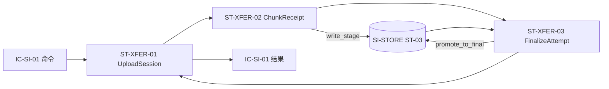

# 03 State and Data — SI-XFER 状态与数据

## 状态所有权清单

| state_id | 状态 | owner child_id | 读方 | 写方 | 生命周期 | 一致性边界 | 保留/隐私约束 | 父层追踪 |
|---|---|---|---|---|---|---|---|---|
| ST-XFER-01 | UploadSession：`session_id`、`submission_uuid`、声明类别、外部状态、内部恢复状态、received_bytes、next_expected_seq、failure_reason、retry_deadline | XFER-SESSION | SI-API；XFER-CHUNK；XFER-FINALIZE | XFER-SESSION；子节点通过内部命令请求迁移 | create → receiving → interrupted_retryable/merged/pending_verification/failed_terminal；终止后按 LCD-006 清理 | 同一 session_id 单写者；状态迁移和进度快照原子提交；不与 ST-01 组成分布式事务 | 短生命周期运行数据；含 submission_uuid 和姓名/小组关联上下文引用，不复制名单数据；失败原因可供 CT-001/CT-002 映射 | L1 ST-02；IC-SI-01；KD-005；LCD-001/006 |
| ST-XFER-02 | ChunkReceipt：`session_id`、`seq`、`category`、`size_bytes`、摘要、暂存引用、写入状态、accepted_at | XFER-CHUNK | XFER-SESSION；XFER-FINALIZE | XFER-CHUNK | receiving 中创建；重复分片更新为 duplicate_ignored；会话清理时删除 | `session_id+seq` 唯一；相同 seq 的摘要必须一致；accepted 记录与 received_bytes 更新同一会话事务 | 不持久化完整文件内容；只保存传输元数据和 SI-STORE 引用；随会话 TTL 清理 | REQ-DD001/002；IC-SI-01.append_chunk；IC-SI-02.write_stage；KD-004 |
| ST-XFER-03 | FinalizeAttempt：`session_id`、attempt_id、检查结果、合并阶段、material_refs、错误类别、started_at/completed_at | XFER-FINALIZE | XFER-SESSION；SI-API（通过结果） | XFER-FINALIZE | finalize 请求创建；成功 merged；可重试失败保留最后一次摘要；会话清理时归档/删除 | 最终化检查点与 session 状态迁移按 session 单写者顺序提交；不得重复 promote 产生不同正式引用 | 不含材料内容；material_refs 由 SI-STORE 生成；失败摘要用于诊断和恢复 | IC-SI-01.finalize；IC-SI-02.promote_to_final；INV-XFER-04/06 |
| ST-XFER-04 | TransferObservation：上传开始、分片接受、恢复、最终化耗时、失败原因和计数指标 | XFER-SESSION | 基础监控；SI-API 观测聚合 | XFER-SESSION/XFER-CHUNK/XFER-FINALIZE 埋点 | 与会话事件同步产生，按监控保留策略汇总 | 观测写入失败不得阻塞业务；指标不反向成为业务状态 | 标签最小化，避免复制材料内容和名单数据；遵守 KD-003 基础监控约束 | PRD implementation_surfaces=observability；SM-001 仍由 SI-API 拥有 |

## 父层存储意图与所有权确认

- ST-XFER-01/02/03 的结构化元数据使用父层既定的单一关系型数据库意图；数据库产品选型继承父层暂缓项，不在本层决定。
- 分片字节和正式材料不由本层保存为独立数据存储；通过 IC-SI-02 写入 SI-STORE 的加密暂存区或正式区。
- `MaterialFile`、`CourseQuotaUsage` 的所有权不从 SI-STORE 转移；本层只保存 `material_ref` 和配额检查结果引用。
- 不新增缓存、消息队列、独立数据库或部署单元；Outbox 仍由 SI-RELAY/L1 负责。

## 数据流

重要写入和读取：

1. `CreateSession`：以 submission_uuid 唯一约束读/写 ST-XFER-01；存在时返回原会话。
2. `AppendChunk`：XFER-CHUNK 先做大小、类别、seq 和摘要检查；通过后调用 SI-STORE 写暂存并写入 ST-XFER-02，再以 IC-XFER-02 请求 XFER-SESSION 原子更新 ST-XFER-01/ST-02 进度。XFER-CHUNK 不直接写 ST-02。
3. `FinalizeTransfer`：读取全部 ChunkReceipt 和声明类别，检查无缺口/无冲突/总量合法；调用 SI-STORE promote_to_final，写 ST-XFER-03 和 material_refs，再把会话投影为 merged。
4. `Abort/expiry`：由 XFER-SESSION 串行化、将会话置为不可继续并发起暂存删除请求；不删除 SI-CORE 的 Submission。
5. `GetSessionProgress`：只读会话进度和失败摘要；不得把内部 `pending_verification` 等值未经 L1 映射直接作为父 API 新状态扩展。

## 一致性、幂等和并发规则

| 规则 | 约束 |
|---|---|
| 会话并发 | 同一 session_id 通过版本号/单写者锁串行化；不同 session_id 可并行，不共享进度锁 |
| 分片幂等 | `session_id+seq` 已存在且摘要相同则返回原接受结果；摘要不同返回冲突，不覆盖原分片 |
| 顺序 | 默认只接受 `next_expected_seq`；断点恢复从持久化的 next_expected_seq 继续；重复已接受 seq 可重放 |
| 总量 | 每次接受前检查累计大小和本片大小，超过 500MB 立即拒绝；不能仅依赖最终化检查 |
| 类型 | 只接受 KD-004 白名单；类型判断失败不写正式材料，映射为父 IC-SI-01 既有错误 |
| finalize | 已 merged 再 finalize 返回同一 material_refs；进行中的 finalize 可由同一 session 串行重试 |
| 外部状态 | 只产生 L1 ST-02 允许的值；内部 checkpoint 和 observation 不外泄为新父契约值域 |
| 文件与元数据 | 不宣称跨存储分布式事务；依赖 SI-STORE 的写入/提升原子性和幂等接口，失败时保留可诊断的会话结果 |

## 状态迁移与失败分支责任

| 操作结果 | 产生方 | 状态/数据写入 | 是否写入 SI-STORE | 对外语义 |
|---|---|---|---|---|
| accepted | XFER-CHUNK | 写 ST-XFER-02；通过 IC-XFER-02 请求 XFER-SESSION 更新 ST-XFER-01/ST-02 进度 | 是 | 返回 accepted、进度和 next_expected_seq |
| duplicate | XFER-CHUNK | 不新增 ChunkReceipt；SESSION 可记录重复计数但不重复累计字节 | 否；直接返回原 material_ref | 返回 duplicate 和原接受结果 |
| rejected | XFER-CHUNK | 不写 ST-XFER-02；不改变 ST-02 状态 | 否 | 返回 `decision=rejected`、error_code 和 failure_reason；会话仍可继续，除非上层另行 abort |
| interrupted_retryable | XFER-SESSION | 仅由 SESSION 写 ST-XFER-01/ST-02 | 失败时保留可清理引用 | 返回可恢复会话和 next_expected_seq |
| failed_terminal | XFER-SESSION | 仅由 SESSION 写 ST-XFER-01/ST-02，并触发既有失败映射 | 发起幂等清理 | 映射为父层既有 upload_failed 语义 |

状态 owner 规则：XFER-CHUNK 独占 ST-XFER-02；XFER-FINALIZE 独占 ST-XFER-03；XFER-SESSION 独占 ST-XFER-01 以及父层 ST-02 投影。`rejected` 是分片操作结果，不是新增的父层状态值。

## 父/兄弟所有权未转移确认

- SI-XFER 只拥有上传会话及其分片/最终化元数据。
- SI-CORE 仍拥有 Submission、外部状态机、完整性报告和 upload_failed 业务记录。
- SI-STORE 仍拥有文件内容、正式 material_ref 的底层对象和课程配额。
- SI-API 仍拥有 HTTP/API、认证、30 秒预算和 SM-001 业务口径。
- SI-RELAY 仍拥有 Outbox/入站去重和跨模块事件投递。
