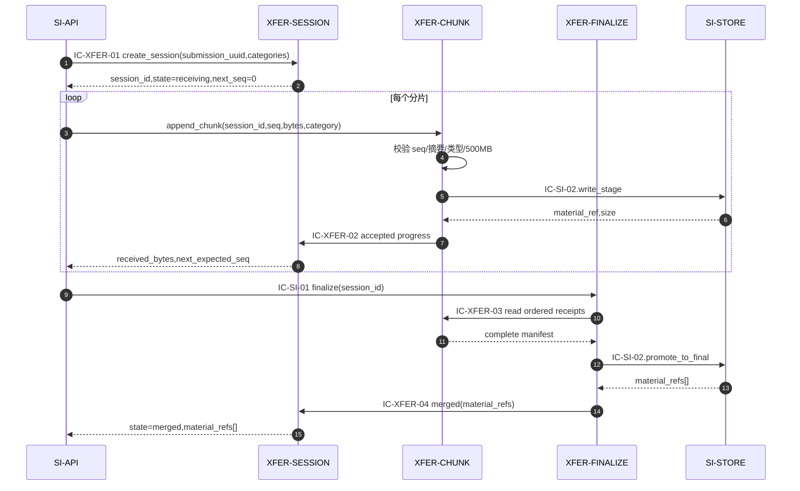
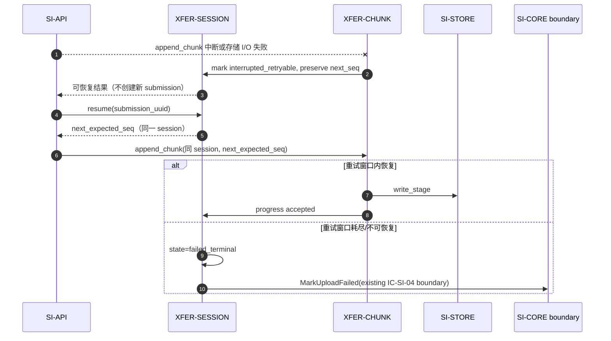
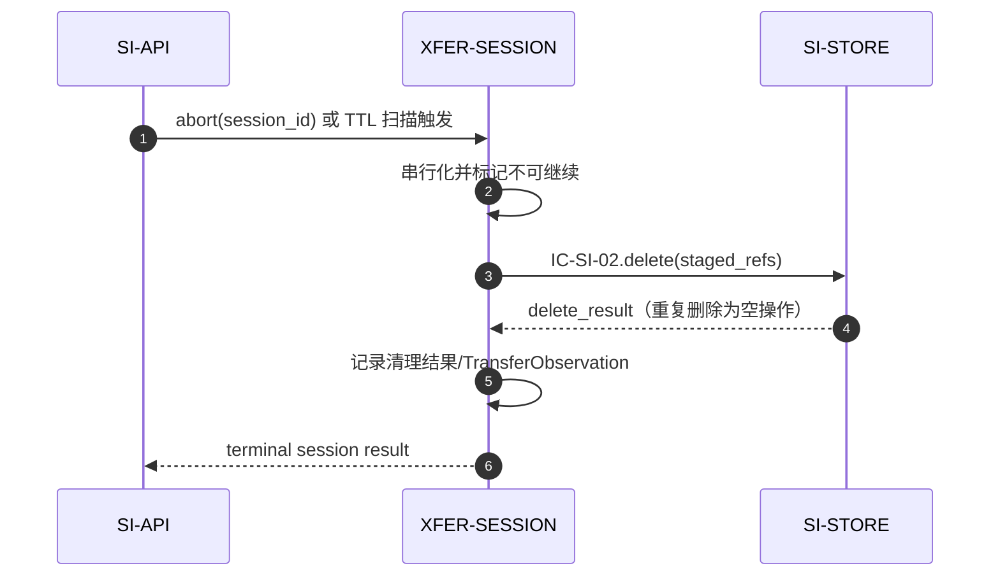

# 04 Contracts and Runtime — SI-XFER 契约与运行时

## 父契约清单与实现映射

| 父 ID | 所有者/消费者 | 路径/名称 | 关键字段/副作用 | 失败/版本 | L2 实现映射 |
|---|---|---|---|---|---|
| IC-SI-01 | SI-XFER → SI-API | 进程内上传会话端口 | `submission_uuid`、`session_id`、`seq`、`bytes`、`declared_categories[]`、`state`、`material_refs[]?`、`failure_reason?`；写 ST-02/分片暂存 | `CHUNK_OUT_OF_ORDER`、`SIZE_LIMIT_EXCEEDED`、`TYPE_NOT_ALLOWED`、`SESSION_NOT_FOUND`；按父包内部契约随包发布，字段只追加 | XFER-SESSION 实现 create/get/abort；XFER-CHUNK 实现 append；XFER-FINALIZE 实现 finalize |
| IC-SI-02 | SI-STORE → SI-XFER | 材料存储端口 | `write_stage`、`promote_to_final`、`read_metadata`、`delete`、配额查询；写/删 ST-03 | `QUOTA_EXCEEDED`、`STORAGE_IO_FAILED`；`material_ref` 唯一，delete 幂等 | XFER-CHUNK 调 write_stage；XFER-FINALIZE 调 promote_to_final；删除由会话终止策略发起 |
| CT-001 | MOD-02 → MOD-01 consumer | `POST /api/v1/submissions` | 外部上传、接收确认、状态和缺失项；副作用由 L1 编排定义 | 外部字段、状态值、错误码和 v=1 语义不变；30 秒确认由 SI-API 控制 | SI-XFER 仅作为 SI-API 的上传子流程，不直接拥有端点 |

本层不新增父外部契约，不改变 IC-SI-01/02 的字段、所有者、依赖、错误、幂等和版本。

## 当前节点内部契约

内部契约限定在 SI-XFER 内，按稳定 ID 排序；与 SI-STORE 的边界仍引用 L1 已确认的 IC-SI-02。

| contract_id | owner → consumer | 触发与 schema | side_effects | errors / timeout / retry | dependencies | 幂等/兼容 |
|---|---|---|---|---|---|---|
| IC-XFER-01 | XFER-SESSION → SI-API | 建会话、查询进度、中止、恢复。输入：`operation`, `submission_uuid`, `session_id?`, `declared_categories[]`, `abort_reason?`；输出：`session_id`, `state`, `received_bytes`, `next_expected_seq`, `failure_reason?` | 写 ST-XFER-01；中止可发起暂存清理 | `SESSION_NOT_FOUND`；单次调用短超时；恢复由同一 submission_uuid 重试 | SI-API；ST-XFER-01 | submission_uuid 唯一；字段只追加；不外泄新父状态值 |
| IC-XFER-02 | XFER-CHUNK → XFER-SESSION | 分片接收结果。输入：`session_id`, `seq`, `category`, `size_bytes`, `digest`, `material_ref`；输出：`decision`, `accepted_bytes?`, `next_expected_seq`, `duplicate`, `error_code?`, `failure_reason?` | accepted 时写 ST-XFER-02 并请求 SESSION 更新进度；rejected 不写暂存、不创建 ChunkReceipt | `CHUNK_OUT_OF_ORDER`, `CHUNK_DIGEST_CONFLICT`, `SIZE_LIMIT_EXCEEDED`, `TYPE_NOT_ALLOWED`, `STORAGE_IO_FAILED`；I/O 失败可重试 | SI-STORE IC-SI-02；ST-XFER-02；ST-XFER-01 由 SESSION 写入 | session_id+seq+digest 幂等；decision=`accepted|duplicate|rejected`；冲突不覆盖 |
| IC-XFER-03 | XFER-FINALIZE → XFER-CHUNK | finalize 前读取分片目录。输入：`session_id`；输出：`ordered_chunk_refs`, `category_coverage`, `total_size`, `missing_seqs`, `conflicts` | 只读 ST-XFER-02；不改变会话状态 | 缺口/冲突返回可修复结果；不启动外部重试 | ST-XFER-02；XFER-CHUNK | 同一快照重复读取结果一致；内部字段可追加 |
| IC-XFER-04 | XFER-FINALIZE → XFER-SESSION | 合并结果。输入：`session_id`, `attempt_id`, `merge_status`, `material_refs?`, `failure_reason?`, `recoverable`；输出：`state_projection`, `material_refs?`, `failure_reason?` | 写 ST-XFER-03；请求 SESSION 更新 ST-XFER-01/ST-02 为 merged、可恢复或终止 | `STORAGE_IO_FAILED` 可重试；不可恢复由 SESSION 映射 failed_terminal | SI-STORE IC-SI-02；ST-XFER-03；ST-XFER-01 | attempt_id 幂等；重复完成返回原 material_refs |
| IC-XFER-05 | XFER-SESSION → observation sink | 观测事件；XFER-FINALIZE 通过 SESSION 的观测协调入口提交。输入：`session_id_hash`, `course_id?`, `phase`, `duration_ms`, `result`, `reason_category`；输出：`observation_recorded` | 异步/非阻塞写 TransferObservation | 观测失败不阻塞业务；无业务重试要求 | ST-XFER-04；基础监控 | 只追加事件/计数；不影响父契约 |

### `IC-SI-01`

以下是父契约在本 L2 包的入口映射，仅用于机器可读的组件覆盖检查，不改变父契约所有者、消费者或公开字段语义。

| Field | Contract |
|---|---|
| contract_id | `IC-SI-01` |
| contract_type | `inherited_module_port` |
| provider | SI-API |
| consumer | XFER-SESSION, XFER-CHUNK, XFER-FINALIZE |
| Schema | 输入：`submission_uuid`, `session_id?`, `seq?`, `bytes?`, `declared_categories[]`, `abort_reason?`；输出：`session_id`, `state`, `received_bytes`, `next_expected_seq`, `material_refs[]?`, `failure_reason?` |
| side_effects | 按操作写入 ST-XFER-01/ST-XFER-02/ST-XFER-03 或经 IC-SI-02 写入暂存/正式材料 |
| dependencies | SI-API；IC-SI-01；IC-SI-02；ST-02 |
| Error / Timeout / Retry | 继承父契约 `CHUNK_OUT_OF_ORDER`, `SIZE_LIMIT_EXCEEDED`, `TYPE_NOT_ALLOWED`, `SESSION_NOT_FOUND`；字段只追加 |

### `IC-XFER-01`

| Field | Contract |
|---|---|
| contract_id | `IC-XFER-01` |
| contract_type | `internal_port` |
| provider | XFER-SESSION |
| consumer | SI-API |
| Schema | 输入：`operation`, `submission_uuid`, `session_id?`, `declared_categories[]`, `abort_reason?`；输出：`session_id`, `state`, `received_bytes`, `next_expected_seq`, `failure_reason?` |
| side_effects | 写 ST-XFER-01；abort/expiry 可发起 IC-SI-02.delete |
| dependencies | SI-API；ST-XFER-01；IC-SI-02 |
| Error / Timeout / Retry | `SESSION_NOT_FOUND`；短超时；同一 submission_uuid 可重试 |

### `IC-XFER-02`

| Field | Contract |
|---|---|
| contract_id | `IC-XFER-02` |
| contract_type | `internal_port` |
| provider | XFER-CHUNK |
| consumer | XFER-SESSION |
| Schema | 输入：`session_id`, `seq`, `category`, `size_bytes`, `digest`, `material_ref`；输出：`decision`, `accepted_bytes?`, `next_expected_seq`, `duplicate`, `error_code?`, `failure_reason?` |
| side_effects | accepted 写 ST-XFER-02 并请求 SESSION 更新进度；rejected 不写暂存和 ChunkReceipt |
| dependencies | SI-STORE；IC-SI-02；ST-XFER-02；ST-XFER-01 由 SESSION 写入 |
| Error / Timeout / Retry | `CHUNK_OUT_OF_ORDER`; `CHUNK_DIGEST_CONFLICT`; `SIZE_LIMIT_EXCEEDED`; `TYPE_NOT_ALLOWED`; `STORAGE_IO_FAILED` |

### `IC-XFER-03`

| Field | Contract |
|---|---|
| contract_id | `IC-XFER-03` |
| contract_type | `internal_port` |
| provider | XFER-FINALIZE |
| consumer | XFER-CHUNK |
| Schema | 输入：`session_id`；输出：`ordered_chunk_refs`, `category_coverage`, `total_size`, `missing_seqs`, `conflicts` |
| side_effects | None; read-only |
| dependencies | ST-XFER-02；XFER-CHUNK |
| Error / Timeout / Retry | 缺口/冲突返回可修复结果；同一快照可重读 |

### `IC-XFER-04`

| Field | Contract |
|---|---|
| contract_id | `IC-XFER-04` |
| contract_type | `internal_port` |
| provider | XFER-FINALIZE |
| consumer | XFER-SESSION |
| Schema | 输入：`session_id`, `attempt_id`, `merge_status`, `material_refs?`, `failure_reason?`, `recoverable`；输出：`state_projection`, `material_refs?`, `failure_reason?` |
| side_effects | 写 ST-XFER-03；请求 SESSION 更新 ST-XFER-01/ST-02 |
| dependencies | SI-STORE；IC-SI-02；ST-XFER-03；ST-XFER-01 |
| Error / Timeout / Retry | `STORAGE_IO_FAILED` 可重试；不可恢复由 SESSION 映射 failed_terminal |

### `IC-XFER-05`

| Field | Contract |
|---|---|
| contract_id | `IC-XFER-05` |
| contract_type | `internal_port` |
| provider | XFER-SESSION |
| consumer | observation sink |
| Schema | 输入：`session_id_hash`, `course_id?`, `phase`, `duration_ms`, `result`, `reason_category`；输出：`observation_recorded` |
| side_effects | 异步/非阻塞写 ST-XFER-04 |
| dependencies | ST-XFER-04；基础监控 |
| Error / Timeout / Retry | 观测失败不阻塞业务；无业务重试要求 |

### 调用方向与 next_hop 约束

| 入口/调用 | 合法方向 | 说明 |
|---|---|---|
| 建会话、查询、恢复、中止 | SI-API → XFER-SESSION，经 IC-XFER-01 | SESSION 返回 `next_expected_seq`；恢复后的下一片仍由 SI-API 发起。 |
| 追加分片 | SI-API → XFER-CHUNK，经父 IC-SI-01.append_chunk | CHUNK 校验并调用 SI-STORE，再以 IC-XFER-02 向 SESSION 报告结果。 |
| 进度更新 | XFER-CHUNK → XFER-SESSION，经 IC-XFER-02 | 这是单向内部回调，不是 SESSION 对 CHUNK 的反向调用。 |
| 最终化 | SI-API → XFER-FINALIZE，经父 IC-SI-01.finalize | FINALIZE 依次调用 IC-XFER-03、IC-SI-02.promote_to_final、IC-XFER-04。 |
| 中止/清理 | SI-API 或 TTL 扫描 → XFER-SESSION，经 IC-XFER-01 | SESSION 负责终止状态和暂存清理请求。 |

禁止生成 `XFER-SESSION → XFER-CHUNK` 的 `append/finalize/abort` next_hop；验证 trace 中下一次 append/finalize 是新的 SI-API 入口，不是组件内部回跳。

## 运行流一：成功上传至 merged

最终 `merged` 结果返回 SI-API，后续名单校验和 SI-CORE 持久化仍由 L1 RF-01 编排。

## 运行流二：中断与恢复/终止

该流不新增 `verifying` 等父状态；名单服务不可用时由 L1 LCD-001 的会话层策略继续承载 `pending_verification`。

## 运行流三：生命周期中止和清理

清理不触碰 SI-CORE 的 Submission，也不接管 MOD-05 的 retention_due_at、删除批次或审计记录。

## 错误、重试、超时、幂等、可观测性和兼容性

| 方面 | L2 约束 |
|---|---|
| 错误 | `CHUNK_OUT_OF_ORDER`、`SIZE_LIMIT_EXCEEDED`、`TYPE_NOT_ALLOWED`、`SESSION_NOT_FOUND` 继续使用 IC-SI-01 既有集合；SI-STORE 错误原样映射到 L1 既有错误分类 |
| 重试 | 分片上传由调用方按 session/seq 重试；存储 I/O 失败保留会话进度；finalize 以 attempt_id 重试；重试截止时间接入 LCD-006，不在本层决定具体参数 |
| 超时 | 单分片和单次端口调用必须是短工作单元；不得等待长时间恢复或名单校验；30 秒总预算由 SI-API 分配 |
| 幂等 | submission_uuid 建会话、session_id+seq 分片、attempt_id finalize、delete material_ref 均幂等 |
| 可观测 | 记录接受率、重复分片数、断点恢复数、最终化耗时、失败原因类别、暂存 I/O 延迟；不记录材料内容和敏感原文；SM-001 的有效提交分母/分子仍由 SI-API 口径决定 |
| 兼容 | 内部契约随 MOD-02 一起发布，字段只追加；不改变 CT-001、IC-SI-01、IC-SI-02 的外部语义或版本；不增加父状态值 |
