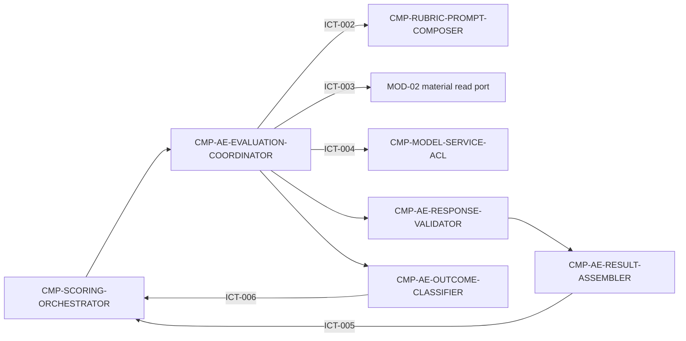

# 02 Architecture Decomposition — CMP-ASSESSMENT-ENGINE

## 1. Local semantic refinement

This node is an execution capability, not a new bounded context or aggregate. The parent `AssessmentResult` aggregate remains owned and persisted by `CMP-SCORING-ORCHESTRATOR`.

| Local concept | Meaning | Boundary |
|---|---|---|
| `EvaluationContext` | task-local assignment, material references, missing items, attempt metadata, and prompt/rubric versions | ephemeral; no durable ownership |
| `ModelAssessmentResponse` | raw response returned by `ICT-004` | untrusted until validated |
| `DimensionRationale` | one of exactly five dimension/evidence pairs | validator enforces completeness and uniqueness |
| `TeacherSuggestion` | improvement advice carrying an internal teacher-only marker | never exposed as student-facing data here |
| `MissingMaterialImpact` | explanation of how missing material limits the assessment | result field, not a failure by itself |
| `EvaluationFailure` | classified failure that can be reported through `ICT-006` | retry/terminal policy remains parent-owned |

### Local invariants

1. A successful result has exactly one grade in `A–E` and exactly five dimension rationales.
2. A successful result contains teacher-only marking on every teacher suggestion and includes `missing_materials_impact` when `missing_items[]` is non-empty.
3. A failed validation never produces a grade or partial scored result.
4. A failure is reported with a stable parent-compatible error kind; this node does not decide whether it is retried.
5. No local child writes `ST-001`, `ST-002`, `ST-003`, or `ST-004`.

## 2. Child registry (sorted by stable `child_id`)

| child_id | responsibility | exclusions | owned state | requirement/parent trace | dependencies | reason for existence | trace_exemption_reason |
|---|---|---|---|---|---|---|---|
| `CMP-AE-EVALUATION-COORDINATOR` | Coordinate one attempt: accept `ICT-001` execution context, call `ICT-002`, call `ICT-003`, call `ICT-004`, and route success/failure to local children and parent callbacks | no task claiming, retry scheduling, persistence, network, rubric ownership, or CT-005 publication | ephemeral `EvaluationContext` | `REQ-DD001`, `D-AC-REQ-008-01`, `ICT-001`, `ICT-002`, `ICT-003`, `ICT-004`, `ICT-005`, `ICT-006` | orchestrator execution context; prompt composer; MOD-02 read port; model ACL; validator; assembler; classifier | isolates execution sequencing from validation and parent lifecycle policy | — |
| `CMP-AE-OUTCOME-CLASSIFIER` | Map prompt, material, model, and validation failures to parent-compatible `ICT-006` error kinds and produce failure metadata | no retry count, backoff, terminal state, notification, or failure invention | ephemeral `EvaluationFailure` | `REQ-DD001`, `D-AC-REQ-008-01`, `ICT-006`, `DF-2` | coordinator; ICT-006 parent port | keeps failure taxonomy and reporting separate from execution and result assembly | — |
| `CMP-AE-RESULT-ASSEMBLER` | Assemble validated grade, five rationales, suggestions, missing-material impact, timestamps, versions, and model metadata for `ICT-005` | no persistence, Outbox write, CT-005 publication, or terminal transaction | ephemeral `ValidatedAssessmentPayload` | `REQ-DD001`, `D-AC-REQ-008-01`, `ICT-005`, `LCD-003` | result structure changes independently from model/vendor integration and task scheduling | — |
| `CMP-AE-RESPONSE-VALIDATOR` | Validate model output against A–E, exactly five dimensions, rationale completeness, teacher-only suggestion marking, and missing-material rules | no prompt generation, model call, fallback grade, persistence, or retry decision | ephemeral `ValidatedModelResponse` | `REQ-DD001`, `FR-008`, `D-AC-REQ-008-01`, `ICT-004`, `ICT-005`, `ICT-006` | owns the domain invariants that guard the parent scored result | — |

All children have direct requirement or parent-contract traces. No trace exemption is used.

## 3. Dependency map

The arrows are in-process calls or existing parent ports. They do not create a new service, topic, public API, database, or deployment unit.

## 4. C1-C6 mappings

| Mapping | Parent source | L2 result | Boundary preserved |
|---|---|---|---|
| C1 | `CMP-ASSESSMENT-ENGINE` | four children above | all remain inside the selected node |
| C2 | `ST-001`/`ST-002` plus parent AssessmentResult invariants | transient local context/response/payload only | durable state and consistency remain with orchestrator |
| C3 | `FLOW-004`/`FLOW-005`/`FLOW-006`/`FLOW-007`, `DF-2` | coordinator sequence plus success/failure/lifecycle flows in `04` | parent business order and retry meaning are unchanged |
| C4 | `ICT-001` through `ICT-006` | realization maps and machine-readable boundary cards in `04`, plus child-only in-process ports | parent IDs, fields, owners, side effects, errors, and versions unchanged |
| C5 | `ICT-003` and `ICT-004` | material and model collaborators remain behind existing ports | MOD-02 storage and model vendor are not redesigned |
| C6 | `L2-AE-D001`–`L2-AE-D004` | validator, assembler, classifier, redacted observability, ephemeral context | no parent-level platform or deployment choice introduced |

## 5. Sibling and support boundary confirmation

`CMP-RUBRIC-PROMPT-COMPOSER`, `CMP-MODEL-SERVICE-ACL`, `CMP-RESULT-PUBLISHER`, and `CMP-SCORING-METRICS` are referenced as parent-level support collaborators only. `MOD-01` and `MOD-03` are reference-only siblings. None of their internals is redesigned or assigned new state ownership by this package.
