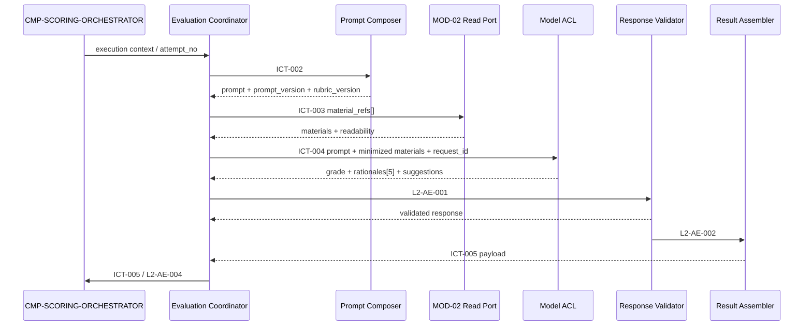
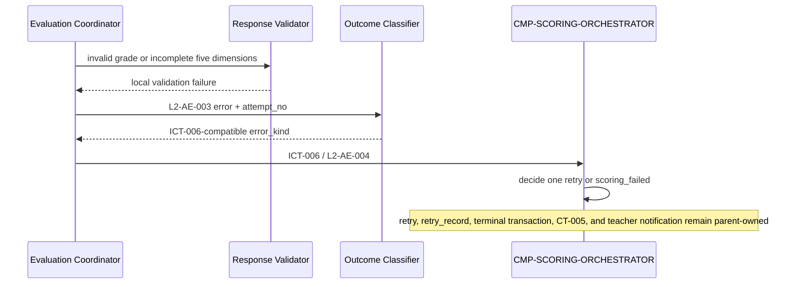

# 04 Contracts and Runtime — CMP-ASSESSMENT-ENGINE

## 1. Inherited contract inventory

The following contracts are copied as binding parent contracts. This package does not rename, weaken, add required fields to, change owners of, or version-bump them.

| contract_id | contract_type | provider | consumer | schema / fields | side_effects | dependencies | failures / timeout / retry | version |
|---|---|---|---|---|---|---|---|---|
| `CT-004` | event | MOD-02 | parent orchestrator | `submission_id`, `course_id`, `assignment`, `student_name`, `group_name`, `material_refs[]`, `missing_items[]`, `received_at`, `v=1` | orchestrator persists task before acknowledging | MOD-02 submission intake and material references | duplicate `submission_id` is deduplicated by parent | `v=1` |
| `CT-005` | event | MOD-04 parent publisher | MOD-02 and MOD-05 | `outcome`; scored: `original_grade`, `dimension_rationales[5]`, `teacher_suggestions[]`, `scored_at`; failed: `failure_reason`, `retry_record`; `v=1` | Outbox insertion in parent terminal transaction | `ST-001`, `ST-002`, `ST-003` | terminal transaction/idempotency owned by parent | `v=1` |
| `CT-010` | external_api | model service via ACL | `CMP-MODEL-SERVICE-ACL` | request: minimized `evaluation_prompt` + materials + `request_id`; response: grade, five rationales, suggestions | external model inference after ACL minimization | external provider, ACL | single call ≤3 min; `MODEL_TIMEOUT`, `MODEL_ERROR`, `INVALID_RESPONSE_SCHEMA`; retry policy is parent-owned | parent contract |
| `ICT-001` | command | `CMP-SCORING-ORCHESTRATOR` | `CMP-AE-EVALUATION-COORDINATOR` | output `task_id`, `submission_id`, `assignment`, `material_refs[]`, `missing_items[]`, `attempt_no`, `deadline_at`; or `NO_TASK` | conditional task claim remains parent-owned | `ST-001` | `NO_TASK` is normal control flow; `CLAIM_CONFLICT` causes polling | internal evolving |
| `ICT-002` | command | `CMP-RUBRIC-PROMPT-COMPOSER` | `CMP-AE-EVALUATION-COORDINATOR` | input `assignment`, material list, `missing_items[]`; output `evaluation_prompt`, `prompt_version`, `rubric_version` | none | `ST-004` versioned configuration | `PROMPT_ASSEMBLY_FAILED` -> `ICT-006`; deterministic for same input/version | internal evolving |
| `ICT-003` | query_port | MOD-02 material read port | `CMP-AE-EVALUATION-COORDINATOR` | input `material_refs[]`; output material contents/readability | none; read-only | MOD-02 shared material storage | `MATERIAL_UNREADABLE` -> `ICT-006`; no ownership transfer | internal evolving |
| `ICT-004` | command | `CMP-MODEL-SERVICE-ACL` | `CMP-AE-EVALUATION-COORDINATOR` | input prompt/materials/request id; output grade, rationales[5], suggestions or classified model error | ACL calls CT-010; no local persistence | vendor ACL and minimization policy | timeout/error/schema error; retry decided by orchestrator | internal evolving |
| `ICT-005` | command | `CMP-AE-EVALUATION-COORDINATOR` | `CMP-SCORING-ORCHESTRATOR` | grade, rationales[5], teacher suggestions, `scored_at`, missing-material impact, prompt/rubric versions, model metadata | parent scored terminal transaction writes ST-001/ST-002 and invokes ICT-007 | parent state machine and publisher | invalid domain response must use ICT-006; terminal transition once | internal evolving |
| `ICT-006` | command | `CMP-AE-EVALUATION-COORDINATOR` | `CMP-SCORING-ORCHESTRATOR` | `error_kind`, `attempt_no`, `at` | parent schedules one retry or enters scoring_failed and publishes CT-005 | DF-2, retry table, ST-001 | stable parent-compatible error kinds; dedup by attempt | internal evolving |

## 2. Inherited-contract realization map

| Parent contract | Current child realization | Preservation evidence |
|---|---|---|
| `ICT-001` | orchestrator claims the task and passes the execution context to the coordinator | task lifecycle, lease ownership, attempt number, and claim idempotency remain parent-owned |
| `ICT-002` | coordinator invokes prompt composer; context stores returned versions | no template ownership or prompt field change |
| `ICT-003` | coordinator invokes read port; response is handed to validator/assembler | read-only access; MOD-02 remains owner |
| `ICT-004` | coordinator invokes ACL; validator receives raw response or classified error | no direct network/vendor call; ACL error taxonomy preserved |
| `ICT-005` | result assembler builds the exact input payload; coordinator reports it to orchestrator | parent owns transaction, persistence, and terminal idempotency |
| `ICT-006` | outcome classifier maps local failures; coordinator reports exact `error_kind` and `attempt_no` | parent owns retry/terminal policy and `retry_record` |
| `CT-004` / `CT-005` / `CT-010` | referenced only at existing MOD-04 boundary | public fields, owners, side effects, and versions unchanged |

## 3. Coordinator boundary contract cards

These cards make the inherited boundary machine-readable for strict validation. They mirror the parent contracts and do not introduce new fields or change ownership.

### `ICT-001` ClaimScoringTask

| Field | Contract |
|---|---|
| `contract_id` | `ICT-001` |
| `contract_type` | `command` |
| Provider | `CMP-SCORING-ORCHESTRATOR` |
| Consumer | `CMP-AE-EVALUATION-COORDINATOR` |
| Trigger | worker claims a pending or expired-lease task |
| Schema | 输入：；输出：`task_id`, `submission_id`, `assignment`, `material_refs[]`, `missing_items[]`, `attempt_no`, `deadline_at`, or `NO_TASK` |
| `side_effects` | parent-owned conditional update of `ST-001`; no local write |
| Errors/timeouts/retries | `NO_TASK` is normal control flow; `CLAIM_CONFLICT` causes polling |
| Idempotency | conditional update; one executor per task |
| Compatibility | coordinator consumes the exact parent execution-context fields |

### `ICT-002` ComposeEvaluationPrompt

| Field | Contract |
|---|---|
| `contract_id` | `ICT-002` |
| `contract_type` | `command` |
| Provider | `CMP-RUBRIC-PROMPT-COMPOSER` |
| Consumer | `CMP-AE-EVALUATION-COORDINATOR` |
| Trigger | coordinator starts one assessment attempt |
| Schema | 输入：`assignment`, `material_refs[]`, `missing_items[]`; 输出：`evaluation_prompt`, `prompt_version`, `rubric_version` |
| `side_effects` | `None; read-only prompt assembly` |
| Errors/timeouts/retries | `PROMPT_ASSEMBLY_FAILED` -> `ICT-006`; no local retry |
| Idempotency | same rubric version and input produce the same output |
| Compatibility | inherited `ICT-002` fields and failure meaning are unchanged |

### `ICT-003` LoadMaterialContents

| Field | Contract |
|---|---|
| `contract_id` | `ICT-003` |
| `contract_type` | `query_port` |
| Provider | `MOD-02-MATERIAL-READ-PORT` |
| Consumer | `CMP-AE-EVALUATION-COORDINATOR` |
| Trigger | prompt composition completes and material references are available |
| Schema | 输入：`material_refs[]`; 输出：`materials[]`, `readability[]` |
| `side_effects` | `None; read-only`; ownership remains MOD-02 |
| Errors/timeouts/retries | `MATERIAL_UNREADABLE` -> `ICT-006`; missing declared items are not port errors |
| Idempotency | read-only, naturally idempotent |
| Compatibility | material reference shape follows `CT-004` |

### `ICT-004` InvokeModelAssessment

| Field | Contract |
|---|---|
| `contract_id` | `ICT-004` |
| `contract_type` | `command` |
| Provider | `CMP-MODEL-SERVICE-ACL` |
| Consumer | `CMP-AE-EVALUATION-COORDINATOR` |
| Trigger | prompt and readable/minimized materials are ready |
| Schema | 输入：`evaluation_prompt`, `materials`, `request_id`; 输出：`grade`, `dimension_rationales[5]`, `suggestions[]`, or classified error |
| `side_effects` | ACL invokes `CT-010` after minimization; no local persistence |
| Errors/timeouts/retries | `MODEL_TIMEOUT`, `MODEL_ERROR`, `INVALID_RESPONSE_SCHEMA`; retry remains parent-owned |
| Idempotency | each attempt uses a new `request_id` |
| Compatibility | no business identifiers leave through the ACL |

### `ICT-005` CompleteAssessment

| Field | Contract |
|---|---|
| `contract_id` | `ICT-005` |
| `contract_type` | `command` |
| Provider | `CMP-AE-EVALUATION-COORDINATOR` |
| Consumer | `CMP-SCORING-ORCHESTRATOR` |
| Trigger | result assembly succeeds after domain validation |
| Schema | 输入：`original_grade`, `dimension_rationales[5]`, `teacher_suggestions[]`, `scored_at`, `missing_materials_impact`, `prompt_version`, `rubric_version`, `model_meta`; 输出： |
| `side_effects` | parent scored terminal transaction writes `ST-001`/`ST-002` and invokes `ICT-007` |
| Errors/timeouts/retries | invalid domain response must use `ICT-006`; no local retry |
| Idempotency | parent terminal transition executes once |
| Compatibility | exact inherited `ICT-005` payload; no new required fields |

### `ICT-006` FailAssessment

| Field | Contract |
|---|---|
| `contract_id` | `ICT-006` |
| `contract_type` | `command` |
| Provider | `CMP-AE-EVALUATION-COORDINATOR` |
| Consumer | `CMP-SCORING-ORCHESTRATOR` |
| Trigger | prompt, material, model, or response-validation failure is classified |
| Schema | 输入：`error_kind`, `attempt_no`, `at`; 输出： |
| `side_effects` | parent schedules the only retry or enters `scoring_failed`; child does not write state |
| Errors/timeouts/retries | `MODEL_TIMEOUT`, `MODEL_ERROR`, `INVALID_RESPONSE_SCHEMA`, `MATERIAL_UNREADABLE`, `PROMPT_ASSEMBLY_FAILED` |
| Idempotency | deduplicated by `attempt_no` in the parent |
| Compatibility | exact inherited `ICT-006` error taxonomy and fields |

## 4. Child-only contracts (sorted by `contract_id`)

These are in-process ports scoped to this node. They are not public APIs, events, topics, or deployable boundaries.

### `L2-AE-001` ValidateModelResponse

| Field | Contract |
|---|---|
| `contract_id` | `L2-AE-001` |
| `contract_type` | `in_process_command` |
| Provider | `CMP-AE-EVALUATION-COORDINATOR` |
| Consumer | `CMP-AE-RESPONSE-VALIDATOR` |
| Trigger | `ICT-004` returns a model response |
| Schema | 输入：`grade`, `dimension_rationales[]`, `suggestions`, `missing_items[]`; 输出：`validated_response` or `validation_error` |
| `side_effects` | `None; read-only transformation` |
| `dependencies` | `ICT-004`, `FR-008`, `D-AC-REQ-008-01` |
| Errors/timeouts/retries | invalid grade, duplicate/missing dimension, incomplete rationale, or missing teacher-only marker; no local retry |
| Idempotency | same response/context yields the same validation result |
| Compatibility | node-scoped; changes must preserve the `ICT-005`/`ICT-006` parent shapes |

### `L2-AE-002` AssembleValidatedOutcome

| Field | Contract |
|---|---|
| `contract_id` | `L2-AE-002` |
| `contract_type` | `in_process_command` |
| Provider | `CMP-AE-RESPONSE-VALIDATOR` |
| Consumer | `CMP-AE-RESULT-ASSEMBLER` |
| Trigger | validation succeeds |
| Schema | 输入：`validated_grade`, `dimension_rationales[5]`, `teacher_suggestions[]`, `missing_materials_impact`, `prompt_version`, `rubric_version`, `model_meta`; 输出：`validated_assessment_payload` |
| `side_effects` | `None; transient payload construction` |
| `dependencies` | `D-AC-REQ-008-01`, `LCD-003`, `ICT-005` |
| Errors/timeouts/retries | missing required assembly context is a local failure routed to `L2-AE-003`; no local retry |
| Idempotency | same validated input and context produce the same payload except the parent-assigned timestamp |
| Compatibility | output is a strict subset of the inherited `ICT-005` input |

### `L2-AE-003` ClassifyEvaluationFailure

| Field | Contract |
|---|---|
| `contract_id` | `L2-AE-003` |
| `contract_type` | `in_process_command` |
| Provider | coordinator, validator, or collaborator adapter result |
| Consumer | `CMP-AE-OUTCOME-CLASSIFIER` |
| Trigger | prompt, material, model, or domain validation failure |
| Schema | 输入：`source_error`, `attempt_no`, `at`, `correlation_id`, optional `safe_diagnostic_category`; 输出：`error_kind`, `attempt_no`, `at` |
| `side_effects` | `None; classification only` |
| `dependencies` | `ICT-006`, parent error taxonomy, `DF-2` |
| Errors/timeouts/retries | unknown errors are not silently converted to success; local handling emits a parent-compatible failure category or escalates as a blocked contract question |
| Idempotency | same source error and attempt yields the same `error_kind` |
| Compatibility | local-only; emitted result is `ICT-006` compatible |

### `L2-AE-004` ReportAssessmentOutcome

| Field | Contract |
|---|---|
| `contract_id` | `L2-AE-004` |
| `contract_type` | `in_process_callback` |
| Provider | `CMP-AE-EVALUATION-COORDINATOR` |
| Consumer | `CMP-SCORING-ORCHESTRATOR` |
| Trigger | local assembly or classification completes |
| Schema | 输入：success `ICT-005` payload or failure `ICT-006` payload; 输出： |
| `side_effects` | parent terminal/retry behavior only |
| `dependencies` | `ICT-005`, `ICT-006`, parent state machine |
| Errors/timeouts/retries | callback failure is handled by the parent execution/lease mechanism; child does not create a second durable queue |
| Idempotency | parent terminal transition and attempt rules remain authoritative |
| Compatibility | cannot change parent contract shape or version |

## 5. Legal runtime flows

The coordinator is the only local entry point for an attempt. External collaborators are terminal targets from this package's perspective; the parent callback is an explicit terminal hop.

```yaml
legal_flows:
  - flow_id: AE-FLOW-SUCCESS
    entry_component: CMP-AE-EVALUATION-COORDINATOR
    entry_contract: ICT-001
    steps:
      - {from: CMP-AE-EVALUATION-COORDINATOR, action: compose_prompt, contract_id: ICT-002, next_hop: CMP-RUBRIC-PROMPT-COMPOSER}
      - {from: CMP-AE-EVALUATION-COORDINATOR, action: load_materials, contract_id: ICT-003, next_hop: MOD-02-MATERIAL-READ-PORT}
      - {from: CMP-AE-EVALUATION-COORDINATOR, action: invoke_model, contract_id: ICT-004, next_hop: CMP-MODEL-SERVICE-ACL}
      - {from: CMP-AE-EVALUATION-COORDINATOR, action: validate_response, contract_id: L2-AE-001, next_hop: CMP-AE-RESPONSE-VALIDATOR}
      - {from: CMP-AE-RESPONSE-VALIDATOR, action: assemble_outcome, contract_id: L2-AE-002, next_hop: CMP-AE-RESULT-ASSEMBLER}
      - {from: CMP-AE-RESULT-ASSEMBLER, action: return_assembled_payload, contract_id: L2-AE-002, next_hop: CMP-AE-EVALUATION-COORDINATOR}
      - {from: CMP-AE-EVALUATION-COORDINATOR, action: report_scored, contract_id: ICT-005, next_hop: CMP-SCORING-ORCHESTRATOR}
    terminal_state: scored
  - flow_id: AE-FLOW-FAILURE
    entry_component: CMP-AE-EVALUATION-COORDINATOR
    entry_contract: ICT-001
    steps:
      - {from: CMP-AE-EVALUATION-COORDINATOR, action: classify_failure, contract_id: L2-AE-003, next_hop: CMP-AE-OUTCOME-CLASSIFIER}
      - {from: CMP-AE-EVALUATION-COORDINATOR, action: report_failure, contract_id: ICT-006, next_hop: CMP-SCORING-ORCHESTRATOR}
    terminal_state: parent_retry_or_scoring_failed
```

## 6. Runtime flows

### 4.1 Success



### 4.2 Failure and parent recovery



### 4.3 Lifecycle and worker crash

The coordinator, validator, assembler, and classifier hold no durable state. If a worker crashes before a callback, the parent lease/reclaim mechanism reruns the same attempt according to the inherited rules. A crash is not converted into a local scoring result and does not increment retry count inside this node.

## 7. Runtime safety notes

- `ICT-004` remains the sole route to model inference; business identifiers are minimized by the ACL.
- `ICT-005` is emitted only after all domain validations pass.
- `ICT-006` is emitted for prompt, material, model, or response-validation failures; the child does not fabricate a grade or retry result.
- Logs contain correlation/request IDs, durations, versions, and error kinds only. Raw material, student names, and group names are excluded.
- No child-only contract introduces an external side effect. The only durable side effects are those already owned by the parent contracts.

## 8. Contract compatibility confirmation

Inherited external and cross-node contract semantics remain unchanged. No public contract, event field, owner, path/topic, side effect, dependency, failure meaning, retry semantics, or version was modified.
