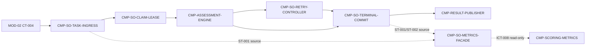

# 02 Architecture Decomposition — CMP-SCORING-ORCHESTRATOR

This decomposition is inside the selected L1 node only. It uses responsibility, state ownership, invariants, lifecycle, change reason, and interaction. It does not turn any L1 support component into a sibling L2 target and does not redesign `CMP-ASSESSMENT-ENGINE`, `CMP-RESULT-PUBLISHER`, `CMP-MODEL-SERVICE-ACL`, or `CMP-SCORING-METRICS`.

## 1. Local semantic refinement

### 1.1 Local consistency model

The parent `AssessmentResult` aggregate is refined into one local consistency unit with two persisted state areas: the mutable `ScoringTask` lifecycle (`ST-001`) and the immutable terminal result (`ST-002`). The terminal commit also coordinates the inherited `ST-003` Outbox write. These are not new parent aggregates or new public state owners.

### 1.2 Concepts, value objects, and invariants

- `ScoringTaskKey`: `submission_id`; unique for CT-004 ingestion.
- `AttemptNo`: only 1 or 2 for classified assessment attempts; crash reclaim does not increment it.
- `ClaimLease`: owner token, expiry, and `reclaim_count`; conditional updates allow one active worker.
- `FailureRecord`: error kind and timestamp for first and second classified failures.
- `TerminalOutcome`: `scored` with result fields or `scoring_failed` with real failure reason and retry record.
- `DeadlineWindow`: `created_at + 10 minutes`; used for timing/observability and not for forced termination.

Binding invariants:

1. `submission_id` creates at most one scoring task.
2. A task has at most one active lease and terminal transitions are irreversible.
3. A classified failure consumes at most one automatic retry; a second classified failure becomes `scoring_failed`.
4. Worker crash reclaim does not consume the classified retry budget; `reclaim_count` records it.
5. A scored task writes ST-001, ST-002, and the CT-005 Outbox row in one terminal transaction.
6. A scoring failure writes the real failure reason and retry record and never fabricates a grade.
7. Parent contract identifiers, fields, owners, side effects, failure semantics, and versioning remain unchanged.

### 1.3 Commands, callbacks, policies, and internal events

| Kind | Local element | Meaning |
|---|---|---|
| Command | `IngestSubmissionReceived` | Apply CT-004 deduplication and create ST-001 pending task |
| Command | `ClaimNextScoringTask` | Apply ICT-001 conditional claim/lease update |
| Callback | `AssessmentCompleted` | Accept ICT-005 payload for terminal commit after engine validation |
| Callback | `AssessmentFailed` | Accept ICT-006 error classification and attempt number |
| Command | `ReclaimExpiredLease` | Reopen a crashed task without incrementing attempts |
| Query | `ReadScoringMetrics` | Serve ICT-008 from ST-001/ST-002 read-only projections |
| Policy | `RetryOncePolicy` | Decide retry vs terminal failure for classified errors |
| Policy | `CrashReclaimPolicy` | Bound reclaim count and prevent unbounded crash loops |
| Policy | `DeadlineTrackingPolicy` | Set and report deadline_at without hard-killing work |
| Policy | `TerminalOutcomePolicy` | Select scored/scoring_failed payload shape and transaction path |
| Internal event | `TaskPersisted`, `TaskClaimed`, `RetryEntered`, `OutcomeCommitted`, `LeaseReclaimed` | In-process coordination signals; not a new message bus or public event |

## 2. Child registry

Stable IDs are sorted lexicographically. The selected current node identity (`CMP-SCORING-ORCHESTRATOR`) is distinct from these internal child IDs.

| child_id | Responsibility | Exclusions | Owned state | Requirement / parent trace | Dependencies | Reason for existence | trace_exemption_reason |
|---|---|---|---|---|---|---|---|
| `CMP-SO-CLAIM-LEASE` | Conditional task claiming, lease renewal/expiry, crash reclaim, active-worker exclusivity | Does not decide retry budget, execute assessment, or publish outcomes | Local slice `L2-ST-001-LEASE` over parent ST-001 `claim_lease` and `reclaim_count` | `REQ-DD002`, `REQ-D002`, `ICT-001`, `ST-001`, L1 `LCD-002` | TASK-INGRESS; RETRY-CONTROLLER; DU-3 worker loop | Isolates concurrency and crash-recovery invariants from business retry semantics | None; direct trace present |
| `CMP-SO-METRICS-FACADE` | Read-only source view for ICT-008 task counts, latency, terminal distribution, backlog, failure and retry rates | Does not write business state or make scoring decisions; CMP-SCORING-METRICS remains the consumer | No independent persisted state; read projection over ST-001/ST-002 | `SM-002`, `SM-003`, `ICT-008`, `ST-001`, `ST-002` | TASK-INGRESS; TERMINAL-COMMIT; CMP-SCORING-METRICS | Keeps observability reads off the scoring write path while preserving metric source semantics | None; direct trace present |
| `CMP-SO-RETRY-CONTROLLER` | Classify ICT-006 failures, apply exactly one retry, record first/second failure, enforce crash-loop cap | Does not call model provider or change CT-005 schema | Local slice `L2-ST-001-RETRY` over parent ST-001 `attempts`, `retry_record`, `failure_reason` | `REQ-DD002`, `REQ-D002`, `FR-012`, `DF-2`, `ICT-006`, `ST-001` | CLAIM-LEASE; TERMINAL-COMMIT; CMP-ASSESSMENT-ENGINE | Makes retry count and terminal-failure invariants explicit and testable at the architecture level | None; direct trace present |
| `CMP-SO-TASK-INGRESS` | Consume CT-004, deduplicate by submission_id, persist task context and initialize deadline | Does not own MOD-02 Submission/material state or run assessment | Local slice `L2-ST-001-CORE` over parent ST-001 identity/input snapshot/status timestamps | `REQ-DD002`, `REQ-D002`, `CT-004`, `ST-001` | MOD-02 CT-004 producer; CLAIM-LEASE; TERMINAL-COMMIT | Gives event ingestion and task creation one idempotency owner | None; direct trace present |
| `CMP-SO-TERMINAL-COMMIT` | Coordinate scored/scoring_failed terminal transaction, ST-002 write, retry record, and inherited ICT-007 Outbox handoff | Does not own ST-003 publisher implementation, teacher UI, notification, or event dispatch | Local slice `L2-ST-002-RESULT`; coordinates parent ST-001 terminal fields and external ST-003 write protocol | `REQ-DD002`, `REQ-D002`, `D-AC-REQ-008-01`, `AC-REQ-007-01`, `CT-005`, `ICT-005`, `ICT-007`, `ST-001`, `ST-002` | RETRY-CONTROLLER; CMP-ASSESSMENT-ENGINE; CMP-RESULT-PUBLISHER | Preserves the parent invariant that result, retry record, status, and outcome event are committed together | None; direct trace present |

## 3. Dependency map

External and sibling boundaries are references only. `CMP-ASSESSMENT-ENGINE` remains the stateless evaluator; `CMP-RESULT-PUBLISHER` remains the CT-005/Outbox support component; `CMP-SCORING-METRICS` remains the metrics consumer. Their internals are not redesigned here.

## 4. C1-C6 mapping

| Mapping | Result in this package | Boundary confirmation |
|---|---|---|
| C1 | One selected L1 node maps to five stable internal child IDs | All remain inside `CMP-SCORING-ORCHESTRATOR` and DU-3 |
| C2 | ST-001 is sliced by lifecycle concern; ST-002 is owned by terminal commit; ST-003 is coordination-only | Parent state ownership and consistency boundary remain unchanged |
| C3 | CT-004 → ingress → claim → engine callback → retry/terminal commit → CT-005 | Parent business order and external promises are preserved |
| C4 | CT-004/CT-005/CT-010 and ICT-001..008 are realized by the child map | No parent identifier, field, owner, side effect, failure rule, or version changes |
| C5 | Model access remains delegated to parent `CMP-MODEL-SERVICE-ACL`; material access remains MOD-02 read-only | No dependency-owned adapter or sibling internals are redesigned |
| C6 | Local tactics cover conditional updates, bounded retry, transaction coordination, and read-only metrics | No parent-level platform, datastore, bus, deployable, or public boundary is introduced |

