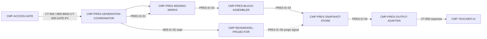

# 02 Architecture Decomposition — L2 / CMP-PRESENTATION

## 1. 局部语义细化

### 1.1 聚合、实体和值对象

| 概念 | 类型 | 本层细化 | 不变量 |
|---|---|---|---|
| `PresentationView` | Aggregate | 一个生成请求对应一个快照；包含 `presentation_id`、生成键、选定小组、`GroupSection[]`、生成时间和来源读模型版本信息 | 只包含请求选择的小组；快照生成后不随源读模型实时变化；随删除批次执行擦除内容 |
| `GroupSection` | Entity | 每个选定小组一个区块，包含项目结果引用、`ProcessSummary`、评分、批注与 `missing_marks` | 不得把其他小组数据混入；缺失不被静默省略 |
| `MissingMarks` | Value Object | 对缺失材料、不可用提交、状态未完成等可观察缺口进行稳定编码和说明 | 缺失标记只表达读模型事实，不把缺失改写为成功或伪造评分 |
| `PresentationGenerationKey` | Value Object | 教师 + 规范化小组集合 + 时间窗，映射父 CT-009 幂等键 | 相同父幂等键返回最新快照，不重复生成不可区分的副作用 |
| `PresentationSnapshotLifecycle` | State model | `snapshot_created → superseded → purged` | purged 后不得通过重生成/读模型重放恢复已擦除内容 |

### 1.2 命令、内部事件与策略

- 命令：`GeneratePresentation`，输入为父 CT-009 已授权的 `group_ids[]` 与幂等上下文。
- 内部事件：`PresentationSnapshotWritten`、`PresentationSnapshotSuperseded`、`PresentationContentPurged`；均为 MOD-05 内部事件，不跨模块发布。
- 策略 `P-PRESENTATION-ELIGIBILITY`：任一选定小组没有可用提交，整体返回 `NO_AVAILABLE_SUBMISSION`，不写快照。
- 策略 `P-MISSING-MARKS-VISIBLE`：将读模型 `missing_items`/不可用状态映射为 `missing_marks`，不隐藏缺口，不修改源数据。
- 策略 `P-SNAPSHOT-IDEMPOTENCY`：先按父生成键查找最新快照；新生成时快照、幂等记录和结果关联在同一父本地事务内。
- 策略 `P-READ-MODEL-ONLY`：项目结果、过程摘要、评分和批注只能从 M05-IC-02 返回的数据装配，不允许本层直连兄弟模块。

## 2. 子节点登记（C1；按稳定 `child_id` 排序）

| child_id | responsibility | exclusions | owned_state | requirement/parent trace | dependencies | reason_for_existence |
|---|---|---|---|---|---|---|
| CMP-PRES-BLOCK-ASSEMBLER | 将合格小组的读模型片段装配为 `GroupSection[]` 与 `ProcessSummary` 引用，保留评分、批注和 missing_marks | 不做资格裁决；不直接读源模块；不写 PresentationView；不负责 HTML/导出 | 瞬时 `GroupSectionBuild`，无持久所有权 | `REQ-DD002`；`D-AC-REQ-010-01`；CT-009 `blocks[]`；F4-1；M05-IC-02 | CMP-PRES-GENERATION-COORDINATOR、CMP-PRES-MISSING-MARKS | 让展示区块的字段组合、缺失表达和聚合边界单点化，避免 UI 或快照存储重复装配 |
| CMP-PRES-GENERATION-COORDINATOR | 承接已授权 CT-009，编排读模型读取、资格判定、区块装配、快照写入和父响应返回 | 不负责认证授权；不拥有快照；不改变 CT-009 错误/幂等语义；不承担网页渲染 | 瞬时 `GenerationContext`，无持久所有权 | `REQ-DD002`；`D-AC-REQ-010-01`；CT-009；M05-FLOW-004；LCD-004 | CMP-PRES-MISSING-MARKS、CMP-PRES-BLOCK-ASSEMBLER、CMP-PRES-SNAPSHOT-STORE、CMP-PRES-OUTPUT-ADAPTER、CMP-READMODEL-PROJECTOR | 以业务顺序闭合一次生成生命周期，避免局部子节点各自实现 CT-009 入口 |
| CMP-PRES-MISSING-MARKS | 根据读模型中的材料/提交状态计算资格结果和每组显式缺失标记，并按 `group_id` 透传后续区块装配所需的 `group_view` 上下文 | 不拥有 Submission/MaterialFile；不把缺失转成成功；不写快照；不读取 MOD-02 源数据 | 瞬时 `EligibilityEvaluation`、`MissingMarks` 与按组关联的 `group_view` 传递值 | `REQ-DD002`；`D-AC-REQ-010-01` boundaries/exceptions；CT-009 `missing_marks`/`NO_AVAILABLE_SUBMISSION`；P-生成资格 | CMP-PRES-GENERATION-COORDINATOR、CMP-PRES-BLOCK-ASSEMBLER | 将“任一小组无可用提交整体拒绝”与“材料缺失仍可展示”两个相反规则集中守护，并保证 PRES-IC-02 字段连续 |
| CMP-PRES-OUTPUT-ADAPTER | 将快照投影为稳定的 CT-009 `presentation_id + blocks[]` 响应；承接具体网页/导出格式的下一层入口 | 不直接渲染教师网页；不决定导出媒体格式；不改 CT-009 字段或新增端点 | 瞬时 `PresentationResponse`，无持久所有权 | `REQ-DD002`；`D-AC-REQ-010-01`；CT-009；LCD-008 | CMP-PRES-SNAPSHOT-STORE、CMP-PRES-GENERATION-COORDINATOR、CMP-TEACHER-UI（仅边界引用） | 将父 API 稳定响应与未来网页/导出渲染解耦，使 LCD-008 有明确下一层落点 |
| CMP-PRES-SNAPSHOT-STORE | 维护 PresentationView 快照和父幂等记录，执行同键再生成、替换和删除后的内容擦除 | 不装配业务区块；不改读模型；不执行 MOD-02 清除；不改变父数据库/部署决策 | ST-IDEMPOTENCY-PRESENTATION、ST-PRESENTATION-VIEW | `REQ-DD002`；CT-009；F4-1；LCD-004；LCD-005；ST-PRESENTATION-VIEW；ST-IDEMPOTENCY-PRESENTATION | CMP-PRES-GENERATION-COORDINATOR、CMP-PRES-OUTPUT-ADAPTER、CMP-READMODEL-PROJECTOR（purge signal） | 以单一状态所有者闭合快照写入、幂等和生命周期不变量 |

所有五个 child 均有当前需求或父契约/流程/决策追踪，因此不使用 `trace_exemption_reason`；没有基础设施或纯横切豁免 child。

## 3. 依赖映射与 C1-C6

- C1：五个 child 全在 `CMP-PRESENTATION` 内部，不形成新的父节点或部署边界。
- C2：只有 `CMP-PRES-SNAPSHOT-STORE` 写 ST-PRESENTATION-VIEW 与 ST-IDEMPOTENCY-PRESENTATION；其余状态均是本地瞬时值。
- C3：父 M05-FLOW-004 的顺序为授权后生成、资格校验、区块装配、快照和响应；本图只展开其内部边。
- C4：CT-009 的 owner、provider、consumer、路径、字段、错误、幂等和版本不变；内部 `PRES-IC-*` 不外溢。
- C5：M05-IC-02 仍由父 `CMP-READMODEL-PROJECTOR` 提供，本层只拥有消费编排，不改变其 owner 或读模型写方。
- C6：资格闭合、缺失可见、快照一致和格式隔离分别落在 policy/child 内，不引入新平台能力。

## 4. 兄弟边界

`CMP-READMODEL-PROJECTOR` 只提供 M05-IC-02 和 purge 信号；`CMP-ACCESS-GATE` 只提供认证授权后的 CT-009 路由；`CMP-TEACHER-UI` 只消费 CT-009 响应。三者以及 MOD-02/MOD-04 内部均未在本包重设计。
