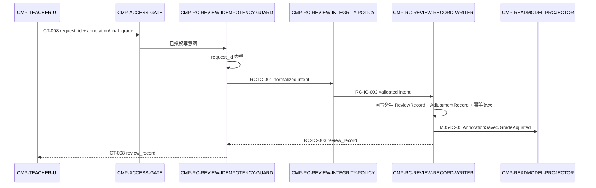
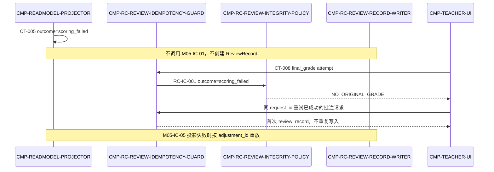
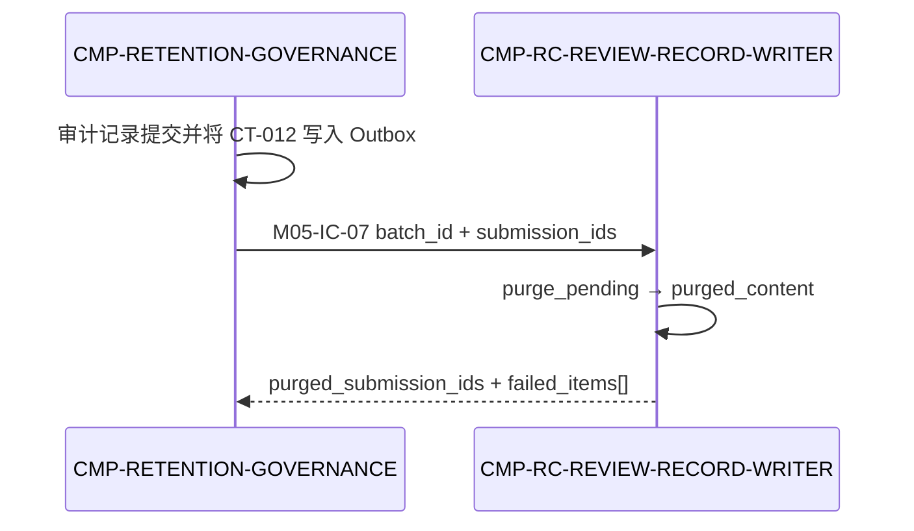

# 04 Contracts and Runtime — 契约与运行时（L2 / CMP-REVIEW-COMMAND）

## 1. 继承契约清单

| contract_id | role | owner/provider → consumer | fields and side effects | failure/retry | idempotency/version |
|---|---|---|---|---|---|
| CT-008 | Provider implementation | MOD-05 / ACCESS-GATE → CMP-REVIEW-COMMAND | 输入 teacher_session、submission_id、request_id；annotation/final_grade 至少其一；输出 review_record；写 ReviewRecord、GradeAdjustmentRecord、幂等记录，发模块内事件 | AUTH_INVALID/FORBIDDEN 由 GATE；本层保留 NOT_FOUND、VALIDATION_FAILED、NO_ORIGINAL_GRADE；同步交互调用，客户端可用相同 request_id 重试 | request_id；`/api/v1` |
| M05-IC-01 | Internal command target | CMP-READMODEL-PROJECTOR → CMP-REVIEW-COMMAND | 输入 submission_id、original_grade、dimension_rationales、scored_at；输出 review_record；固化原始等级复制值 | 写失败使调用事务失败，父投递器重试；scoring_failed 不调用本契约 | submission_id；当前 MOD-05 内部契约 |
| M05-IC-05 | Internal local event provider | CMP-REVIEW-COMMAND → CMP-READMODEL-PROJECTOR | 输入 submission_id、annotation_excerpt、operator、updated_at、adjustment_id；输出 AnnotationSaved/GradeAdjusted；投影更新由 RMP 完成 | 投影失败按 adjustment_id 重放；不跨模块投递 | adjustment_id 或 submission_id+updated_at；不改变 CT-008 |
| M05-IC-07 | Internal purge command target | CMP-RETENTION-GOVERNANCE → CMP-REVIEW-COMMAND | 输入 batch_id、submission_ids、scope、operator、executed_at、audit_record_id、v；输出 purged_submission_ids、failed_items、purged_at、v；只清除 ReviewRecord 内容 | 单项失败回传 failed_items[]，由父级按批次重试；不改变 CT-012 | batch_id+submission_id；MOD-05-internal |

### 1.1 父契约机器可读投影（字段不可变）

```yaml
inherited_contracts:
  - contract_id: CT-008
    provider: MOD-05
    implementation_node: CMP-REVIEW-COMMAND
    inbound_required_fields: [teacher_session, submission_id, request_id]
    optional_write_fields: [annotation, final_grade, adjustment_reason]
    outbound_produced_fields: [review_record]
    errors: [AUTH_INVALID, FORBIDDEN, NOT_FOUND, VALIDATION_FAILED, NO_ORIGINAL_GRADE]
    side_effects: "ReviewRecord + GradeAdjustmentRecord + idempotency record; module-local event"
    idempotency: request_id
    version: /api/v1
  - contract_id: M05-IC-01
    provider: CMP-READMODEL-PROJECTOR
    consumer: CMP-REVIEW-COMMAND
    inbound_required_fields: [submission_id, original_grade, dimension_rationales, scored_at]
    outbound_produced_fields: [review_record]
    errors: [write_failure]
    idempotency: submission_id
    version: MOD-05-internal
  - contract_id: M05-IC-05
    provider: CMP-REVIEW-COMMAND
    consumer: CMP-READMODEL-PROJECTOR
    inbound_required_fields: [submission_id, annotation_excerpt, operator, updated_at, adjustment_id]
    outbound_produced_fields: [AnnotationSaved, GradeAdjusted]
    errors: [projection_replay_required]
    idempotency: adjustment_id
    version: MOD-05-internal
  - contract_id: M05-IC-07
    provider: CMP-RETENTION-GOVERNANCE
    consumer: CMP-REVIEW-COMMAND
    inbound_required_fields: [batch_id, submission_ids, scope, operator, executed_at, audit_record_id, v]
    outbound_produced_fields: [purged_submission_ids, failed_items, purged_at, v]
    errors: [purge_failed]
    side_effects: "ReviewRecord content purge only; DeletionBatch and DeletionAuditRecord remain owned by retention governance"
    idempotency: batch_id+submission_id
    version: MOD-05-internal
```

## 2. 契约实现映射（C4）

| inherited contract | GUARD | POLICY | WRITER | preserved parent meaning |
|---|---|---|---|---|
| CT-008 | 透传 teacher_session 上下文和 request_id，命中时回放首次响应 | 校验至少一项写字段、目标存在、原始等级和等级合法性 | 同事务写 ReviewRecord/调整记录并返回 review_record | 路径、字段、错误码、后写规则、幂等和版本不变 |
| M05-IC-01 | submission_id 去重 | 确认 scored 创建路径和 original_grade 存在 | 首次固化原始等级并创建 ReviewRecord | 重复事件不覆盖原始等级、不产生重复记录 |
| M05-IC-05 | 不改变事件键 | 不参与事件字段重写 | 提交后产生固定字段的 AnnotationSaved/GradeAdjusted | 仅 MOD-05 内部流动，不升级为跨模块事件 |
| M05-IC-07 | 由父级保留治理触发 | 不参与删除批次或审计写入 | 通过 RC-IC-004 清除 Writer 所有的 ReviewRecord 内容 | 只增加 MOD-05 内部清除协作，不改变 CT-012 |

## 3. Child-only contracts（按 stable contract_id 排序）

| contract_id | owner → consumer | trigger | schema | side_effects | errors/timeouts/retries | idempotency/compatibility |
|---|---|---|---|---|---|---|
| RC-ENTRY-CT008 | CMP-ACCESS-GATE → CMP-RC-REVIEW-IDEMPOTENCY-GUARD | CT-008 授权通过且 request_id 已受理 | 输入：`auth_context`, `submission_id`, `request_id`, `annotation`, `final_grade`；输出：`operation`, `submission_id`, `request_id`, `mutation_kind`, `operator`, `outcome`, `annotation`, `final_grade` | 无；已授权命令进入 Guard | AUTH_INVALID/FORBIDDEN 不进入本边界；字段缺失返回 VALIDATION_FAILED | request_id；只在本节点内部归一化 |
| RC-ENTRY-MIC01 | CMP-READMODEL-PROJECTOR → CMP-RC-REVIEW-IDEMPOTENCY-GUARD | CT-005 outcome=scored 且 M05-IC-01 调用 | 输入：`submission_id`, `original_grade`, `dimension_rationales`, `scored_at`, `outcome`；输出：`operation`, `submission_id`, `request_id`, `mutation_kind`, `operator`, `outcome`, `original_grade`, `dimension_rationales`, `scored_at` | 无；系统创建意图，`request_id` 归一化为 submission_id | outcome 非 scored 或 original_grade 缺失返回 NO_ORIGINAL_GRADE/VALIDATION_FAILED | submission_id；只在本节点内部归一化 |
| RC-IC-001 | CMP-RC-REVIEW-IDEMPOTENCY-GUARD → CMP-RC-REVIEW-INTEGRITY-POLICY | 新的 CT-008 或 M05-IC-01 写意图 | 输入：`operation`, `submission_id`, `request_id`, `mutation_kind`, `operator`, `outcome`；输出：`operation`, `submission_id`, `request_id`, `mutation_kind`, `operator`, `outcome`, `annotation`, `final_grade`, `original_grade`, `dimension_rationales`, `scored_at` | 无；传递已归一化的本地命令 | 本地调用 ≤ CT-008 同步预算；校验失败停止；不得降级为部分写 | request_id 或 submission_id；CT-008 的 request_id 和 M05-IC-01 的 submission_id 不互相替代 |
| RC-IC-002 | CMP-RC-REVIEW-INTEGRITY-POLICY → CMP-RC-REVIEW-RECORD-WRITER | POLICY 验证通过 | 输入：`operation`, `submission_id`, `request_id`, `mutation_kind`, `operator`, `outcome`, `annotation`, `final_grade`, `original_grade`, `dimension_rationales`, `scored_at`；输出：`review_record_id`, `source_submission_id`, `mutation_kind`, `request_key`, `validated_fields`, `adjustment_id`, `adjustment_reason` | 无；只允许合法 mutation 进入 writer | VALIDATION_FAILED/NO_ORIGINAL_GRADE 原样返回；不重试业务错误 | request_key；本地字段展开不改变 CT-008 |
| RC-IC-003 | CMP-RC-REVIEW-RECORD-WRITER → CMP-RC-REVIEW-IDEMPOTENCY-GUARD | ReviewRecord 事务提交或重复命中 | 输入：`review_record`, `request_key`, `mutation_status`, `adjustment_id`；输出：`review_record`, `request_key`, `mutation_status`, `adjustment_id`, `emitted_events` | 返回 CT-008/M05-IC-01 所需结果；提交后触发 M05-IC-05 | 数据库瞬时失败由父事务/调用方重试；事件投影失败由 adjustment_id 重放 | request_key；只在本节点内部演进 |
| RC-IC-004 | CMP-RETENTION-GOVERNANCE → CMP-RC-REVIEW-RECORD-WRITER | M05-IC-07 清除命令 | 输入：`batch_id`, `submission_ids`, `scope`, `operator`, `executed_at`, `audit_record_id`, `v`；输出：`purged_submission_ids`, `failed_items`, `purged_at`, `v`, `purge_status` | 只清除 ReviewRecord 内容并写入清除幂等/tombstone；不删除删除审计 | 单项失败进入 `failed_items[]`；父级按 batch_id+submission_id 重试；重复返回 already_purged | batch_id+submission_id；不改变 CT-012 |

## 4. 运行流（C3）

### 4.1 成功流：CT-008 保存批注与调整等级



终态：`updated`；RMP 投影可短暂最终一致，但不改变 CT-008 成功响应。

### 4.2 失败/恢复流：评分失败禁伪造与重复请求



终态：拒绝请求不产生 ReviewRecord/等级副作用；重复成功请求进入 `duplicate_returned`；投影故障进入 `replay_required`。

### 4.3 生命周期流：复核记录进入父级清除



本节点不拥有 DeletionBatch、CT-012 或 CT-014；RMP 通过 CT-012 清除读模型并由重放守卫过滤已清除 submission_id，Writer 通过 M05-IC-07 清除 ReviewRecord 内容。

## 5. 错误、超时、重试、幂等、可观测与兼容

| 面 | 本层规则 |
|---|---|
| 错误 | 保留 `NOT_FOUND`、`VALIDATION_FAILED`、`NO_ORIGINAL_GRADE`；`AUTH_INVALID/FORBIDDEN` 由 GATE，错误码不新增、不改名 |
| 超时 | CT-008 使用父级同步交互预算；RC-IC-001/002/003 为本地调用，不允许通过异步队列改变外部同步语义 |
| 重试 | 数据库瞬时失败按父事务/客户端重试；同 request_id/submission_id 重试必须命中幂等记录；M05-IC-05 投影失败按 adjustment_id 重放；M05-IC-07 失败项按 batch_id+submission_id 重试 |
| 幂等 | ST-IDEMPOTENCY-REVIEW 与业务写入同事务；首次响应可重放，重复请求不追加调整记录 |
| 并发 | 后写为准；每次成功变更有新 adjustment_id，原始等级复制值永不改变 |
| 可观测 | 记录 command outcome、request_id、submission_id、adjustment_id、错误码和耗时；不记录完整批注或会话令牌 |
| 兼容 | CT-008 `/api/v1`、M05-IC-01/M05-IC-05 字段和版本保持不变；M05-IC-07 为新增 MOD-05 内部契约；`adjustment_reason` 仅可作为可选内部/存储字段，不升级为必填父字段 |

## 6. 父契约不变性声明

本层未修改 CT-008、M05-IC-01、M05-IC-05 的标识、字段、提供/消费关系、所有者、副作用、错误码、重试、幂等和版本；M05-IC-07 是新增的 MOD-05 内部清除协作，不新增父级 API、跨模块事件、公共运行时边界或数据所有权转移。
