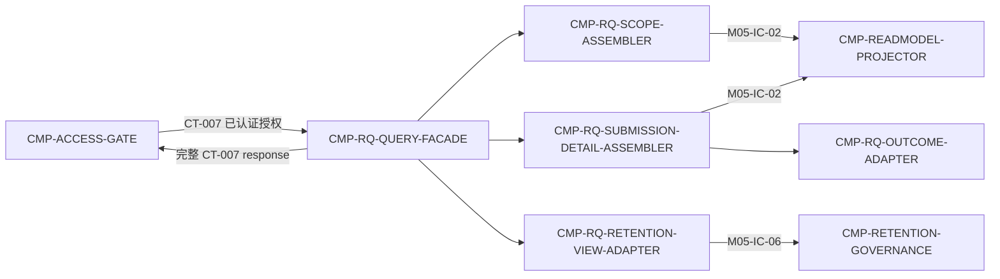

# 02 Architecture Decomposition — 架构分解（L2 / CMP-REVIEW-QUERY）

## 1. 局部语义

本节点是无状态查询读侧。它把已授权的 CT-007 查询上下文转换为一个完整的教师查询响应，数据来源只有父层规定的两个只读端口：

```text
CMP-ACCESS-GATE
        │ CT-007（已认证、已授权）
        ▼
CMP-RQ-QUERY-FACADE
   ├── CMP-RQ-SCOPE-ASSEMBLER ───── M05-IC-02 → ST-READ-MODEL
   ├── CMP-RQ-SUBMISSION-DETAIL-ASSEMBLER
   │       └── CMP-RQ-OUTCOME-ADAPTER ─────── M05-IC-02 → ST-READ-MODEL
   └── CMP-RQ-RETENTION-VIEW-ADAPTER ─────── M05-IC-06 → ST-DELETION-BATCH
        │ 完整 CT-007 response
        ▼
CMP-ACCESS-GATE → 教师浏览器
```

局部概念：`AuthorizedQueryContext`（已由 GATE 建立的请求上下文）、`QueryScope`（课程/小组/学生/提交选择）、`TeacherReadModelView`（父读模型端口返回值）、`SubmissionOutcomeView`（成功或失败结果视图）、`RetentionBatchView`（删除批次只读视图）、`TeacherCourseQueryResponse`（CT-007 完整响应）。这些均为本层装配概念，不新增领域聚合。

## 2. 分解理由

1. **Facade 与装配分离**：Facade 只负责 CT-007 编排、超时/错误收敛和响应完整性，避免把父契约路由散到各装配器。
2. **层级选择与提交详情分离**：课程/小组/学生目录的选择变化和提交详情字段变化原因不同；两者都只读消费 M05-IC-02。
3. **结果分支显式化**：评分成功与失败结果的可见字段规则必须单点实现，避免查询路径临时推导失败状态或伪造等级。
4. **保留视图独立适配**：`deletion_batches[]` 来自不同状态所有者 M05-IC-06，单独隔离可防止查询侧误写 DeletionBatch。

## 3. 直接子节点清单（C1；按稳定 child_id 排序）

| child_id | 责任 | 排除项 | 分配需求/父追踪 | 拥有状态 | 依赖 | 存在理由 |
|---|---|---|---|---|---|---|
| CMP-RQ-OUTCOME-ADAPTER | 将读模型中的 scored/scoring_failed 结果转换为教师可见结果；保留原始等级、依据、建议、失败原因和重试结果的条件语义 | 不评分、不重试、不写 ReviewRecord；不在查询侧生成结果 | REQ-DD001；D-AC-REQ-009-01；CT-007；RQ-IC-003；DF-2 | 无；纯只读转换 | CMP-RQ-SUBMISSION-DETAIL-ASSEMBLER（RQ-IC-003） | 将“失败可见且不得伪造等级”集中为唯一装配策略 |
| CMP-RQ-QUERY-FACADE | 接收 GATE 路由后的 CT-007 请求，协调层级、详情、结果、保留视图装配，输出完整响应 | 不认证授权、不直接读底层表、不持有查询缓存、不提供新端点 | REQ-DD001；D-AC-REQ-009-01；CT-007；M05-FLOW-002 | 无；每请求瞬时上下文不持久化 | ACCESS-GATE；四个本层装配 child | 形成单一 CT-007 装配边界并收敛错误/超时 |
| CMP-RQ-RETENTION-VIEW-ADAPTER | 通过 M05-IC-06 读取并规范化 `deletion_batches[]` | 不计算到期、不确认删除、不发布 CT-012、不修改批次 | REQ-DD001；D-AC-REQ-009-01 response；CT-007；M05-IC-06 | 无；不拥有 ST-DELETION-BATCH | CMP-RETENTION-GOVERNANCE（M05-IC-06） | 隔离跨状态所有者的只读批次视图，保证 CT-007 出参完整 |
| CMP-RQ-SCOPE-ASSEMBLER | 按课程/小组/学生/提交选择装配层级结果和选择范围 | 不做权限判断、不校验课程归属、不读 MOD-03 源数据 | REQ-DD001；D-AC-REQ-009-01；CT-007；M05-IC-02 | 无；不拥有目录或读模型 | CMP-READMODEL-PROJECTOR（M05-IC-02） | 将层级查询选择与提交详情解耦，支持同一父响应的列表/详情路径 |
| CMP-RQ-SUBMISSION-DETAIL-ASSEMBLER | 装配材料引用、处理状态、评分字段、批注、最终等级和缺失标记，并委托结果分支处理 | 不生成 PresentationView、不保存批注、不修改等级、不读取材料文件本体 | REQ-DD001；D-AC-REQ-009-01 response；CT-007；M05-IC-02 | 无；只读视图 | CMP-READMODEL-PROJECTOR；CMP-RQ-OUTCOME-ADAPTER | 让提交详情字段完整性和结果转换具有单一责任边界 |

每个 child 都具有当前 L2 需求或父契约追踪；不使用 `trace_exemption_reason`。

## 4. 依赖图与合法边界



禁止边：本层任何 child → MOD-02/MOD-03/MOD-04 源数据；本层任何 child → CT-008/CT-009/CT-011 写路径；本层任何 child → 持久化写操作。

## 5. 生命周期与局部策略

- **请求上下文**：`accepted`（GATE 已授权）→ `assembling` → `completed` 或 `rejected/retryable`；上下文仅存在于单次请求，不持久化。
- **读模型结果**：`available` → `assembled`；若父端口读取失败，转 `retryable`，不能用空字段伪装 `completed`。
- **评分结果**：`scored` 时可返回原始等级、依据、建议及最终等级；`scoring_failed` 时返回失败原因/重试结果，禁止推导等级。
- **批次结果**：有批次则装配完整 `deletion_batches[]`；无批次返回空数组；读取端口失败时整体失败。
- **查询无副作用**：任何成功 CT-007 查询不写业务状态、不发事件、不改变投影位点。

## 6. 验证覆盖与组件可达性

- **唯一入口**：所有 CT-007 查询先由 `CMP-ACCESS-GATE` 路由到 `CMP-RQ-QUERY-FACADE`；Facade 不是可选组件，也不能因场景入口推断未命中而判为孤儿。
- **必需分支**：Facade 在 CT-007 完整响应要求 `deletion_batches[]` 时调用 `CMP-RQ-RETENTION-VIEW-ADAPTER`，再经 M05-IC-06 读取 RG 的只读批次视图。无批次也必须返回空数组，因此该 Adapter 是合法响应分支而非孤儿组件。
- **写侧隔离**：保存批注和调整等级必须走 CT-008 → `CMP-REVIEW-COMMAND`；查询链不得新增指向 CT-008 的 `next_hop`，也不得将保存结果伪装成 Scope Assembler 的输出。
- **留痕隔离**：原始等级、最终等级、操作者和时间的持久化由 ReviewRecord 写侧负责；M05-IC-05 投影完成后，Query 仅经 M05-IC-02 读取已投影事实。
- **测试覆盖前提**：严格验证应至少有一个场景明确覆盖 `deletion_batches[]` 分支；通用“打开详情”场景未触达该分支时，只能记录 coverage warning，不能改变组件注册或所有权。
