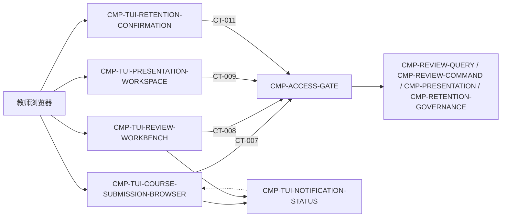

# 02 Architecture Decomposition — L2 / CMP-TEACHER-UI

> C1 映射：选定的 L1 `CMP-TEACHER-UI` → 五个局部 child。拆分依据是用户旅程、状态所有权、失败恢复和交互变化原因，而不是通用 MVC 分层。

## 1. 局部概念与生命周期

- **TeacherUIContext**：浏览器侧教师会话引用、当前课程/小组/学生/提交范围和路由意图；不包含授权真相。
- **PageViewModel**：由 CT-007/CT-009 等父契约响应转换出的展示模型；缺失字段保持显式 `missing`，不填默认等级。
- **InteractionDraft**：批注、最终等级、删除确认、展示小组选择等尚未提交的用户输入；提交成功或取消后销毁/重置。
- **ActionStatus**：每个 UI 请求的 `idle → submitting/loading → succeeded/failed`；失败保留可重试上下文，但不自动重试父写契约。
- **NotificationEntry**：从 CT-005 投影后的失败原因、重试结果和状态通知映射为列表/详情可见条目；UI 不拥有通知事实来源。

关键生命周期：

1. 浏览器进入教师页 → 创建会话上下文 → 读取课程/小组/学生/提交 → 进入详情或展示工作区。
2. 用户编辑批注/等级、选择小组或确认删除 → 建立局部 draft → 生成父契约请求 → 经 GATE 处理 → 根据响应更新页面状态。
3. 读模型更新或评分失败 → 通知 child 将显式状态合并到当前页面 → 不覆盖用户未提交草稿。
4. 切换课程/提交/页面 → 清除不再适用的局部 draft 和 action status；保留教师会话引用及可复用查询范围。

## 2. 直接 child registry（按稳定 `child_id` 排序）

| child_id | 责任 | 排除项 | 拥有状态 | 需求/父层追踪 | 依赖 | 存在理由 | trace_exemption_reason |
|---|---|---|---|---|---|---|---|
| CMP-TUI-COURSE-SUBMISSION-BROWSER | 课程、组、学生、提交列表和提交详情的导航、加载、刷新、结果/失败/缺失状态展示；组织 CT-007 查询请求 | 不查询数据库；不做授权、评分、读模型投影或复核写入；不持有 Submission/Course | ST-TUI-CURRENT-COURSE-SCOPE、ST-TUI-DETAIL-SELECTION、ST-TUI-QUERY-STATUS | REQ-DD001；REQ-D001；D-AC-REQ-009-01；CT-007；AC-NFR-001-01 | CMP-ACCESS-GATE、CMP-TUI-NOTIFICATION-STATUS | 查询与详情的变化原因、状态和交互密切，需单独控制查询/导航生命周期 | — |
| CMP-TUI-NOTIFICATION-STATUS | 将 scoring_failed、失败原因、重试结果和端内通知映射到列表/详情的可观察状态；处理刷新和已呈现标记 | 不生成通知事实；不消费 CT-005；不改变读模型；不把失败转换为等级 | ST-TUI-NOTIFICATION-QUEUE、ST-TUI-ACTION-STATUS（通知分支） | REQ-DD001；REQ-D001；D-AC-REQ-009-01；A-005；CT-005；LCD-001 | CMP-TUI-COURSE-SUBMISSION-BROWSER、CMP-TUI-REVIEW-WORKBENCH、父 CT-007 响应 | 端内通知是跨页面横切交互，但必须有明确 owner，避免错误状态散落在各页面 | — |
| CMP-TUI-PRESENTATION-WORKSPACE | 选择一个或多个小组、发起 CT-009、呈现 blocks、过程摘要、评分、批注和 missing_marks | 不生成 PresentationView；不实时读 MOD-02/MOD-04；不决定生成资格或导出格式 | ST-TUI-PRESENTATION-SELECTION、ST-TUI-PRESENTATION-STATUS | REQ-DD002；REQ-D002；D-AC-REQ-010-01；CT-009；F4-1；LCD-004 | CMP-ACCESS-GATE、CMP-TUI-COURSE-SUBMISSION-BROWSER | 展示视图有独立选择、生成和快照浏览生命周期，不能与提交详情草稿混用 | — |
| CMP-TUI-RETENTION-CONFIRMATION | 展示删除批次范围、状态、排除项和确认结果；构造 CT-011 confirm 请求 | 不计算保留期；不执行删除；不改 DeletionBatch；不绕过授权或审计先行规则 | ST-TUI-RETENTION-CONFIRMATION-DRAFT、ST-TUI-RETENTION-STATUS | REQ-DD001；REQ-D001；D-AC-REQ-009-01；CT-007 deletion_batches[]；CT-011；DF-3 | CMP-ACCESS-GATE、CMP-TUI-COURSE-SUBMISSION-BROWSER | 删除确认是高风险、低频、需明确二次确认的独立交互边界 | — |
| CMP-TUI-REVIEW-WORKBENCH | 展示原始等级/依据/建议/批注，编辑 annotation/final_grade，构造 CT-008 并展示保存结果 | 不修改原始等级；不执行 NO_ORIGINAL_GRADE；不拥有 ReviewRecord；不把失败状态伪造成可编辑等级 | ST-TUI-REVIEW-DRAFT、ST-TUI-REVIEW-STATUS | REQ-DD001；REQ-D001；D-AC-REQ-009-01；CT-008；F3-2/F3-3；LCD-003/LCD-009 | CMP-ACCESS-GATE、CMP-TUI-COURSE-SUBMISSION-BROWSER、CMP-TUI-NOTIFICATION-STATUS | 复核编辑拥有独立草稿、并发反馈和幂等提交语义，需隔离于只读查询 | — |

所有 child 均有当前 PRD 或父层需求/契约追踪，因此不使用 `trace_exemption_reason`。

## 3. 子节点依赖图

图中兄弟节点仅作为父契约的下一跳引用；本包不读取或设计其内部结构。`CMP-ACCESS-GATE` 仍是唯一服务端入口。

## 4. 局部分解理由

1. **查询与复核分离**：查询是只读、可刷新、最终一致；复核是写入、幂等、并发后写为准，状态与失败处理不同。
2. **展示视图独立**：CT-009 是带快照语义的生成请求，选组与缺失标记不能依附于普通提交详情导航。
3. **删除确认独立**：CT-011 是高风险 confirm=true 操作，必须有单独草稿、确认提示和结果状态。
4. **通知集中映射**：A-005 的失败可见性跨课程列表、提交详情和复核页面；集中 owner 可避免各页面用默认值掩盖 `scoring_failed`。
5. **浏览器状态局部化**：UI 不拥有服务端业务聚合；各 child 只拥有与交互生命周期一致的瞬时状态，页面切换不会转移父状态所有权。

## 4.1 场景入口与验证触达边界

- `SCENARIO-001` 的完整成功路径由 `CMP-TUI-COURSE-SUBMISSION-BROWSER` 接收 CT-007 详情响应，再经 `TUI-IC-01` 进入 `CMP-TUI-REVIEW-WORKBENCH`；`CMP-TUI-NOTIFICATION-STATUS` 只参与失败原因、重试结果和通知可见性，不承担提交详情的主渲染职责。
- `SCENARIO-002/003` 必须按“CT-007 查询 → REVIEW-WORKBENCH 编辑/保存 → CT-008 返回复核记录”的多阶段路径验证；单独执行 CT-007 不能证明保存或复核记录字段。
- `SCENARIO-006` 必须包含 CT-009 请求、父流 `M05-FLOW-004` 的展示 provider 响应和 `presentation_id/blocks/missing_marks` 返回；L2 不新增 UI 到 `CMP-PRESENTATION` 的直连。
- 当前验收场景未包含 CT-011 删除确认，因此 `CMP-TUI-RETENTION-CONFIRMATION` 的“未触达”只能判定为测试覆盖缺口，不是架构依赖孤儿；删除该 child 会破坏 CT-007 `deletion_batches[]` → CT-011 的既有边界。

## 5. 边界确认

- 五个 child 都是 `CMP-TEACHER-UI` 内部逻辑，不是服务、容器、数据库或部署单元。
- 所有 API 请求经过 CMP-ACCESS-GATE；不存在 UI→兄弟节点的绕行边。
- `ST-READ-MODEL`、`ST-REVIEW-RECORD`、`ST-PRESENTATION-VIEW`、`ST-DELETION-BATCH`、`ST-TEACHER-ACCESS-GRANT` 的 owner 与 L1 保持不变。
- UI 只引用 `material_refs` 和返回数据，不接触材料文件本体。
- 不引入独立通知服务；通知仍是父层读模型投影的可观察派生结果。
