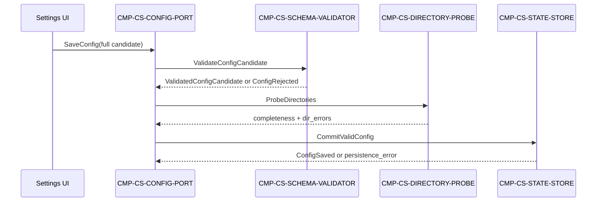

# CMP-CONFIG-STORE current-layer strict adapter

This is a read-only, machine-parseable projection of the historical CMP
architecture package. It preserves the source package's component, contract,
and error vocabulary; it does not add acceptance assertions or repair the
historical Feature's vague steps.

Source: `tutor/tutor/L2/mod-01/L2-mod-01-cmp-config-store/architecture/04-contracts-and-runtime.md`.

<!-- validate-arch-package: {"target_node_id":"CMP-CONFIG-STORE","current_node_name":"CMP-CONFIG-STORE","level":"L2"} -->

## Component registry

| child_id | responsibility | dispatch_kind |
|---|---|---|
| CMP-CS-CONFIG-PORT | Receives configuration saves and reads; orchestrates validation, directory probing, commit, and effective-config assembly. | component |
| CMP-CS-SCHEMA-VALIDATOR | Validates a configuration candidate before any state write. | component |
| CMP-CS-DIRECTORY-PROBE | Reads the three configured directories and reports completeness/errors. | component |
| CMP-CS-STATE-STORE | Atomically commits a valid configuration and preserves the previous valid value on failure. | component |
| CMP-STATUS-PRESENTER | Consumes the derived ConfigView without owning configuration state. | component |

## Entry endpoint and request

`SaveConfig` is handled by **CMP-CS-CONFIG-PORT** through contract
`IC-M01-02`. The historical contract requires `invite_code`, `student_name`,
`group`, `code_dir`, `screenshot_dir`, and `result_dir`; `schema_version` is
optional.

## Request flow

## Internal contract mapping

| contract_id | Owner → Consumer | 触发与 schema | Errors, idempotency, compatibility |
|---|---|---|---|
| `IC-M01-02` | Settings UI → CMP-CS-CONFIG-PORT | 输入：`invite_code`, `student_name`, `group`, `code_dir`, `screenshot_dir`, `result_dir`；输出：`config_version`, `completeness`, `dir_errors` | `INVALID_CONFIG`; `DIRECTORY_UNREADABLE`; persistence failure. |
| `IC-CS-001` | CMP-CS-CONFIG-PORT → CMP-CS-SCHEMA-VALIDATOR | 输入：`candidate`, `requested_schema_version`；输出：`validated_candidate`, `schema_version` | `INVALID_CONFIG`; no write. |
| `IC-CS-002` | CMP-CS-CONFIG-PORT → CMP-CS-DIRECTORY-PROBE | 输入：`code_dir`, `screenshot_dir`, `result_dir`；输出：`exists`, `readable`, `empty`, `error_code`, `error_detail` | `DIRECTORY_UNREADABLE`; read-only. |
| `IC-CS-003` | CMP-CS-CONFIG-PORT → CMP-CS-STATE-STORE | 输入：`validated_candidate`, `completeness`, `dir_errors`, `schema_version`；输出：`config_version` | `PERSISTENCE_FAILED`; old valid value remains readable. |

## Deliberate negative boundary

The associated historical Feature states user-facing outcomes such as “save
configuration and use it on the next submission” without concrete input
values, contracts, response fields, or executable assertions. This adapter
does not invent those missing mappings. A strict semantic failure or warning
after component execution is the intended Day 3 negative-control result.
