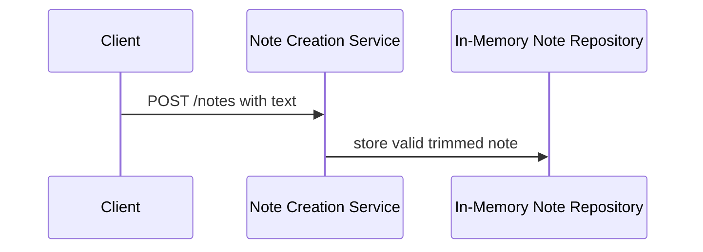

# S1: Create a Short Note

<!-- validate-arch-package: {"target_node_id":"s1-note-create","current_node_name":"S1 Note Create","level":"L1"} -->

## Component registry

| child_id | responsibility | dispatch_kind |
|---|---|---|
| Note Creation Service | Entry component for HTTP `POST /notes`; validates trimmed `text` and returns the endpoint response. | component |
| In-Memory Note Repository | Stores valid generated `id` and trimmed `text` in memory only. | component |

## 组件职责

| Component | Responsibility |
|---|---|
| Note Creation Service | Entry component for HTTP `POST /notes`; it receives the request body field `text`, validates trimmed text, and returns the endpoint response. |
| In-Memory Note Repository | Stores a valid note's generated `id` and trimmed `text` in memory only. |

## Entry endpoint and request

`POST /notes` is handled by **Note Creation Service**. Its request body
contains exactly one field: `text`.

## Request flow

The repository is an in-memory boundary. It is called only for valid creation;
invalid input does not create or store a note.

## Internal contract mapping

| contract_id | Owner → Consumer | 触发与 schema | Errors, idempotency, compatibility |
|---|---|---|---|
| `note.create.request` | Client → Note Creation Service | 输入：`text`；输出：`accepted` | The client supplies the sole request field. |
| `note.create.store` | Note Creation Service → In-Memory Note Repository | 输入：`text`；输出：`id`, `text` | Valid trimmed text only; create one in-memory note. Invalid input never invokes this contract. |

## Contract mapping

The public endpoint `POST /notes` uses contract `note.create`.

### `note.create`

| Field | Contract |
|---|---|
| contract_id | `note.create` |
| contract_type | `http_json` |
| Provider | Note Creation Service |
| Consumer | Client |
| Schema | 请求：`text`；响应 201：`id`, `text`；响应 422：no note is created |
| Side_effects | For valid trimmed text only, store one note through In-Memory Note Repository. |
| Error / Timeout / Retry | HTTP 422 when trimmed `text` is empty or longer than 140 characters; no note is created. |

## Validation and creation

Trim leading and trailing whitespace from `text`. If the trimmed text has 1 to
140 non-whitespace characters, store that trimmed text as one note with a
generated non-empty string `id`.

If the trimmed text is empty or has more than 140 characters, return HTTP 422
without creating a note.

## Responses

For successful creation, return HTTP 201 with a JSON object containing exactly
the generated `id` and the stored trimmed `text`. For either invalid length,
return HTTP 422.
