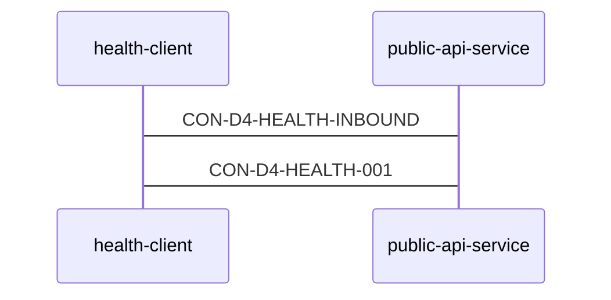

<!-- validate-arch-package: {"schema_version":"1.0","task_id":"day4-architecture-repair-fixture","depth":0,"max_depth":2,"entry_component":"public-api-service","public_contract_id":"CON-D4-HEALTH-001","requirements":["REQ-D4-HEALTH","REQ-D4-TRACE"],"scope":"Day 4 Architecture-only strict repair fixture"} -->

# VeriLayer Day 4 Health and Trace Architecture

## Scope

This is an Architecture-only repair of the Day 4 health and trace path. It preserves the frozen Feature and requirement IDs. The Feature exercises one public health endpoint, so the Architecture declares one reachable strict component instead of retaining unused orchestration components.

## Component registry

| child_id | responsibility | dispatch_kind |
| --- | --- | --- |
| public-api-service | Accepts the public FastAPI health request and returns the completed health response. | component |

## Machine-readable public boundary

## Internal contract mapping

| contract_id | owner → consumer | 触发与 schema | 错误、幂等与兼容性 |
| --- | --- | --- | --- |
| CON-D4-HEALTH-INBOUND | health-client → public-api-service | 输入: `event`; 输出: `status_code, status, node_id, requirement_ids, request_id`。 | Errors: INVALID_REQUEST_ID, METHOD_NOT_ALLOWED, NOT_FOUND. Idempotency: read-only. Compatibility: additive optional fields only. |
| CON-D4-HEALTH-001 | public-api-service → health-client | 输入: `event`; 输出: `status_code, status, node_id, requirement_ids, request_id`。 | Errors: NODE_METADATA_UNAVAILABLE, NODE_METADATA_INVALID. Idempotency: read-only. Compatibility: stable public success fields. |

## Public behavior

`GET /health` is handled by `public-api-service`. A successful request returns HTTP 200 with `status` equal to `ok`, the root `node_id`, and the public `requirement_ids`. The path is read-only and side-effect free.
